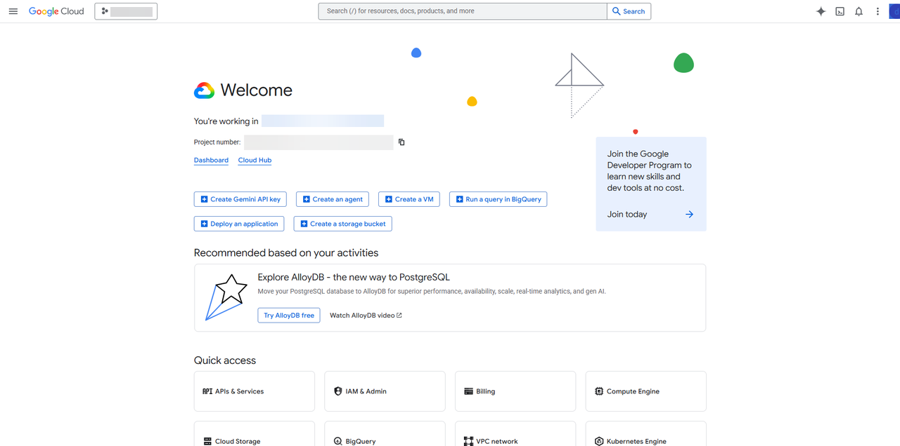
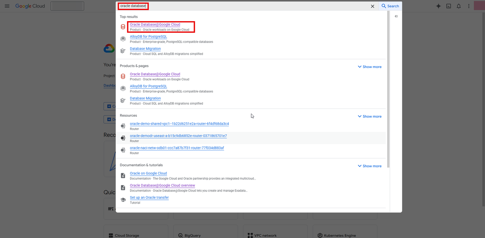
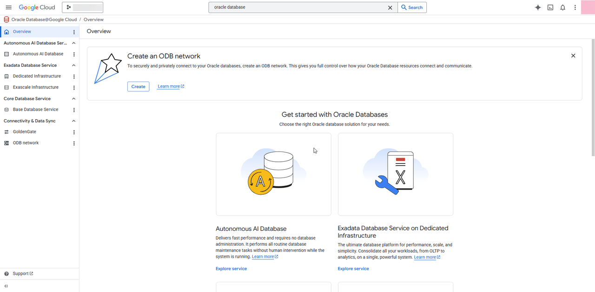
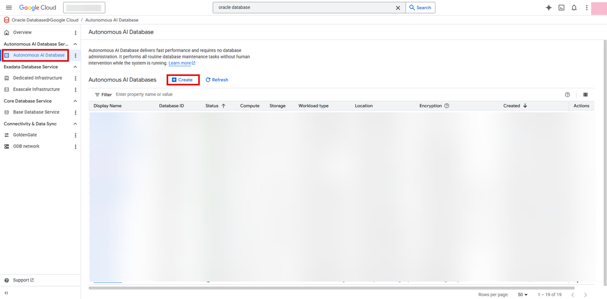
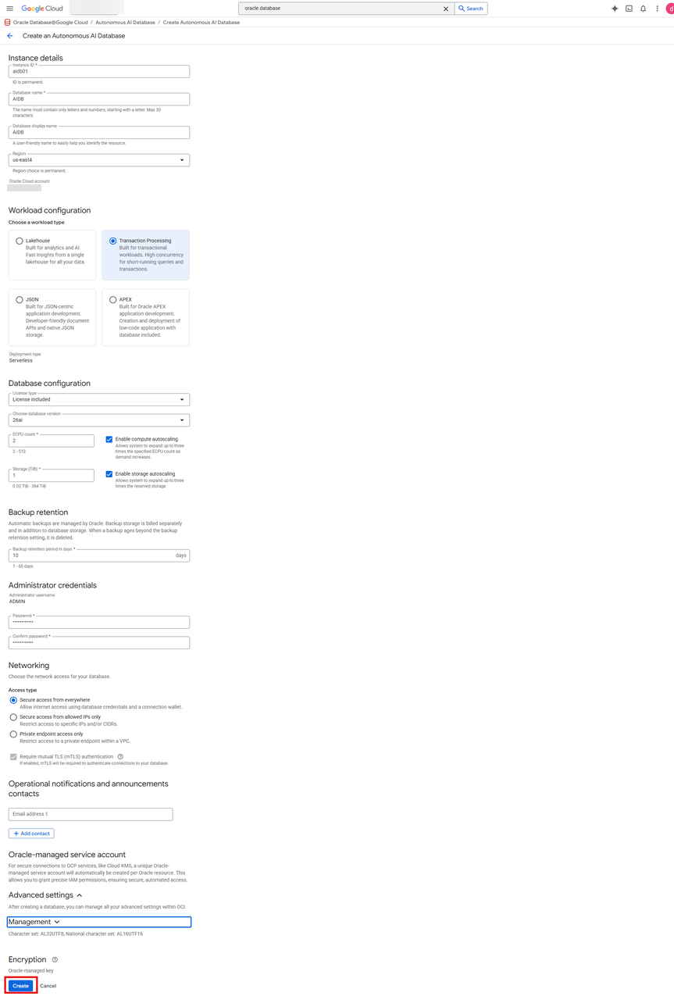
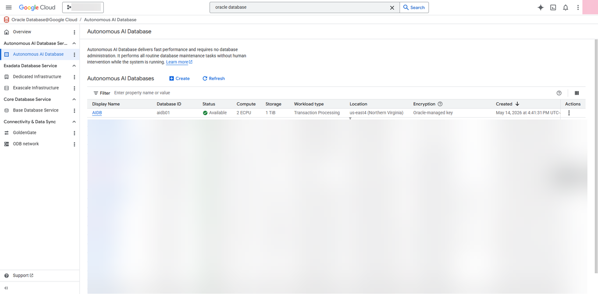
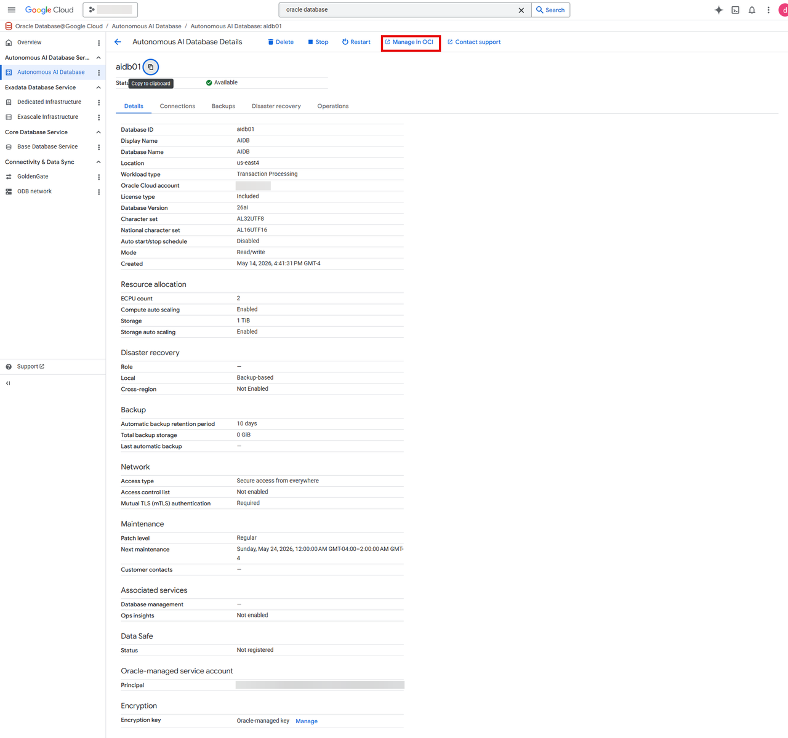
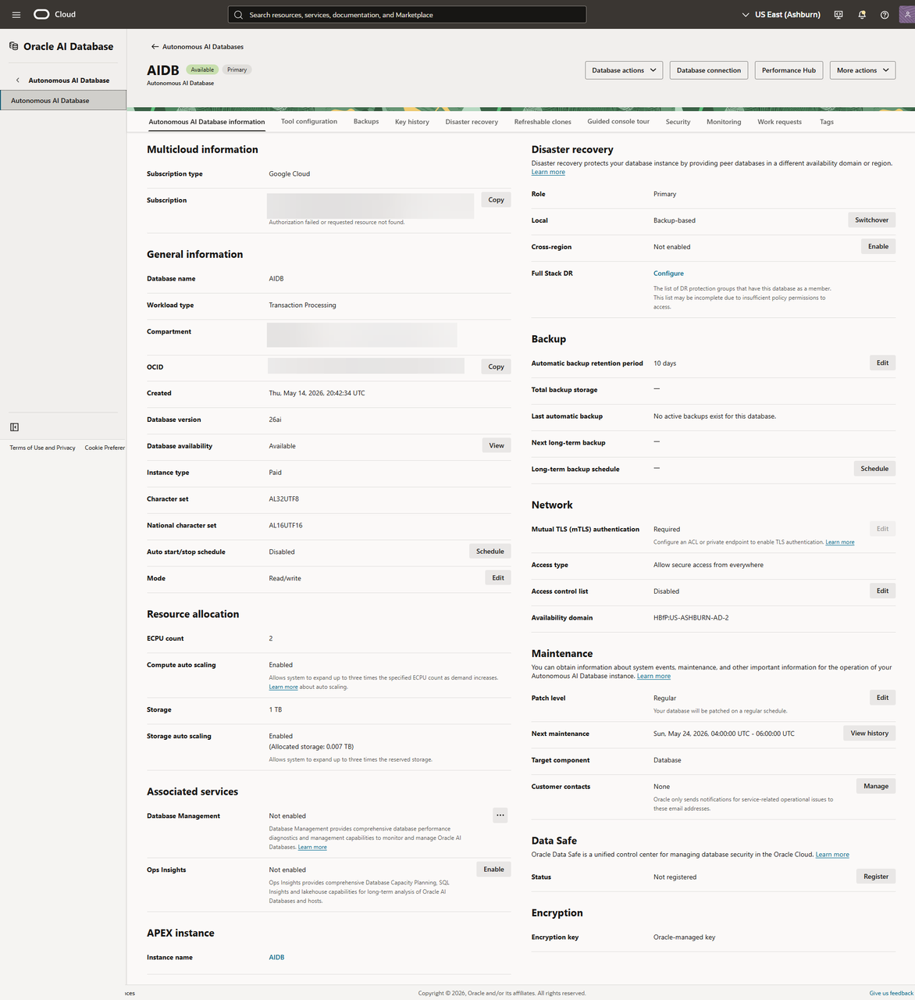

# Create Autonomous AI Database Serverless

## Introduction

This lab walks you through creating an **Autonomous AI Database (Serverless) on Oracle AI Database@Google Cloud**

**Oracle Autonomous AI Database (Serverless)** on Oracle AI Database@Google Cloud is Oracle’s fully managed, self-driving database service deployed on dedicated Exadata infrastructure inside Google Cloud data centers. It combines Oracle’s autonomous database automation with the low-latency, native integration of Google Cloud services, enabling enterprises to run mission-critical Oracle workloads close to their Google Cloud applications while minimizing operational overhead.

 Estimated Time: About 30 minutes.

### Objectives

>**Note: Autonomous AI Database (Serverless)** can be created only from the **Google Cloud Console.**

 - Create an Autonomous AI Database (Serverless)

## Create an Autonomous AI Database (Serverless) from Google Cloud Console.

1. Login to Google Cloud Console (https://console.cloud.google.com/)

 

2. Search for oracle database in the search bar and click on Oracle Database@Google Cloud

 

3. Oracle Database@Google Cloud dashboard opens up

 .

4. Select Autonomous AI Database from the left hand menu and click on create

 

5. **Create an Autonomous AI Database** screen opens up and enter the required information in the database configuration fields.
 

  |Field|Value|
  |----|------|
  |**Instance details**||
  |Instance ID|aidb01|
  |Database name|AIDB|
  |Database Display name|AIDB|
  |Region|us-east4|
  |**Workload configuration**||
  |Choose a workload type| Transaction Processing|
  |**Database Configuration**||
  |License type|License included|
  |Choose database version|26ai|
  |ECPU count|2|
  |Enable compuet scaling|Checked|
  Storage|1|
  |Enable Storage Scaling|Checked|
  |**Backup Retention**||
  |Backup retention period in days|10|
  |**Administrative credentials||
  |Administrator username|Admin(Not modifiable|
  |Password|*****|
  |**Networking**||
  |Access type|Secure access from everywhere|

 Review the database configuration information that you entered and then click on **Create**

 

6. It will take about 10 min to provision the database
 

7. You can click on your database to view its detialed configuration.
 
 

8. If you click on Manage in OCI, it will take you to OCI Console and you can view the database configuration details in OCI Console
 
 

9. Click the **Home** link in the breadcrumbs to return to the **Home** page in preparation for the next lab.

**Congratulations! You have successfully created Autonomous AI Database (Serverless) on Oracle AI Database@Google Cloud**

**You may now proceed to the next lab.**.

## Learn More
* [Oracle AI Database@Google Cloud](https://docs.oracle.com/en-us/iaas/Content/database-at-gcp/home.htm)
* [Onboarding with Oracle AI Database@Google Cloud](https://docs.oracle.com/en-us/iaas/Content/database-at-gcp/onboard.htm)
* [Oracle Autonomous AI Database (Serverless)](https://docs.oracle.com/en/cloud/paas/autonomous-database/serverless/adbsb/autonomous-intro-adb.html)

## Acknowledgements
- **Author:** Devinder Singh, Senior Principal Solutions Architect - Multicloud
- **Contributor:** Devinder Singh, Senior Principal Solutions Architect - Multicloud
- **Last Updated By/Date:** Devinder Singh, May 2026
