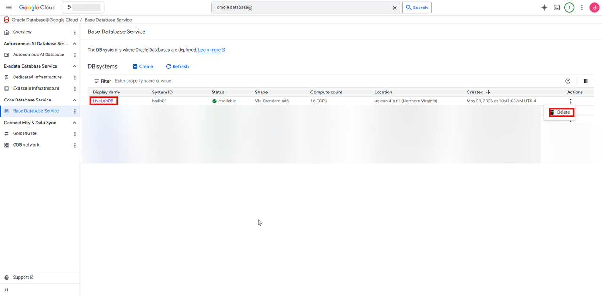
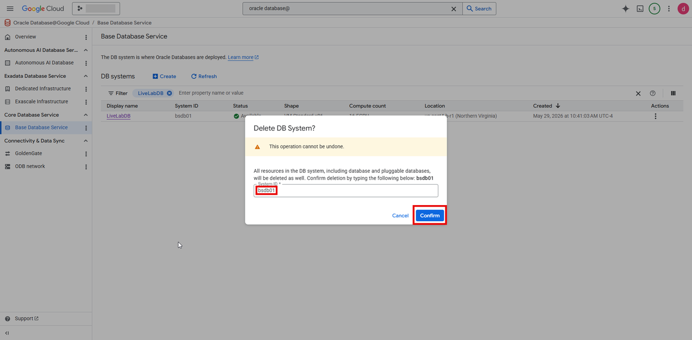
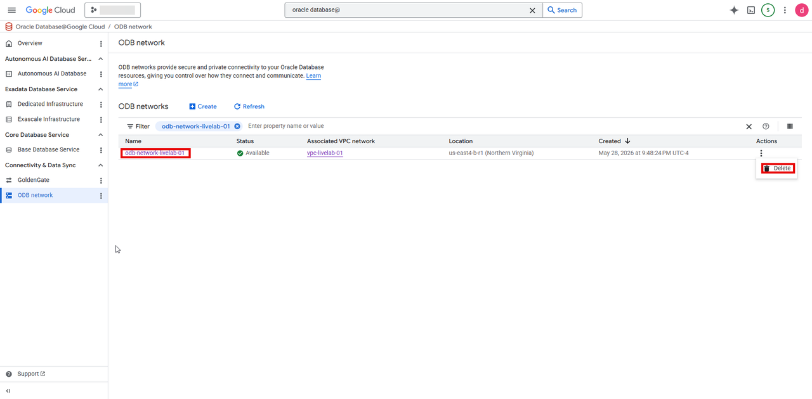
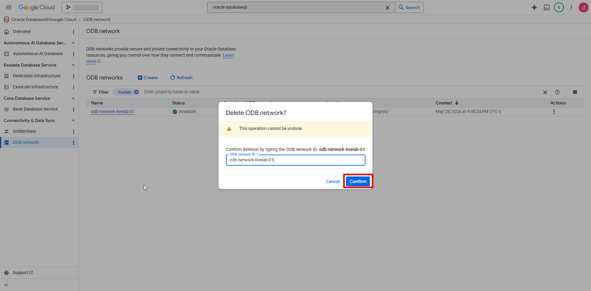
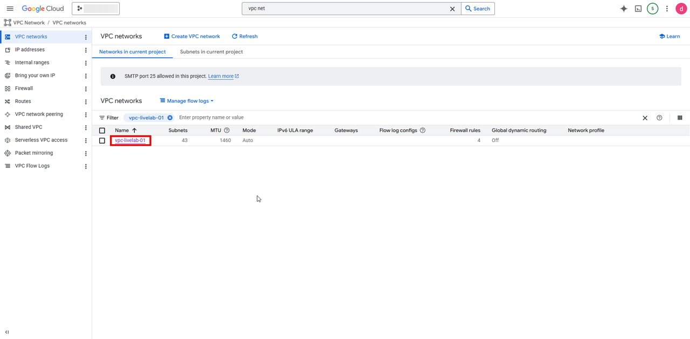
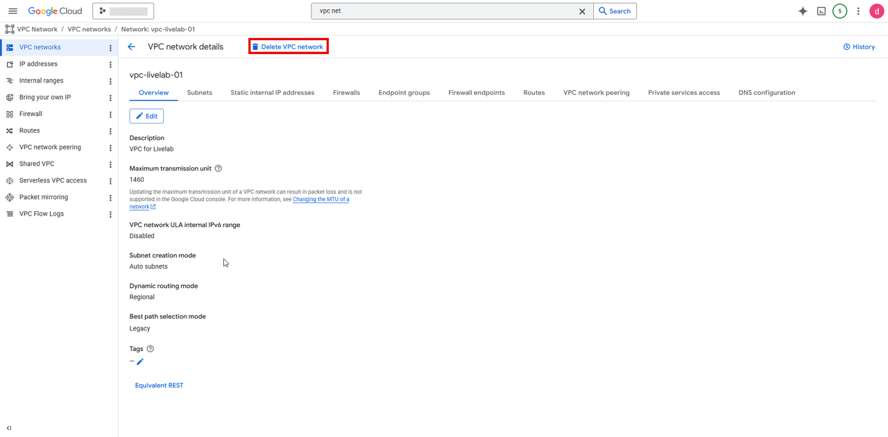
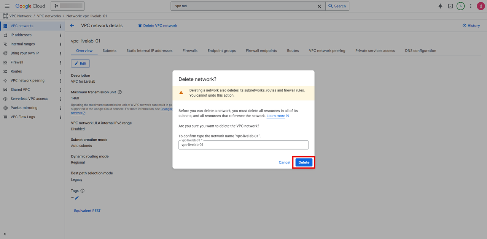

# Clean Up Resources

## Introduction

In this lab, you will delete the resources created in the previous labs.

Estimated Time: About an 30-40 minutes.

### Objectives

- Delete resources created during the workshop.

### Prerequisites

This lab assumes you have successfully completed all previous labs.

## Task 1: Delete Oracle Base Database on Oracle AI Database@Google cloud
1. Select your Base Database and from the three dot menu, click on **Delete**

    

2. A warning will pop up, **"All resources in the DB system, including database and pluggable databases, will be deleted as well. Confirm deletion by typing the following below: bsdb001**

 Enter the System ID **bsdb01** and click on **Confirm**
 
 

 The deletion will take about 15-20 minutes

## Task 2: Delete ODB Network
1. Select the ODB network that you created in the earlier lab and from the three dot menu click **Delete**

 

 2. A warning will pop up **This operation cannot be undone**, Enter the name of the ODB Network and click on **Confirm**

 

## Task 3: Delete VPC Network

1. Select your VPC network 

    

2. Click on the name of your VPC Network to go to **VPC network details** page  and then click on **Delete VPC network**

    

3. A warning will pop up, **Deleting a network also deletes its subnetworks, routes and firewall rules. You cannot undo this action.**

To confirm type the network name "vpc-livelab-01". and click **Delete**

**Congratulations, you have completed the workshop!**

## Acknowledgements
- **Author:** Devinder Singh, Sr Principal Soltiuons Architect, Multicloud
- **Last Updated By/Date:** Devinder Singh, May 2026
