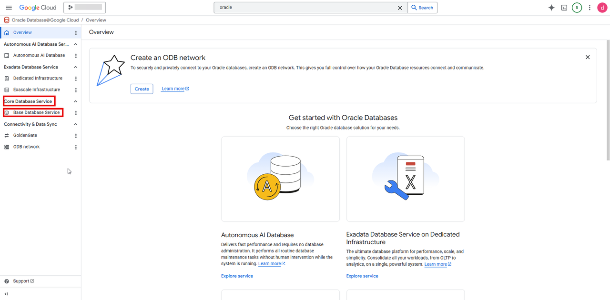
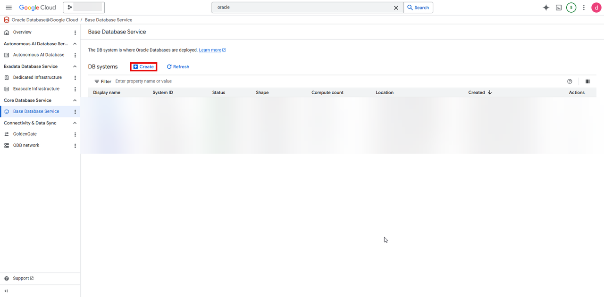
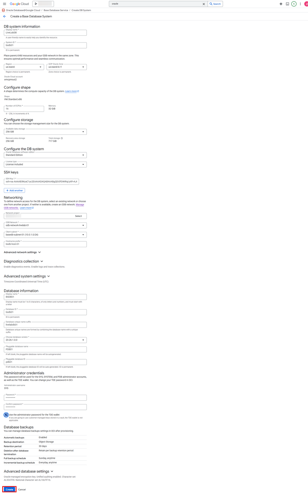
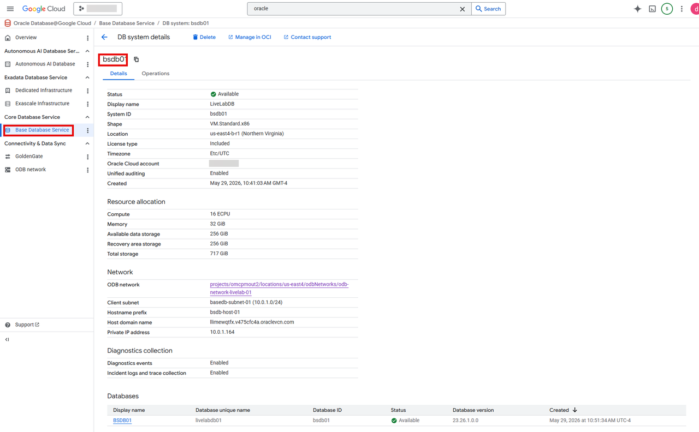

# Create Oracle Base Database on Oracle AI Database@Google Cloud

## Introduction

This lab walks you through creating Oracle Base Database on Oracle AI Database@Google Cloud

Estimated Time: About 30 min

### Objectives

You will login to google Cloud Console and perform the following task
- Create Oracle Base Database on Oracle AI Database@Google Cloud

## Create an Oracle Base Database on Oracle AI Database@Google Cloud

1. Login to Google Cloud Console (https://console.cloud.google.com/)

 

2. Search for Oracle Database@Google Cloud in the search bar and click on Oracle Database@Google Cloud

 

3. Oracle Database@Google Cloud dashboard opens up, click on **Base Database Service** under **Core Database Service**

 

4. Click on **+ Create**

 

5. Enter the following information and click on **Create**

 |Field|Value|
 |-----|------|
 |**DB system information**||
 |Display name|LiveLabDB|
 |System ID|bsdb01|
 |Region|us-east4|
 |GCP Oracle Zone| us-east-b-r1|
 |**Configure Shape**||
 |Shape|VM.Standard.x86(non-modifiable)|
 |Number of ECPUs|16|
 |**Configure storage**||
 |Available data storage|256Gib|
 |**Configure the DB system**||
 |Oracle Database software edition|Standard Edition|
 |License type|License included|
 |**SSH Keys**||
 |SSH key 1 |Paste the contents of the ssh key generated (id_rsa.pub) in the earlier lab|
 |**Networking**||
 |Network project|Your project name|
 |ODB Network|odb-network-livelab-01|
 |client subnet|basedb-subnet-01(10.0.1.0/24)|
 |Hostname prefix|bsdb-host-01|
 |**Database information**||
 |Display name|BSDB01|
 |Database ID|bsdb01|
 |Database unique name suffix|livelabdb01|
 |Choose database version|23.26.1.0.0|
 |Pluggable database name|PDB01|
 |Pluggable databse ID|pdb01|
 |**Administrator credentials**|
 |Adminstrator username|SYS(Can not be modified)|
 |Password|Your password|

  

6. Once created, you can view the details of your newly created Base database

  

6. Click the **Home** link in the breadcrumbs to return to the **Home** page in preparation for the next lab.

**Congratulations! You have successfully created Oracle Base Database on Oracle AI Database@Google Cloud!**.

**You may now proceed to the next lab.**.

## Learn More
* [Oracle AI Database@Google Cloud](https://docs.oracle.com/en-us/iaas/Content/database-at-gcp/home.htm)
* [ODB Network](https://docs.oracle.com/en-us/iaas/Content/database-at-gcp/gcpcr-create-odb-network.html)
* [Oracle Base Database Service](https://docs.oracle.com/en/cloud/paas/base-database/about/)

## Acknowledgements
- **Author:** Devinder Singh, Senior Principal Solutions Architect - Multicloud
- **Contributor:** Devinder Singh, Senior Principal Solutions Architect - Multicloud
- **Last Updated By/Date:** Devinder Singh, May 2026

