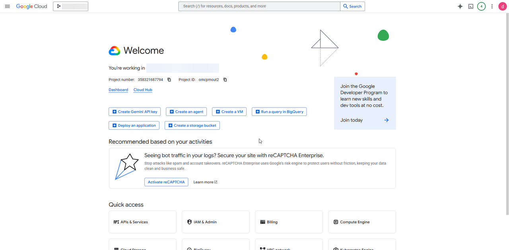
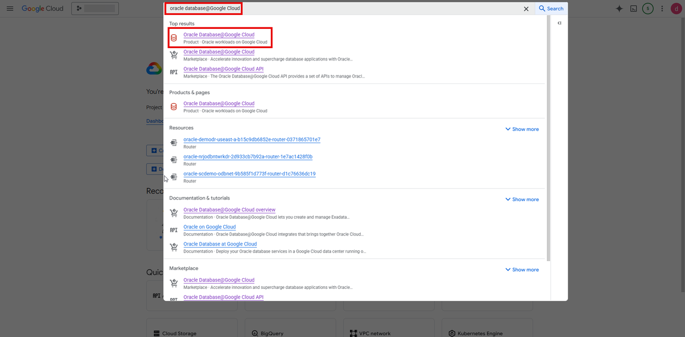
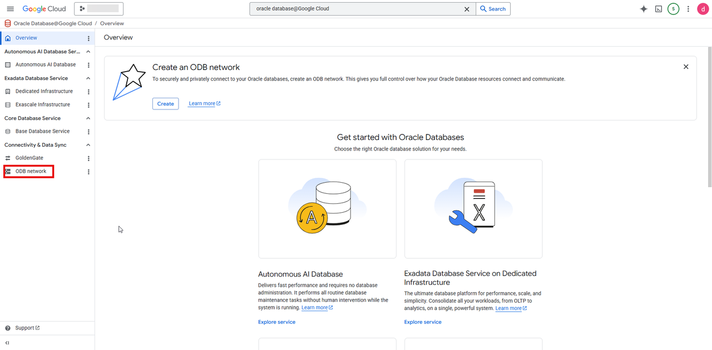
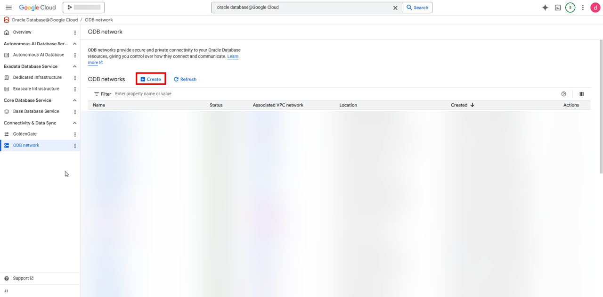
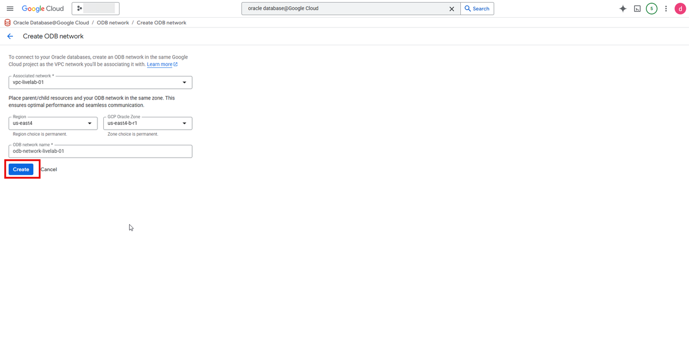
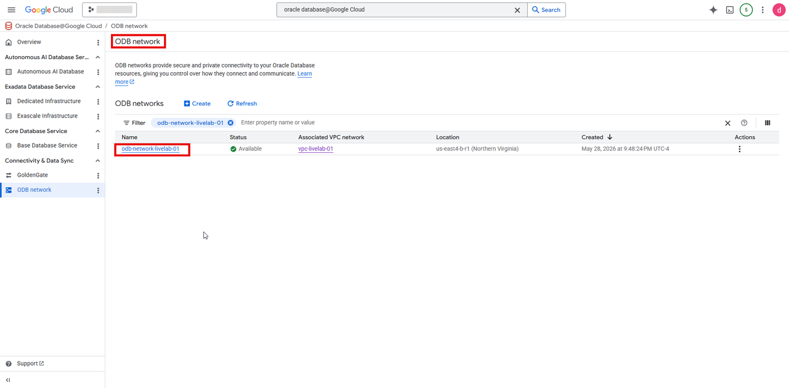
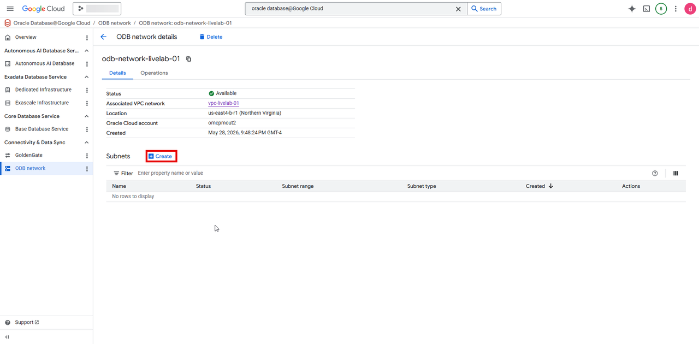
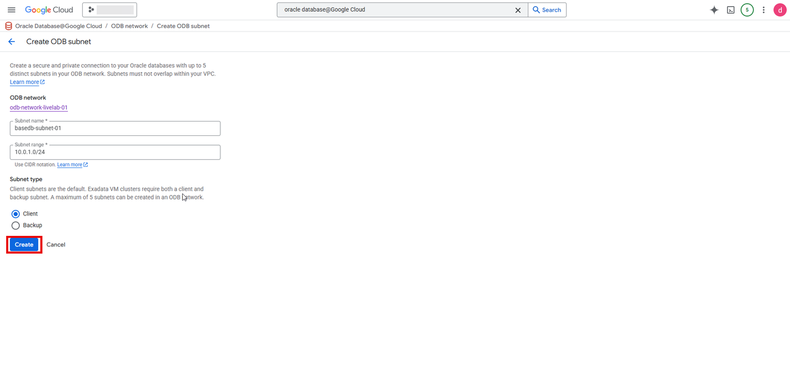

# Create ODB Network

## Introduction

This lab walks you through creating ODB Network which is required for creating a Base Database.

Estimated Time: About 30 min

### Objectives

You will login to google Cloud Console and perform the following task
- Create an ODB Network

## Create an an ODB Network.

1. 1. Login to Google Cloud Console (https://console.cloud.google.com/)

 

2. Search for Oracle Database@Google Cloud in the search bar and click on Oracle Database@Google Cloud

 

3. Oracle Database@Google Cloud dashboard opens up, click on **ODB network** under **Connectivity & Data Sync**

 

4. On the **ODB network** dashboard, click on **+ Create**
 
 

5. On **Create ODB network** screen, enter the following information
 |Field| Value|
 |-----|-----|
 |Associated network|vpc-livelab-01|
 |Region|us-east4|
 |GCP Oracle Zone|us-east4b-r1|
 |ODB network name|odb-network-livelab-01|

 Click **Create**
 

6. Select your newly created ODB network in the **ODB network** dashboard

 

7. Under Subnet section, click on **+ Create**

 

8. Enter the following information and click on create

 |Field|Value|
 |----|--|
 |Subnet name|basedb-subnet-01|
 |Subnet range|10.0.1.0/24|
 |Subnet type|Client |

 

6. Click the **Home** link in the breadcrumbs to return to the **Home** page in preparation for the next lab.

**Congratulations! You have successfully created ODB Network with a subnet!**.

**You may now proceed to the next lab.**.

## Learn More
* [Oracle AI Database@Google Cloud](https://docs.oracle.com/en-us/iaas/Content/database-at-gcp/home.htm)
* [ODB Network](https://docs.oracle.com/en-us/iaas/Content/database-at-gcp/gcpcr-create-odb-network.html)
* [Oracle Base Database Service](https://docs.oracle.com/en/cloud/paas/base-database/about/)

## Acknowledgements
- **Author:** Devinder Singh, Senior Principal Solutions Architect - Multicloud
- **Contributor:** Devinder Singh, Senior Principal Solutions Architect - Multicloud
- **Last Updated By/Date:** Devinder Singh, May 2026

