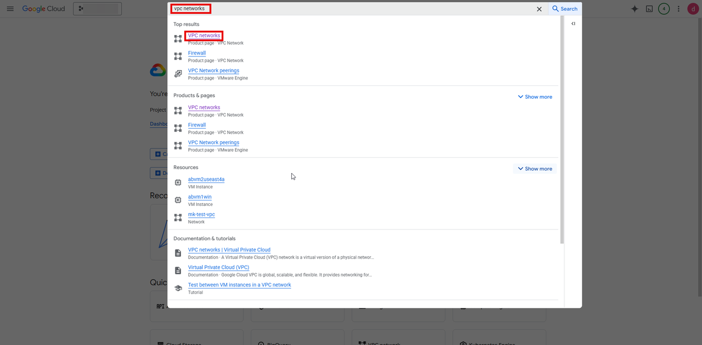
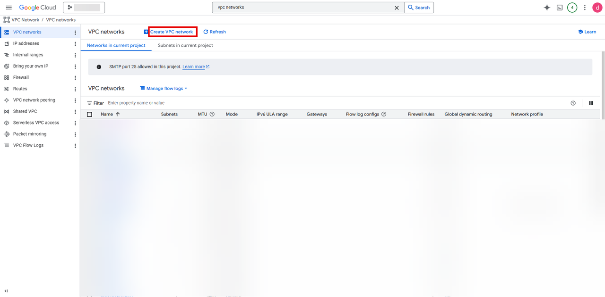
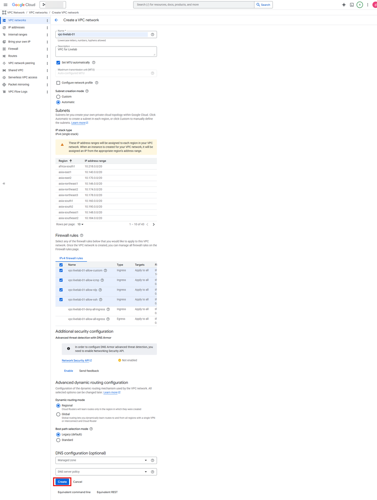
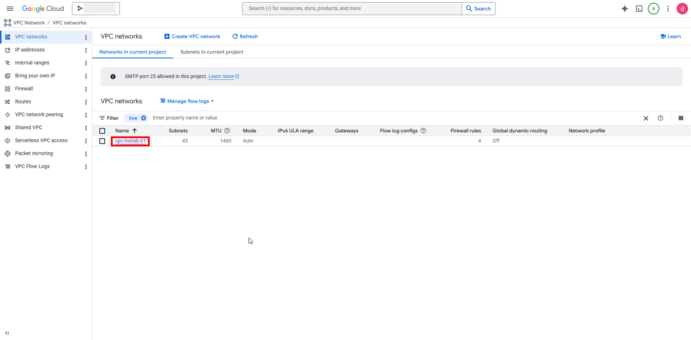

# Create a VPC Network

## Introduction

This lab walks you through creating a VPC Network which is required for creating an ODB Network.

 Estimated Time: About 30 min.

### Objectives

You will login to google Cloud Console and perform the following task.

- Create a VPC Network

## Create an VPC Network

1. Login to Google Cloud Console (https://console.cloud.google.com/)

 

2. Search for VPC Networks the search bar and click on Oracle Database@Google Cloud

 

3. Click on **+Create VPC networks**

 

4. Enter the values

|Field | Value|
|-----|---|
|Name |vpc-livelab-01|
|Description|VPC for LiveLab|
|Set MTU Automatically| Check|
|Subnet creation mode | Automatic|
|Firewall rule| Select all the firewall rules|
|Dynamic routing mode| Regional|
|Best path selection mode |Legacy|

Click on create

 

5. It will take couple of minutes to provision the VPC and you check the details of the newly created VPC under VPC Networks

 

6. Click the **Home** link in the breadcrumbs to return to the **Home** page in preparation for the next lab.

**Congratulations! You have successfully created VPC Network!**.

**You may now proceed to the next lab.**.

## Learn More
* [Oracle AI Database@Google Cloud](https://docs.oracle.com/en-us/iaas/Content/database-at-gcp/home.htm)
* [Onboarding with Oracle AI Database@Google Cloud](https://docs.oracle.com/en-us/iaas/Content/database-at-gcp/onboard.htm)
* [Oracle Base Database Service](https://docs.oracle.com/en/cloud/paas/base-database/about/)

## Acknowledgements
- **Author:** Devinder Singh, Senior Principal Solutions Architect - Multicloud
- **Contributor:** Devinder Singh, Senior Principal Solutions Architect - Multicloud
- **Last Updated By/Date:** Devinder Singh, May 2026
