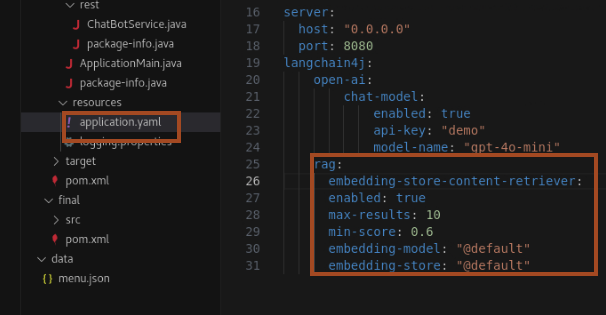

#  Add Retrieval-Augmented Generation (RAG)

## Introduction

**Retrieval-Augmented Generation (RAG)** is an advanced AI technique that enhances LLMs (Large Language Models) by allowing them to retrieve **external knowledge** in real-time. Instead of relying solely on pre-trained data, RAG enables AI models to fetch relevant information from external sources, such as knowledge bases, document stores, or embeddings storage**, leading to more accurate, context-aware responses.

### Key Components of RAG:

**Embedding Model** → Converts text into numerical vectors (**embeddings**) for similarity-based retrieval.</br>
**Embedding Store** → Stores and retrieves embeddings efficiently.</br>
**Content Retriever** → Fetches relevant content from the embedding store based on user queries.

### Objectives

In This Section, we will:

* Learn about **embedding models**, **embedding storage**, and **content retriever**.
* Implement services for these components using **Helidon Inject**.
* Integrate them into our **AI Service** to enable RAG functionality.


## Task 1: Creating the Embedding Model

Since our application uses **Helidon Inject**, we need to create **Helidon services** for the following:

- **Embedding Model**
- **Embedding Store**
- **Content Retriever**

We will use **Helidon Producers** to achieve this.

### What is a Producer?

A **Producer** is a **service** that implements `Supplier<T>`, where `T` is the type it produces. This allows us to define custom factories for components like embedding models and stores.

We will use the **`AllMiniLmL6V2EmbeddingModel`**, a pretrained embedding model from LangChain4J.

1. Right click on `io.helidon.hol.lc4j.ai`, and select **New File** and Enter **`EmbeddingModelFactory.java`** as name.
    ```bash
    <copy>EmbeddingModelFactory.java</copy>
    ```

2. Add the following code:
    ```bash
    <copy>package io.helidon.hol.lc4j.ai;
    import java.util.function.Supplier;
    import dev.langchain4j.model.embedding.EmbeddingModel;
    import dev.langchain4j.model.embedding.onnx.allminilml6v2.AllMiniLmL6V2EmbeddingModel;
    import io.helidon.service.registry.Service;

    @Service.Singleton
    class EmbeddingModelFactory implements Supplier<EmbeddingModel> {
        @Override
        public EmbeddingModel get() {
            return new AllMiniLmL6V2EmbeddingModel();
        }
    }</copy>
    ```

    > **What This Does:**
    - Defines a **service** using `@Service.Singleton`.
    - Implements `Supplier<EmbeddingModel>`, making it a factory for the embedding model.
    - Returns an instance of `AllMiniLmL6V2EmbeddingModel`.
    - We implemented the embedding model as a **separate standalone Java class**, but in some cases, it may be more convenient to define producers as **static inner classes** inside related components.

## Task 2: Creating the Embedding Store

We create an **embedding store** that will store and retrieve embeddings efficiently. We will use `InMemoryEmbeddingStore` provided by LangChain4J.

1. Right click on **`io.helidon.hol.lc4j.ai`**, and select **New File** and Enter **`EmbeddingStoreFactory.java`** as name.
    ```bash
    <copy>EmbeddingStoreFactory.java</copy>
    ```
2. Add the following code:
    ```bash
    <copy>package io.helidon.hol.lc4j.ai;
    import java.util.function.Supplier;
    import dev.langchain4j.store.embedding.EmbeddingStore;
    import dev.langchain4j.data.segment.TextSegment;
    import dev.langchain4j.store.embedding.inmemory.InMemoryEmbeddingStore;
    import io.helidon.service.registry.Service;

    @Service.Singleton
    class EmbeddingStoreFactory implements Supplier<EmbeddingStore<TextSegment>> {
        @Override
        public EmbeddingStore<TextSegment> get() {
            return new InMemoryEmbeddingStore<>();
        }
    }</copy>
    ```

    > **What This Does:**
    - Defines a **service** using `@Service.Singleton`.
    - Implements `Supplier<EmbeddingStore<TextSegment>>`, making it a factory for the embedding store.
    - Uses `InMemoryEmbeddingStore<TextSegment>`, a simple in-memory storage solution for embeddings.

## Task 3: Creating the Content Retriever

To connect our embedding store to the **AI Service**, we need a **Content Retriever**. Instead of writing Java code, Helidon allows configuring it directly via **YAML**.

1. Modify **`application.yaml`** and add the following inside **langchain4j** while keeping proper indentation:
    ```yaml
    <copy>rag:
            embedding-store-content-retriever:
            enabled: true
            max-results: 10
            min-score: 0.6
            embedding-model: "@default"
            embedding-store: "@default"</copy>
    ```
    

    > **What This Does:**
    - Enables **RAG** by configuring `EmbeddingStoreContentRetriever`.
    - Automatically discovers `EmbeddingModel` and `EmbeddingStore` from the service registry using `@default` as a reference.
    - Configures key retrieval properties:
        - `max-results: 10` → Returns up to 10 results per query.
        - `min-score: 0.6` → Filters out results with low similarity scores.

## Task 4: Connecting RAG to Our AI Service

**Do We Need to Modify Our AI Service?**  

No! Helidon LangChain4J automatically discovers the `ContentRetriever` service in the service registry. Since we registered it via configuration, it will be automatically plugged into our **AI Service** without any additional code.

After recompiling, our AI Service will now support RAG, allowing it to query data from the embedding store!

## Task 5: Testing RAG Integration

1. Recompile and Restart the Application:

    ```bash
    <copy>mvn clean package
    java -jar target/helidon-ai-hol.jar</copy>
    ```

2. Try asking a **menu-related question** via the chatbot API:
    ```bash
    <copy>curl -G -X GET "http://localhost:8080/chat" --data-urlencode "question=What drinks do you have?"</copy>
    ```

    You should have output similar to the following:
    ```bash
    $ curl -G -X GET "http://localhost:8080/chat" --data-urlencode "question=What drinks do you have?"
    I dont have physical drinks, but I can suggest a variety of beverages! Here are some options:

    ### Non-Alcoholic Drinks:
    1. **Water** - Still or sparkling.
    2. **Juices** - Orange, apple, cranberry, or mixed fruit.
    3. **Soda** - Cola, lemon-lime, root beer, etc.
    4. **Tea** - Black, green, herbal, or iced tea.
    5. **Coffee** - Espresso, Americano, latte, or cold brew.
    6. **Smoothies** - Made with fruits, vegetables, and yogurt or milk.
    7. **Lemonade** - Classic or flavored (strawberry, mint, etc.).
    8. **Milkshakes** - Chocolate, vanilla, or strawberry.

    ### Alcoholic Drinks:
    1. **Beer** - Lager, ale, stout, or craft beer.
    2. **Wine** - Red, white, rosé, or sparkling.
    3. **Cocktails** - Margarita, mojito, martini, or cosmopolitan.
    4. **Spirits** - Whiskey, vodka, rum, gin, or tequila.

    If you have a specific occasion or preference in mind, let me know, and I can give tailored suggestions!
    $
    ```


## Acknowledgements

* **Author** - Dmitry Kornilov
* **Contributors** - Ankit Pandey, Sid Joshi
* **Last Updated By/Date** - Ankit Pandey, February 2025