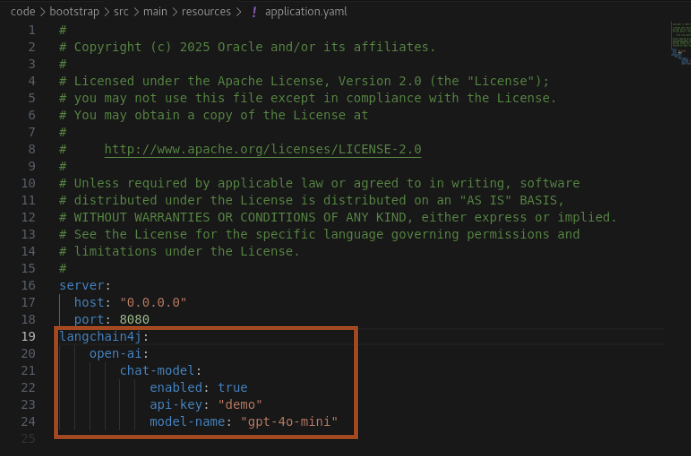

# Enable AI Capabilities in the Project

## Introduction

We will use [LangChain4J (LC4J)](https://github.com/langchain4j/langchain4j/) to implement AI features in our application. Helidon 4.2 provides a dedicated **Helidon-LC4J integration module**, simplifying AI integration in Helidon applications.

### Key Features of Helidon LangChain4J Integration:

**Helidon Inject Support** - Allows **build-time injection** of LangChain4J components into services.</br>
**Convention over Configuration** - Provides **sensible defaults**, reducing manual setup.</br>
**Declarative Services** - Supports LangChain4J's **declarative service** model within Helidon's **declarative programming model**.</br>
**Helidon MP / CDI Integration** - Enables the use of **multiple AI models** and **AI services** in a **CDI environment**.</br>

Estimated Time: 10 minutes


### Objectives

In This Section, we will:

* Use **Helidon LangChain4J integration** to enable AI capabilities.
* Add the necessary **Maven dependencies**.
* Configure **Helidon Inject** to work with AI services.
* Add and configure an **OpenAI chat model**.
* Modify our **RESTful service** to interact with the AI model.

---


## Task 1: Add dependencies and annotation processors

To enable Helidon and LangChain4J integration, You need to add several **Maven dependencies** and **annotation processors**.

1. You need to add the following dependencies inside the **`<dependencies>`** section of **`pom.xml`**:
    ```bash
    <copy><dependency>
        <groupId>io.helidon.integrations.langchain4j</groupId>
        <artifactId>helidon-integrations-langchain4j</artifactId>
    </dependency>
    <dependency>
        <groupId>io.helidon.integrations.langchain4j.providers</groupId>
        <artifactId>helidon-integrations-langchain4j-providers-open-ai</artifactId>
    </dependency>
    <dependency>
        <groupId>dev.langchain4j</groupId>
        <artifactId>langchain4j-embeddings-all-minilm-l6-v2</artifactId>
        <version>${version.lib.langchain4j}</version>
    </dependency></copy>
    ```

2. Since Helidon Inject works at build time, we need to add annotation processor **helidon-integrations-langchain4j-codegen** to the maven-compiler-plugin in **`<build><plugins><configuration><annotationProcessorPaths>`** section of **`pom.xml`**:
    ```bash
    <copy><path>
        <groupId>io.helidon.integrations.langchain4j</groupId>
        <artifactId>helidon-integrations-langchain4j-codegen</artifactId>
        <version>${helidon.version}</version>
    </path></copy>
    ```

    Your final result should look like this:

    ```bash
    <plugin>
        <groupId>org.apache.maven.plugins</groupId>
        <artifactId>maven-compiler-plugin</artifactId>
        <configuration>
            <annotationProcessorPaths>
                <path>
                    <groupId>io.helidon.codegen</groupId>
                    <artifactId>helidon-codegen-apt</artifactId>
                    <version>${helidon.version}</version>
                </path>
                <path>
                    <groupId>io.helidon.service</groupId>
                    <artifactId>helidon-service-codegen</artifactId>
                    <version>${helidon.version}</version>
                </path>
                <path>
                    <groupId>io.helidon.integrations.langchain4j</groupId>
                    <artifactId>helidon-integrations-langchain4j-codegen</artifactId>
                    <version>${helidon.version}</version>
                </path>
            </annotationProcessorPaths>
        </configuration>
    </plugin></copy>
    ```

## Task 2: Adding a Chat Model

Now, let’s add a **chat model** to our project. We will use OpenAI’s **gpt-4o-mini** in **demo mode**.

1. Add the following configuration to `src/main/resources/application.yaml`:
    ```bash
    <copy>langchain4j:
        open-ai:
            chat-model:
                enabled: true
                api-key: "demo"
                model-name: "gpt-4o-mini"</copy>
    ```
    

    >  After adding the configuration, the chat model will be **available for injection** into Helidon components. *Make sure to keep proper indentation as shown in above screenshot*.


2. To inject the chat model into our services, update **`ChatBotService.java`** as follows:
    ```bash
    <copy>import dev.langchain4j.model.openai.OpenAiChatModel;

    @Service.Singleton
    public class ChatBotService implements HttpService {

        private final OpenAiChatModel chatModel;

        @Service.Inject
        public ChatBotService(OpenAiChatModel chatModel) {
            // Injecting the configured chat model using constructor injection
            this.chatModel = chatModel;
        }

        @Override
        public void routing(HttpRules httpRules) {
            httpRules.get("/chat", this::chatWithAssistant);
        }

        private void chatWithAssistant(ServerRequest req, ServerResponse res) {
            // Reading the `question` query parameter from the request. 
            var question = req.query().get("question");
            
            // Calling the chat model to get the answer
            var answer = chatModel.generate(question);

            // Return the answer
            res.send(answer);
        }
    }</copy>
    ```
    > You need to retain other imports in this class.

## Task 3: Testing the AI Chat Assistant

1. In the terminal, where you have set the JDK and maven, run the following command to build the application.
    ```bash
    <copy>mvn clean package
    java -jar target/helidon-ai-hol.jar</copy>
    ```

2. To test the assistant, run the following command in the terminal:
    ```bash
    <copy>curl "http://localhost:8080/chat?question=Hello"</copy>
    ```

    You should receive an AI-generated response.
    ```bash
    $ curl "http://localhost:8080/chat?question=Hello"
    Hello! How can I assist you today?
    $
    ```

## Acknowledgements

* **Author** - Dmitry Kornilov
* **Contributors** - Ankit Pandey, Sid Joshi
* **Last Updated By/Date** - Ankit Pandey, March 2025