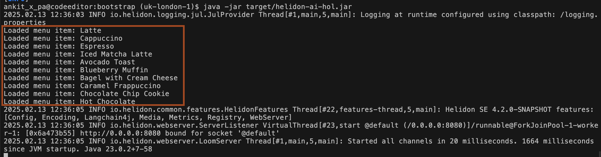

# Prepare Application Data

## Introduction

Now it's time to connect our **AI Service** to a data source so it can use this information to answer user queries.

This is a required lab before filling the embedding store with our business data.

Estimated time: 05 minutes

### Objectives

In this lab, we will:
* Understand the **structure and format** of the application data.
* Define a **Java model** to represent menu items.
* Implement a **service to read application data** from a JSON file and convert it into an internal model.


## Task 1:  Defining Application Data

In this application, **menu data** consists of a list of **menu items** along with their metadata. While in a real-world scenario, this data would come from a **back-office system**, for simplicity, we will **load it from a JSON file**.

**Example: A Menu Item in JSON Format**

```json
{
    "name": "Latte",
    "description": "A rich espresso drink with steamed milk.",
    "category": "Drink",
    "price": 4.5,
    "tags": [
        "Hot",
        "Customizable",
        "Classic"
    ],
    "addOns": [
        "Oat milk",
        "Soy milk",
        "Extra shot",
        "Caramel syrup"
    ]
}
```

> **prefilled menu dataset** is provided in the repository under: `data/menu.json`

1.  Open **`data/menu.json`** and  you can **add a new menu item of your choice** or leave it.
    

## Task 2: Creating an Internal Data Model

To represent a **menu item** in Java, we will define a **Java Bean** that mirrors the JSON structure.

1. We will keep all AI-related classes in `io.helidon.hol.lc4j.data` package. Right click on **`io.helidon.hol.lc4j`** and select **New Folder** and Enter name **data**.

2. Right click on `io.helidon.hol.lc4j.data`, and select **New File** and Enter **`MenuItem.java`** as name.
    ```bash
    <copy>MenuItem.java</copy>
    ```

3. Copy and paste the following content in `MenuItem.java`
    ```java
    <copy>package io.helidon.hol.lc4j.data;

    import java.util.List;

    public class MenuItem {
        private String name;
        private String description;
        private String category;
        private double price;
        private List<String> tags;
        private List<String> addOns;

        // Getters and Setters
        public String getName() { return name; }
        public void setName(String name) { this.name = name; }

        public String getDescription() { return description; }
        public void setDescription(String description) { this.description = description; }

        public String getCategory() { return category; }
        public void setCategory(String category) { this.category = category; }

        public double getPrice() { return price; }
        public void setPrice(double price) { this.price = price; }

        public List<String> getTags() { return tags; }
        public void setTags(List<String> tags) { this.tags = tags; }

        public List<String> getAddOns() { return addOns; }
        public void setAddOns(List<String> addOns) { this.addOns = addOns; }
    }</copy>
    ```

    > This **Java class** maps the **JSON fields** to **Java fields** of corresponding types.

## Task 3: Configuring the Application to Read Data

1. Modify the **`application.yaml`** file to specify the path to `menu.json`:
    ```yaml
    <copy>app:
        menu-items: "../../data/menu.json"</copy>
    ```
    

## Task 4: Create a Service to Load Menu Data

At this step, we will create a **service** responsible for:

- **Loading data from the JSON file**
- **Converting it into the internal model**
- **Providing an API to access menu items**

**What This Class Will Do:**

- The `MenuItemsService` class will be a **singleton service**, ensuring that a **single instance** is used across the application.
- It retrieves the **menu file path** from `application.yaml` using **constructor injection**.
- The `getMenuItems()` method **parses the JSON file** using **Jackson** and converts it into a `List<MenuItem>`.
- If the file is missing or unreadable, an **error is logged**, and a `RuntimeException` is thrown to prevent the application from running with missing data.

1. Right click on `io.helidon.hol.lc4j.data`, and select **New File** and Enter **`MenuItemsService.java`** as name.
    ```bash
    <copy>MenuItemsService.java</copy>
    ```

2. Copy and paste the following content in `MenuItemsService.java`
    ```java
    <copy>package io.helidon.hol.lc4j.data;

    import java.io.IOException;
    import java.nio.file.Path;
    import java.util.List;
    import java.util.logging.Logger;

    import io.helidon.common.config.Config;
    import io.helidon.service.registry.Service;

    import com.fasterxml.jackson.core.type.TypeReference;
    import com.fasterxml.jackson.databind.ObjectMapper;

    @Service.Singleton
    public class MenuItemsService {
        private static final Logger LOGGER = Logger.getLogger(MenuItemsService.class.getName());
        private static final String CONFIG_KEY = "app.menu-items";    
        private final Path jsonPath;

        @Service.Inject
        MenuItemsService(Config config) {
            // Injecting Config and reading the menu data file path
            this.jsonPath = config.get(CONFIG_KEY)
                    .as(Path.class)
                    .orElseThrow(() -> new IllegalStateException(CONFIG_KEY + " is a required configuration key"));
        }

        public List<MenuItem> getMenuItems() {
            var objectMapper = new ObjectMapper();
            try {
                // Deserialize JSON into List<MenuItem>
                return objectMapper.readValue(jsonPath.toFile(), new TypeReference<>() {});
            } catch (IOException e) {
                LOGGER.severe("Failed to read menu items from file: " + e.getMessage());
                throw new RuntimeException("Error reading menu data", e);
            }
        }
    }</copy>
    ```

## Task 5: Integrating Menu Data into the Application

Now, we need to **modify the main class** to read menu items **during application startup**.

1. **Update `ApplicationMain.java`:**

```java
<copy>import io.helidon.hol.lc4j.data.MenuItemsService;
public class ApplicationMain {
    public static void main(String[] args) {
        // Initialize logging
        LogConfig.configureRuntime();

        var config = Services.get(Config.class);

        // Read and print menu items
        var menuItems = Services.get(MenuItemsService.class).getMenuItems();
        menuItems.forEach(item -> System.out.println("Loaded menu item: " + item.getName()));

        // Start Helidon Web Server
        WebServer.builder()
                .config(config.get("server"))
                .routing(routing -> routing.register("/", Services.get(ChatBotService.class)))
                .build()
                .start();
    }
}</copy>
```

## Task 6: Testing the Application Data Integration

1. Recompile and Run the Application
    ```bash
    <copy>mvn clean package
    java -jar target/helidon-ai-hol.jar</copy>
    ```

2. Verify the output at **Console** Logs
    **Expected Console Log:**
    ```
    Loaded menu item: Latte
    Loaded menu item: Espresso
    Loaded menu item: Cappuccino
    ```
    
    
    > **If you added a new menu item to `menu.json`, it should also appear in the output.**

## Acknowledgements

* **Author** - Dmitry Kornilov
* **Contributors** - Ankit Pandey, Sid Joshi
* **Last Updated By/Date** - Ankit Pandey, February 2025