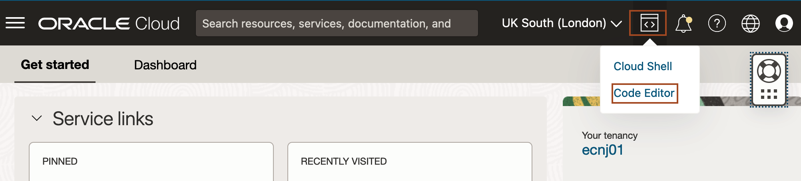
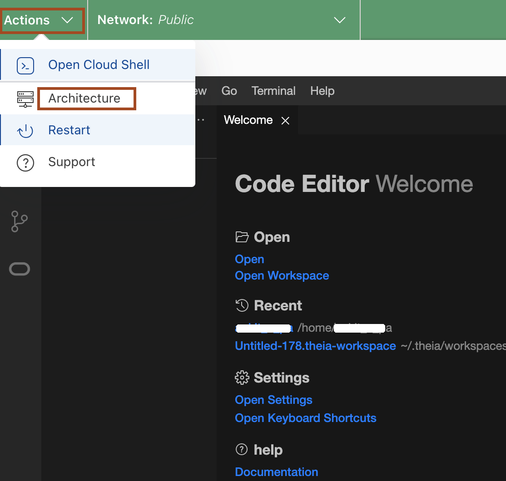
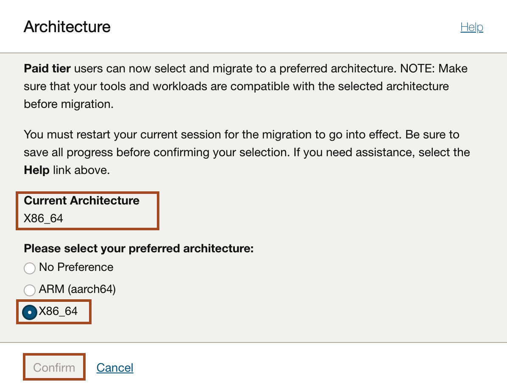
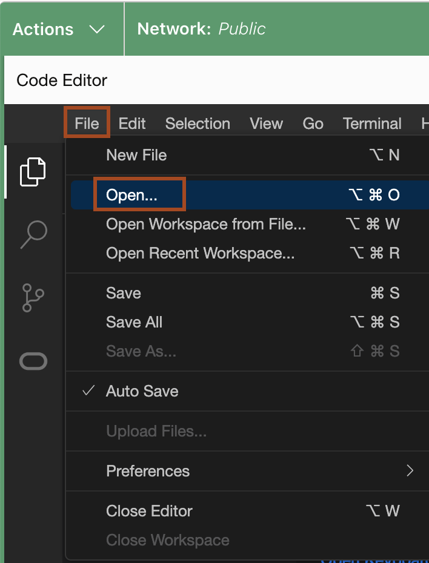

# Setup the Environment

## Introduction

This lab walks you through the steps to setup the required environment for the Workshop.

Estimated time: 05 minutes

### Objectives

* Setup the Code Editor
* Download the required Maven and JDK version
* Download the Helidon source code

### Prerequisites

* You must have an [Oracle Cloud Infrastructure](https://www.oracle.com/in/cloud/) enabled account.
* You must have Chrome as a browser to open Code Editor


## Task 1: Setup the Code Editor

1. In Cloud Console, click the **Code Editor** icon as shown.
    

2. In Code Editor, click **Terminal** -> **New Terminal**.
     


## Task 2: Download the required Maven and JDK version

1. Click **Actions** -> **Architecture**, to know your current architecture.
    

2. Check your **Current Architecture**, if it is **X86_64**, then click **Cancel**. If you have **ARM** architecture, then select **`X86_64`** and click **Confirm**.
    

1. Copy the following commands and paste in the terminal. It downloads the required version of JDK and Maven.
    ```bash
    <copy>curl -O https://objectstorage.uk-london-1.oraclecloud.com/p/9opYCG9nPW_Ch9f1wrCtnL361EEY1OPQ3WO4FxaMfQfTOurFHCqkgoWEFc5a6EDK/n/lrv4zdykjqrj/b/ankit-bucket/o/setup-jdk24-x86-64.sh
    chmod +x setup-jdk24-x86-64.sh
    ./setup-jdk24-x86-64.sh</copy>
    ```


## Task 3: Download the Helidon source code

1. Copy the following commands and paste in the terminal to download the source code of helidon application.
    ```bash
    <copy>curl -O https://objectstorage.uk-london-1.oraclecloud.com/p/Z7KkflaFYAGMVpWL5n0nGBMF58iAp5_suMxnCymjgNizS0r72GkDOqSctkPAQjsM/n/lrv4zdykjqrj/b/ankit-bucket/o/helidon-ai-hol.zip
    unzip helidon-ai-hol.zip
    cd helidon-ai-hol</copy>
    ```
    

## Task 4: Open Helidon source code in VS Code

1. Click **File** -> **Open** in Code Editor.
    

2. Select **helidon-ai-hol** folder and click **Open**.
    

3. Copy the following command and run in the terminal to verify that required JDK and Maven version are configured properly.
    ```bash
    <copy>mvn -v </copy>
    ```

    > Do not get alarmed if you encounter `WARNING: java.lang.System::load`, it's a harmless warning caused by Maven compatibility issue [MNG-8248](https://issues.apache.org/jira/browse/MNG-8248)


You may now *proceed to the next lab*.


## Acknowledgements

* **Author** - Dmitry Kornilov
* **Contributors** - Ankit Pandey, Sid Joshi
* **Last Updated By/Date** - Ankit Pandey, March 2025