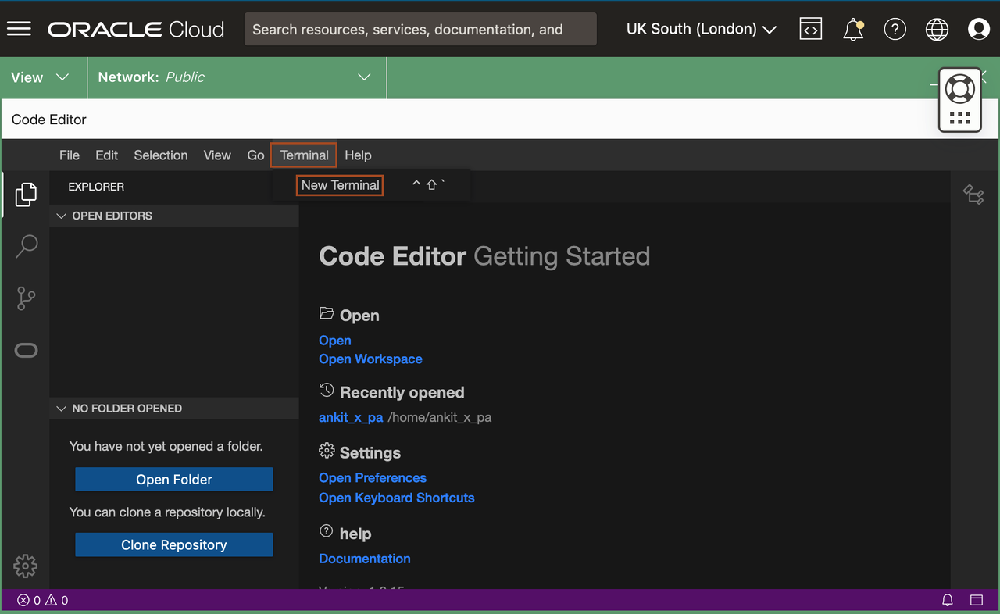
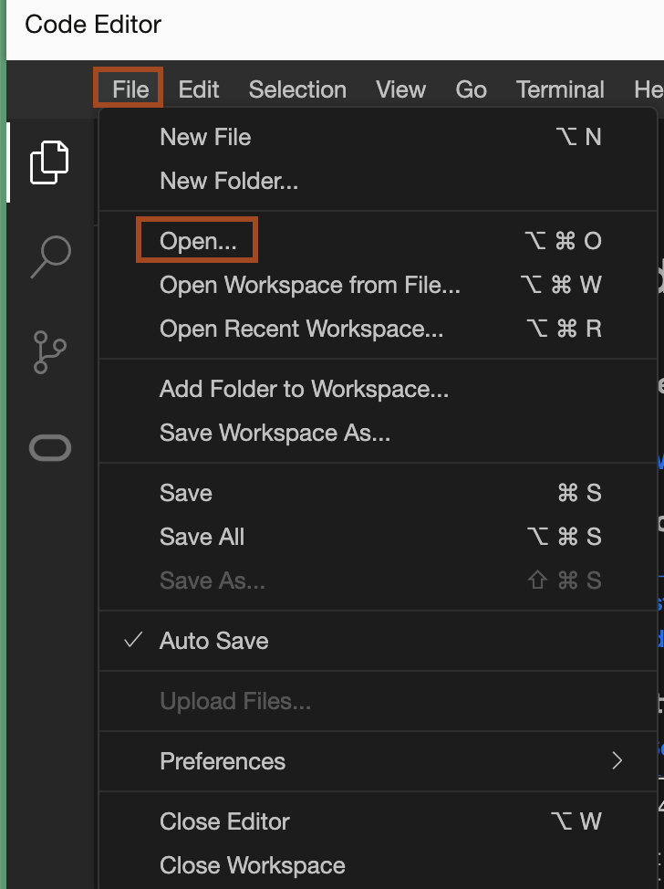
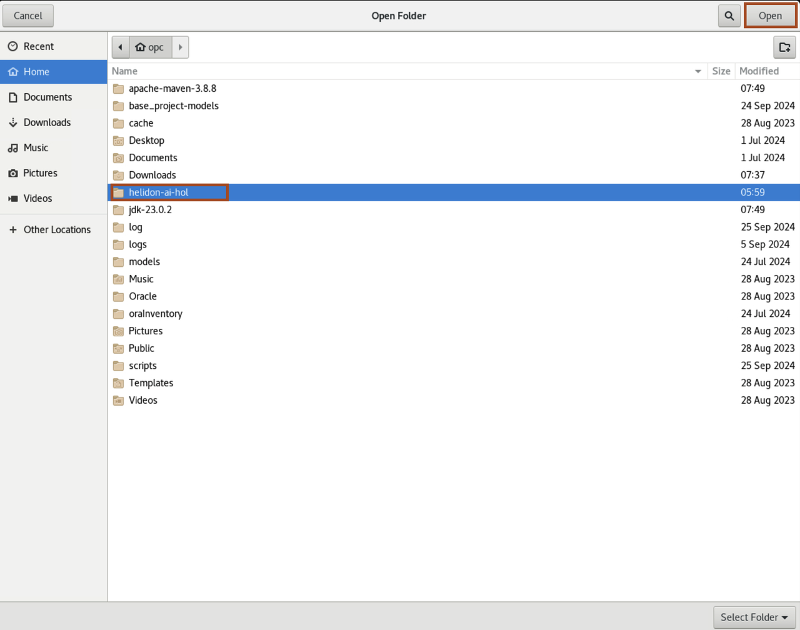
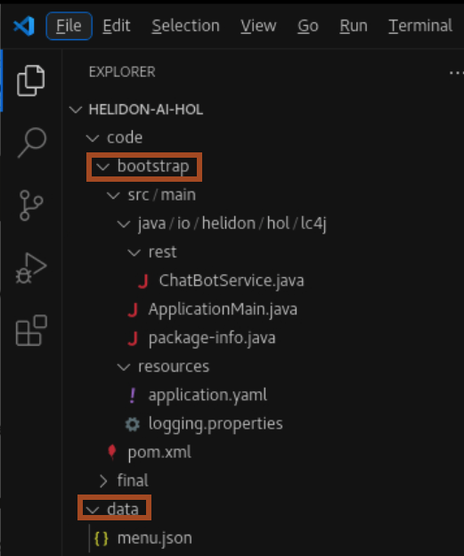

# Setup the Environment

## Introduction

This lab walks you through the steps to setup the required environment for the Workshop.

Estimated time: 05 minutes

### Objectives

* Setup the Visual Studio Code
* Download the required Maven and JDK version
* Download the Helidon source code

### Prerequisites

* You must have an [Oracle Cloud Infrastructure](https://cloud.oracle.com/en_US/cloud-infrastructure) enabled account.
* You must have Chrome as a browser to open Code Editor.


## Task 1: Access the Remote console URL

1. You must have received the **bitly** link from the instructor. Open the URL in the browser.

## Task 2: Install Visual Studio Code in the Remote Desktop


1. In the terminal, copy and paste the below command to install the **VSCode** in the remote Desktop.
    ```bash
    <copy>./install-vscode.sh</copy>
    ```

2. Click **Activities** and type **Visual**, you will see the icon for **Visual Studio code**. Click **Visual Studio Code** icon.

    
3. In **VSCode**, click **Terminal** -> **New Terminal**.
    


## Task 3: Download the required Maven and JDK version

1. Copy the following commands and paste in the terminal. It downloads the required version of JDK and Maven.

    ```bash
    <copy>cd ~
    wget https://dlcdn.apache.org/maven/maven-3/3.8.8/binaries/apache-maven-3.8.8-bin.tar.gz
    tar -xvf apache-maven-3.8.8-bin.tar.gz
    wget https://download.oracle.com/java/23/latest/jdk-23_linux-x64_bin.tar.gz
    tar -xzvf jdk-23_linux-x64_bin.tar.gz
    cd ~</copy>
    ```

## Task 4: Open Helidon Application in the Visual Studio Code

1.  Copy the following commands and paste in the terminal to download the source code of helidon application.

    ```bash
    <copy>curl -O https://objectstorage.uk-london-1.oraclecloud.com/p/eVD6cUQpRms3iic_ZM4_si54wtIsFTNQUns-_U_HR7ofwQRj4m7qR76IMXDEEFqt/n/lrv4zdykjqrj/b/ankit-bucket/o/helidon-ai-hol.zip</copy>
    ```
    
2. Copy and paste the following command to unzip the *helidon-ai-hol.zip*.
    ```bash
    <copy>unzip ~/helidon-ai-hol.zip</copy>
    ```

3. Click *File* -> *Open Folder* in **VSCode**.
    

4. Select *helidon-ai-hol* folder and click *Open*.
    

    > Click **Explorer** icon as shown and expand the folders.
        

You may now *proceed to the next lab*.


## Acknowledgements

* **Author** - Dmitry Kornilov
* **Contributors** - Ankit Pandey, Sid Joshi
* **Last Updated By/Date** - Ankit Pandey, February 2025