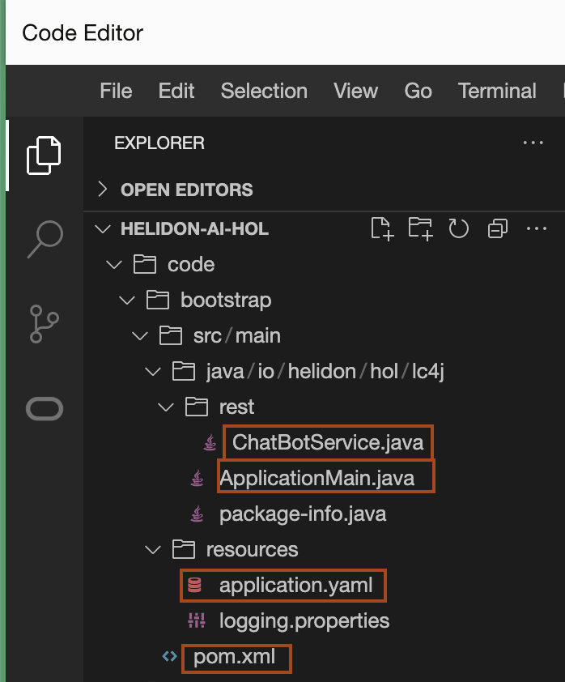

# Setup the Project

## Introduction

In this lab, you will explore the **bootstrap** project that include a minimal **Helidon SE** application. You will understand the project structure and its key component. Then, you will build and run the application, to verify **Rest service** is working.

Estimated time: 10 minutes

### Objectives

* Explore the **bootstrap project** a **Helidon SE** application
* Understand the project structure
* Build and run the project
* Verify **REST service** is working

### Prerequisites

* You must have completed all previous labs.

## Task 1: Bootstrap the Project

1. This repository includes a **bootstrap project**, which provides a **Helidon SE** application with a basic REST service. The project is located in the `code/bootstrap` directory.

## Task 2: Understand the project structure
The bootstrap project contains the following key files:

1. **`pom.xml`** - Maven build script with a minimal set of dependencies required to build and run the application.

2. **`ApplicationMain.java`** - Contains the `main` method and initializes the application.

3. **`ChatBotService.java`** - A simple **RESTful service** that listens on the **`/chat`** endpoint. Currently, it responds with `"Hello"` to every request. We will modify this service to implement our chatbot functionality.

4. **`application.yaml`** - Contains application configuration settings. We will extend this file as we enhance the application.

      

## Task 3: Build and Run the Project

1. In the terminal, where you have set the JDK and Maven, run the following command to **clean** and **build** the project:
      ```bash
      <copy>cd code/bootstrap
      mvn clean package</copy>
      ```

2. Start the application using:
      ```bash
      <copy>java -jar target/helidon-ai-hol.jar</copy>
      ```

## Task 4: Verify the Application is Running

1. One a new terminal, and run the following command to test the application.
      ```bash
      <copy>curl -X GET http://localhost:8080/chat</copy>
      ```

      You should receive the following response:

      ```bash
      Hello
      ```

      > To stop the application, press **Ctrl+C** in the terminal where application is running.

## Acknowledgements

* **Author** - Dmitry Kornilov
* **Contributors** - Ankit Pandey, Sid Joshi
* **Last Updated By/Date** - Ankit Pandey, February 2025