# Build and Push Helidon Application Image to Oracle Cloud Container Registry

## Introduction

In this lab, you will build a *native* Docker image with your Helidon application and push that image to a repository inside the Oracle Cloud Container Registry.

Estimated Time: 15 minutes

### Objectives

* Build and package your application using Docker.
* Generate an Authentication Token to log in to the Oracle Cloud Container Registry.
* Push Helidon application Docker image to your Oracle Cloud Container Registry repository.

### Prerequisites

* The Helidon application you created in the previous lab
* Docker
* Oracle Cloud Account


## Task 1: Build the Helidon Application Docker Image

We are creating a Docker image, which you will upload to the Oracle Cloud Container Registry that belongs to your OCI account. To do so you need to create an image name which reflects your registry coordinates.

You need the following information:

* Region Name
* Tenancy Namespace
* Endpoint for the Region
    >Copy this information to a text file so that you can refer to it throughout the lab.

1. Locate your *Region Name*. <br>
Your *Region Name* is located in the top right corner of the Oracle Cloud Console, in this example, it is shown as *UK South (London)*. Yours may be different.

    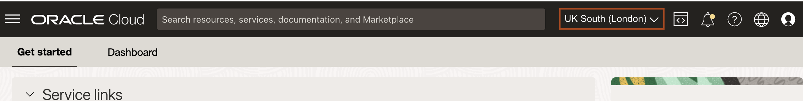

2. Locate the *Tenancy Namespace*. <br>
In the Console, open the navigation menu and click **Developer Services**. Under **Containers & Artifacts**, click **Container Registry**.

    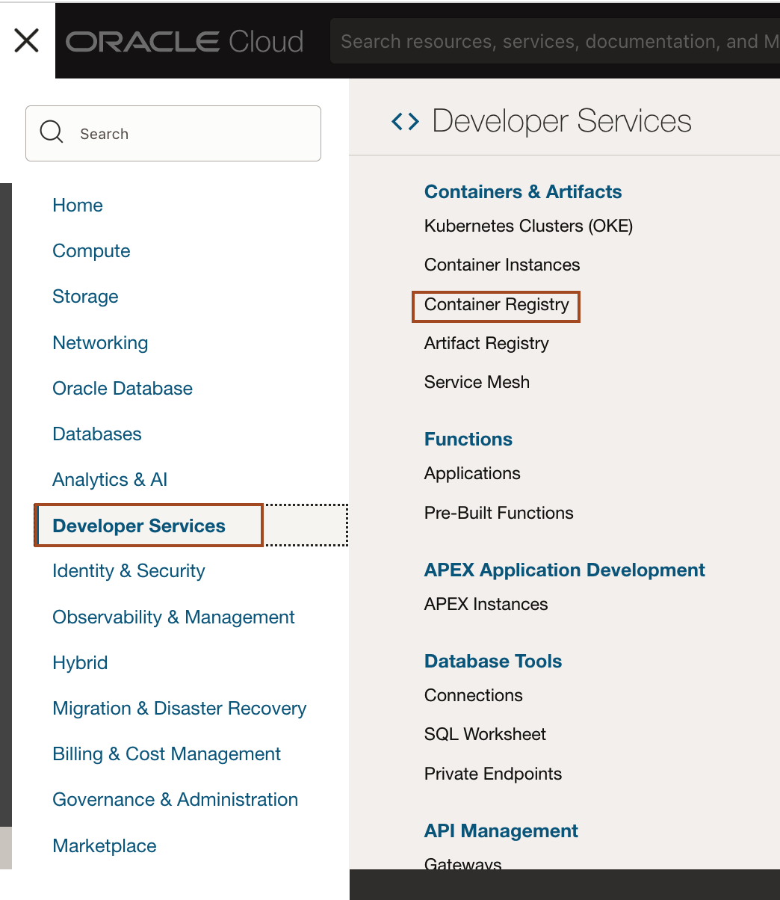

    > The tenancy namespace is listed in the compartment. Copy and save it in a text file. You will use this information in the next lab, too.
    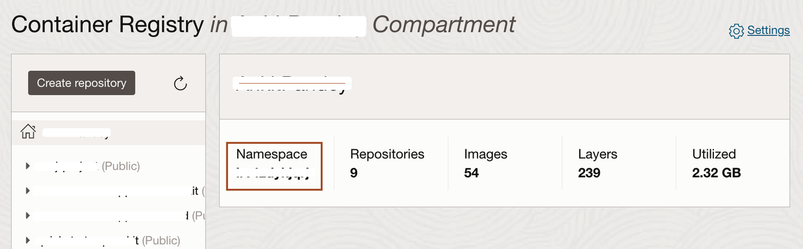

3. Locate the *Endpoint for Your Region*. <br>
Refer to the table documented at this URL [https://docs.oracle.com/en-us/iaas/Content/Registry/Concepts/registryprerequisites.htm#Availab](https://docs.oracle.com/en-us/iaas/Content/Registry/Concepts/registryprerequisites.htm#Availab). In the example shown, the endpoint for the region is *UK South (London)* (as the region name) and its endpoint is *lhr.ocir.io*. Locate the endpoint for your own *Region Name* and save it in the text file. You will also need it for the next lab.

    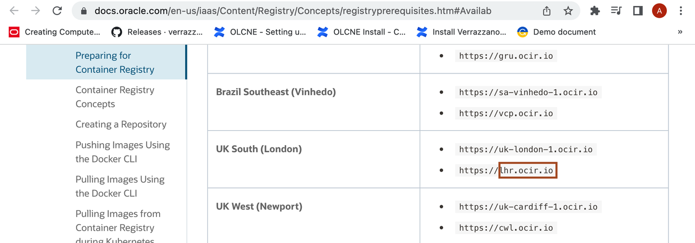

    >Now you have both the tenancy namespace and endpoint for your region.

4. Copy the following command and paste it into your text file. Then replace the *`ENDPOINT_OF_YOUR_REGION`* with the endpoint of your region name, *`NAMESPACE_OF_YOUR_TENANCY`* with your tenancy's namespace and *`your_first_name`* with your's first name.
    > This does a full build inside the Docker container. The first time you run it, it will take a while because it is downloading all of the Maven dependencies and caching them in a Docker layer. Subsequent builds will be much faster as long as you don’t change the pom.xml file. If the pom is modified then the dependencies will be re-downloaded.

    ```bash
    <copy>docker build -t ENDPOINT_OF_YOUR_REGION/NAMESPACE_OF_YOUR_TENANCY/myproject-your_first_name:1.0 -f Dockerfile.native .</copy>
    ```
    When the command is ready then run in the terminal inside Code Editor from the `~/myproject/` directory. The build will produce the following result at the end:

    ```bash
    $ docker build -t lhr.ocir.io/tenancynamespace/myproject-your_first_name:1.0 -f Dockerfile.native .

    [INFO] [myproject:70]     (clinit):   2,003.59 ms,  4.84 GB
    [INFO] [myproject:70]   (typeflow):  46,911.76 ms,  4.84 GB
    [INFO] [myproject:70]    (objects): 254,111.73 ms,  4.84 GB
    [INFO] [myproject:70]   (features):  24,428.97 ms,  4.84 GB
    [INFO] [myproject:70]     analysis: 331,810.15 ms,  4.84 GB
    [INFO] [myproject:70]     universe:  19,777.47 ms,  4.85 GB
    [INFO] [myproject:70]      (parse):  17,328.01 ms,  4.85 GB
    [INFO] [myproject:70]     (inline):  34,953.90 ms,  4.43 GB
    [INFO] [myproject:70]    (compile): 154,736.98 ms,  4.56 GB
    [INFO] [myproject:70]      compile: 215,343.56 ms,  4.56 GB
    [INFO] [myproject:70]        image:  19,270.03 ms,  4.62 GB
    [INFO] [myproject:70]        write:   2,909.02 ms,  4.62 GB
    [INFO] [myproject:70]      [total]: 609,016.44 ms,  4.62 GB
    [INFO] # Printing build artifacts to: /helidon/target/myproject.build_artifacts.txt
    [INFO] ------------------------------------------------------------------------
    [INFO] BUILD SUCCESS
    [INFO] ------------------------------------------------------------------------
    [INFO] Total time:  10:19 min
    [INFO] Finished at: 2022-09-02T02:17:13Z
    [INFO] ------------------------------------------------------------------------
    Removing intermediate container 7459a8fded63
    ---> ceae283fafca
    Step 10/15 : RUN echo "done!"
    ---> Running in 0d428f253a5b
    done!
    Removing intermediate container 0d428f253a5b
    ---> f1baf6f6e2a7
    Step 11/15 : FROM scratch
    ---> 
    Step 12/15 : WORKDIR /helidon
    ---> Running in a1e07d0ed3e1
    Removing intermediate container a1e07d0ed3e1
    ---> 75c33e343012
    Step 13/15 : COPY --from=build /helidon/target/myproject .
    ---> 4bd6a176d7df
    Step 14/15 : ENTRYPOINT ["./myproject"]
    ---> Running in e9b47124756f
    Removing intermediate container e9b47124756f
    ---> b7c99eff01ed
    Step 15/15 : EXPOSE 8080
    ---> Running in 65224e9ac1b5
    Removing intermediate container 65224e9ac1b5
    ---> 52dbfa806fdc
    Successfully built 52dbfa806fdc
    Successfully tagged lhr.ocir.io/tenancynamespace/myproject-ankit:1.0 
    ```

5. This creates the Docker image, which you can check in your local repository.

    ```bash
    $ docker images
    REPOSITORY    TAG    IMAGE ID            CREATED             SIZE
    lhr.ocir.io/tenancynamespace/myproject-ankit   1.0  6a0213536020  11 hours ago        424MB
    ```
    Copy to your text editor the replaced full image name `ENDPOINT_OF_YOUR_REGION/NAMESPACE_OF_YOUR_TENANCY/myproject-your_first_name:1.0` because you will need it later.

6. Copy and paste the following command in the terminal, to run the docker image in Cloud Shell of Code Editor.
    ```bash
    <copy>docker run --rm -p 8080:8080 ENDPOINT_OF_YOUR_REGION/NAMESPACE_OF_YOUR_TENANCY/myproject-your_first_name:1.0</copy>
    ```
    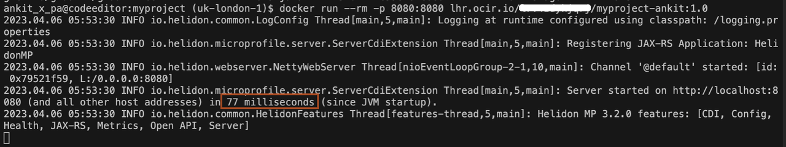

7.  Open a new terminal/console and run the following commands to check the application:

    ```bash
    <copy>
    curl -X GET http://localhost:8080/greet
    </copy>
    {"message":"Hello World!","greeting":null}
    ```

    ```bash
    <copy>
    curl -X GET http://localhost:8080/greet/Joe
    </copy>
    {"message":"Hello Joe!","greeting":null}
    ```

    ```bash
    <copy>
    curl -X PUT -H "Content-Type: application/json" -d '{"greeting" : "Hola"}' http://localhost:8080/greet/greeting
    </copy>
    ```

    ```bash
    <copy>
    curl -X GET http://localhost:8080/greet/Jose
    </copy>
    {"message":"Hola Jose!","greeting":null}
    ```

## Task 2: Generate an Authentication Token to log in to the Oracle Cloud Container Registry

In this step, we are going to generate an *Authentication Token*, that we will use to log in to the Oracle Cloud Container Registry.

1. In the Console, open the navigation menu and click **Identity and Security**. Under **Identity**, click **Users**.

    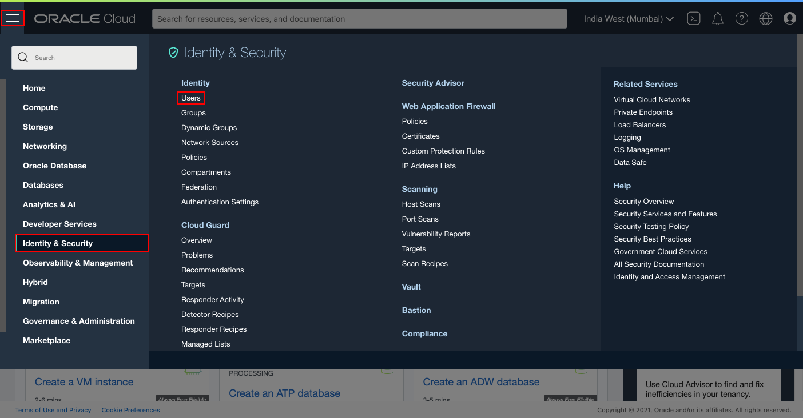

2. Click on the non-federated user name to view the details. (The non-federated user name should be your email address -without any prefix- what was used during the trial signup.)

    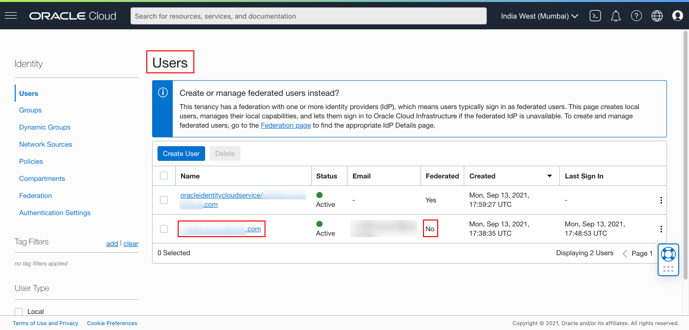

3. On the User Detail page scroll down and click **Auth Tokens**.

    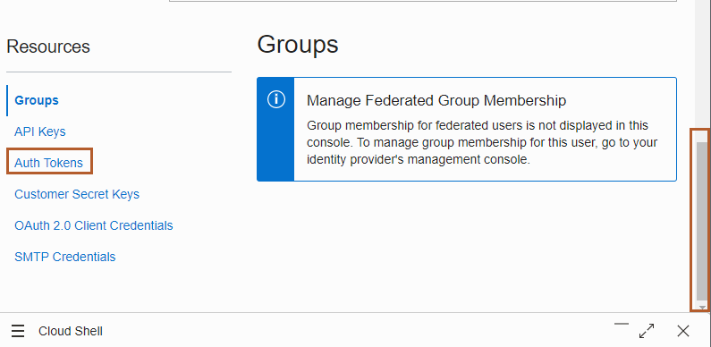

4. Click **Generate Token**.

    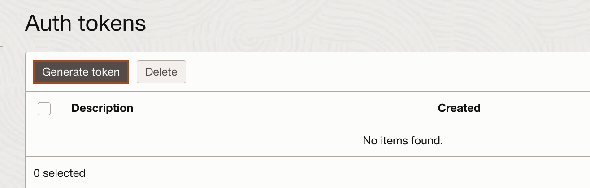

5. Copy *myproject* and paste it in the *Description* box and click **Generate Token**.

    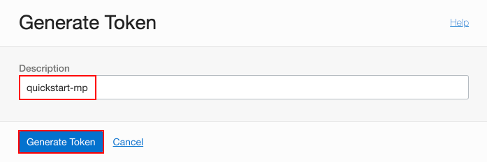

6. Click **Copy** under Generated Token and paste it into the text file. You cannot copy it later, so make sure you have a copy of this token saved.

    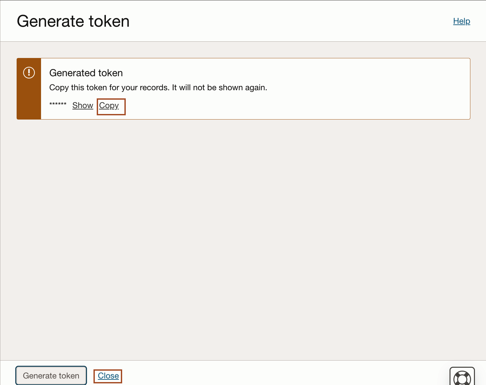

## Task 3: Push the Helidon Application (myproject) Docker Image to your Container Registry Repository

In Task 1 of this lab, you opened a URL [https://docs.oracle.com/en-us/iaas/Content/Registry/Concepts/registryprerequisites.htm#Availab](https://docs.oracle.com/en-us/iaas/Content/Registry/Concepts/registryprerequisites.htm#Availab) and determined the endpoint for your Region name and copied it to a text file. In our example, the Region Name is UK South (London). You will need this information for this task.
    

1. Copy the following command and paste it into your text file and then replace the `ENDPOINT_OF_REGION_NAME` with the endpoint of your region.

    >In our example the Region Name is *UK South (London)* and the endpoint is *lhr.ocir.io*. You will need your specific information for this task.

    ```bash
    <copy>docker login ENDPOINT_OF_REGION_NAME</copy>
    ```

2. In the previous step, you also determined the tenancy namespace.
Enter the Username as follows: `NAMESPACE_OF_YOUR_TENANCY`/`YOUR_ORACLE_CLOUD_USERNAME`. <br>
    * Replace `NAMESPACE_OF_YOUR_TENANCY` with your tenancy's namespace
    * Replace `YOUR_ORACLE_CLOUD_USERNAME` with your Oracle Cloud Account user name and then copy the replaced username from your text file and paste it into the *Cloud Shell*.
    * For Password, copy and paste the Authentication Token from your text file (or wherever you saved it.)

    ```bash
    $ docker login lhr.ocir.io
    Username: NAMESPACE_OF_YOUR_TENANCY/YOUR_ORACLE_CLOUD_USERNAME
    Password:
    Login Succeeded
    ```
3. Navigate back to the Container Registry. In the Console, open the navigation menu and click **Developer Services**. Under **Containers & Artifacts**, click **Container Registry**.
    

4. Select the compartment and then click **Create Repository**.
    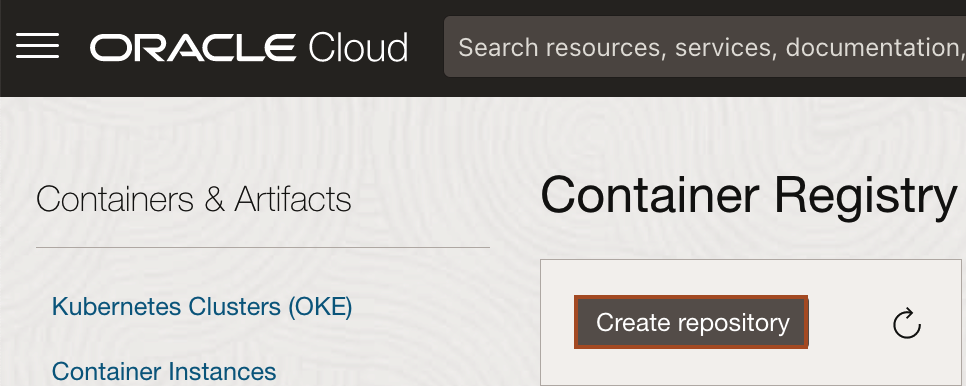

5. Select the compartment and enter *`myproject-your_first_name`* as the Repository Name, then choose Access as **Public** and click **Create Repository**.

    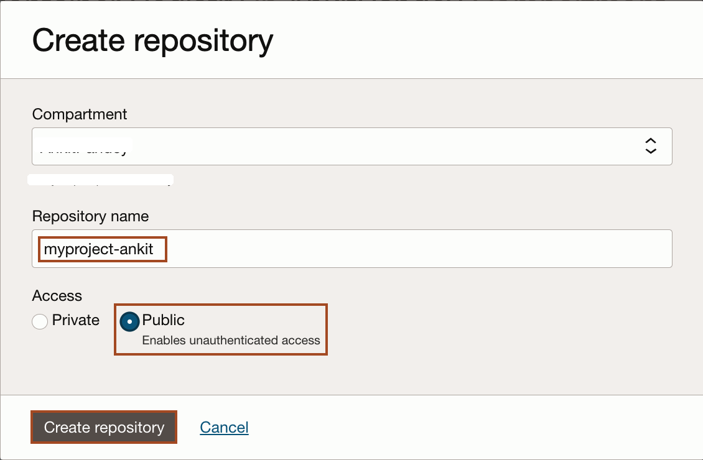

6. After the repository *`myproject-your_first_name`* has been created you can verify in the repository list and its settings.

    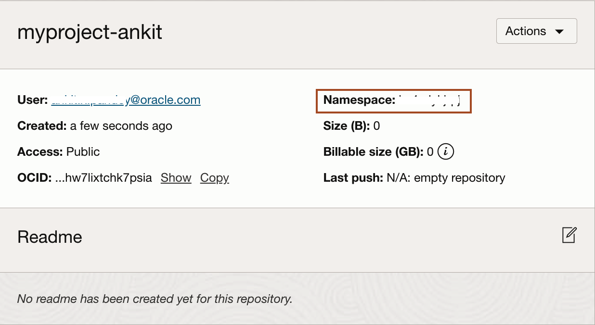

7. To push your Docker image into your repository inside the Oracle Cloud Container Registry, copy and paste the following command in your text file and then replace `ENDPOINT_OF_YOUR_REGION_NAME`/`NAMESPACE_OF_YOUR_TENANCY`/myproject-your_first_name:1.0 with Docker image full name, which you saved earlier.

    ```bash
    <copy>docker push ENDPOINT_OF_YOUR_REGION_NAME/NAMESPACE_OF_YOUR_TENANCY/myproject-your_first_name:1.0</copy>
    ```
    The result should look like this:
    ```bash
    $ docker push lhr.ocir.io/tenancynamespace/myproject-your_first_name:1.0
    The push refers to a repository [lhr.ocir.io/tenancynamespace/myproject-your_first_name]
    0795b8384c47: Pushed
    131452972f9d: Pushed
    93c53f2e9519: Pushed
    3b78b65a4be9: Pushed
    e1434e7d0308: Pushed
    17679d5f39bd: Pushed
    300b011056d9: Pushed
    1.0: digest: sha256:355fa56eab185535a58c5038186381b6d02fd8e0bcb534872107fc249f98256a size: 1786
    ```

8. After the *docker push* command runs successfully, expand the *`myproject-your_first_name`* repository and you will notice a new image has been uploaded to this repository.

    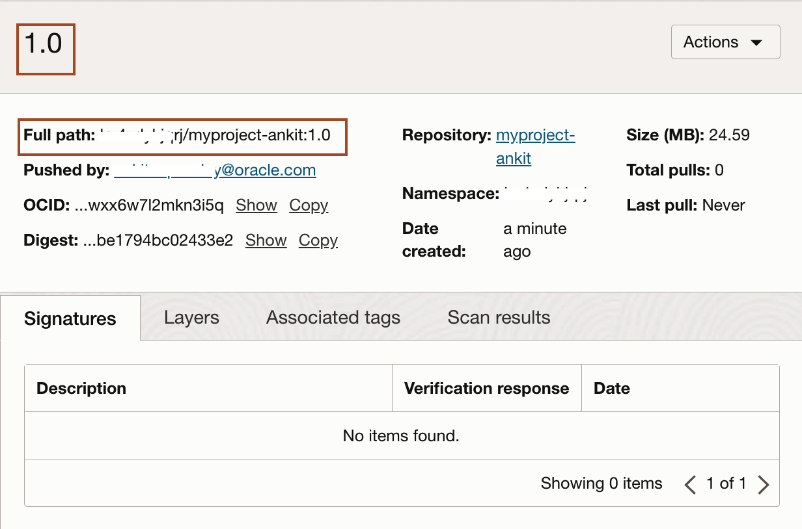


## Acknowledgements

* **Author** -  Dmitry Aleksandrov
* **Contributors** - Ankit Pandey, Maciej Gruszka
* **Last Updated By/Date** - Ankit Pandey, August 2022
