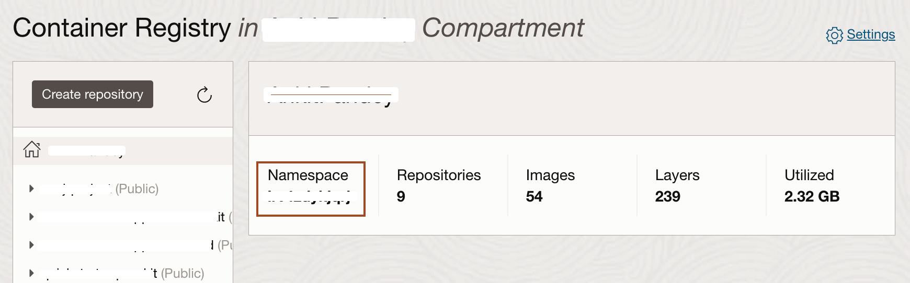

# Build and Push Helidon Application Image to Oracle Cloud Container Registry

## Introduction

In this lab, you will build a *native* Docker image with your Helidon application and push that image to a repository inside the Oracle Cloud Container Registry.

Estimated Time: 15 minutes

Watch the video below for a quick walk-through of the lab.
[Build and Push Helidon Application Image to Oracle Cloud Container Registry](videohub:1_mh1brw5t)

### Objectives

* Build and package your application using Docker.
* Generate an Authentication Token to log in to the Oracle Cloud Container Registry.
* Push Helidon application Docker image to your Oracle Cloud Container Registry repository.

### Prerequisites

* The Helidon application you created in the previous lab
* Docker
* Oracle Cloud Account


## Task 1: Build the Helidon Application Docker Image

We are creating a Docker image, which you will upload to the Oracle Cloud Container Registry that belongs to your OCI account. To do so you need to create an image name which reflects your registry coordinates.

You need the following information:

* Region Name
* Tenancy Namespace
* Endpoint for the Region
    >Copy this information to a text file so that you can refer to it throughout the lab.

1. Locate your *Region Name*. <br>
Your *Region Name* is located in the top right corner of the Oracle Cloud Console, in this example, it is shown as *UK South (London)*. Yours may be different.

    

2. Locate the *Tenancy Namespace*. <br>
In the Console, open the navigation menu and click **Developer Services**. Under **Containers & Artifacts**, click **Container Registry**.

    

    > The tenancy namespace is listed in the compartment. Copy and save it in a text file. You will use this information in the next lab, too.
    

3. Locate the *Endpoint for Your Region*. <br>
Refer to the table documented at this URL [https://docs.oracle.com/en-us/iaas/Content/Registry/Concepts/registryprerequisites.htm#Availab](https://docs.oracle.com/en-us/iaas/Content/Registry/Concepts/registryprerequisites.htm#Availab). In the example shown, the endpoint for the region is *UK South (London)* (as the region name) and its endpoint is *lhr.ocir.io*. Locate the endpoint for your own *Region Name* and save it in the text file. You will also need it for the next lab.

    

    >Now you have both the tenancy namespace and endpoint for your region.

4. Copy the following command and paste it into your text file. Then replace the *`ENDPOINT_OF_YOUR_REGION`* with the endpoint of your region name, *`NAMESPACE_OF_YOUR_TENANCY`* with your tenancy's namespace and *`your_first_name`* with your's first name.
    > This does a full build inside the Docker container. The first time you run it, it will take a while because it is downloading all of the Maven dependencies and caching them in a Docker layer. Subsequent builds will be much faster as long as you don’t change the pom.xml file. If the pom is modified then the dependencies will be re-downloaded.

    ```bash
    <copy>docker build -t ENDPOINT_OF_YOUR_REGION/NAMESPACE_OF_YOUR_TENANCY/myproject-your_first_name:1.0 -f Dockerfile.native .</copy>
    ```
    When the command is ready then run in the terminal inside Code Editor from the *`~/helidon-project/myproject/myproject`* directory. The build will produce the following result at the end:

    ```bash
    $ docker build -t lhr.ocir.io/tenancynamespace/myproject-ankit:1.0 -f Dockerfile.native .

    [1/7] Initializing...                                                                                   (15.7s @ 0.14GB)
    Version info: 'GraalVM 22.3.0 Java 17 CE'
    Java version info: '17.0.5+8-jvmci-22.3-b08'
    C compiler: gcc (redhat, x86_64, 11.3.1)
    Garbage collector: Serial GC
    2 user-specific feature(s)
    - io.helidon.integrations.graal.mp.nativeimage.extension.WeldFeature
    - io.helidon.integrations.graal.nativeimage.extension.HelidonReflectionFeature
    2023.04.06 05:41:01 INFO io.helidon.common.LogConfig Thread[main,5,main]: Logging at initialization configured using classpath: /logging.properties
    [2/7] Performing analysis...  [**********]                                                             (202.8s @ 1.92GB)
    18,812 (92.77%) of 20,278 classes reachable
    27,564 (63.52%) of 43,392 fields reachable
    87,900 (62.22%) of 141,268 methods reachable
    1,068 classes,   565 fields, and 6,864 methods registered for reflection
        65 classes,    70 fields, and    58 methods registered for JNI access
        6 native libraries: dl, m, pthread, rt, stdc++, z
    [3/7] Building universe...                                                                              (27.6s @ 3.15GB)
    [4/7] Parsing methods...      [*****]                                                                   (22.5s @ 3.00GB)
    [5/7] Inlining methods...     [***]                                                                     (11.9s @ 1.84GB)
    [6/7] Compiling methods...    [************]                                                           (156.5s @ 3.05GB)
    [7/7] Creating image...                                                                                 (15.6s @ 2.44GB)
    35.03MB (45.80%) for code area:    57,947 compilation units
    39.02MB (51.01%) for image heap:  477,987 objects and 128 resources
    2.44MB ( 3.19%) for other data
    76.49MB in total
    ------------------------------------------------------------------------------------------------------------------------
    Top 10 packages in code area:                               Top 10 object types in image heap:
    1.63MB sun.security.ssl                                     7.71MB byte[] for code metadata
    1.20MB com.sun.media.sound                                  4.60MB java.lang.Class
    1.17MB java.util                                            3.93MB java.lang.String
    822.87KB java.lang.invoke                                     3.41MB byte[] for java.lang.String
    717.54KB com.sun.crypto.provider                              3.22MB byte[] for general heap data
    517.57KB io.helidon.config                                    1.58MB com.oracle.svm.core.hub.DynamicHubCompanion
    510.02KB java.util.concurrent                                 1.13MB byte[] for reflection metadata
    481.49KB jdk.proxy4                                           1.03MB byte[] for embedded resources
    474.98KB java.lang                                          915.61KB java.util.HashMap$Node
    468.42KB com.sun.org.apache.xerces.internal.impl            781.21KB java.lang.String[]
    26.70MB for 671 more packages                                9.83MB for 4584 more object types
    ------------------------------------------------------------------------------------------------------------------------
                            31.0s (6.6% of total time) in 59 GCs | Peak RSS: 4.80GB | CPU load: 1.60
    ------------------------------------------------------------------------------------------------------------------------
    Produced artifacts:
    /helidon/target/myproject (executable)
    /helidon/target/myproject.build_artifacts.txt (txt)
    ========================================================================================================================
    Finished generating 'myproject' in 7m 48s.
    [INFO] ------------------------------------------------------------------------
    [INFO] BUILD SUCCESS
    [INFO] ------------------------------------------------------------------------
    [INFO] Total time:  08:04 min
    [INFO] Finished at: 2023-04-06T05:48:33Z
    [INFO] ------------------------------------------------------------------------
    Removing intermediate container e400c5c6897b
    ---> 20099e4619d6
    Step 10/15 : RUN echo "done!"
    ---> Running in a8eddd448e48
    done!
    Removing intermediate container a8eddd448e48
    ---> ebfd3064dc68
    Step 11/15 : FROM scratch
    ---> 
    Step 12/15 : WORKDIR /helidon
    ---> Running in 46be56a98462
    Removing intermediate container 46be56a98462
    ---> eaf15b746a1c
    Step 13/15 : COPY --from=build /helidon/target/myproject .
    ---> a69ac5933048
    Step 14/15 : ENTRYPOINT ["./myproject"]
    ---> Running in 71633a601e7f
    Removing intermediate container 71633a601e7f
    ---> cd9f22bfa4b3
    Step 15/15 : EXPOSE 8080
    ---> Running in 4b9763eb49fa
    Removing intermediate container 4b9763eb49fa
    ---> aa8b6e7b04c0
    Successfully built aa8b6e7b04c0
    Successfully tagged lhr.ocir.io/lrv4zdykjqrj/myproject-ankit:1.0
    ```

5. This creates the Docker image, which you can check in your local repository.

    ```bash
    $ docker images
    REPOSITORY                     TAG IMAGE ID        CREATED           SIZE
    lhr.ocir.io/tn/myproject-ankit 1.0 aa8b6e7b04c0 About a minute ago   80.2MB
    ```
    Copy to your text editor the replaced full image name `ENDPOINT_OF_YOUR_REGION/NAMESPACE_OF_YOUR_TENANCY/myproject-your_first_name:1.0` because you will need it later.

6. Copy and paste the following command in the terminal, to run the docker image in Cloud Shell of Code Editor.
    ```bash
    <copy>docker run --rm -p 8080:8080 ENDPOINT_OF_YOUR_REGION/NAMESPACE_OF_YOUR_TENANCY/myproject-your_first_name:1.0</copy>
    ```
    

7.  Open a new terminal/console and run the following commands to check the application:

    ```bash
    <copy>
    curl -X GET http://localhost:8080/greet
    </copy>
    {"message":"Hello World!"}
    ```

    ```bash
    <copy>
    curl -X GET http://localhost:8080/greet/Joe
    </copy>
    {"message":"Hello Joe!"}
    ```

    ```bash
    <copy>
    curl -X PUT -H "Content-Type: application/json" -d '{"greeting" : "Hola"}' http://localhost:8080/greet/greeting
    </copy>
    ```

    ```bash
    <copy>
    curl -X GET http://localhost:8080/greet/Jose
    </copy>
    {"message":"Hola Jose!"}
    ```

## Task 2: Generate an Authentication Token to log in to the Oracle Cloud Container Registry

In this step, we are going to generate an *Authentication Token*, that we will use to log in to the Oracle Cloud Container Registry.

1. Select the User Icon in the top right corner and then select *My Profile*.

    

2. Scroll down and select *Auth Tokens*.

    

3. Click *Generate Token*.

    

4. Copy *`myproject-your_first_name`* and paste it in the *Description* box and click *Generate Token*.

    

5. Select *Copy* under Generated Token and paste it in the text editor. We cannot copy it later. Then click *Close*.

    

## Task 3: Push the Helidon Application (myproject) Docker Image to your Container Registry Repository

1. In Task 1 of this lab, you opened a URL [https://docs.oracle.com/en-us/iaas/Content/Registry/Concepts/registryprerequisites.htm#Availab](https://docs.oracle.com/en-us/iaas/Content/Registry/Concepts/registryprerequisites.htm#Availab) and determined the endpoint for your Region name and copied it to a text file. In our example, the Region Name is UK South (London). You will need this information for this task.
    

2. Copy the following command and paste it into your text file and then replace the `ENDPOINT_OF_REGION_NAME` with the endpoint of your region.

    >In our example the Region Name is *UK South (London)* and the endpoint is *lhr.ocir.io*. You will need your specific information for this task.

    ```bash
    <copy>docker login ENDPOINT_OF_REGION_NAME</copy>
    ```

3. In the previous step, you also determined the tenancy namespace.
Enter the Username as follows: `NAMESPACE_OF_YOUR_TENANCY`/`YOUR_ORACLE_CLOUD_USERNAME`. <br>
    * Replace `NAMESPACE_OF_YOUR_TENANCY` with your tenancy's namespace
    * Replace `YOUR_ORACLE_CLOUD_USERNAME` with your Oracle Cloud Account user name and then copy the replaced username from your text file and paste it into the *Cloud Shell*.
    * For Password, copy and paste the Authentication Token from your text file (or wherever you saved it.)

    ```bash
    $ docker login lhr.ocir.io
    Username: NAMESPACE_OF_YOUR_TENANCY/YOUR_ORACLE_CLOUD_USERNAME
    Password:
    Login Succeeded
    ```
4. Navigate back to the Container Registry. In the Console, open the navigation menu and click **Developer Services**. Under **Containers & Artifacts**, click **Container Registry**.
    

5. Select the compartment and then click **Create Repository**.
    

6. Select the compartment and enter *`myproject-your_first_name`* as the Repository Name, then choose Access as **Public** and click **Create Repository**.

    

7. After the repository *`myproject-your_first_name`* has been created you can verify in the repository list and its settings.

    

8. To push your Docker image into your repository inside the Oracle Cloud Container Registry, copy and paste the following command in your text file and then replace `ENDPOINT_OF_YOUR_REGION_NAME`/`NAMESPACE_OF_YOUR_TENANCY`/myproject-your_first_name:1.0 with Docker image full name, which you saved earlier.

    ```bash
    <copy>docker push ENDPOINT_OF_YOUR_REGION_NAME/NAMESPACE_OF_YOUR_TENANCY/myproject-your_first_name:1.0</copy>
    ```
    The result should look like this:
    ```bash
    $ docker push lhr.ocir.io/tenancynamespace/myproject-ankit:1.0 The push refers to repository [lhr.ocir.io/tenancynamespace/myproject-ankit]
    0bf9e88b7284: Pushed 
    0acc08535a89: Pushed 
    1.0: digest: sha256:3e8cc0ff23d256499dff8d907150b639925687aed0c41008cbe1794bc02433e2 size: 735
    $
    ```

9. After the *docker push* command runs successfully, expand the *`myproject-your_first_name`* repository and you will notice a new image has been uploaded to this repository.

    


## Acknowledgements

* **Author** -  Ankit Pandey
* **Contributors** - Sid Joshi, Maciej Gruszka
* **Last Updated By/Date** - Ankit Pandey, March 2024
