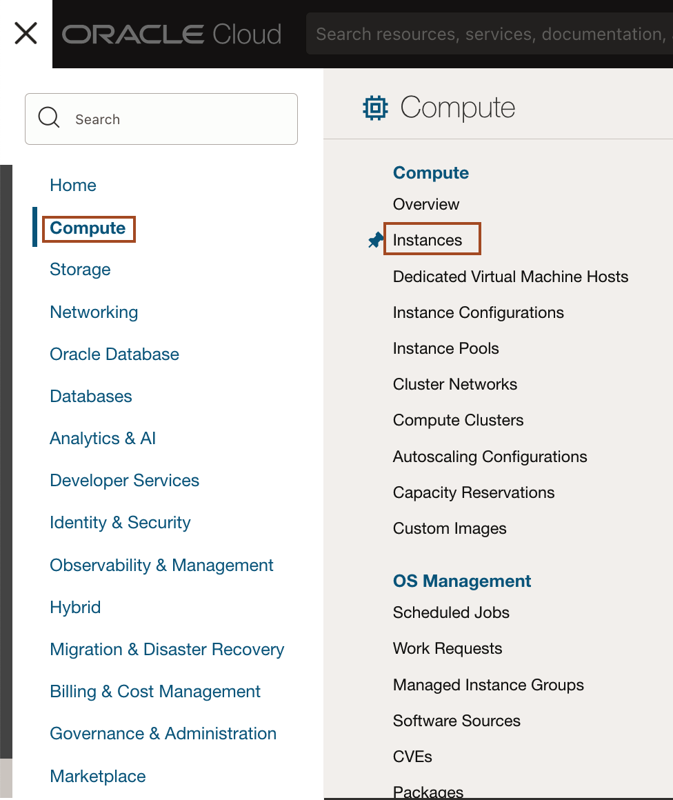
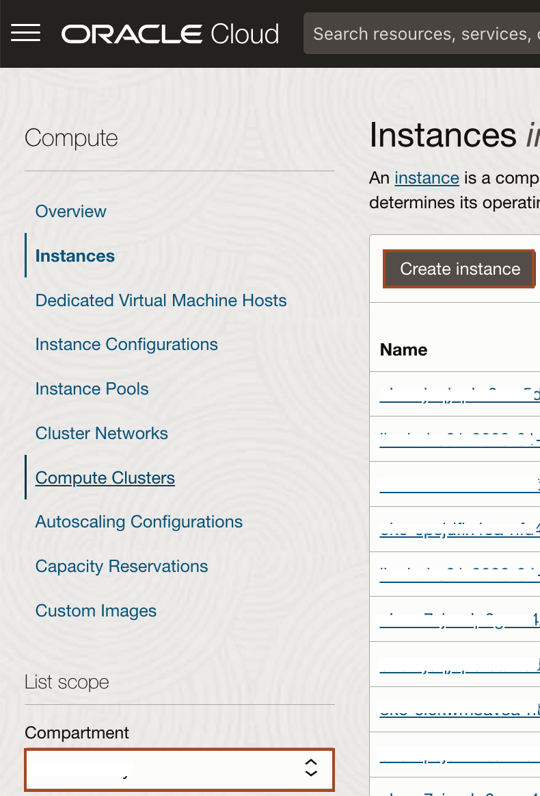
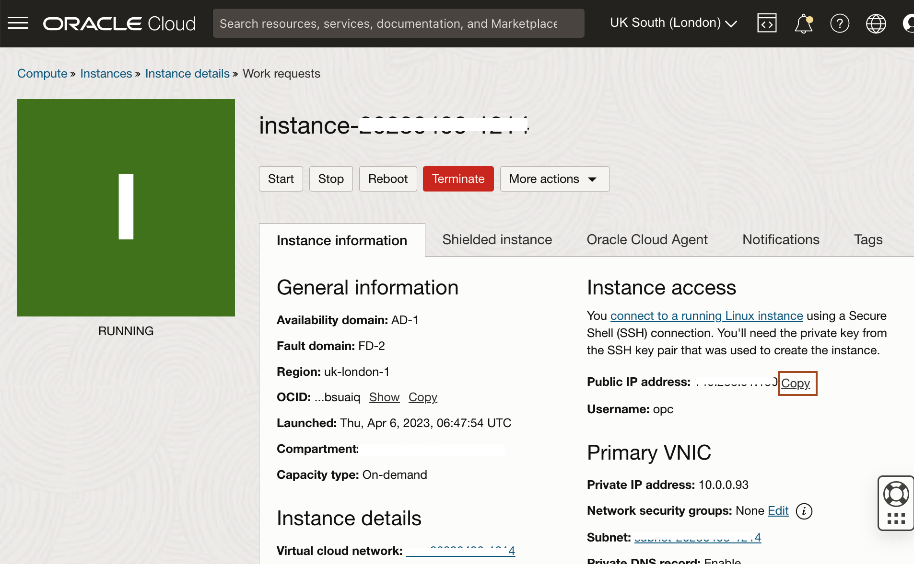
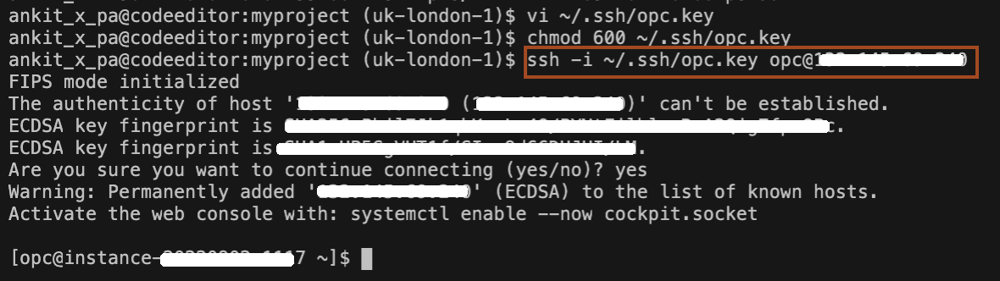
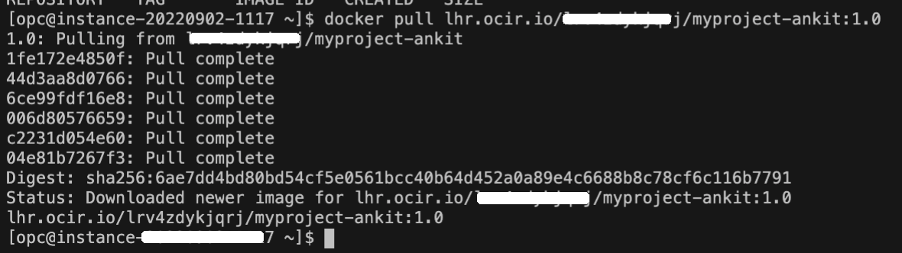

# Run Helidon Application native docker image in Compute Instance

## Introduction

This lab walks you through the process of pulling a docker image from the Oracle Container Image Registry and running it in a Virtual Machine inside Oracle Cloud Infrastructure.

Estimated Time: 15 minutes

Watch the video below for a quick walk-through of the lab.
[Run Helidon Application native docker image in Compute Instance](videohub:1_dsfd22u5)

### Objectives

In this lab, you will:

* Create a compute instance
* Install Docker in Compute instance
* Run the application native image docker container inside compute instance.

### Prerequisites

To run this lab, you must have:

* Oracle Cloud Account
* Having a resource to create compute instance
* Container packaged Helidon *myproject-your_first_name* application available in a container registry.

## Task 1: Create Compute instance

1. In Cloud console, click *Compute* -> *Instances*.
    

2. Select the correct compartment and then click *Create instance*.
    

3. Select the following values and click *Create*.</br>
    **Name:** Leave default.</br>
    **Image:** Select *Oracle Linux 8* image.</br>
    **Shape:** Select the shape **VM.Standard.E3.Flex** and then select 1 OCPU with 16GB memory.</br>
    **Primary network:** select *Create new virtual cloud network* and leave default values.</br>
    **Subnet:** select *Create new public subnet* and leave default values.</br>
    **Public IP address:** select *Assign a public IPv4 address*.</br>
    **Add SSH keys:** select *Generate a key pair for me* and click *Save private key* and *Save public key* to save the key pair in your local machine. you will need to copy the private key to Code Editor later.


4. Once the instance gets created, click *Copy* to copy the public IP of the instance.
    

## Task 2: Install docker on compute instance

1. In the terminal inside the Code Editor, run the following command to create a private key.
    ```bash
    <copy>vi ~/opc.key</copy>
    ```

2. Press *i* to enter into insert mode and paste the content of the private key, which you downloaded in task 1 of this lab. Press the *escape* key and then enter *:wq* to save the content of the file.

3. Change the permission of the file by running the following command in the terminal.
    ```bash
    <copy>chmod 600 ~/opc.key</copy>
    ```

4. Run the following command with your own *PUBLIC IP* to connect to Compute Instance just created.
    ```bash
    <copy>ssh -i ~/opc.key opc@REPLACE_THIS_WITH_YOUR_PUBLIC_IP</copy>
    ```
    
    > **In Free tier account, we dont have *.ssh* folder bydefault, so you will have output  different then screenshot.**

5. Run the following command to install docker as root user in compute instance and to provide *opc* user capability to run docker.
    ```bash
    <copy>sudo dnf config-manager --add-repo=https://download.docker.com/linux/centos/docker-ce.repo
    sudo dnf remove -y runc
    sudo dnf install -y docker-ce --nobest
    sudo systemctl enable docker.service
    sudo systemctl start docker.service
    sudo usermod -aG docker opc
    sudo reboot</copy>
    ```

6. Wait for 1-2 minutes till the machine reboots and connects to compute instance again by running the following command:
    ```bash
    <copy>ssh -i ~/.ssh/opc.key opc@REPLACE_THIS_WITH_YOUR_PUBLIC_IP</copy>
    ```

## Task 3: Pull and run the Greeting app in the Compute instance


1. Run the following command to pull the docker image from Oracle Container Image Registry.
    ```bash
    <copy>docker pull ENDPOINT_OF_YOUR_REGION/NAMESPACE_OF_YOUR_TENANCY/myproject-your_first_name:1.0</copy>
    ```

    you will have a similar output as shown below.
    

2. Run the following command to run the application:
    ```bash
    <copy>docker run --rm -p 8080:8080 ENDPOINT_OF_YOUR_REGION/NAMESPACE_OF_YOUR_TENANCY/myproject-your_first_name:1.0</copy>
    ```

3. You can open a new terminal and ssh to compute an instance and run the following commands to exercise the application.
    ```bash
    <copy>
    curl -X GET http://localhost:8080/greet
    </copy>
    {"message":"Hello World!","greeting":null}
    ```

    ```bash
    <copy>
    curl -X GET http://localhost:8080/greet/Joe
    </copy>
    {"message":"Hello Joe!","greeting":null}
    ```

    ```bash
    <copy>
    curl -X PUT -H "Content-Type: application/json" -d '{"greeting" : "Hola"}' http://localhost:8080/greet/greeting
    </copy>
    ```

    ```bash
    <copy>
    curl -X GET http://localhost:8080/greet/Jose
    </copy>
    {"message":"Hola Jose!","greeting":null}
    ```

    Congratulations you have completed the Helidon application deployment on Compute instance in Oracle Cloud Infrastructure.


## Acknowledgements

* **Author** -  Dmitry Aleksandrov
* **Contributors** - Ankit Pandey, Maciej Gruszka
* **Last Updated By/Date** - Ankit Pandey, August 2022
