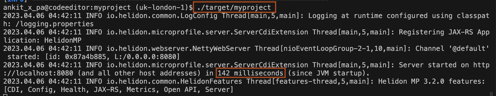

# Build Helidon MP Application native image

## Introduction

In this lab, you will learn how to build a GraalVM native image for a Helidon MP application.

Estimated Time: 15 minutes

### About GraalVM native image

GraalVM is a high-performance JDK distribution that can accelerate any Java workload running on the HotSpot JVM.

GraalVM Native Image ahead-of-time compilation enables you to build lightweight Java applications that are smaller, faster, and use less memory and CPU. At build time, GraalVM Native Image analyzes a Java application and its dependencies to identify just what classes, methods, and fields are necessary and generates optimized machine code for just those elements.

GraalVM Enterprise Edition is available for use on Oracle Cloud Infrastructure (OCI) at no additional cost.

### Objectives

* Build a Helidon MP application native executable with a local installation of GraanVM
* Run and exercise the Helidon Greeting app

### Prerequisites

* You must have an [Oracle Cloud Infrastructure](https://cloud.oracle.com/en_US/cloud-infrastructure) enabled account.


## Task 1: Create the Helidon MP application GraalVM native image

1. To create a GraalVM Native image with the same application, run the following command in the terminal, where you configured the maven and JDK.
    ```bash
    <copy>export USE_NATIVE_IMAGE_JAVA_PLATFORM_MODULE_SYSTEM=false
    mvn clean package -Pnative-image</copy>
    ```

    you will see output similar to below.
    ```bash
    [INFO] 2022.09.01 11:29:24 INFO io.helidon.common.LogConfig Thread[main,5,main]: Logging at initialization configured using classpath: /logging.properties
    [INFO] [1/7] Initializing...                                                                                   (20.7s @ 0.20GB)
    [INFO]  Version info: 'GraalVM 22.2.0 Java 17 EE'
    [INFO]  Java version info: '17.0.4+11-LTS-jvmci-22.2-b05'
    [INFO]  C compiler: gcc (redhat, x86_64, 11.2.1)
    [INFO]  Garbage collector: Serial GC
    [INFO]  2 user-specific feature(s)
    [INFO]  - io.helidon.integrations.graal.mp.nativeimage.extension.WeldFeature
    [INFO]  - io.helidon.integrations.graal.nativeimage.extension.HelidonReflectionFeature
    [INFO] [2/7] Performing analysis...  [*********]                                                              (210.2s @ 1.98GB)
    [INFO]   19,158 (92.36%) of 20,743 classes reachable
    [INFO]   28,255 (64.17%) of 44,034 fields reachable
    [INFO]  100,934 (64.48%) of 156,539 methods reachable
    [INFO]    1,099 classes,   576 fields, and 6,428 methods registered for reflection
    [INFO]       65 classes,    70 fields, and    58 methods registered for JNI access
    [INFO]        6 native libraries: dl, m, pthread, rt, stdc++, z
    [INFO] [3/7] Building universe...                                                                              (25.4s @ 3.11GB)
    [INFO] [4/7] Parsing methods...      [*****]                                                                   (25.2s @ 2.02GB)
    [INFO] [5/7] Inlining methods...     [***]                                                                     (11.1s @ 2.64GB)
    [INFO] [6/7] Compiling methods...    [**********************]                                                 (505.2s @ 2.61GB)
    [INFO] [7/7] Creating image...                                                                                 (17.8s @ 3.74GB)
    [INFO]   49.46MB (57.89%) for code area:    59,480 compilation units
    [INFO]   35.14MB (41.14%) for image heap:  514,061 objects and 129 resources
    [INFO]  852.35KB ( 0.97%) for other data
    [INFO]   85.44MB in total
    [INFO] ------------------------------------------------------------------------------------------------------------------------
    [INFO] Top 10 packages in code area:                               Top 10 object types in image heap:
    [INFO]    4.51MB com.oracle.svm.core.code                            10.17MB byte[] for code metadata
    [INFO]    1.58MB sun.security.ssl                                     4.23MB byte[] for java.lang.String
    [INFO]    1.44MB java.util                                            3.53MB java.lang.Class
    [INFO]    1.33MB com.sun.media.sound                                  3.22MB java.lang.String
    [INFO]  972.41KB io.netty.buffer                                      2.92MB byte[] for general heap data
    [INFO]  961.71KB com.sun.crypto.provider                              1.22MB byte[] for reflection metadata
    [INFO]  803.92KB jdk.proxy4                                           1.03MB byte[] for embedded resources
    [INFO]  781.86KB io.helidon.config                                  898.03KB com.oracle.svm.core.hub.DynamicHubCompanion
    [INFO]  725.47KB java.util.concurrent                               591.34KB java.util.HashMap$Node
    [INFO]  702.80KB java.lang                                          546.16KB c.o.svm.core.hub.DynamicHub$ReflectionMetadata
    [INFO]   35.34MB for 692 more packages                                6.23MB for 4555 more object types
    [INFO] ------------------------------------------------------------------------------------------------------------------------
    [INFO]                        44.6s (5.3% of total time) in 108 GCs | Peak RSS: 5.22GB | CPU load: 1.69
    [INFO] ------------------------------------------------------------------------------------------------------------------------
    [INFO] Produced artifacts:
    [INFO]  /home/ankit_x_pa/myproject/target/myproject (executable)
    [INFO]  /home/ankit_x_pa/myproject/target/myproject.build_artifacts.txt (txt)
    [INFO] ========================================================================================================================
    [INFO] Finished generating 'myproject' in 13m 53s.
    [INFO] ------------------------------------------------------------------------
    [INFO] BUILD SUCCESS

    ```

## Task 2: Run the Helidon MP application GraalVM native image

1. Copy and paste the following command in the same terminal to run this application
    ```bash
    <copy>./target/myproject</copy>
    ```
    
    > You can see the application startup time is 145 milliseconds, which is almost 35 times faster.


2. Stop the *myproject* application by entering `Ctrl + C` in the terminal where the "./target/myproject" command is running.


## Acknowledgements

* **Author** -  Dmitry Aleksandrov
* **Contributors** - Ankit Pandey, Maciej Gruszka
* **Last Updated By/Date** - Ankit Pandey, August 2022
