# Generate an Helidon MP Project and Run the project in Code Editor

## Introduction

This lab walks you through the steps to create a Helidon MP application.

Estimated Time: 15 minutes

Watch the video below for a quick walk-through of the lab.
[Generate an Helidon MP Project and Run the project in Code Editor](videohub:1_22nv8v4q)

### About Product/Technology

Helidon is designed to be simple to use, with tooling and examples to get you going quickly. Since Helidon is just a collection of libraries running on a fast Netty core, there is no extra overhead or bloat. Helidon supports MicroProfile and provides familiar APIs like JAX-RS, CDI and JSON-P/B. Our MicroProfile implementation runs on our fast Helidon Reactive WebServer. The Reactive WebServer provides a modern, functional, programming model and runs on top of Netty. Lightweight, flexible and reactive, the Helidon WebServer provides a simple to use and fast foundation for your microservices.

With support for health checks, metrics, tracing and fault tolerance, Helidon has what you need to write cloud-ready applications that integrate with Prometheus, Jaeger/Zipkin and Kubernetes.

### About Helidon Project Starter

Project Starter is a new web UI for creating Helidon projects. It’s highly customizable, providing various options that allow users to select Helidon features they want to add to the project. End users will be able to generate projects to their specific needs. For more information click [Helidon Starter](https://helidon.io/starter).


### About Code Editor

The Code Editor enables you to edit and deploy code for various OCI services directly from the OCI Console. You can now update service workflows and scripts without having to switch between the Console and your local development environments. This makes it easy to rapidly prototype cloud solutions, explore new services, and accomplish quick coding tasks.

Code Editor's direct integration with Cloud Shell allows you access to the GraalVM Enterprise Native Image and JDK 17 (Java Development Kit) pre-installed in Cloud Shell.

### About OCI Cloud Shell

[OCI Cloud Shell](https://docs.oracle.com/en-us/iaas/Content/API/Concepts/cloudshellintro.htm) is a browser-based terminal accessible from the Oracle Cloud Console. It provides access to a Linux shell with a pre-authenticated OCI command-line interface (CLI), and pre-installed developer tools, and comes with 5GB of storage.

As of version 22.2.0, GraalVM Enterprise JDK 17 and Native Image are pre-installed in Cloud Shell.

> GraalVM Enterprise is available on Oracle Cloud Infrastructure at no additional cost.


### Objectives
* Create a MicroProfile supported microservice called Helidon Greeting application
* Open Helidon application in Code Editor
* Change the default JDK in the cloud shell
* Configure the required Maven
* Run and exercise the Helidon Greeting app


### Prerequisites

* You must have an [Oracle Cloud Infrastructure](https://cloud.oracle.com/en_US/cloud-infrastructure) enabled account.


## Task 1: Generate Helidon project using project starter

1. Copy the below URL and paste it into the browser to open the Helidon Project page.

    ```bash
    <copy>https://helidon.io/starter/</copy>
    ```

2. Select the latest **3.x** as Helidon version.
    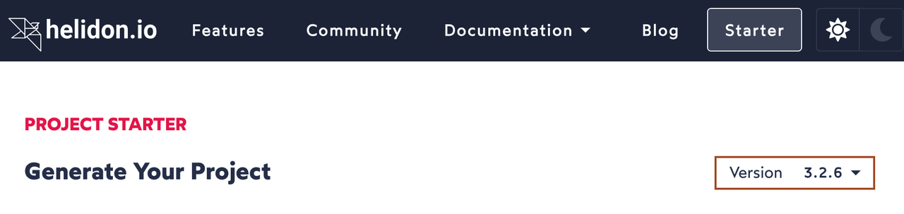

3. Under Generate Your Project, select *Helidon MP* as Helidon Flavor and then click *Next*.

4. For Application Type, select *Quickstart* and then click *Next*.

5. For Media Support, select *JSON-B* and then click *Next*.

6. For Customize Project, select the default values and click on *Downloads*. This will pop up in a window, save this *myproject.zip* to the location of your choice. In the rest of this workshop, myproject name will be used. if you choose a different name, please change respectively.


## Task 2: Build and run the helidon project locally

1. In Cloud Console, click the *Developer tools* icon as shown then click *Code Editor*.
    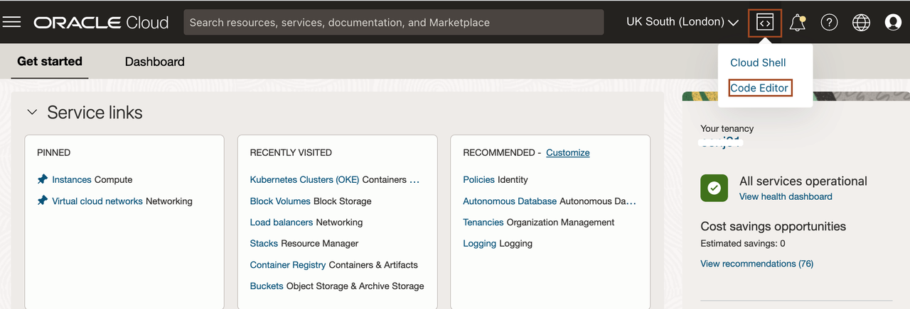

2. In Code Editor, click *Terminal* -> *New Terminal*.
    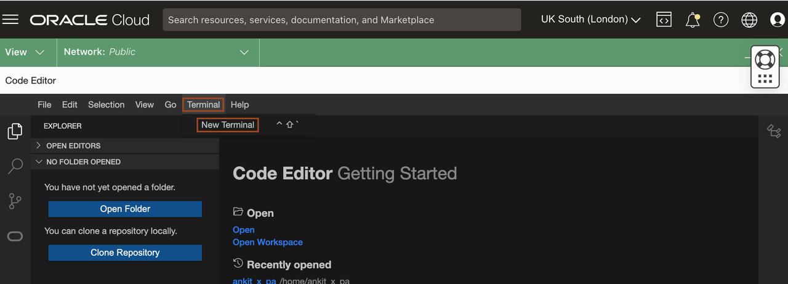

3. Copy and paste the below command in the terminal, to create *myproject* folder. where we  will downloads the default myproject.zip file.

    ```bash
    <copy>mkdir -p ~/helidon-project/myproject</copy>
    ```

4. In Code Editor, Click *File* -> *Open*.
    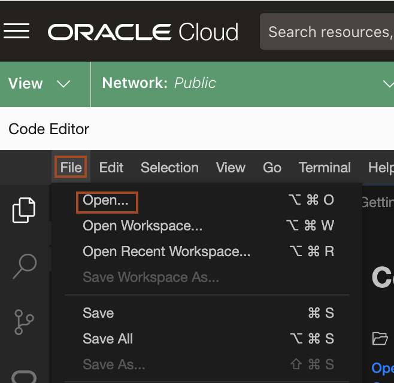

5. Select the *helidon-project* folder and click *Open*.
    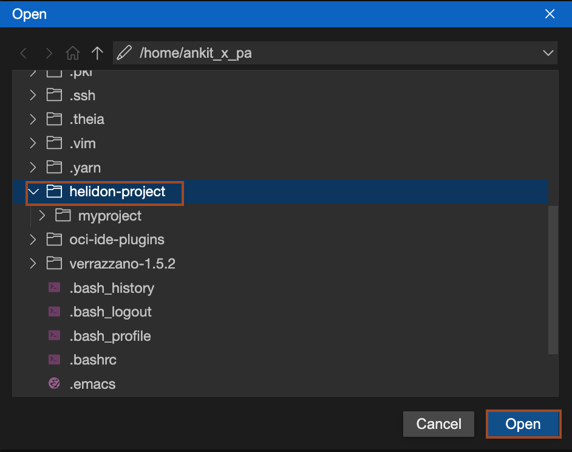


6. In Code Editor, in EXPLORER window, you can see your *HELIDON-PROJECT*. you can see the *myproject* folder here, click on it. Now click on *File* -> *Upload Files..*, then specify the location where you have downloaded the project and select the zip file and click *Open*.
    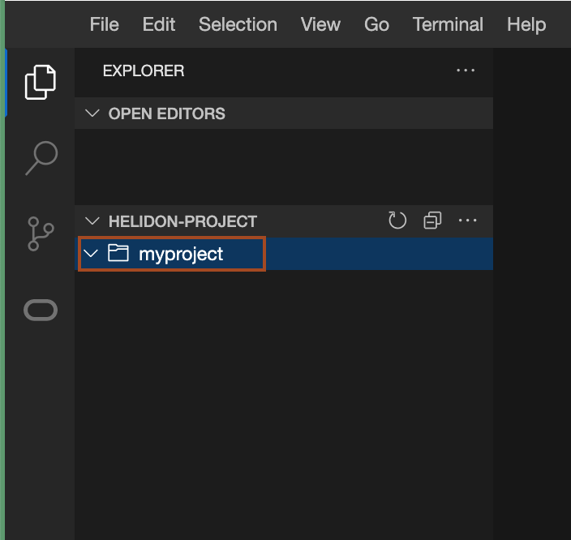
    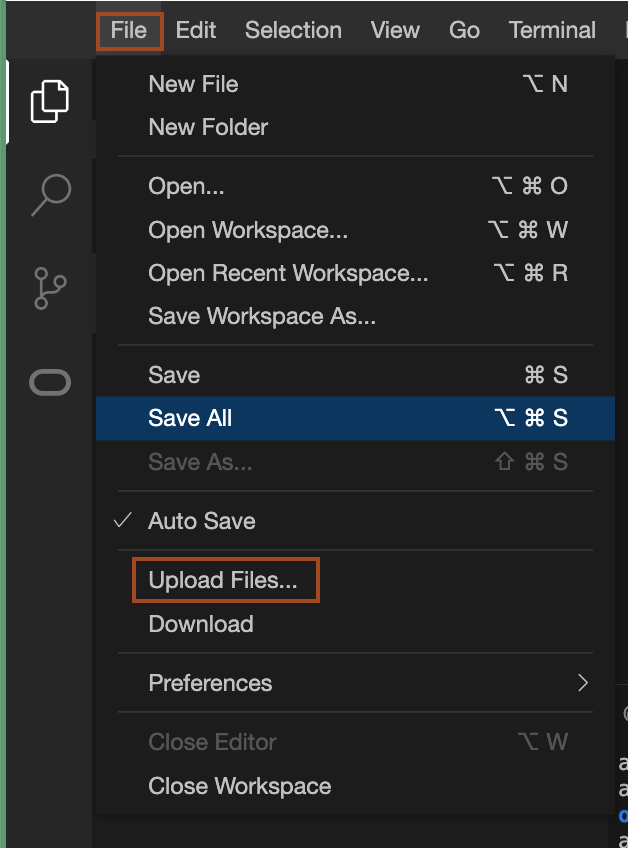

7. Copy and paste the following command to unzip the *myproject.zip* file.
    ```bash
    <copy>cd ~/helidon-project/myproject
    unzip myproject.zip
    </copy>
    ```

8. Expand the *myproject* folder, to view the project structure.
    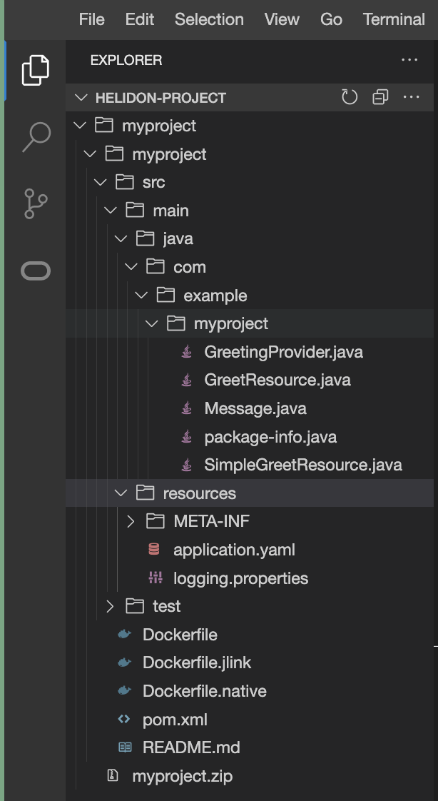


9. To run this project we will use Maven 3.8+ and JDK 17+. In Oracle cloud, you have various JDK provided. Here we will select GraalVM JDK. Copy and paste the following command in the terminal, to know your default JDK.

    ```bash
    <copy>csruntimectl java list</copy>
    ```
    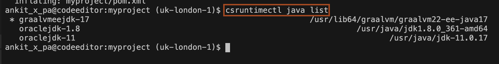

    > The JDK with * *asterisk* in the beginning is your default JDK. If you have any other JDK then graalvmeejdk, then change the default JDK version by running the below command. Please use the shown version of graalvmeejdk, as it may different then what is shown in command.

    ```bash
    <copy>csruntimectl java set graalvmjdk-17</copy>
    ```
10. To configure the required maven, copy and paste the following command in the terminal.
    ```bash
    <copy>cd ~/helidon-project/myproject/
    wget https://dlcdn.apache.org/maven/maven-3/3.8.8/binaries/apache-maven-3.8.8-bin.tar.gz
    tar -xzvf apache-maven-3.8.8-bin.tar.gz
    PATH=~/helidon-project/myproject/apache-maven-3.8.8/bin:$PATH</copy>
    ```
    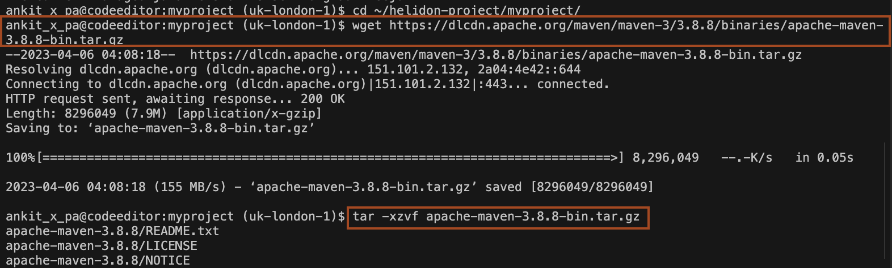

11. To verify that you have the correct version of JDK and Maven as shown below, run the following command in the terminal.
    ```bash
    <copy>mvn -v</copy>
    ```
    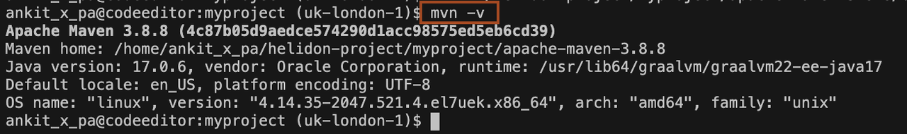

12. From the *myproject* folder, run the following command to build the project.
    ```bash
    <copy>cd ~/helidon-project/myproject/myproject
    mvn clean package</copy>
    ```
    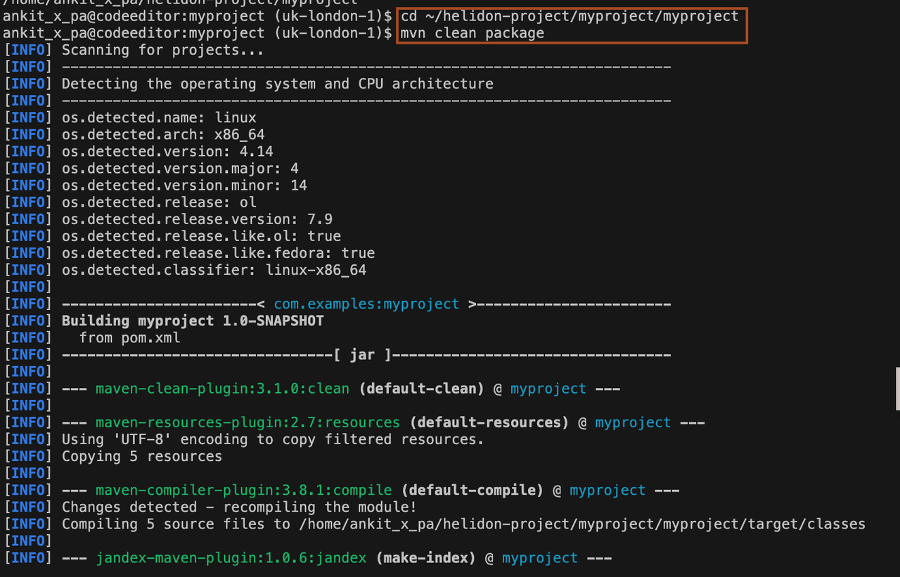
    > You should see *BUILD SUCCESS* at the end of the execution of this command.

13. Copy and paste the following command into the terminal, to run this application. You will see the output similar to that shown in the below screenshot.
    ```bash
    <copy>java -jar target/myproject.jar</copy>
    ```
    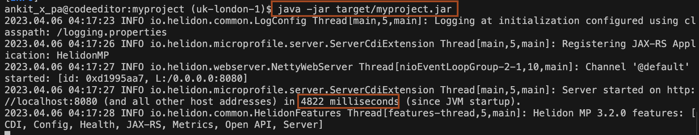

> Note down the start time, it is 4822 milliseconds. we will compare this time with the native image executable later.

14. Open a new terminal/console in Code Editor and run the following commands to check the application:

    ```bash
    <copy>
    curl -X GET http://localhost:8080/greet
    </copy>
    {"message":"Hello World!"}
    ```

    ```bash
    <copy>
    curl -X GET http://localhost:8080/greet/Joe
    </copy>
    {"message":"Hello Joe!"}
    ```

    ```bash
    <copy>
    curl -X PUT -H "Content-Type: application/json" -d '{"greeting" : "Hola"}' http://localhost:8080/greet/greeting
    </copy>
    ```

    ```bash
    <copy>
    curl -X GET http://localhost:8080/greet/Jose
    </copy>
    {"message":"Hola Jose!"}
    ```

15. *Stop the **myproject** application by entering `Ctrl + C` in the terminal where the "java -jar target/myproject.jar" command is running*.
IT IS VERY IMPORTANT, OTHERWISE YOU WILL FACE ISSUES IN THE LAB LATER.


## Acknowledgements

* **Author** -  Ankit Pandey
* **Contributors** - Sid Joshi, Maciej Gruszka
* **Last Updated By/Date** - Ankit Pandey, March 2024
