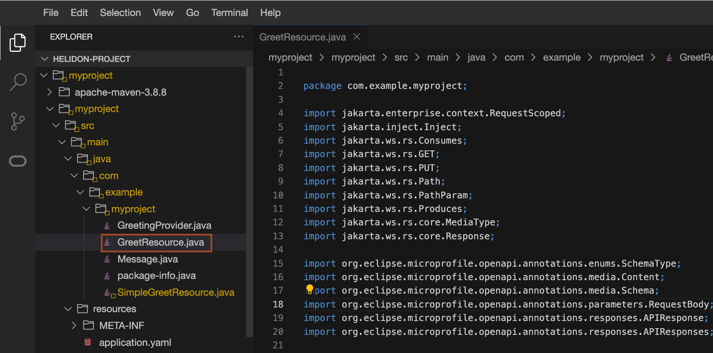

# Modify Helidon MP application in Code Editor

## Introduction

In this lab, you add a custom endpoint to JAVA Class in Code Editor.

Estimated Time: 10 minutes

Watch the video below for a quick walk-through of the lab.
[Modify Helidon MP application in Code Editor](videohub:1_sv1iug41)

### Objectives

In this lab, you will:

* Add a custom endpoint in the Java class
* Build and run the modified application

### Prerequisites

* You must have an [Oracle Cloud Infrastructure](https://cloud.oracle.com/en_US/cloud-infrastructure) enabled account.

## Task 1: Add a custom Endpoint

1. In Code Editor, click the *GreetResource.java* file to open it.
    


2. As you may see in the code, it is fully MicroProfile-based. This means that all the functionality is achieved with POJOs and annotations.  These annotations are Standard, thus portable across different vendors. This means that you can easily run code running on other platforms supporting the same version of MicroProfile. For more information, you will find it [here](https://microprofile.io/).

3. Create a new endpoint that provides titles randomly out of a group of five titles. To create this endpoint, copy and paste the below code at line number 80 as shown below.
    ```bash
    <copy>@Path("/title")
    @GET
    @Produces(MediaType.APPLICATION_JSON)
    public String getRandomTitle() {
        return new String[] {"Mr. ", "Mrs.", "Miss", "Dr.", "Dr. sc."} [(int)(Math.random()*5)];
    }</copy>
    ```
    

4. To save the content of the file, in Code Editor, click *File* -> *Save*.
    > AutoSave is enabled by default in Code Editor.


## Task 2: Run the application

1. Copy and paste the following command into the terminal to run the application.
    ```bash
    <copy>mvn clean package
    java -jar target/myproject.jar</copy>
    ```


2. Open a new terminal/console and run the following commands to check the application:
    ```bash
    <copy>curl -X GET http://localhost:8080/greet/title</copy>
    Mr.
    ```
    > It randomly provides the title out of 5 options, you can run this command multiple times.

3. *Stop the **myproject** application by entering `Ctrl + C` in the terminal where the "java -jar target/myproject.jar" command is running*. IT IS VERY IMPORTANT, OTHERWISE YOU WILL FACE ISSUES IN THE LAB LATER.

## Acknowledgements

* **Author** -  Dmitry Aleksandrov
* **Contributors** - Ankit Pandey, Maciej Gruszka
* **Last Updated By/Date** - Ankit Pandey, August 2022