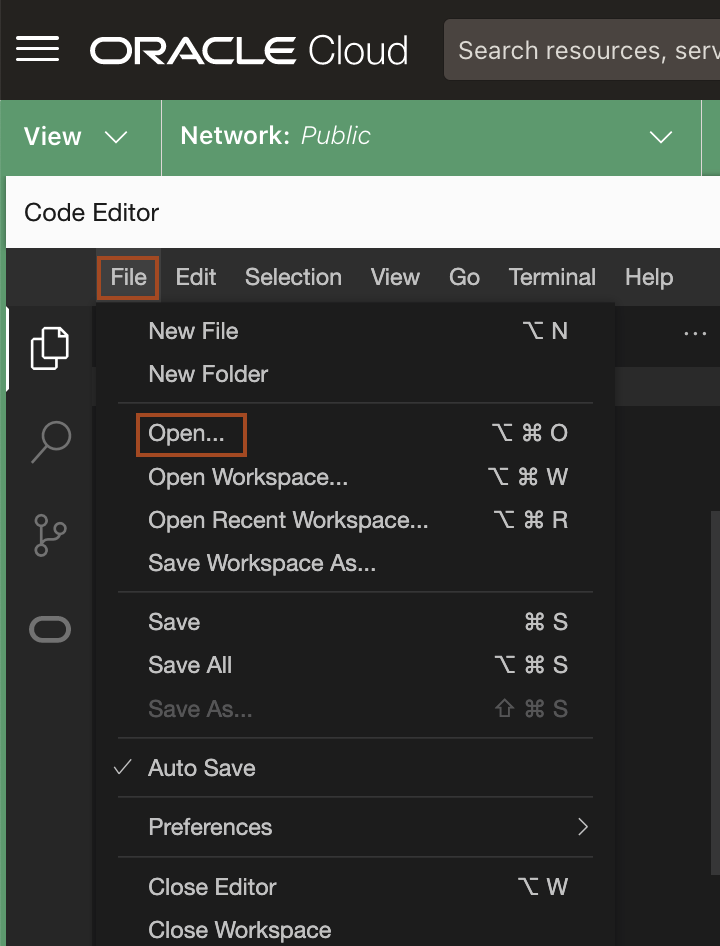
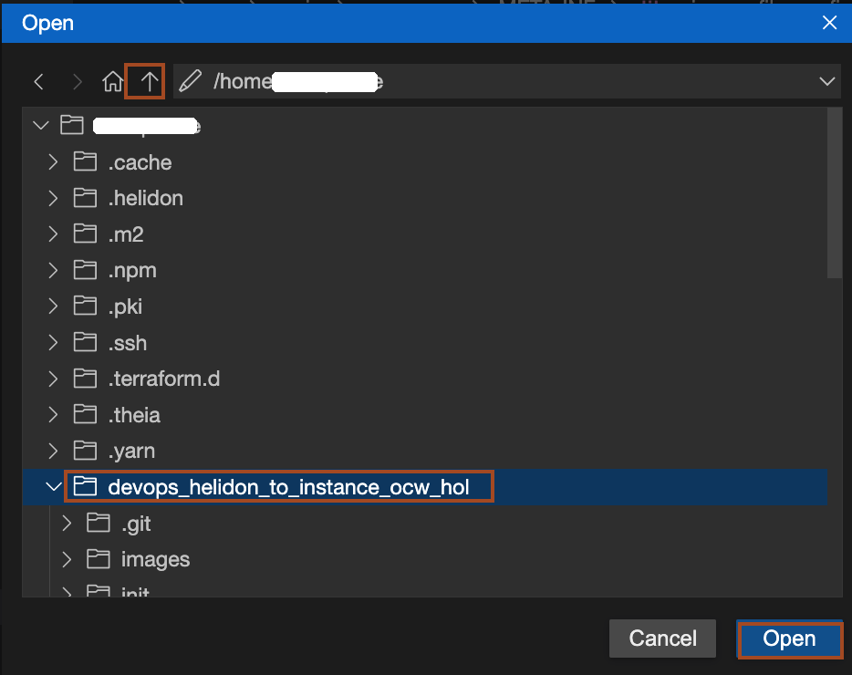

# Clean up the OCI Resources

## Introduction

This lab walks you through the steps to clean up the OCI resource created in this workshop, when the environment is not needed.

Estimated time: 15 minutes

Watch the video below for a quick walk-through of the lab.
[clean up resources](videohub:1_cyuzrf2g)

### Objectives

In this lab, you will:

* Destroy the resources created for the DevOps project
* Clean up the compartment, dynamic groups, user groups and policies.


### Prerequisites

* An Oracle Free Tier(Trial), Paid or LiveLabs Cloud Account

## Task 1: Destroy the resources created for the DevOps project

1. To open the *`devops_helidon_to_instance_ocw_hol`* project in **Code Editor**, Click on *File* -> *Open*.
    

2. Click the *Up Arrow* to navigate to parent folder and then select **`devops_helidon_to_instance_ocw_hol`** folder and click *Open*.


3. Open a new terminal, Copy and paste the following command to navigate to the  **`devops_helidon_to_instance_ocw_hol`** folder. 
    ```bash
    <copy>cd ~/devops_helidon_to_instance_ocw_hol/main</copy>
    ```

4. Copy and paste the following command to destroy the resources related to the **DevOps project** like the topic, code repository etc. Please observe the output of a command to know the resources it deletes. 
    ```bash
    <copy>./destroy.sh</copy>
    Deleting all artifacts from 'artifact-repo-helidon-ocw-hol'
    Deleted 6 artifacts

    Deleting all objects from 'app-bucket-helidon-ocw-hol-UkUz'
    Deleted 1 objects

    Begin Terraform destroy...

    tls_private_key.public_private_key_pair: Refreshing state... [id=2aab23ed7159c8162b122d90fee8d5e1ebeda044]
    random_string.random_value: Refreshing state... [id=UkUz]
    data.oci_core_images.compute_instance_images: Reading...
    oci_core_virtual_network.vcn: Refreshing state... [id=ocid1.vcn.oc1.ap-hyderabad-1.ama]
    oci_logging_log_group.devops_log_group: Refreshing state... [id=ocid1.loggroup.oc1.ap-hyderabad-1.ama]
    data.oci_objectstorage_namespace.object_storage_namespace: Reading...
    oci_logging_log_group.application_log_group: Refreshing state... [id=ocid1.loggroup.oc1.ap-hyderabad-1.amaa]
    data.oci_identity_availability_domains.ads: Reading...
    oci_ons_notification_topic.devops_notification_topic: Refreshing state... [id=ocid1.onstopic.oc1.ap-hyderabad-1.aaaaaa]
    oci_artifacts_repository.artifact_repo: Refreshing state... [id=ocid1.artifactrepository.oc1.ap-hyderabad-1.0.amaa]
    data.oci_objectstorage_namespace.object_storage_namespace: Read complete after 0s [id=ObjectStorageNamespaceDataSource-1900185788]
    oci_objectstorage_bucket.application_bucket: Refreshing state... [id=n/axebow4vbabr/b/app-bucket-helidon-ocw-hol-UkUz]
    data.oci_identity_availability_domains.ads: Read complete after 0s [id=IdentityAvailabilityDomainsDataSource-2783498200]
    oci_logging_log.application_log: Refreshing state... [id=ocid1.log.oc1.ap-hyderabad-1.amaaa]
    oci_devops_project.devops_project: Refreshing state... [id=ocid1.devopsproject.oc1.ap-hyderabad-1.amaa]
    oci_core_internet_gateway.ig: Refreshing state... [id=ocid1.internetgateway.oc1.ap-hyderabad-1.aaaa]
    oci_core_security_list.sl: Refreshing state... [id=ocid1.securitylist.oc1.ap-hyderabad-1.aaaa]
    ```

    > This script takes 16 minutes to completion.

## Task 2: Cleanup the compartment, dynamic group, user group and policies

1. Copy and paste the following command in the terminal to navigate to *init* folder.
    ```bash
    <copy>cd ../init</copy>
    ```

2. Copy and paste the following command in the terminal to delete the compartment, dynamic-groups, groups and policies.
    ```bash
    <copy>terraform destroy -auto-approve</copy>
    random_string.random_value: Refreshing state... [id=8emL]
    oci_identity_group.user_group: Refreshing state... [id=ocid1.group.oc1..aaa]
    oci_identity_compartment.devops_demo_compartment: Refreshing state... [id=ocid1.compartment.oc1..aaa]
    oci_identity_dynamic_group.devops_dynamic_group: Refreshing state... [id=ocid1.dynamicgroup.oc1..aaaa]
    oci_identity_dynamic_group.instance_dynamic_group: Refreshing state... [id=ocid1.dynamicgroup.oc1..aaaa]
    oci_identity_user_group_membership.user_group_membership[0]: Refreshing state... [id=ocid1.groupmembership.oc1..aaaa]
    oci_identity_policy.user_group_policy: Refreshing state... [id=ocid1.policy.oc1..aaaa]
    oci_identity_policy.instance_policy: Refreshing state... [id=ocid1.policy.oc1..aaaa]
    oci_identity_policy.devops_policy: Refreshing state... [id=ocid1.policy.oc1..aaa]
    ```

## Acknowledgements

* **Author** -  Keith Lustria
* **Contributors** - Ankit Pandey, Maciej Gruszka
* **Last Updated By/Date** - Ankit Pandey, May 2023