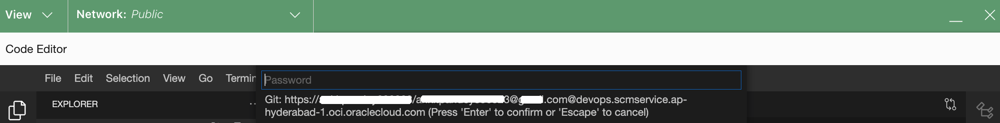
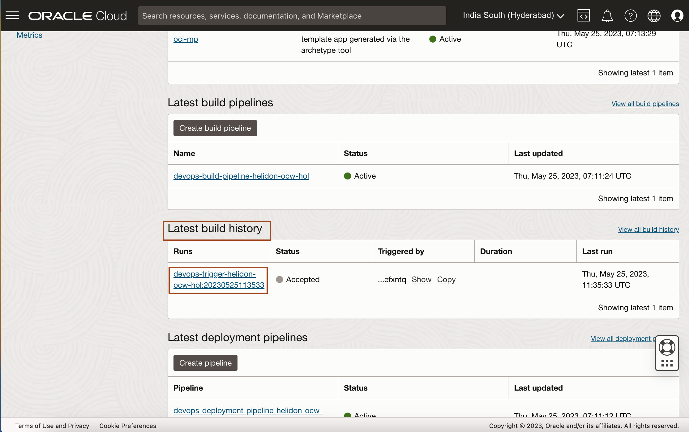
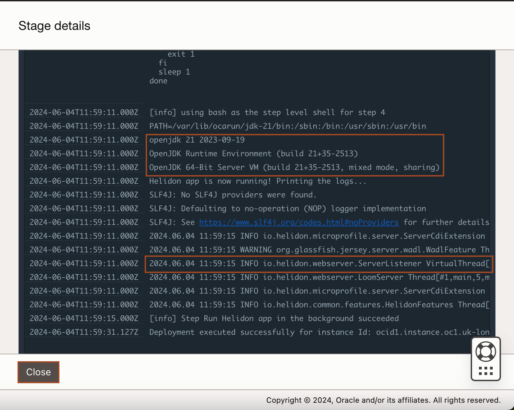

# Generate Helidon MP Application

## Introduction

This lab walks you through the steps to create a **Helidon MP** application using **Helidon CLI**. Also, you will modify the Helidon application to show its integration with **OCI Logging and Monitoring** services.

Estimated time: 15 minutes

Watch the video below for a quick walk-through of the lab.
[Generate Helidon MP application](videohub:1_i4j33ed4)
### Objectives

In this lab, you will:

* Download the Helidon CLI
* Generate Helidon MP application using Helidon CLI
* Perform integration with OCI Logging and Metrics service
* Push the application code to the OCI Code repository
* Trigger the DevOps pipeline

### Prerequisites

* An Oracle Free Tier(Trial), Paid or LiveLabs Cloud Account
* Familiarity with git commands

## Task 1: Download Helidon CLI

1. Open a new terminal in the **OCI Code Editor** and paste the following command to navigate to the home folder.
    ```bash
    <copy>cd ~</copy>
    ```

2. Copy and paste the following command to download **Helidon CLI** and change the **permissions** to make it executable.
    ```bash
    <copy>curl -L -O https://helidon.io/cli/latest/linux/helidon
    chmod +x ./helidon</copy>
    ```


## Task 2: Generate a Helidon Microprofile application using Helidon CLI


1. Execute the CLI to **generate a Helidon Microprofile application** project.
     ```bash
    <copy>./helidon init</copy>
    ```
2. When it prompts for the *Helidon version*, Enter *4* to see all versions and then enter the option to select the *4.0.7* version.
    

3. When prompted to *Select a Flavor*, copy and paste the below value to the terminal.
    ```bash
        | Helidon Flavor

        Select a Flavor
        (1) se   | Helidon SE
        (2) mp   | Helidon MP
        Enter selection (default: 1): <copy>2</copy>
    ``` 
4. When prompted to *Select an Application Type*, copy and paste the below value to the terminal.
    ```bash
        Select an Application Type
    (1) quickstart | Quickstart
    (2) database   | Database
    (3) custom     | Custom
    (4) oci                | OCI
    Enter selection (default:1):<copy>4</copy>
    ```
5. When prompted for *Project groupId*, *Project artifactId* and *Project version*, just **accept the default values**.

6. When prompted for *Java package name*, copy and paste the below value to the terminal.
    ```bash
    Java package name (default: me.username.mp.oci): <copy>ocw.hol.mp.oci</copy>
    ```

7. When promted for *Start development loop? (default: n):*, press *Enter* to select the default value.

    > Once completed, this will generate an **oci-mp** project.

## Task 3: Modify the Helidon application for logging and metrics explorer

1. To open the *oci-mp* project in **Code Editor**, click *File* -> *Open*.
    

2. Click the *Up Arrow* to navigate to parent folder and then select *oci-mp* folder and click *Open*.
    

    > This will open the *oci-mp* application in Explorer. 

3. Open a new terminal, Copy and paste the following command to **copy the build and deployment pipeline specs** from the *`devops_helidon_to_instance_ocw_hol`* folder.
    ```bash
    <copy>cd ~/oci-mp/
    cp ~/devops_helidon_to_instance_ocw_hol/pipeline_specs/* .</copy>
    ```

4. Add **.gitignore** so files and directories that are not needed to be part of the repository will be ignored by git.
    ```bash
    <copy>cp ~/devops_helidon_to_instance_ocw_hol/.gitignore .</copy>
    ```

5. Copy and paste the following command to run the utility script from the main folder *`devops_helidon_to_instance_ocw_hol`* to update the **config** parameters. when it asks for **Enter the Helidon MP project's root directory**, press enter to select the **default** value.
    ```bash
    <copy>~/devops_helidon_to_instance_ocw_hol/utils/update_config_values.sh</copy>
    ```
    You will have output similar to that shown below:
    

    > **Please Read:-**
    * Invoking this script will perform the following:
    * Updates in *~/oci-mp/server/src/main/resources/application.yaml* config file to set up a Helidon feature that sends Helidon-generated metrics to the OCI monitoring service.
        * **compartmentId** - Compartment ocid that is used for this demo
        * **namespace** - This can be any string but for this demo, this will be set to helidon_metrics.
    * Updates in *~/oci-mp/server/src/main/resources/META-INF/microprofile-config.properties* config file to set up configuration parameters used by the Helidon app code to perform integration with OCI Logging and Metrics service.
        * **oci.monitoring.compartmentId** - Compartment ocid that is used for this demo
        * **oci.monitoring.namespace** - This can be any string but for this demo, this will be set to helidon_application.
        * **oci.logging.id** - Application log id that was provisioned by the Terraform scripts.
     * Update in *~/oci-mp/server/src/main/resources/META-INF/microprofile-config.properties* config file to set up *oci.bucket.name* property to contain the Object Storage bucket name that was provisioned by the terraform scripts that will be used in a later exercise to demonstrate Object Storage support from a Helidon application.

6. Open the file *~/oci-mp/server/src/main/resources/application.yaml* in Code editor to verify that the value of **compartmentId** and **namespace** are updated.


7. Open the file *~/oci-mp/server/src/main/resources/META-INF/microprofile-config.properties* in Code editor to verify that the value of **oci.monitoring.compartmentId**, **oci.monitoring.namespace**, **oci.logging.id** and **oci.bucket.name** are updated. *oci.bucket.name* will be used later in Lab 5.


## Task 4: Generate an Authentication Token to push the code to the OCI Code repository

In this step, we are going to generate an *Authentication Token*, that we will use to push the Helidon application code to the *OCI Code repository*.

1. Select the *User Icon* in the top right corner and then select *My Profile*.
    

2. Scroll down and select *Auth Tokens*.
    

3. Click *Generate Token*.
    

4. Copy *oci-mp* and paste it in the Description box and click *Generate Token*.
    

5. Select **Copy** under Generated Token and paste/save it into a text file using an editor of your choice. Remember that the token cannot be retrieved later so it is important to keep a copy of this now. Once done, click **Close**.
    


## Task 5: Sync up the Helidon application project to the OCI Code repository in your DevOps project

1. Open a new terminal, Copy and paste the following command to navigate to the *oci-mp* directory.
    ```bash
    <copy>cd ~/oci-mp</copy>
    ```

2. Initialize the *oci-mp* project directory to become a **git repository**.
    ```bash
    <copy>git init</copy>
    ```

3. Set the branch to **main** to match the corresponding remote branch.
    ```bash
    <copy>git checkout -b main</copy>
    ```

4. Set the **remote repository**. Use the OCI Code Repository's https url displayed from the last terraform output or use the get.sh tool from `devops_helidon_to_instance_ocw_hol` to retrieve that value.
    ```bash
    <copy>git remote add origin $(~/devops_helidon_to_instance_ocw_hol/main/get.sh code_repo_https_url)
    git remote -v</copy>
    ```

    > **git remote -v** is to verify that the origin has been set.

5. Configure git to use the **credential helper** store so that OCI repository's username and password will be entered only once on git commands that require them. Also, set **user.name** and **user.email** which is required by git commit.
    ```bash
    <copy>git config credential.helper store
    git config --global user.email "my.name@example.com"
    git config --global user.name "FIRST_NAME LAST_NAME"</copy>
    ```

6. Synchronize the oci repository's git log with the local repository by using **git pull**.
    ```bash
    <copy>git pull origin main</copy>
    ```

7. This will prompt for a username and password. Use **tenancy name**/**username** for the username and OCI user **auth token** that was generated at **task 4** for the password.
    
    

8. You will have output similar to the following. If not, please check that you have run every git command correctly.
    


## Task 6: Push the Helidon application code and trigger the DevOps pipeline

1. **Stage** all the files for the git commit.
    ```bash
    <copy>git add .
    git status</copy>
    ```

    > git status will output all the files in the repository.

2. Perform the first **commit**.
    ```bash
    <copy>git commit -m "Helidon oci-mp first commit"</copy>
    ```

3. **Push** the changes to the remote repository.
    ```bash
    <copy>git push -u origin main</copy>
    ```
    > This will trigger the DevOps to start the build pipeline.

4. Open the [Cloud Console](https://cloud.oracle.com/) in new tab, Click *Hamburger menu* -> *Developer Services* -> *Projects* under **DevOps**.
    

5. Select the compartment, which you have created in **Lab 1** and then Click *devops-project-helidon-ocw-hol-string* to open the **DevOps Project**.
    

    > Refresh the browser,If you don't see the new compartment.

6. Under *Latest build history*, you will see the *Runs* and Status as *Accepted/In Progress*. Click on the latest runs as shown below.
    

7. Once the build pipeline completed all three stages, you will see output as shown below. You can click the arrow just before the stages, to view, what action they are performing. This action, we have defind in *`build_spec.yaml`* file in *oci-mp* folder.
    

8. In Build run progress, In the third stage, click on **Three dots** and then click **View deployment** as shown below. This will open the **deployment pipeline**. 
    

9. Here you can see *Deployment Progress*. Once you have the deployment pipeline completed, you will see the output as shown below. You can click the arrow just before the stage, to view, what action they are performing. This action, we have defind in *`deployment_spec.yaml`* file in *oci-mp* folder.
    

    > This successfully deploys the Helidon application to **Compute instances** in OCI.

10. To view the logs of the deployment pipeline, click on **Three dots** near to deployment stage and click **View details** as shown below.
    

11. Scroll down the logs and verify that the JDK flavor is **Open JDK**. Also note from the logs that the Helidon application leverages the new **Virtual Threads** feature in Java as shown below.
    

    > As part of **Lab 4**, we will replace **Open JDK** with **Oracle JDK**. 

You may now **proceed to the next lab.**

## Learn More

* [Helidon CLI](https://helidon.io/docs/v3/#/about/cli)
* [Helidon MP Quick Start Guide](https://helidon.io/docs/v3/#/mp/guides/quickstart)
* [Helidon MP Config Sources](https://helidon.io/docs/v3/#/mp/config/advanced-configuration)
* [Helidon MP Config Sources](https://helidon.io/docs/v3/#/mp/guides/config)

## Acknowledgements

* **Author** -  Ankit Pandey
* **Contributors** - Sid Joshi, Maciej Gruszka
* **Last Updated By/Date** - Ankit Pandey, June 2024