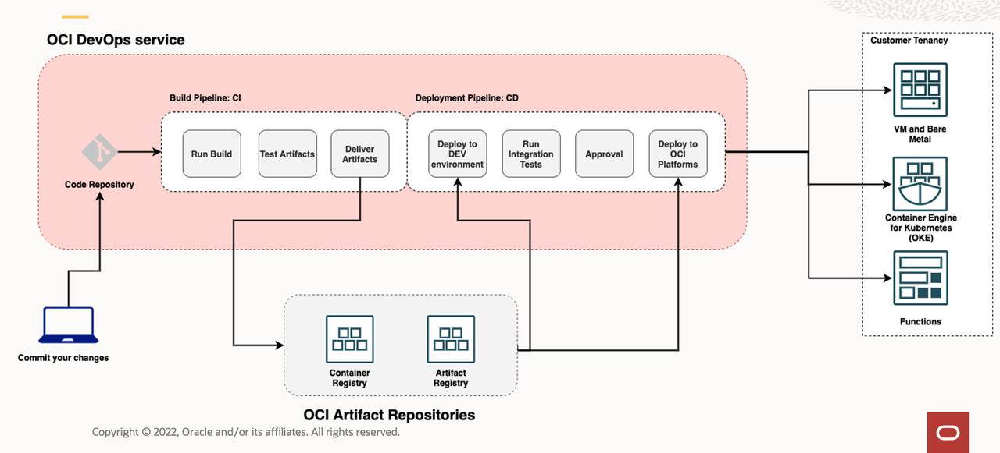
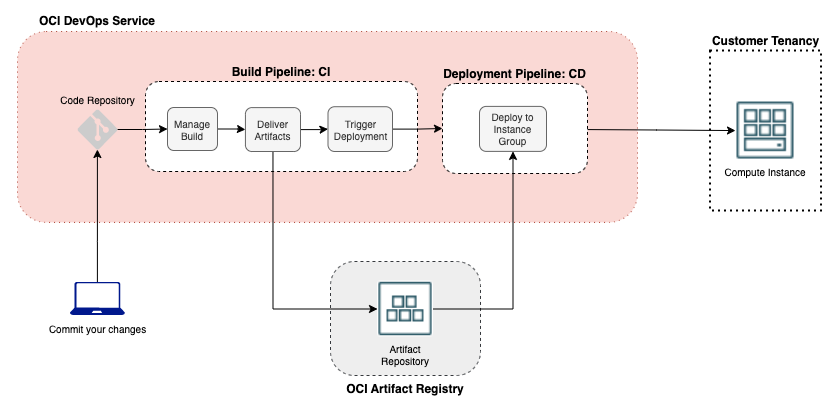

# Introduction

## About this Workshop

In this workshop, you will learn how to build, maintain, and upgrade a **Helidon microservice application** from start to finish using the **OCI DevOps service**. We'll demonstrate how to accelerate and streamline the entire lifecycle management process, utilizing JDK20 with Virtual Threads technology.

*IT IS IMPORTANT TO GO THROUGH THE **"MANDATORY TO BE READ"** SECTION*.

Estimated time: 5 minutes

### Objectives

In this workshop, you will:

* Create a compartment, dynamic group and policies
* Create a DevOps project and related resources using Terraform
* Build and deploy Helidon MP application to Compute Instances using OCI DevOps
* Show OCI Monitoring SDK integration
* Validate OCI Logging SDK integration to push messages to Logging service
* Simulate a patching scenario
* Add Object storage access from the Helidon MP application

### Prerequisites

* An Oracle Free Tier(Trial), Paid or LiveLabs Cloud Account
* [Familiarity with OCI console](https://docs.us-phoenix-1.oraclecloud.com/Content/GSG/Concepts/console.htm)
* [Overview of Networking](https://docs.us-phoenix-1.oraclecloud.com/Content/Network/Concepts/overview.htm)
* [Familiarity with Compartments](https://docs.us-phoenix-1.oraclecloud.com/Content/GSG/Concepts/concepts.htm)
* [OCI DevOps services](https://docs.oracle.com/en-us/iaas/Content/devops/using/home.htm)

## Oracle DevOps

Oracle Cloud Infrastructure DevOps service provides an end-to-end CI/CD platform for developers. OCI DevOps services broadly cover all the essential needs for a software lifecycle. Such as

* **OCI Deployment pipelines** – automate releases with declarative Pipeline release strategies to OCI Platforms like VM and Baremetals, Oracle Container Engine for Kubernetes (OKE) and OCI Functions
* **OCI Artifact repositories** – A place to store versioned artifacts, including immutable ones.
* **OCI Code repositories** – OCI provided a scalable code repository service.
* **OCI Build pipelines** – A serverless, scalable service to automate build, test, artefacts and deployment invocations.

## Role Play Architecture

You will be building and deploying the below-mentioned architecture using OCI services and features.

You may now **proceed to the next lab.**

## Learn More

* [Reference Architecture: Understand modern app deployment strategies with Oracle Cloud Infrastructure DevOps](https://docs.oracle.com/en/solutions/mod-app-deploy-strategies-oci/index.html)
* [https://helidon.io/](https://helidon.io/)

## Acknowledgements

* **Author** -  Keith Lustria
* **Contributors** - Ankit Pandey, Maciej Gruszka
* **Last Updated By/Date** - Ankit Pandey, May 2023