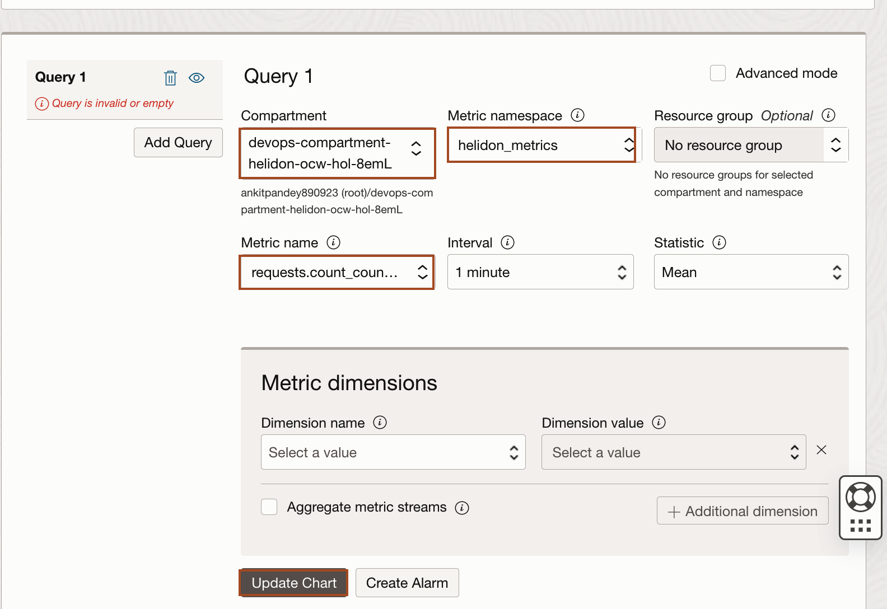
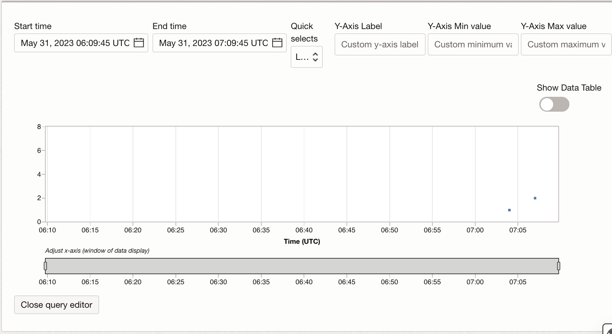
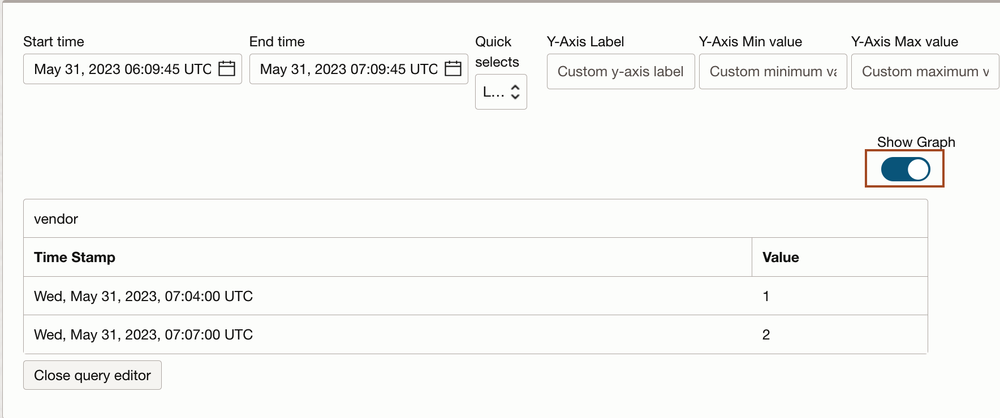
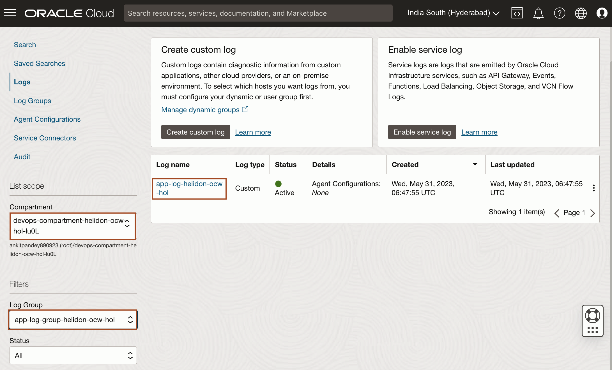
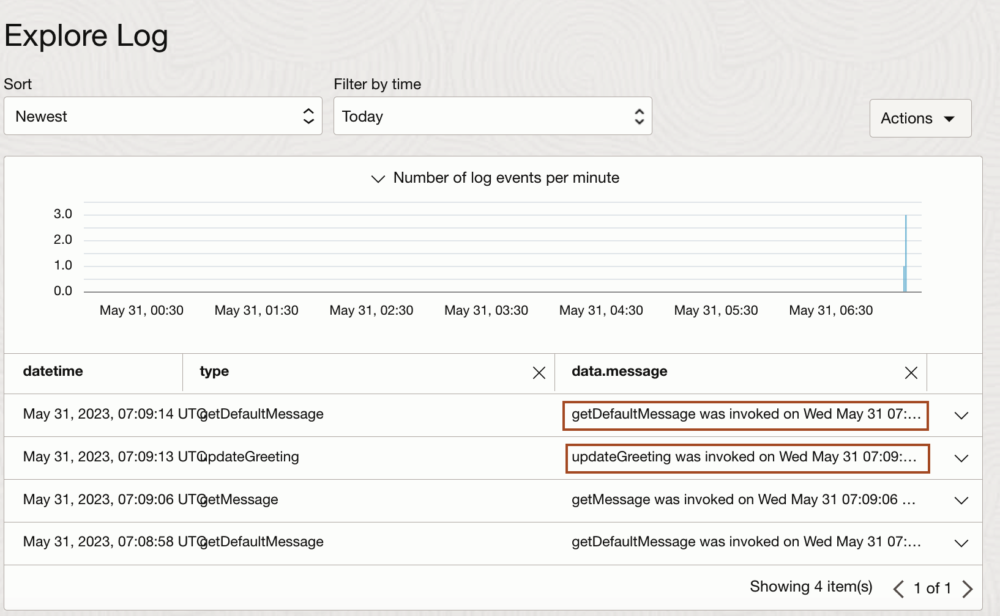

# Explore Logs and Metrics Explorer

## Introduction

In this lab, you will verify the successful deployment of the Helidon application. Also, you will explore the logs and metrics explorer service.

Estimated time: 5 minutes

Watch the video below for a quick walk-through of the lab.
[Explore logs and metrics explorer](videohub:1_7a0qaaif)

### Objectives

In this lab, you will:

* Verify the successful deployment of the Helidon application.
* Explore OCI Metric Explorer
* Explore OCI Logging service
* Validate the liveness and readiness of the Helidon application

### Prerequisites

* An Oracle Free Tier(Trial), Paid or LiveLabs Cloud Account
* Familiarity with OCI console

## Task 1: Access the Helidon application

In this task, we will access the application using curl to do GET and PUT HTTP requests.

1. Go back to **Code Editor**, copy and paste the following command in the terminal to set up the deployment node **`PUBLIC_IP`** as an environment variable.
    ```bash
    <copy>export PUBLIC_IP=$(~/devops_helidon_to_instance_ocw_hol/main/get.sh public_ip)</copy>
    ```

2. Copy and paste the following command to place a **GET request**. You will have similar output as shown below.
    ```bash
    <copy>curl http://$PUBLIC_IP:8080/greet</copy>
    {"message":"Hello World!","date":[2024,6,5]}
    ```

3. Hello to a name, i.e. to **Joe**. You will have similar output as shown below.
    ```bash
    <copy>curl http://$PUBLIC_IP:8080/greet/Joe</copy>
    {"message":"Hello Joe!","date":[2024,6,5]}
    ```

4. Replace Hello with another greeting word, i.e. **Hola**. You will have similar output as shown below.
    ```bash
    <copy>curl -X PUT -H "Content-Type: application/json" -d '{"greeting" : "Hola"}' http://$PUBLIC_IP:8080/greet/greeting 
    curl http://$PUBLIC_IP:8080/greet</copy>
    {"message":"Hola World!","date":[2024,6,5]}
    ```

## Task 2: Explore OCI Metrics Explorer

In this task, You will validate that the **Helidon metrics** are pushed to the **OCI Monitoring Service**.

1. In Cloud Console, Click *Hamburger menu* -> *Observability & Management* -> *Metrics Explorer* under **Monitoring** as shown below.
    

2. Scroll down to go **Query** section, select the correct compartment and then select **`helidon_metrics`** as Metrics namespace and **`request.count_counter`** as Metric name to build the query. Then click *Update Chart* as shown below.
    

3. Scroll up and you will see similar output as shown below. This provides you with data in Graph format for the request counter. 
    

4. To show the data in Data Table, Toggle the button for **Show Data Table** as shown below. As you toggle the button, *Show Data table* replaces with **Show Graph**. 
    

## Task 3: Explore OCI Logging service

In this task, we validate **OCI logging SDK** integration to push messages to the Logging service by exploring the log **app-log-helidon-ocw-hol** on log group **app-log-group-helidon-ocw-hol**.

1. In Cloud console, Click *Hamburger menu* -> *Observability & Management* -> *Logs*. 
    

2. Select the correct compartment, and then select the *`app-log-group-helidon-ocw-hol`* as **Log Group** then click **app-log-helidon-ocw-hol** as shown below.
    

3. In **Filter by time**, select **Today** from dropdown and you can see the application logs. 
    

## Task 4: Health check of Helidon application to validate liveness and readiness

The Helidon **oci-mp** application adds a **Health Check** feature to validate **liveness** and/or **readiness**. You can check *GreetLivenessCheck* and *GreetReadinessCheck* class files respectively in the project to see how they are done. This will particularly be useful when running the app as a microservice on an orchestrator environment like Kubernetes to determine if the microservice needs to be restarted if it is not healthy. Specific to this lab, the readiness check is leveraged in the DevOps deployment pipeline spec after the app is started *to determine if the Helidon application started successfully*. Check out the code at *line #79* in **deployment_spec.yaml** to see it in action.

1. Go back to **Code Editor**, copy and paste the following command in the terminal to set up the deployment node **`PUBLIC_IP`** as an environment variable.
    ```bash
    <copy>export PUBLIC_IP=$(~/devops_helidon_to_instance_ocw_hol/main/get.sh public_ip)</copy>
    ```

2. Copy and paste the following command to check the **liveness**. You will have similar output as shown below.
    ```bash
    <copy>curl http://$PUBLIC_IP:8080/health/live</copy>
    {"status":"UP","checks":[{"name":"CustomLivenessCheck","status":"UP","data":{"time":1684391639448}}]}
    ```

3. Copy and paste the following command to check **readiness**. You will have similar output as shown below.
    ```bash
    <copy>curl http://$PUBLIC_IP:8080/health/ready</copy>
    {"status":"UP","checks":[{"name":"CustomReadinessCheck","status":"UP","data":{"time":1684391438298}}]}
    ```


You may now **proceed to the next lab.**

## Learn More

* [OCI Application with Helidon](https://medium.com/helidon/oci-application-with-helidon-caa78cacaee5)
* [Helidon MP Metrics](https://helidon.io/docs/v3/#/mp/metrics/metrics)
* [Helidon MP Metrics Guide ](https://helidon.io/docs/v3/#/mp/guides/metrics)
* [Helidon MP Health](https://helidon.io/docs/v3/#/mp/health)
* [Helidon MP Health Check Guide](https://helidon.io/docs/v3/#/mp/guides/health)

## Acknowledgements

* **Author** -  Ankit Pandey
* **Contributors** - Sid Joshi, Maciej Gruszka
* **Last Updated By/Date** - Ankit Pandey, June 2024
