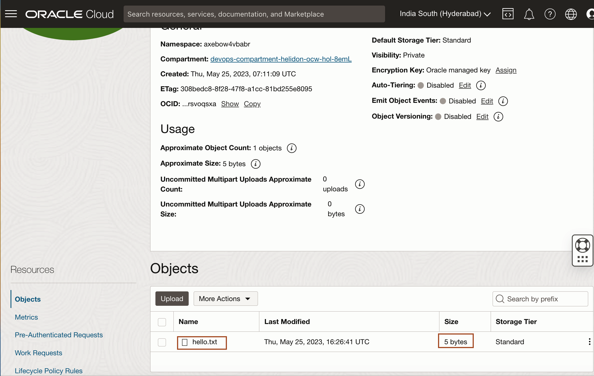
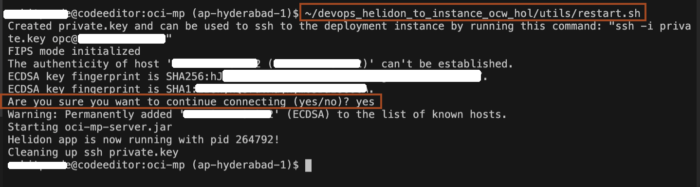
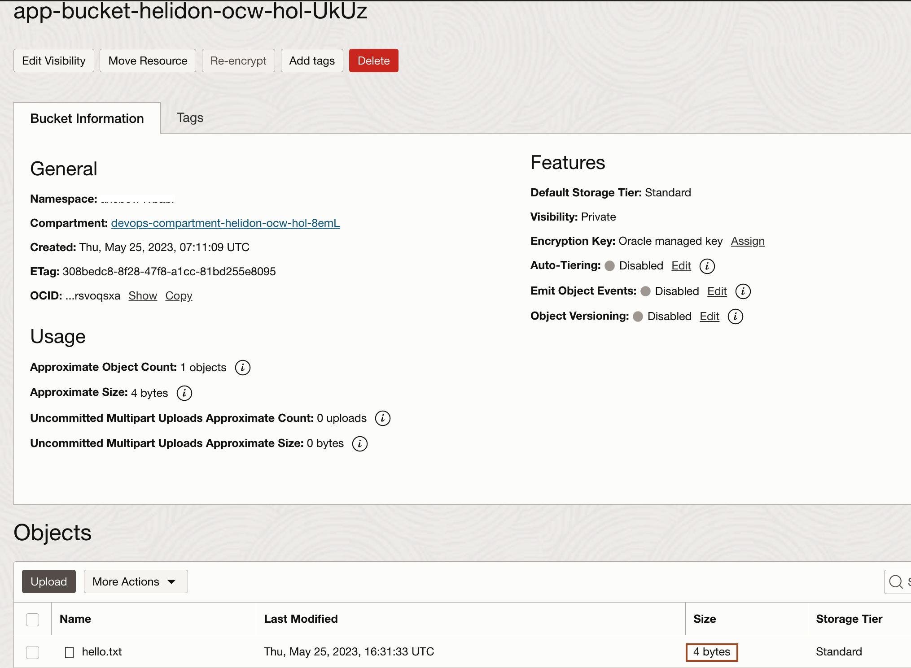

# Modify the Helidon application for Object storage integration 

## Introduction

The objective of this lab is to demonstrate **how to add Object Storage access** from the Helidon application. This is done by replacing a variable which is used to store the greeting word with an object that will now become the new greeting word container and is stored and **retrieved from an Object Storage bucket**. Since the object is persisted, the last greeting word value will survive application restarts. Without this change and with the greeting word in memory via the variable, the greeting word will reset to a default value when the application is restarted.

Estimated time: 15 minutes

### Objectives

In this lab, you will:

* Modify the Helidon application to show its integration with OCI services like Object storage
* Verify the successful Object storage integration

### Prerequisite

* An Oracle Free Tier(Trial), Paid or LiveLabs Cloud Account

## Task 1: Modify the Helidon application for Object Storage integration

1. Verify that **oci.bucket.name** is configured properly in **~/oci-mp/server/src/main/resources/META-INF/microprofile-config.properties** which should have already been set in step 5 of Lab 2/Task 3.

1. In **Code Editor**, click the file name **`pom.xml`** under *~/oci-mp/server/* to open it and add the **Object Storage OCI SDK** dependency inside the **dependencies** clause as shown below.
    ```bash
    <copy><dependency>
                <groupId>com.oracle.oci.sdk</groupId>
                <artifactId>oci-java-sdk-objectstorage</artifactId>
    </dependency></copy>
    ```
    

    > Make sure to keep indentation proper.

2. We modify the file *~/oci-mp/server/src/main/java/ocw/hol/mp/oci/server/GreetingProvider.java* to add **Object Storage** access. In the interest of time, we have the source code for this change. Please copy and paste the following code to get this file updated with the required changes. You can read the *Note* below which describes the changes we make in this file.
    ```bash
    <copy>cp ~/devops_helidon_to_instance_ocw_hol/source/GreetingProvider.java server/src/main/java/ocw/hol/mp/oci/server/</copy>
    ```
    

    > **Please Read:-**
    * From the constructor's argument section, added the *ObjectStorage objectStorageClient* parameter. Since this is part of *@Injected* annotation, the parameter will automatically be processed and set by Helidon to contain the client which can be used to communicate with the Object Storage service without having to add several lines of **OCI SDK** code for that purpose.
    * From the same constructor's argument section, added **ConfigProperty** which will extract value from an **oci.bucket.name** property in the configuration. This has earlier been populated in **microprofile-config.properties** during the initial application setup when a utility script called **`update_config_values.sh`** was executed from the **`devops_helidon_to_instance_ocw_hol`** repository directory.
    * Using **getNamespace() Object Storage SDK** method, retrieve the Object Storage's namespace as it will be used later to retrieve or store an object:
    ```bash
    <copy>public GreetingProvider(@ConfigProperty(name = "app.greeting") String message,
                        ObjectStorage objectStorageClient,
                        @ConfigProperty(name = "oci.bucket.name") String bucketName) {
    try {
        this.bucketName = bucketName;
        GetNamespaceResponse namespaceResponse =
                objectStorageClient.getNamespace(GetNamespaceRequest.builder().build());
        this.objectStorageClient = objectStorageClient;
        this.namespaceName = namespaceResponse.getValue();
        LOGGER.info("Object storage namespace: " + namespaceName);
        setMessage(message);
    } catch (Exception e) {
        LOGGER.warning("Error invoking getNamespace from Object Storage: " + e);
    }
    }     </copy>
    ```
    * Right below the GreetingProvider class, removed the variable declaration:
    ```bash
    <copy>private final AtomicReference<String> message = new AtomicReference<>();</copy>
    ```
    * Replaced it with local global variables like below. *LOGGER* will be used for logging while *objectStorageClient*, *namespaceName*, *bucketName* and *objectName* will be used on *Object Storage SDK* calls.
    ```bash
    <copy>private static final Logger LOGGER = Logger.getLogger(GreetingProvider.class.getName());
    private ObjectStorage objectStorageClient;
    private String namespaceName;
    private String bucketName;
    private final String objectName = "hello.txt";</copy>
    ```
    * Replaced the content of *getMessage()* with the below code. This will use **getObject() SDK** method to retrieve the greeting word from the **hello.txt** object fetched from the bucket.
    ```bash
    <copy>try {
    GetObjectResponse getResponse =
            objectStorageClient.getObject(
                    GetObjectRequest.builder()
                            .namespaceName(namespaceName)
                            .bucketName(bucketName)
                            .objectName(objectName)
                            .build());
    return new String(getResponse.getInputStream().readAllBytes());
    } catch (Exception e) {
        LOGGER.warning("Error invoking getObject from Object Storage: " + e);
        return "Hello-Error";
    }</copy>
    ```
    * Replaced the content of void **setMessage(String message)** method with the below code. This will use the **putObject() SDK** method to store the **hello.txt** object containing the greeting word into the bucket.
    ```bash
    <copy>try {
    byte[] contents = message.getBytes();
    PutObjectRequest putObjectRequest =
            PutObjectRequest.builder()
                    .namespaceName(namespaceName)
                    .bucketName(bucketName)
                    .objectName(objectName)
                    .putObjectBody(new ByteArrayInputStream(message.getBytes()))
                    .contentLength(Long.valueOf(contents.length))
                    .build();
    objectStorageClient.putObject(putObjectRequest);
    } catch (Exception e) {
        LOGGER.warning("Error invoking putObject from Object Storage: " + e);
    }</copy>
    ```
    * Removed the import (**import java.util.concurrent.atomic.AtomicReference;**) and replaced it with the these new imports to support all the new code that has been added.
    ```bash
    <copy>import java.io.ByteArrayInputStream;
    import java.util.logging.Logger;
    
    import com.oracle.bmc.objectstorage.ObjectStorage;
    import com.oracle.bmc.objectstorage.requests.GetNamespaceRequest;
    import com.oracle.bmc.objectstorage.requests.GetObjectRequest;
    import com.oracle.bmc.objectstorage.requests.PutObjectRequest;
    import com.oracle.bmc.objectstorage.responses.GetNamespaceResponse;
    import com.oracle.bmc.objectstorage.responses.GetObjectResponse;</copy>
    ```

## Task 2: Push the Helidon application code change and trigger the DevOps pipeline

1. Copy and paste the following command in the terminal **to commit and push the change**.
    ```bash
    <copy>git add .
    git status
    git commit -m "Add support Object Storage integration"
    git push</copy>
    ```

    > The pipeline will get triggered by this git push.

2. Wait until the **DevOps lifecycle** is completed by monitoring the build and deployment pipeline logs.
    

## Task 3: Verify the successful Object Storage integration

Test by using curl and check that a new **hello.txt** object has been added to the **bucket**. Validate that the size of the object is the same as the size of the greeting word. For example, if the greeting word is *Hello*, then the size should be **5**. If the greeting word is *Hola*, then the size should be **4**.

1. Set up the deployment node **`PUBLIC_IP`** as an environment variable.
    ```bash
    <copy>export PUBLIC_IP=$(~/devops_helidon_to_instance_ocw_hol/main/get.sh public_ip)</copy>
    ```
2. Copy and paste the following command to place a **GET** request. You will have similar output as shown below.
    ```bash
    <copy>curl http://$PUBLIC_IP:8080/greet</copy>
    {"message":"Hello World!","date":[2023,5,25]}
    ```

3. In **Cloud Console**, Click *Hamburger menu* -> *Storage* -> *Buckets* as shown.
    

4. Select the correct compartment and click **app-bucket-helidonocw-hol-string** to open the **bucket**.
    

5. Check that the bucket now contains an object **hello.txt** and has a size of **5 bytes** because the greeting word is **Hello**. You can also download the object and verify that the content is indeed *Hello*.
    

    > Leave this page open, as we will refresh this page, once we change the greeting word in the next step.

6. Copy and paste the following command to replace the **Hello** greeting word with **Hola**.
    ```bash
    <copy>curl -X PUT -H "Content-Type: application/json" -d '{"greeting" : "Hola"}' http://$PUBLIC_IP:8080/greet/greeting 
    curl http://$PUBLIC_IP:8080/greet</copy>
    {"message":"Hola World!","date":[2023,5,25]}
    ```

7. Check that the bucket's **hello.txt** object now has a size of **4 bytes** because the greeting word is replaced with **Hola**. You can also download the object and verify that the content is changed to **Hola**.
    

8. Restart the application using **restart.sh** tool to demonstrate that the value of the greeting word will survive as it is persisted in the **Object Storage**.
    ```bash
    <copy>~/devops_helidon_to_instance_ocw_hol/utils/restart.sh</copy>
    Created private.key and can be used to ssh to the deployment instance by running this command: "ssh -i private.key opc@xx.xx.xx.xx"
    FIPS mode initialized
    The authenticity of host 'xx.xx.xx.xx (xx.xx.xx.xx)' can't be established.
    ECDSA key fingerprint is SHA256:hJl8axCNhFcILDo+AwxMkodxhY+UxRD40d1ans83GTg.
    ECDSA key fingerprint is SHA1:IBUhyn05DaIs60GAQsruVXajhym.
    Are you sure you want to continue connecting (yes/no)? yes
    Warning: Permanently added 'xx.xx.xx.xx' (ECDSA) to the list of known hosts.
    Starting oci-mp-server.jar
    Helidon app is now running with pid 264792!
    Cleaning up ssh private.key
    ```
    

    > Enter *yes*, when asked for **Are you sure you want to continue connecting (yes/no)?**.

9. Call the default Hello World request and **observe that the greeting word is still Hola**.
    ```bash
    <copy>curl http://$PUBLIC_IP:8080/greet</copy>
    {"message":"Hola World!","date":[2023,5,25]}
    ```

10. Refresh the Bucket page in **Cloud Console**, and you will notice the size is still **4** which confirms that the greeting word is still **Hola**.
    

**Congratulations!** You have completed the Workshop. If you want you can proceed with **Lab 6**, which **deletes all the resources** created during this workshop.

## Learn More

* [Helidon OCI integration](https://helidon.io/docs/v3/#/mp/integrations/oci)

## Acknowledgements

* **Author** -  Keith Lustria
* **Contributors** - Ankit Pandey, Maciej Gruszka
* **Last Updated By/Date** - Ankit Pandey, May 2023
