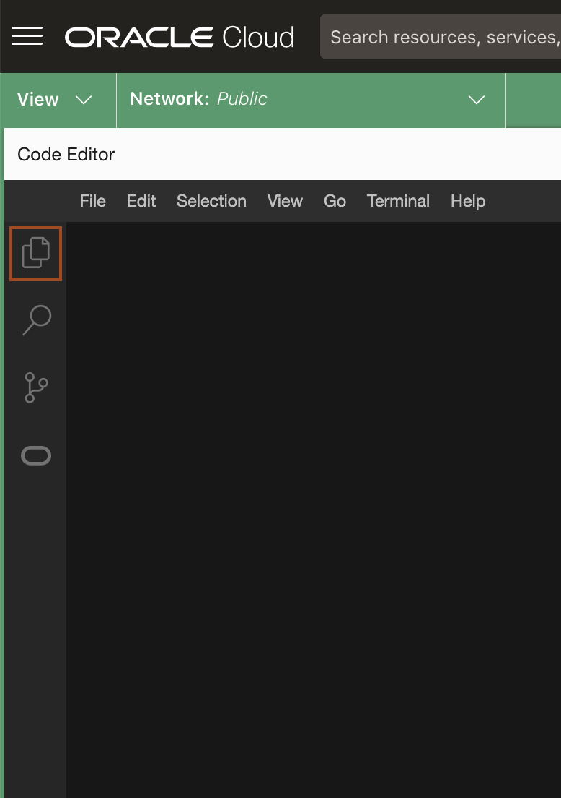
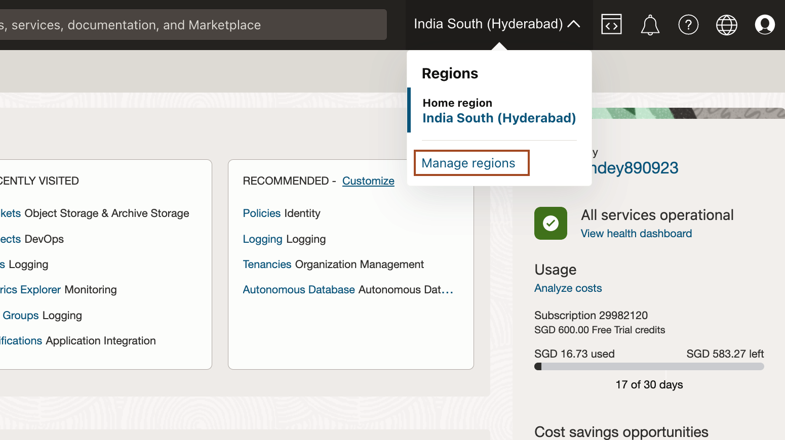
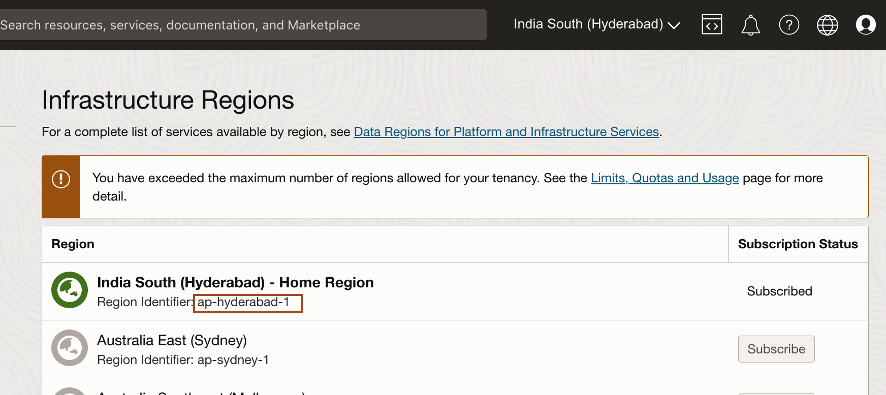

# Provision the Infrastructure

## Introduction

In this lab, you will create a **compartment**, **dynamic groups**, **user group and policies**. Then you will create a **DevOps project** and its related resources using the Terraform service in **OCI Code Editor**.

Estimated time: 10 minutes

### Objectives

In this lab, you will:

* Open Code Editor to download the Terraform script.
* Provision the compartment, dynamic groups, user group and policies.
* Provision the resources required for the DevOps project

### Prerequisites

* An Oracle Free Tier(Trial), Paid or LiveLabs Cloud Account
* Familiarity with compartments, dynamic groups, user groups and policies

## Task 1: Open Code Editor and download the source code

1. In Cloud Console, click the *Developer tools* icon as shown and then click *Code Editor*.


2. Click *Terminal*-> *New Terminal* to open the terminal. During the workshop, you will be asked to open a new terminal. In this way, you can open a new terminal in Code Editor.


3. Copy and paste the following command to the terminal to download the source code. This source code contains the terraform scripts which create the OCI resources required for this workshop. 

    ```bash
    <copy>curl -O https://objectstorage.uk-london-1.oraclecloud.com/p/NkeOirm718ot5bzRl60d38WdF-nGPKFdvl8mqzOaFChts3s6r-X8pq-Qn2ux9A0T/n/lrv4zdykjqrj/b/ankit-bucket/o/devops_helidon_to_instance_ocw_hol.zip
    unzip ~/devops_helidon_to_instance_ocw_hol.zip</copy>
    ```


4. To open the source code *`devops_helidon_to_instance_ocw_hol`* in **Code Editor**, click *File*-> *Open*.


5. Select the *`devops_helidon_to_instance_ocw_hol`* in your home directory and click *Open*.


6. Click the file name *terraform.tfvars* inside the *`devops_helidon_to_instance_ocw_hol`* folder as shown. You can see we have variables **`tenancy_ocid`**, **region**, **`compartment_ocid`**, **`user_ocid`** which we will customize for your trial cloud account. 


> If you don't see the project. You may need to click the *Explorer* icon in Code Editor.


7. In your browser, open a **new tab** for [Cloud Console](https://cloud.oracle.com/). We will use this tab to get the value of the above variables.

8. To get the **`tenancy_ocid`**, Click *User icon* and then click *Tenancy* as shown.


9. Click *Copy* to copy the **OCID** for tenancy and paste it in *terraform.tfvars* file as the value of *`tenancy_ocid`*.


10. To get the **`user_ocid`**, click *User icon* and then click *My profile* as shown.


11. Click *Copy* to copy the **OCID** for the user and paste it in *terraform.tfvars* file as the value of *`user_ocid`*.


12. To find the region name, click **Manage regions** as shown below. Then copy the **Region Identifier** of your home region and paste it in *terraform.tfvars* file as the value of *region*.



13. Finally, your *terraform.tfvars* should look like this. Leave the value of *`compartment_ocid`* as it is. We will replace the value, once the compartment will be created as part of Task 2.


## Task 2: Create a Compartment, Dynamic Groups, User Group and Policies

The goal of this task is to prepare the environment for the DevOps setup by creating a Compartment, Dynamic Group, User Group and policies. This section requires a user with administrator privilege. If you don't have it, make sure to request another user with such privilege to run this for you.

1. In the terminal, copy and paste the following command to navigate to the *init* folder.
    ```bash
    <copy>cd ~/devops_helidon_to_instance_ocw_hol/init/</copy>
    ```

2. In Code Editor, you can view various files in the *init* folder. These are the terraform scripts which create the compartment, dynamic groups, user group and policies.


3. Copy and paste the following commands to provision the compartment, dynamic groups, user group and policies. 
    ```bash
    <copy>terraform init
    terraform plan
    terraform apply -auto-approve</copy>
    ```
    you will see output similar to below. Please **observe the output** to know what the terraform script creates. Also, you can refer the code to see its implementation.
    

    > If there are any errors, check to ensure that you have properly set the values correctly in **terraform.tfvars** file.

## Task 3: Create a DevOps project and its resources

1. In the terminal, copy and paste the following command to navigate to the *main* folder.
    ```bash
    <copy>cd ~/devops_helidon_to_instance_ocw_hol/main/</copy>
    ```

2. Copy and paste the following command to update the **compartment_ocid** of a newly created compartment in  *terraform.tfvars* inside *`devops_helidon_to_instance_ocw_hol`* folder. 
    ```bash
    <copy>../utils/update_compartment.sh</copy>
    ```

3. Copy and paste the following command in the terminal to provision all the DevOps resources.
    ```bash
    <copy>terraform init
    terraform plan
    terraform apply -auto-approve</copy>
    ```

    > **Please Read:-**
    This will provide the following resources required for DevOps:
    * **OCI DevOps Service** 
        * **OCI DevOps Project** that will contain all the DevOps components needed for this project.
        * **OCI Code Repository** that will host the Application source code project.
        * **DevOps Build Pipeline** with the following stages:
            * **Manage Build** - executes steps to download JDK20, maven and building the Helidon application
            * **Deliver Artifacts** - Uploads the built Helidon app and the Deployment to the Artifact Repository
            * **Trigger Deployment** - Triggers the Deployment Pipeline
        * **DevOps Deployment Pipeline** that will perform the following on the target environment:
            * Download JDK20
            * Install OCI CLI and use it to download the Application Deliverable
            * Run the Application
        * **DevOps Instance Group environment** that will be used by the Deployment Pipeline to identify the created OCI Compute Instance as the deployment target.
        * **DevOps Trigger** that will invoke the pipeline lifecycle from start to finish when a push event occurs on the OCI Code Repository.
    * **OCI Artifact Registry**
        * **OCI Artifact Repository** that will host the built Helidon App Binaries and Deployment Manifest as versioned artifacts.
    * **OCI Platform**
        * **OCI Compute Instance** that opens port 8080 from the firewall. This is where the application will be eventually deployed.
    * **OCI Virtual Cloud Network (VCN) with Security List** containing an Ingress that opens port 8080. Port 8080 is where the Helidon application will be accessed from. The OCI VCN will be used by the OCI Compute Instance for its network needs.

4. Diagram below depicts how the DevOps setup will work:
    

5. You will get a similar output as shown below.
    


You may now **proceed to the next lab.**

## Acknowledgements

* **Author** -  Keith Lustria
* **Contributors** - Ankit Pandey, Maciej Gruszka
* **Last Updated By/Date** - Ankit Pandey, May 2023
