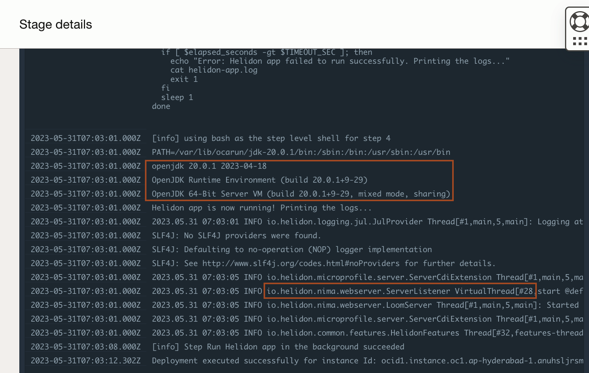
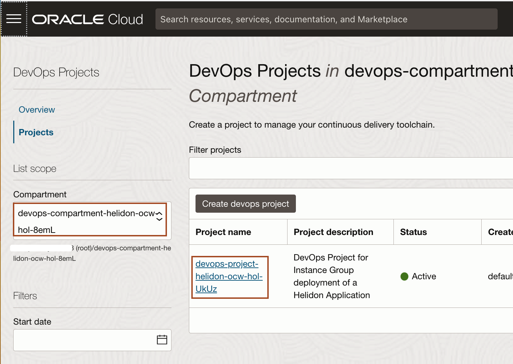
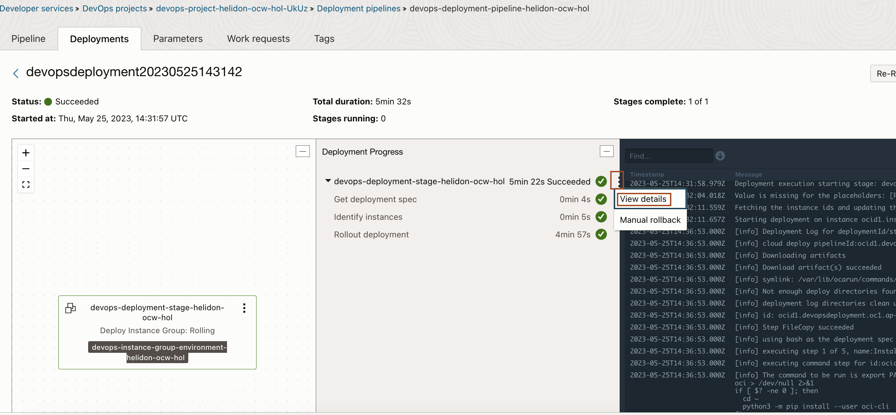
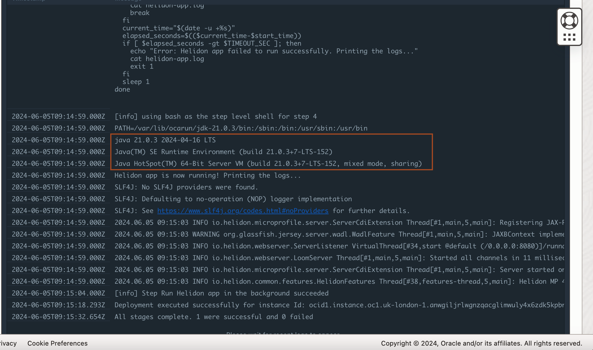

# Simulate a patch scenario

## Introductions

This lab will attempt to simulate a patching scenario. Take a case where the initial environment uses *Open JDK* for testing and eventually moves to use *Oracle JDK* when it is ready for production. The previous build and deployment pipeline already sets *Open JDK 20* as the Java flavour to use. In this lab, it will be replaced with *Oracle JDK 20*.

Estimated time: 10 minutes

Watch the video below for a quick walk-through of the lab.
[Simulate a patch scenario](videohub:1_4pecvhmf)

### Objectives

In this lab, you will:

* Modify the JDK flavour
* Verify the JDK new flavour in the deployment pipeline

### Prerequisites

* An Oracle Free Tier(Trial), Paid or LiveLabs Cloud Account

## Task 1: Change the JDK Installer

1. As we have seen in **Lab 2**, In the previously completed **deployment pipeline log** and observed that near the bottom of the log it was using **Open JDK**.
    

2. In the **Code Editor**, click the file name **`build_spec.yaml`** to open it. Comment out the environment variable **`JDK20_TAR_GZ_INSTALLER`** that sets the URL path to an **Open JDK** installer at line number #15 and uncomment **`JDK20_TAR_GZ_INSTALLER`** that sets the URL path to an **Oracle JDK** installer at line number #16 as shown below. 
    
    
## Task 2: Push the change and trigger the DevOps pipeline

1. Copy and paste the following command in the terminal **to commit and push** the change.
    ```bash
    <copy>git add .
    git status
    git commit -m "Replace OpenJDK 20 with OracleJDK 20"
    git push</copy>
    ```

    > The pipeline will get triggered by this git push.

## Task 3: Verify the JDK new flavor in the Deployment pipeline

1. Open the [Cloud Console](https://cloud.oracle.com/) in new tab, Click *Hamburger menu* -> *Developer Services* -> *Projects* under **DevOps**.
    

2. Select the compartment, which you have created in **Lab 1** and then Click *devops-project-helidon-ocw-hol-string* to open the **DevOps Project**.
    

3. Under **Latest build history**, you will see the **Runs** and Status as **Accepted/In Progress**. Click on the latest Runs as shown below.
    

4. Once the build pipeline **completed all three stages**, you will see output as shown below.
    

5. In Build run progress, In the third stage, click on **Three dots** and then click **View deployment** as shown below. This will open the deployment pipeline. 
    

6. Here you can see **Deployment Progress**. Once you have the deployment pipeline completed, you will see the output as shown below.
    

    > This successfully deploys the Helidon application to Compute instances in OCI.

7. To view the logs of the deployment pipeline, click on **Three dots** near to deployment stage and click **View details** as shown below.
    

8. Scroll down the logs and verify the JDK flavour, It should be **Oracle JDK** as shown below.
    

You may now **proceed to the next lab.**

## Acknowledgements

* **Author** -  Keith Lustria
* **Contributors** - Ankit Pandey, Maciej Gruszka
* **Last Updated By/Date** - Ankit Pandey, May 2023
