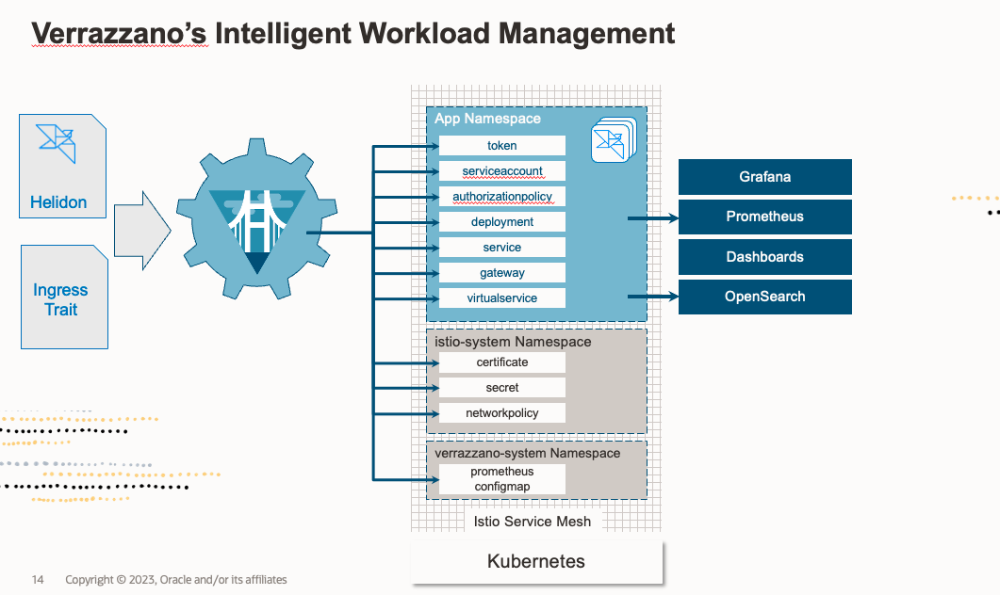

# Deploy Helidon Application on Verrazzano

## Introduction

This lab walks you through the process of deploying the Hello Helidon application.

Estimated Time: 10 minutes

### Verrazzano and Application Deployment

Verrazzano supports application definition using [Open Application Model (OAM)](https://oam.dev/). Verrazzano applications are composed of components and application configurations.

When you deploy applications with Verrazzano, Verrazzano performs intelligent workload managment. The platform sets up connections, and network policies, ingresses in the service mesh, and wires up a monitoring stack to capture the metrics, logs, and traces. Verrazzano employs OAM components to define the functional units of a system that are then assembled and configured by defining associated application configurations.



### Objectives

In this lab, you will:

* Verify the successful installation of the Verrazzano environment.
* Deploy the Hello Helidon application.
* Verify the deployment of the Hello Helidon application.

### Prerequisites

To run this lab, you must have:

* Kubernetes (OKE) cluster running on the Oracle Cloud Infrastructure.
* Verrazzano installation started on a Kubernetes (OKE) cluster.

## Task 1: Verification of a successful Verrazzano installation

Verrazzano installs multiple objects in multiple namespaces. Verrazzano components are installed in the namespace *verrazzano-system*.

1. Please verify that all the pods associated with the multiple objects have a *Running* status.

    ```bash
    <copy>kubectl get pods -n verrazzano-system</copy>
    ```

    The output should be similar to the following:

    ```bash
    $   kubectl get pods -n verrazzano-system
    NAME                                         READY   STATUS RESTARTS AGE
    coherence-operator-b5dc669c6-zm4dw           1/1     Running   1     153m
    fluentd-5s7hh                                2/2     Running   1     144m
    fluentd-bt4t4                                2/2     Running   1     144m
    fluentd-ghmkx                                2/2     Running   1     144m
    oam-kubernetes-runtime-5b48f944b-9bv2v       1/1     Running   0     154m
    verrazzano-application-operator-f976cf96f    1/1     Running   0     152m
    verrazzano-application-operator-webhook      1/1     Running   0     152m
    verrazzano-authproxy-58f8975c5d-jhx72        3/3     Running   0     151m
    verrazzano-cluster-operator-544d494f49       1/1     Running   0     144m
    verrazzano-cluster-operator-webhook-79       1/1     Running   0     144m
    verrazzano-console-6f59f7485d-xrdt8          2/2     Running   0     147m
    verrazzano-monitoring-operator-d88cdd66c     2/2     Running   0     151m
    vmi-system-es-master-0                       2/2     Running   0     151m
    vmi-system-grafana-78cd975dd9-vfjv5          3/3     Running   0     151m
    vmi-system-kiali-57d859dc4b-bnvjh            2/2     Running   0     151m
    vmi-system-osd-7687d6fccf-cjwqr              2/2     Running   0     147m
    weblogic-operator-54979449f4-t9q26           2/2     Running   0     152m
    weblogic-operator-webhook-f7ff8c8cf-nc4r     1/1     Running   0     152m
    ```

## Task 2: Deploy the Hello Helidon application 


1. Create a `hello-helidon` namespace for the Helidon quickstart-mp application. We will keep all Kubernetes artefacts in a separate namespace.

    ```bash
    <copy>kubectl create namespace hello-helidon</copy>
    ```

    >Namespaces are a way to organize clusters into virtual sub-clusters. We can have any number of namespaces within a cluster, each logically separated from others but with the ability to communicate with each other.

2. We need to make Verrazzano aware that we store in that namespace Verrazzano artifacts. So we need to add a label identifying the `hello-helidon` namespace as managed by Verrazzano. Labels are intended to be used to specify identifying attributes of objects that are meaningful and relevant to users.

    Here, for the `hello-helidon` namespace, we are attaching a label to it, which marks this namespace as managed by Verrazzano. The *istio-injection=enabled*, enables an Istio "sidecar", and as such, helps establish an Istio proxy. With an Istio proxy, we can access other Istio services like an Istio gateway. To add the label to the `hello-helidon` namespace with the previously mentioned attributes, copy the following command and run it in the Cloud Shell:

    ```bash
    <copy>kubectl label namespace hello-helidon verrazzano-managed=true istio-injection=enabled</copy>
    ```


3. Now, we want to deploy Hello Helidon containerized application on *cluster1*. For this, we need a Kubernetes deployment configuration. This deployment instructs the Kubernetes to create and update instances for the Hello Helidon application. Here, we have the `hello-helidon-comp.yaml` file, which instructs Kubernetes.

    To deploy the Hello Helidon application, copy and paste the following two commands as shown. The `hello-helidon-comp.yaml` file contains definitions of various OAM components, where, an OAM component is a Kubernetes Custom Resource describing an application’s general composition and environment requirements.
    ```bash
    <copy>kubectl apply -f https://raw.githubusercontent.com/verrazzano/verrazzano/v1.5.1/examples/hello-helidon/hello-helidon-comp.yaml -n hello-helidon</copy>
    ```
    The `hello-helidon-app.yaml` file is a Verrazzano application configuration file, which provides environment-specific customizations.
    ```bash
    <copy>kubectl apply -f https://raw.githubusercontent.com/verrazzano/verrazzano/v1.5.1/examples/hello-helidon/hello-helidon-app.yaml -n hello-helidon</copy>
    ```

4. Wait for the pods to be in *Running* status. Use this *kubectl* command to wait for all the pods to be in the *Running* state within the hello-helidon namespace. It takes around 1-2 minutes.

    ```bash
    <copy>kubectl wait --for=condition=Ready pods --all -n hello-helidon --timeout=600s</copy>
    ```

    When the pods are ready you can see a similar response:

    ```bash
    $ kubectl wait --for=condition=Ready pods --all -n hello-helidon --timeout=600s
    pod/hello-helidon-deployment-58fdd5cd4-94wjf condition met
    ```
    You can also list the pods directly to check their status:

    ```bash
    $ kubectl  get po -n hello-helidon
    NAME                                       READY   STATUS    RESTARTS   AGE
    hello-helidon-deployment-58fdd5cd4-94wjf   2/2     Running   0          34m
    ```


## Task 3: Verify the Successful Deployment of the Hello Helidon Application

1. Verify the `/greet` endpoint. To determine the URL that was constructed from the external/load balancer IP and application configuration, execute the following command:

    ```bash
    <copy>echo https://$(kubectl get gateways.networking.istio.io hello-helidon-hello-helidon-gw -n hello-helidon -o jsonpath={.spec.servers[0].hosts[0]})/greet</copy>
    ```

    This will print the proper URL to your REST endpoint, for example:

    ```bash
    https://hello-helidon.hello-helidon.xx.xx.xx.xx.nip.io/greet
    ```

2. Use this link to test from your browser. Due to self-signed certificates, however, you need to accept risk and allow the browser to continue the request processing.

    You may find it easier to use `curl` because the response is only a string:

    ```bash
    <copy>curl -k https://$(kubectl get gateways.networking.istio.io hello-helidon-hello-helidon-gw -n hello-helidon -o jsonpath={.spec.servers[0].hosts[0]})/greet; echo</copy>
    ```

    You should see the same result you received during the development:


    ```yaml
    {"message":"Hello World!"}
    ```

3. Leave the *Cloud Shell* open; we will use it for the next lab.

## Learn More about Open Application Model
**Verrazzano components**

A Verrazzano OAM component is a [Kubernetes Custom Resource](https://kubernetes.io/docs/concepts/extend-kubernetes/api-extension/custom-resources/) describing an application’s general composition and environment requirements.

The following code shows a simple Helidon application component for Hello Helidon application used in this lab. This resource describes a component which is implemented by a single Docker image containing a Helidon application exposing a single endpoint.

```yaml
apiVersion: core.oam.dev/v1alpha2
kind: Component
metadata:
  name: hello-helidon-component
spec:
  workload:
    apiVersion: oam.verrazzano.io/v1alpha1
    kind: VerrazzanoHelidonWorkload
    metadata:
      name: hello-helidon-workload
      labels:
        app: hello-helidon
        version: v1
    spec:
      deploymentTemplate:
        metadata:
          name: hello-helidon-deployment
        podSpec:
          containers:
            - name: hello-helidon-container
              image: "ghcr.io/verrazzano/example-helidon-greet-app-v1:1.0.0-1-20230126194830-31cd41f"
              ports:
                - containerPort: 8080
                  name: http
```

A brief description of each field of the component:

* **apiVersion** - Version of the component custom resource definition
* **kind** - Standard name of the component custom resource definition
* **metadata.name** - The name used to create the component’s custom resource
* **metadata.namespace** - The namespace used to create this component’s custom resource
* **spec.workload.kind** - VerrazzanoHelidonWorkload defines a stateless workload of Kubernetes
* **spec.workload.spec.deploymentTemplate.podSpec.metadata.name** - The name used to create the stateless workload of Kubernetes
* **spec.workload.spec.deploymentTemplate.podSpec.containers** - The implementation containers
* **spec.workload.spec.deploymentTemplate.podSpec.containers.ports** - Ports exposed by the container

**Verrazzano Application Configurations**

A Verrazzano application configuration is a Kubernetes Custom Resource which provides environment-specific customizations. The following code shows the application configuration for the Helidon *quickstart-mp* example used in this lab. This resource specifies the deployment of the application to the hello-helidon namespace.

Additional runtime features are specified using traits, or runtime overlays that augment the workload. For example, the ingress trait specifies the ingress host and path, while the metrics trait provides the Prometheus scraper used to obtain the application-related metrics.

```yaml
apiVersion: core.oam.dev/v1alpha2
kind: ApplicationConfiguration
metadata:
  name: hello-helidon
  annotations:
    version: v1.0.0
    description: "Hello Helidon application"
spec:
  components:
    - componentName: hello-helidon-component
      traits:
        - trait:
            apiVersion: oam.verrazzano.io/v1alpha1
            kind: MetricsTrait
            spec:
                scraper: verrazzano-system/vmi-system-prometheus-0
        - trait:
            apiVersion: oam.verrazzano.io/v1alpha1
            kind: IngressTrait
            metadata:
              name: hello-helidon-ingress
            spec:
              rules:
                - paths:
                    - path: "/greet"
                      pathType: Prefix
```

A brief description of each field in the application configuration:

* **apiVersion** - Version of the ApplicationConfiguration custom resource definition
* **kind** - Standard name of the application configuration custom resource definition
* **metadata.name** - The name used to create this application configuration resource
* **metadata.namespace** - The namespace used for this application configuration custom resource
* **spec.components** - Reference to the application’s components leveraged to specify runtime configuration
* **spec.components[].traits** - The traits specified for the application’s components

To explore traits, we can examine the fields of an ingress trait:

* **apiVersion** - Version of the OAM trait custom resource definition
* **kind** - IngressTrait is the name of the OAM application ingress trait custom resource definition
* **spec.rules.paths** - The context paths for accessing the application


## Acknowledgements

* **Author** -  Ankit Pandey
* **Contributors** - Maciej Gruszka, Sid Joshi
* **Last Updated By/Date** - Ankit Pandey, March 2023
