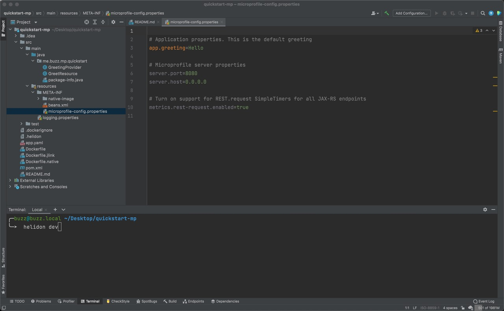
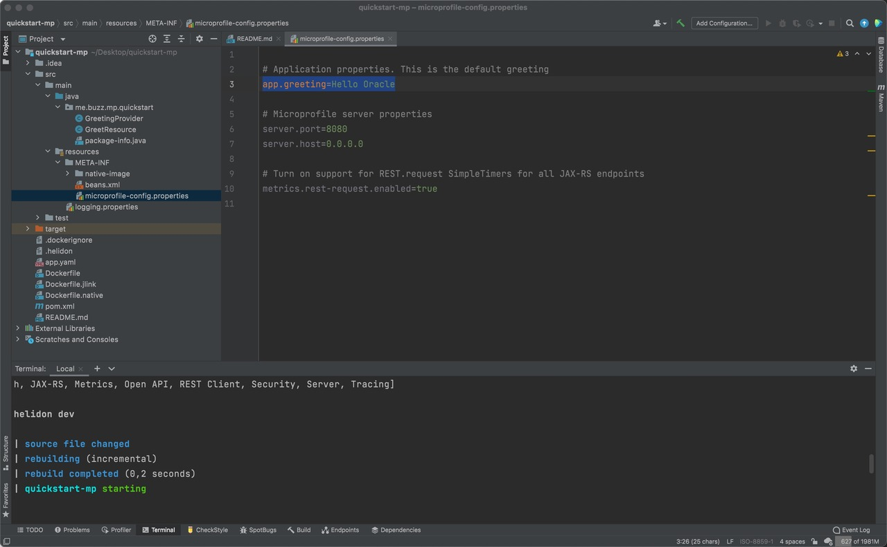

# Develop Helidon Application

## Introduction

This lab walks you through the steps to create a Helidon MP application.

Estimated Time: 15 minutes

### About Product/Technology

Helidon is designed to be simple to use, with tooling and examples to get you going quickly. Since Helidon is just a collection of libraries running on a fast Netty core, there is no extra overhead or bloat. Helidon supports MicroProfile and provides familiar APIs like JAX-RS, CDI and JSON-P/B. Our MicroProfile implementation runs on our fast Helidon Reactive WebServer. The Reactive WebServer provides a modern, functional, programming model and runs on top of Netty. Lightweight, flexible and reactive, the Helidon WebServer provides a simple to use and fast foundation for your microservices.

With support for health checks, metrics, tracing and fault tolerance, Helidon has what you need to write cloud-ready applications that integrate with Prometheus, Jaeger/Zipkin and Kubernetes.

### About Helidon CLI

The Helidon CLI lets you easily create a Helidon project by picking from a set of archetypes. It also supports a developer loop that performs continuous compilation and application restart, so you can easily iterate over source code changes.

The CLI is distributed as a standalone executable (compiled using GraalVM) for ease of installation. It is currently available as a download for Linux, Mac and Windows. Simply download the binary, install it at a location accessible from your PATH and you’re ready to go.

### Objectives
* Install the Helidon CLI
* Create a MicroProfile supported microservice called Helidon Greeting
* Run and exercise the Helidon Greeting app
* View health and metrics data
* Add new functionality to the app

### Prerequisites

* Helidon requires Java 11+
* Maven 3.6.x
> **Caution: Do not use the 3.8.x version due to known issue with application build!**

* Java and `mvn` are in your path.
* Windows users will also need the Visual C++ Redistributable Runtime. <br>
See [Helidon on Windows](https://helidon.io/docs/v2/#/about/04_windows) for more information.

## Task 1: Install the Helidon CLI
1. Install Helidon CLI

    For MacOS:
    ```bash
    <copy>
    curl -O https://helidon.io/cli/latest/darwin/helidon
    chmod +x ./helidon
    sudo mv ./helidon /usr/local/bin/
    </copy>
    ```

    For Linux:
    ```bash
    <copy>
    curl -O https://helidon.io/cli/latest/linux/helidon
    chmod +x ./helidon
    sudo mv ./helidon /usr/local/bin/
    </copy>
    ```

    For Windows:
    ```PowerShell
    <copy>
    PowerShell -Command Invoke-WebRequest -Uri "https://helidon.io/cli/latest/windows/helidon.exe" -OutFile "C:\Windows\system32\helidon.exe"
    </copy>
    ```


## Task 2: Create Helidon Greeting Application
1. In your console enter:
    ```bash
    <copy>helidon init --version 2.4.1 </copy>
    ```
    > To avoid any potential issues, define the specific Helidon version that was tested for this lab's environment.

2. For this demo we will create a MicroProfile supported microservice, so choose option **(2)** for **Helidon MP Flavor**:

    ```bash
    Using Helidon version 2.4.1
    Helidon flavor
    (1) SE 
    (2) MP 
    Enter selection (Default: 1): 2
    ```

3. For the most functionality, choose option **(2) quickstart** then **Enter** for the default answers. Note that you can have different default package and project group names because it uses the OS user name. Notedown the package name, you will need to use it while creating new Java class.

    ```bash
    Select archetype
    (1) bare | Minimal Helidon MP project suitable to start from scratch 
    (2) quickstart | Sample Helidon MP project that includes multiple REST operations 
    (3) database | Helidon MP application that uses JPA with an in-memory H2 database 
    Enter selection (Default: 1): 2
    Project name (Default: quickstart-mp): 
    Project groupId (Default: me.user-helidon): 
    Project artifactId (Default: quickstart-mp): 
    Project version (Default: 1.0-SNAPSHOT): 
    Java package name (Default: me.user_name.mp.quickstart): 
    Switch directory to /home/user/quickstart-mp to use CLI

    Start development loop? (Default: n):
    $
    ```

    >For the **development loop** accept the default (**n**) for now. You will start the development loop later in this lab.

    You now have a fully functional Microservice Maven Project:

```bash
    quickstart-mp
    ├── Dockerfile
    ├── Dockerfile.jlink
    ├── Dockerfile.native
    ├── README.md
    ├── app.yaml
    ├── pom.xml
    └── src
        ├── main
        │   ├── java
        │   │   └── me
        │   │       └── buzz
        │   │           └── mp
        │   │               └── quickstart
        │   │                   ├── GreetResource.java
        │   │                   ├── GreetingProvider.java
        │   │                   └── package-info.java
        │   └── resources
        │       ├── META-INF
        │       │   ├── beans.xml
        │       │   ├── microprofile-config.properties
        │       │   └── native-image
        │       │       └── reflect-config.json
        │       └── logging.properties
        └── test
            └── java
                └── me
                    └── buzz
                        └── mp
                            └── quickstart
                                └── MainTest.java

```

## Task 3: Run the Helidon Greeting Application
1. From the same console/terminal, navigate to the quickstart-mp directory and run the following commands:

    ```bash
    <copy> cd quickstart-mp
    </copy>
    ```


2. With JDK11+

    ```bash
    <copy>
    mvn package
    java -jar target/quickstart-mp.jar
    </copy>
    ```

### Exercise the Application

1. Open a new terminal/console and run the following commands to check the application:

    ```bash
    <copy>
    curl -X GET http://localhost:8080/greet
    </copy>
    {"message":"Hello World!"}
    ```

    ```bash
    <copy>
    curl -X GET http://localhost:8080/greet/Joe
    </copy>
    {"message":"Hello Joe!"}
    ```

    ```bash
    <copy>
    curl -X PUT -H "Content-Type: application/json" -d '{"greeting" : "Hola"}' http://localhost:8080/greet/greeting
    </copy>
    ```

    ```bash
    <copy>
    curl -X GET http://localhost:8080/greet/Jose
    </copy>
    {"message":"Hola Jose!"}
    ```

### Review Health and Metrics Data

1. In the same terminal/console, run the following commands to check health and metrics:

    ```bash
    <copy>
    curl -s -X GET http://localhost:8080/health
    </copy>
    {"outcome":"UP",...
    . . .
    ```

    ```bash
    # Prometheus Format
    <copy>
    curl -s -X GET http://localhost:8080/metrics
    </copy>
    # TYPE base:gc_g1_young_generation_count gauge
    . . .
    ```
    ```bash
    # JSON Format
    <copy>
    curl -H 'Accept: application/json' -X GET http://localhost:8080/metrics
    </copy>
    {"base":...
    . . .
    ```

2. Stop the *quickstart-mp* application by entering `Ctrl + C` in the terminal where the "java -jar target/quickstart-mp.jar" command is running.

## Task 4: Modify the Application

1. Open your favorite IDE and navigate to the **microprofile-config.properties** file.

    

2. In the console/terminal, navigate to the project folder and enter:

    ```bash
    <copy>helidon dev</copy>
    ```

    >This will start the **Development loop** mentioned in the previous task.

3. Change the property *app.greeting* to "Hello Oracle" and save the file.

    ```properties
    <copy>app.greeting=Hello Oracle</copy>
    ```

    

    >You will see that whenever you change a file, the **Helidon CLI** recognizes there is a change, recompiles the app, and reruns it. Since Helidon is small, everything happens quickly.

4. In the console/terminal, enter the following:

    ```bash
    <copy>curl -X GET http://localhost:8080/greet</copy>
    ```

    The result is expected to be:

    ```json
    {"message":"Hello Oracle World!"}
    ```

    > Be sure to stop the development loop with `CTRL+C`

5. Go back to your project folder and open the **GreetResource.java** file.

    >You can see that it is pure MicroProfile compatible code:

    

6. Create a new endpoint that provides help for different greetings in different languages. To create this new functionality, create a new class called **GreetHelpResource** with the following code:

    ```java
    <copy>
    package me.user_name.me.quickstart;
    import java.util.Arrays;
    import java.util.List;
    import java.util.logging.Logger;

    import javax.enterprise.context.ApplicationScoped;
    import javax.ws.rs.GET;
    import javax.ws.rs.Path;

    import org.eclipse.microprofile.metrics.annotation.Counted;

    @ApplicationScoped
    @Path("/help")
    public class GreetHelpResource {

        Logger LOGGER = Logger.getLogger(GreetHelpResource.class.getName());

        @GET
        @Path("/allGreetings")
        @Counted(name = "helpCalled", description = "How many time help was called")
        public String getAllGreetings(){
            LOGGER.info("Help requested!");
            return Arrays.toString(List.of("Hello","Привет","Hola","Hallo","Ciao","Nǐ hǎo", "Marhaba","Olá").toArray());
        }
    }
    </copy>
    ```

    >The class has only one method *getAllGreetings* which returns a list with greetings in different languages. While copying the code, be sure to add the necessary package name on top of class.

7. Build and run the application:

    ```bash
    <copy>
    mvn package -DskipTests
    java -jar target/quickstart-mp.jar
    </copy>
    ```

8. Execute the following command and notice the results:

    ```bash
    <copy>curl http://localhost:8080/help/allGreetings</copy>
    ```
    The expected result:
    ```bash
    [Hello, Привет, Hola, Hallo, Ciao, Nǐ hǎo, Marhaba, Olá]
    ```

9. Look at the metrics and you will see that a new counter appeared. Whenever this endpoint is called the value will increment:

    ```bash
    curl http://localhost:8080/metrics

    ...
    # TYPE application_me_buzz_mp_quickstart_GreetHelpResource_helpCalled_total counter
    # HELP application_me_buzz_mp_quickstart_GreetHelpResource_helpCalled_total How many time help was called
    application_me_buzz_mp_quickstart_GreetHelpResource_helpCalled_total 1
    ...
    ```


10. In the console you will now see the INFO log line about this call:

    ```bash
    INFO me.buzz.mp.quickstart.GreetHelpResource Thread[helidon-4,5,server]: Help requested!
    ```

    And the new endpoint has been added.

    

    >Working with Helidon and its tooling is really easy and fast!

11. Leave your terminal/console open and continue with Verrazzano installation lab.

## Acknowledgements

* **Author** -  Dmitry Aleksandrov
* **Contributors** - Maciej Gruszka, Peter Nagy
* **Last Updated By/Date** - Ankit Pandey, April 2022
