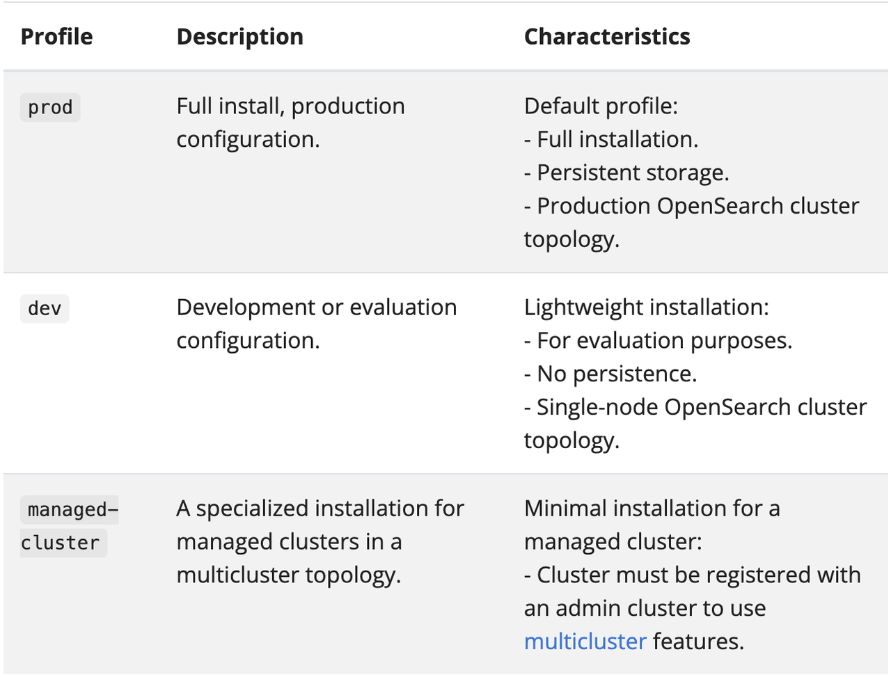
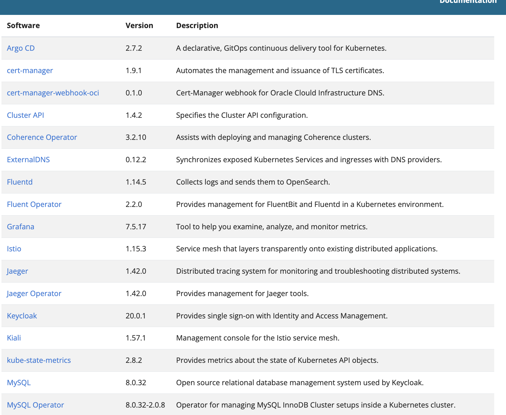
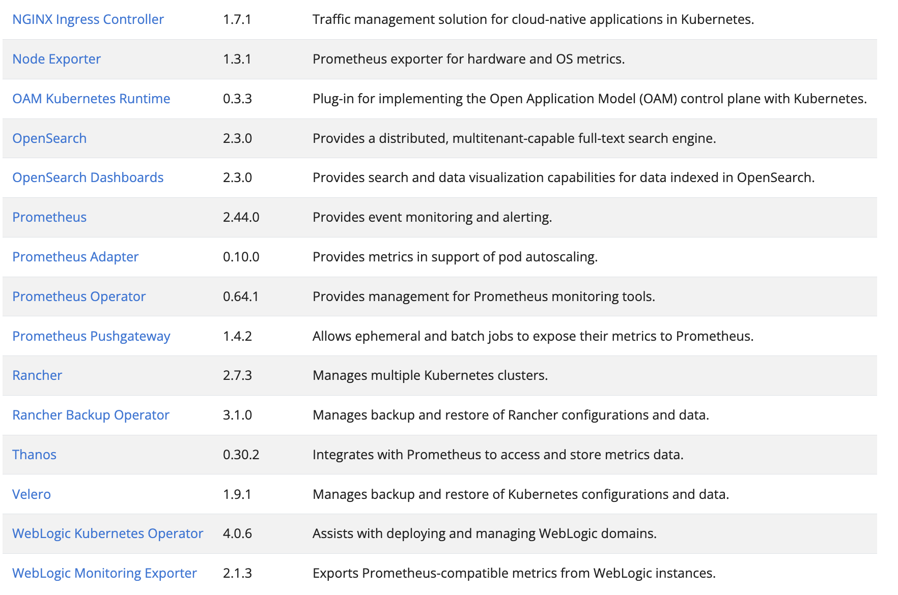
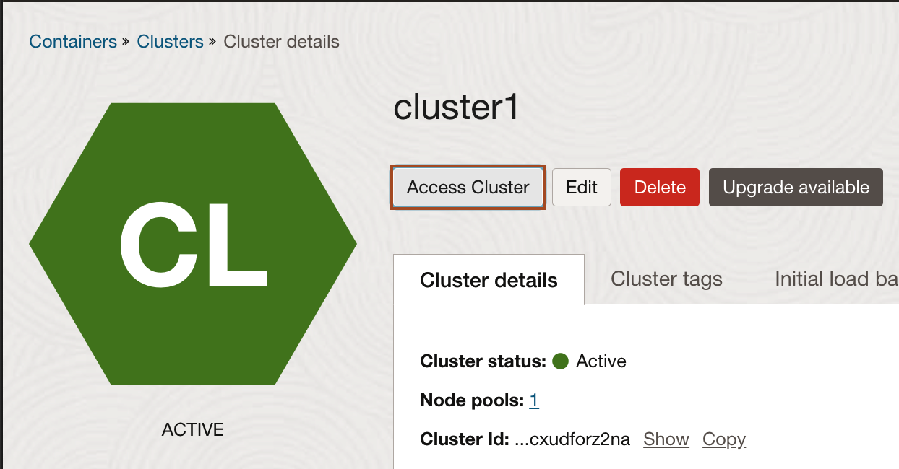
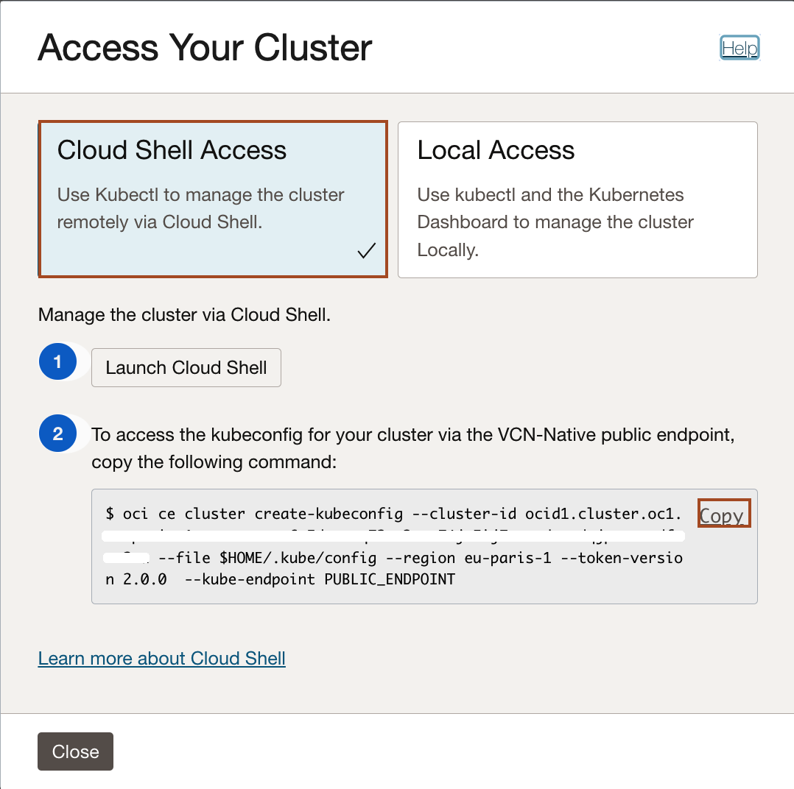
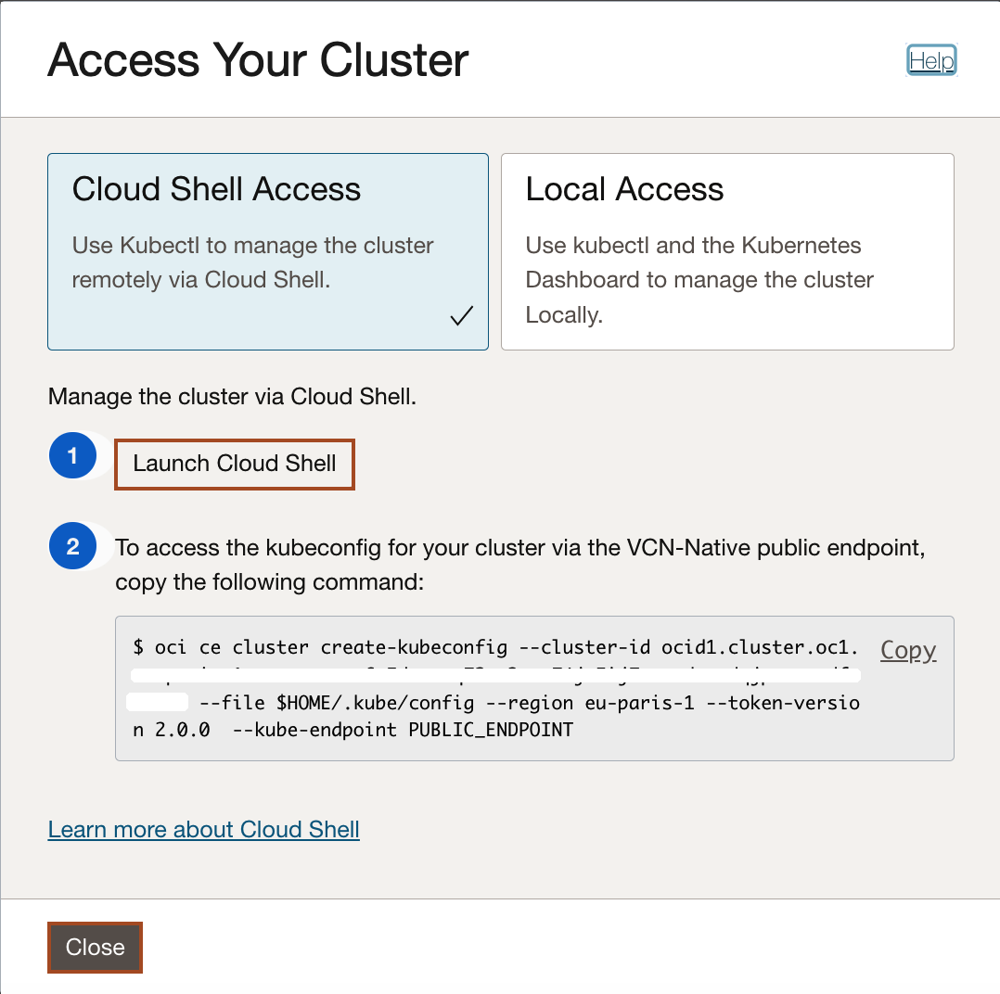
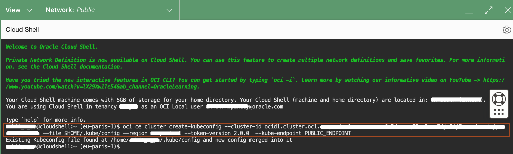

# Install Verrazzano

## Introduction

This lab walks you through the steps to install Verrazzano on a Kubernetes cluster in the Oracle Cloud Infrastructure.

Estimated Time: 15 minutes

### About Product/Technology

Verrazzano is an end-to-end enterprise container platform for deploying cloud-native and traditional applications in multi-cloud and hybrid environments. It is made up of a curated set of open source components – many that you may already use and trust, and some that were written specifically to pull together all of the pieces that make Verrazzano a cohesive and easy-to-use platform.


Verrazzano includes the following capabilities:

* Hybrid and multicluster workload management
* Special handling for WebLogic, Coherence, and Helidon applications
* Multicluster infrastructure management
* Integrated and pre-wired application monitoring
* Integrated security
* DevOps and GitOps enablement

Verrazzano supports the following installation profiles: development (`dev`), production (`prod`), and managed cluster (`managed-cluster`).

The following image describes the Verrazzano installation profiles.


To change profiles in any of the following commands, set the *VZ_PROFILE* environment variable to the name of the profile you want to install.

For a complete description of Verrazzano configuration options, see the [Verrazzano Custom Resource Definition](https://verrazzano.io/docs/reference/api/verrazzano/verrazzano/).

In this lab, we are going to install the *development profile of Verrazzano*, which has the following characteristics:
* Wildcard (nip.io) DNS
* Self-signed certificates
* Shared observability stack used by the system components and all applications
* Ephemeral storage for the observability stack (if the pods are restarted, you lose all of your logs and metrics)
* It has a lightweight installation.
* It is for evaluation purposes.
* Single-node Opensearch cluster topology.

Verrazzano installs a curated set of open source components. The following table lists each component, its version, and a brief description.




According to our DNS choice, we can use nip.io (wildcard DNS) or [Oracle OCI DNS](https://docs.cloud.oracle.com/en-us/iaas/Content/DNS/Concepts/dnszonemanagement.htm). In this lab, we are going to install using nip.io (wildcard DNS).

An ingress controller is something that helps provide access to Docker containers to the outside world (by providing an IP address). The ingress routes the IP address to different clusters.
### Objectives

In this lab, you will:

* Setup `kubectl` to use the Oracle Kubernetes Engine cluster
* Install the Verrazzano vz CLI.
* Install the development (`dev`) profile of Verrazzano.

### Prerequisites

Verrazzano requires the following:

* A Kubernetes cluster and a compatible `kubectl`.
* At least 2 CPUs, 100GB disk storage, and 16GB RAM available on the Kubernetes worker nodes. This is sufficient to install the development profile of Verrazzano. Depending on the resource requirements of the applications you deploy, this may or may not be sufficient for deploying your applications.
* In Lab 1, you created a Kubernetes cluster on the Oracle Cloud Infrastructure. You will use that Kubernetes cluster, *cluster1*, for installing the development profile of Verrazzano.

## Task 1: Configure `kubectl` (Kubernetes Cluster CLI)


Oracle Cloud Infrastructure (OCI) Cloud Shell is a web browser-based terminal, accessible from the Oracle Cloud Console. The Cloud Shell provides access to a Linux shell, with a pre-authenticated Oracle Cloud Infrastructure CLI and other useful tools (*Git, kubectl, helm, OCI CLI*) to complete the Verrazzano tutorials. The Cloud Shell is accessible from the Console. Your Cloud Shell will appear in the Oracle Cloud Console as a persistent frame of the Console, and will stay active as you navigate to different pages of the Console.

You will use the *Cloud Shell* to complete this workshop.

We will use `kubectl` to manage the cluster remotely using the Cloud Shell. It needs a `kubeconfig` file. This will be generated using the OCI CLI which is pre-authenticated, so there’s no setup to do before you can start using it.

1. Click *Access Cluster* on your cluster detail page.

    > If you moved away from that page, then open the navigation menu and under *Developer Services*, select *Kubernetes Clusters (OKE)*. Select your cluster and go the detail page.

    

    > A dialog is displayed from which you can open the Cloud Shell and contains the customized OCI command that you need to run, to create a Kubernetes configuration file.

2. Leave the default *Cloud Shell Access* and first select the *Copy* link to copy the `oci ce...` command to the Cloud Shell.

    

3. Now, click *Launch Cloud Shell* to open the built in console. Then close the configuration dialog before you paste the command into the *Cloud Shell*.

    

4. Copy the command from the clipboard (Ctrl+V or right click and copy) into the Cloud Shell and run the command.

    For example, the command looks like the following:

    ```bash
    oci ce cluster create-kubeconfig --cluster-id ocid1.cluster.oc1.phx.aaaaaaaaaezwen..................zjwgm2tqnjvgc2dey3emnsd --file $HOME/.kube/config --region us-phoenix-1 --token-version 2.0.0
    ```

    

5. Now check that `kubectl` is working, for example, using the `get node` command. you may need to run this command several times until you see the output similar to following.

    ```bash
    <copy>kubectl get node</copy>
    ```

    ```bash
    $ kubectl get node
    NAME          STATUS   ROLES   AGE   VERSION
    10.0.10.101   Ready    node    11m   v1.26.2
    10.0.10.29    Ready    node    11m   v1.26.2
    10.0.10.37    Ready    node    11m   v1.26.2
    ```

    > If you see the node's information, then the configuration was successful.


## Task 2: Install the Verrazzano CLI


1. Download the latest vz CLI.

    ```bash
    <copy>curl -LO https://github.com/verrazzano/verrazzano/releases/download/v1.6.0/verrazzano-1.6.0-linux-amd64.tar.gz</copy>
    ```
    The output should be similar to the following:
    ```bash
    % Total    % Received % Xferd  Average Speed   Time    Time     Time  Current
                                 Dload  Upload   Total   Spent    Left  Speed
  0     0    0     0    0     0      0      0 --:--:-- --:--:-- --:--:--     0
100 39.7M  100 39.7M    0     0  23.6M      0  0:00:01  0:00:01 --:--:-- 32.7M
    ```

2. Download the checksum file.

    ```bash
    <copy>curl -LO https://github.com/verrazzano/verrazzano/releases/download/v1.6.0/verrazzano-1.6.0-linux-amd64.tar.gz.sha256</copy>
    ```

  The output should be similar to the following:

    ```bash
    % Total    % Received % Xferd  Average Speed   Time    Time     Time  Current
                                 Dload  Upload   Total   Spent    Left  Speed
  0     0    0     0    0     0      0      0 --:--:-- --:--:-- --:--:--     0
100   102  100   102    0     0    218      0 --:--:-- --:--:-- --:--:--   218
    ```

3. Validate the binary against the checksum file.

    ```bash
    <copy>sha256sum -c verrazzano-1.6.0-linux-amd64.tar.gz.sha256</copy>
    ```

    The output should be similar to the following:
    ```bash
    verrazzano-1.6.0-linux-amd64.tar.gz: OK
    ```

4. Unpack and move to the vz binary directory,

    ```bash
    <copy>tar xvf verrazzano-1.6.0-linux-amd64.tar.gz
    cd ~/verrazzano-1.6.0/bin/</copy>
    ```

5. Test to ensure that the version you installed is up-to-date.

    ```bash
    <copy>./vz version</copy>
    ```

    The output should be similar to the following:
    ```bash
    Version: v1.6.0
    BuildDate: 2023-06-27T01:27:54Z
    GitCommit: c04ecd4313e66cd6b0ed53f1e3dcf9a7d792f139
    ```


## Task 3: Installation of the Verrazzano development profile

An installation profile is a well-known configuration of Verrazzano settings that can be referenced by name, which can then be customized as needed.

Verrazzano supports the following installation profiles: development (`dev`), production (`prod`), and managed cluster (`managed-cluster`).

1. Install using the nip.io DNS Method. Copy the following command and paste it in the *Cloud Shell* to install Verrazzano.

    ```bash
    <copy>./vz install -f - <<EOF
    apiVersion: install.verrazzano.io/v1beta1
    kind: Verrazzano
    metadata:
      name: example-verrazzano
    spec:
      profile: dev
    EOF
    </copy>
    ```

    The output should be similar to the following:
    ```bash
    Installing Verrazzano version v1.6.0
    Applying the file https://github.com/verrazzano/verrazzano/releases/download/v1.6.0/verrazzano-platform-operator.yaml
    customresourcedefinition.apiextensions.k8s.io/verrazzanos.install.verrazzano.io created
    namespace/verrazzano-install created
    serviceaccount/verrazzano-platform-operator created
    clusterrole.rbac.authorization.k8s.io/verrazzano-managed-cluster created
    clusterrolebinding.rbac.authorization.k8s.io/verrazzano-platform-operator created
    service/verrazzano-platform-operator created
    service/verrazzano-platform-operator-webhook created
    deployment.apps/verrazzano-platform-operator created
    deployment.apps/verrazzano-platform-operator-webhook created
    mutatingwebhookconfiguration.admissionregistration.k8s.io/verrazzano-mysql-backup created
    validatingwebhookconfiguration.admissionregistration.k8s.io/verrazzano-platform-operator-webhook created
    validatingwebhookconfiguration.admissionregistration.k8s.io/verrazzano-platform-mysqlinstalloverrides created
    validatingwebhookconfiguration.admissionregistration.k8s.io/verrazzano-platform-requirements-validator created
    Waiting for verrazzano-platform-operator to be ready before starting install - 23 seconds
    ```

    > It takes around 15 to 20 minutes to complete the installation. This command installs the Verrazzano platform operator and applies the Verrazzano custom resource. Installation logs will be streamed to the command window until the installation has completed or until the default timeout (30m) has been reached.

2. Leave the *Cloud Shell* open and let the installation run.

## Acknowledgements

* **Author** -  Ankit Pandey
* **Contributors** - Maciej Gruszka, Sid Joshi
* **Last Updated By/Date** - Ankit Pandey, March 2023