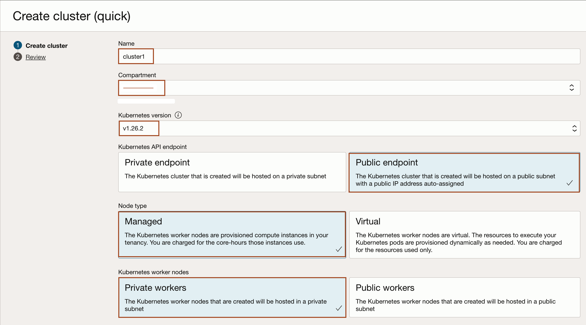
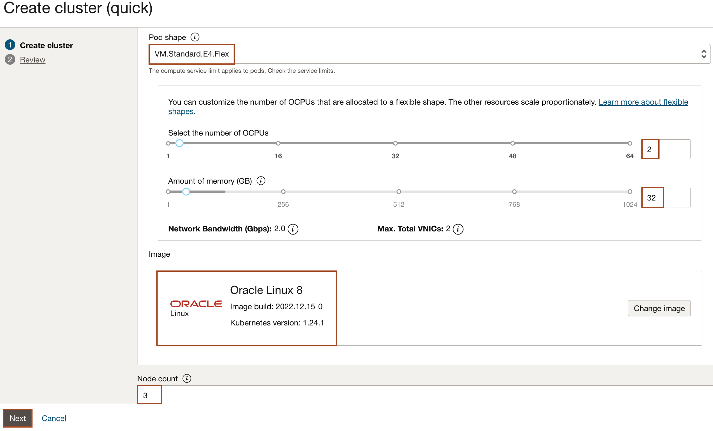
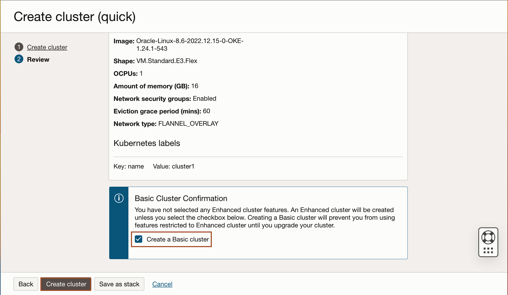

# Set up an Oracle Kubernetes Engine instance on the Oracle Cloud Infrastructure

## Introduction

In this lab, you will create a 3-node Kubernetes cluster configured with all of the necessary network resources. The nodes will be deployed in different fault domains to ensure high availability.

For more information about OKE and custom cluster deployment, see the [Oracle Kubernetes Engine](https://docs.cloud.oracle.com/iaas/Content/ContEng/Concepts/contengoverview.htm) documentation.

Estimated Time: 15 minutes

### About Product/Technology

Oracle Cloud Infrastructure Container Engine for Kubernetes is a fully-managed, scalable, and highly available service that you can use to deploy your container applications to the cloud. Use the Container Engine for Kubernetes (sometimes abbreviated OKE) when your development team wants to reliably build, deploy, and manage cloud-native applications. You specify the compute resources that your applications require, and OKE provisions them on the Oracle Cloud Infrastructure in an existing OCI tenancy.

### Objectives

You will use the *Quick Create* cluster feature to create an OKE (Oracle Kubernetes Engine) instance with the required network resources, a node pool, and three worker nodes. The *Quick Create* approach is the fastest way to create a new cluster. If you accept all the default values, you can create a new cluster in just a few clicks.

### Prerequisites

* You must have an [Oracle Cloud Infrastructure](https://cloud.oracle.com/en_US/cloud-infrastructure) enabled account.

## Task 1: Create an OKE cluster

The *Quick Create* feature uses the default settings to create a *quick cluster* with new network resources as required. This approach is the fastest way to create a new cluster. If you accept all the default values, you can create a new cluster in just a few clicks. New network resources for the cluster are created automatically, along with a node pool and three worker nodes.

1. In the Console, select the *Hamburger Menu -> Developer Services -> Kubernetes Clusters (OKE)* as shown.

    

2. In the Cluster List page, select the Compartment of your choice, where you are allowed to create a cluster, and then click *Create Cluster*.

    > You need to select a compartment in which you are allowed to create a cluster and also, a repository inside the Oracle Container Registry.

    

3. In the Create Cluster Solution dialog, select *Quick Create* and click *Submit*.

    

    *Quick Create* will create a new cluster with the default settings, along with new network resources for the new cluster.

    Specify the following configuration details on the Cluster Creation page (please pay attention to the value you place in the *Shape* field):

    * **Name**: The name of the cluster. Leave the default value.
    * **Compartment**: The name of the compartment. Leave the default value.
    * **Kubernetes version**: The version of Kubernetes. Select *1.24.1* as Kubernetes version.
    * **Kubernetes API Endpoint**: Are the cluster master nodes going to be routable or not. Select the *Public Endpoint* value.
    * **Kubernetes Worker Nodes**: Are the cluster worker nodes going to be routable or not. Leave the default *Private Workers* value.
    * **Shape**: The shape to use for each node in the node pool. The shape determines the number of CPUs and the amount of memory allocated to each node. The list shows only those shapes available in your tenancy that are supported by OKE. Select *VM.Standard.E4.Flex* (which is typically available in Oracle Free Tier Account). Select the 2 OCPUs and 32 GB as Amount of Memory.
    * **Image**: Select the default image with Kubernetes version *1.24.1*.
    * **Number of nodes**: The number of worker nodes to create. Leave the default value, *3*.

    > *PLEASE BE VERY CAREFUL TO NOT LEAVE THE DEFAULT SHAPE; THE DEFAULT SHAPE IS TOO SMALL TO FIT ALL THE VERRAZZANO COMPONENTS*

    

4. Click *Next* to review the details you entered for the new cluster.

    

5. On the Review page, select the check box for *Create a Basic cluster* and then click *Create cluster* to create the new network resources and the new cluster.

    

    > You see the network resources being created for you. Wait until the request to create the node pool is initiated and then click *Close*.

    

    > Then, the new cluster is shown on the *Cluster Details* page. When the master nodes are created, the new cluster gains a status of *Active* (it takes about 7 minutes). You don't need to wait, you may proceed with lab 2.

    

    

## Acknowledgements

* **Author** -  Ankit Pandey
* **Contributors** - Maciej Gruszka, Sid Joshi
* **Last Updated By/Date** - Ankit Pandey, March 2023
