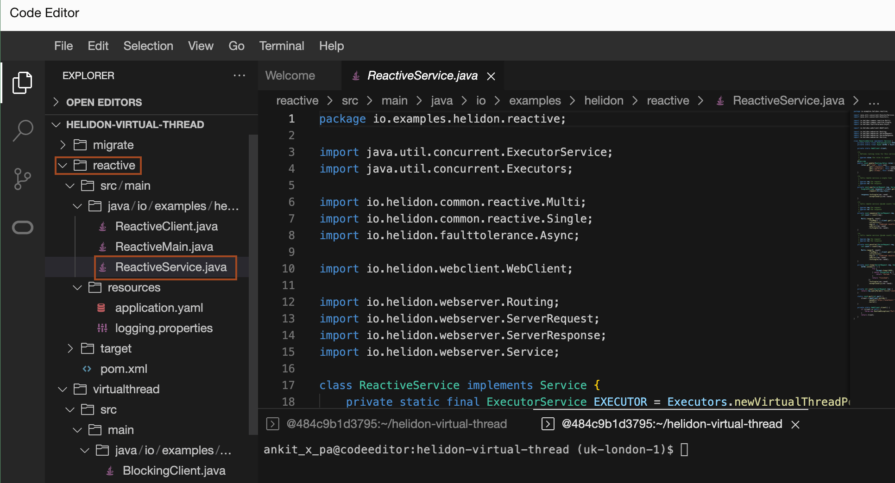

# Build and Run the Helidon Nima and Reactive application

## Introduction

This lab walks you through the process of building and running the Nima and Reactive Helidon applications in Oracle Code Editor inside Oracle Cloud Infrastructure.

Estimated Time: 15 minutes


### Objectives

In this lab, you will:

* Build, run and test the Helidon Nima application
* Build, run and test the Helidon Reactive application
* Analyse the simplicity of the Nima application comparative to Reactive application

### Prerequisites

To run this lab, you must have:

* Oracle Cloud Account
* Completed Lab 1, which install the required JDK and maven.

## Task 1: Build and Run the Nima application

1. Click *File* -> *Open* in Code Editor.
    

2. Select *helidon-levelup-2023-main* folder and click *Open*.
    

 3. Copy and paste the following command to build the nima application.
    ```bash
    <copy>cd ~/helidon-levelup-2023-main/nima/
    mvn clean package -DskipTests</copy>
    ```

    You will have output similar to the following:
    ```bash
    INFO] --- maven-jar-plugin:3.0.2:jar (default-jar) @ example-nima-blocking ---
    [INFO] Building jar: /home/ankit_x_pa/helidon-levelup-2023-main/nima/target/example-nima-blocking.jar
    [INFO] ------------------------------------------------------------------------
    [INFO] BUILD SUCCESS
    [INFO] ------------------------------------------------------------------------
    [INFO] Total time:  8.314 s
    [INFO] Finished at: 2023-02-19T06:27:51Z
    [INFO] ------------------------------------------------------------------------
    ```

4. Copy and paste the following command in the terminal to run the blocking nima version of the application:
    ```bash
    <copy>java --enable-preview -jar target/example-nima-blocking.jar</copy>
    ```
    You will have output similar to the following:
    ```bash
    $ java --enable-preview -jar target/example-nima-blocking.jar
    2023.02.19 06:32:32.590 Logging at initialization configured using classpath: /logging.properties
    2023.02.19 06:32:32.910 Configuration file application.yaml is on classpath, yet there is no parser configured for it
    2023.02.19 06:32:33.739 [0x38f7f9cb] http://127.0.0.1:34389 bound for socket '@default'
    2023.02.19 06:32:33.741 [0x38f7f9cb] direct writes
    2023.02.19 06:32:33.771 Helidon Níma 4.0.0-ALPHA4
    2023.02.19 06:32:33.785 Started all channels in 43 milliseconds. 1419 milliseconds since JVM startup. Java 19.0.2+7-44
    ```

5. Write down the port number on which the server runs (see the log entry for @default). For example, in our output, the port number is 34389. Similarly, find out your server port number.

6. To open new terminal, click *Terminal* -> *New Terminal*. We will use this terminal to run *curl* commands. 
    
    

7. Copy and paste the following command into the new terminal. Don't forget to replace *port* with your server port.
    ```bash
    <copy>curl http://localhost:<port>/one</copy>
    ```
    You will have output similar to the following:
    ```bash
    curl http://localhost:34389/one
    remote_1
    $
    ```

8. Copy and paste the following command into the new terminal. Don't forget to replace to *port* with your server port.
    ```bash
    <copy>curl http://localhost:<port>/sequence</copy>
    ```
    You will have output similar to the following:
    ```bash
    $ curl http://localhost:34389/sequence
    Combined results: [remote_2, remote_3, remote_4, remote_5, remote_6, remote_7, remote_8, remote_9, remote_10, remote_11]
    $
    ```
    > Notice the order of the results. As suggested by the name, this request invokes a remote resource multiple times in sequence.


9. Copy and paste the following command into the new terminal. Don't forget to replace to *port* with your server port.
    ```bash
    <copy>curl http://localhost:<port>/parallel</copy>
    ```
    You will have output similar to the following:
    ```bash
    $ curl http://localhost:39017/parallel
    Combined results: [remote_21, remote_18, remote_12, remote_13, remote_14, remote_15, remote_16, remote_17, remote_19, remote_20]
    $
    ``` 
    > Notice the order of the results. As suggested by the name, this request invokes a remote resource multiple times in parallel.

10. Press the *Ctrl + C* in the terminal where *java -jar * command is running to to stop the server.

## Task 2: Build and Run the Reactive application

1. Copy and paste the following command to build the nima application.
    ```bash
    <copy>cd ~/helidon-levelup-2023-main/reactive/
    mvn clean package -DskipTests</copy>
    ```

    You will have output similar to the following:
    ```bash
    [INFO] Building jar: /home/ankit_x_pa/helidon-levelup-2023-main/reactive/target/example-nima-reactive.jar
    [INFO] ------------------------------------------------------------------------
    [INFO] BUILD SUCCESS
    [INFO] ------------------------------------------------------------------------
    [INFO] Total time:  6.622 s
    [INFO] Finished at: 2023-02-19T10:08:00Z
    [INFO] ------------------------------------------------------------------------
    $
    ```

2. Copy and paste the following command in the terminal to run the reactive version of the application:
    ```bash
    <copy>java --enable-preview -jar target/example-nima-reactive.jar</copy>
    ```
    You will have output similar to the following:
    ```bash
    $ java --enable-preview -jar target/example-nima-reactive.jar
    2023.02.19 10:10:51.722 Logging at initialization configured using classpath: /logging.properties
    2023.02.19 10:10:52.303 Configuration file application.yaml is on classpath, yet there is no parser configured for it
    2023.02.19 10:10:52.843 Helidon SE 4.0.0-ALPHA4 features: [Config, Tracing, Web Client, WebServer]
    2023.02.19 10:10:52.851 Invalid modules are used:
    2023.02.19 10:10:52.856         Module "io.helidon.reactive.faulttolerance" (Fault Tolerance) is not designed for Helidon SE, it should only be used in Helidon [NIMA]
    2023.02.19 10:10:53.170 Channel '@default' started: [id: 0xc152649a, L:/0.0.0.0:40331]
    ```

3. Write down the port number on which the server runs (see the log entry for @default). For example, in our output, the port number is 40331. Similarly, find out your server port number.

4. Go back to the terminal, which we opened in Task 1 for running the curl command.
    
5. Copy and paste the following command into the new terminal. Don't forget to replace to *port* with your server port.
    ```bash
    <copy>curl http://localhost:<port>/one</copy>
    ```
    You will have output similar to the following:
    ```bash
    $ curl http://localhost:40331/one
    remote_1
    $
    ```

6. Copy and paste the following command into the new terminal. Don't forget to replace to *port* with your server port.
    ```bash
    <copy>curl http://localhost:<port>/sequence</copy>
    ```
    You will have output similar to the following:
    ```bash
    $ curl http://localhost:40331/sequence
    Combined results: [remote_2, remote_3, remote_4, remote_5, remote_6, remote_7, remote_8, remote_9, remote_10, remote_11]
    $
    ```
    > Notice the order of the results. As suggested by the name, this request invokes a remote resource multiple times in sequence.


7. Copy and paste the following command into the new terminal. Don't forget to replace to *port* with your server port.
    ```bash
    <copy>curl http://localhost:<port>/parallel</copy>
    ```
    You will have output similar to the following:
    ```bash
    $ curl http://localhost:40331/parallel
    Combined results: [remote_17, remote_16, remote_13, remote_20, remote_12, remote_19, remote_18, remote_14, remote_21, remote_15]
    $
    ``` 
    > Notice the order of the results. As suggested by the name, this request invokes a remote resource multiple times in parallel.

8. Press the *Ctrl + C* in the terminal where *java -jar * command is running to to stop the server.

## Task 3: Analyse the simplicity of the Nima application

1. Open the *nima/src/main/java/io/examples/helidon/nima/BlockingService.java* file to see how endpoints are implemented in the nima version of the application.
    

2. Open the *reactive/src/main/java/io/examples/helidon/reactive/ReactiveService.java* file to see how endpoints are implemented in the reactive version of the application.
    

3. See that reactive code is more complicated than blocking (Virtual Thread)

    > Check methods sequence and parallel in BlockingService and ReactiveService respectively. See if you understand how they work!


## Acknowledgements

* **Author** -  Joe DiPol
* **Contributors** - Ankit Pandey, Maciej Gruszka
* **Last Updated By/Date** - Ankit Pandey, Feb 2023
