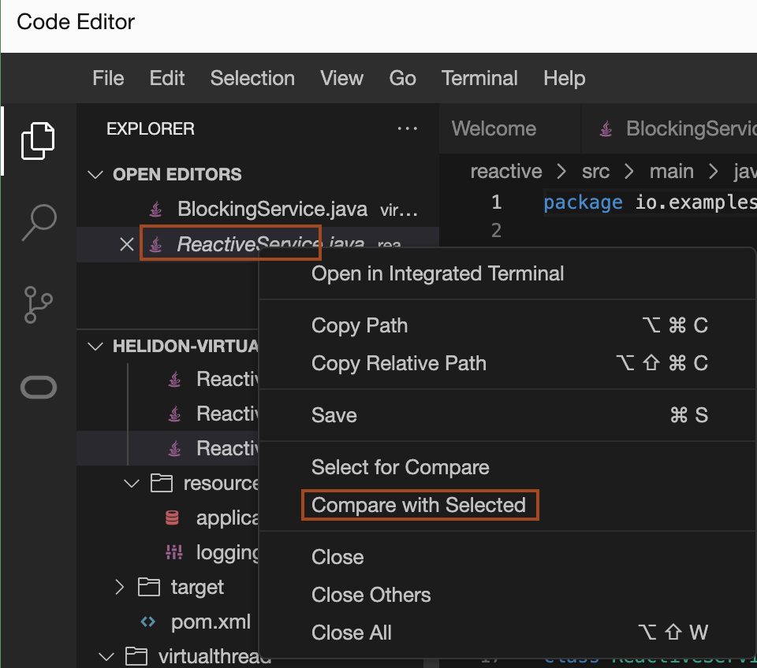
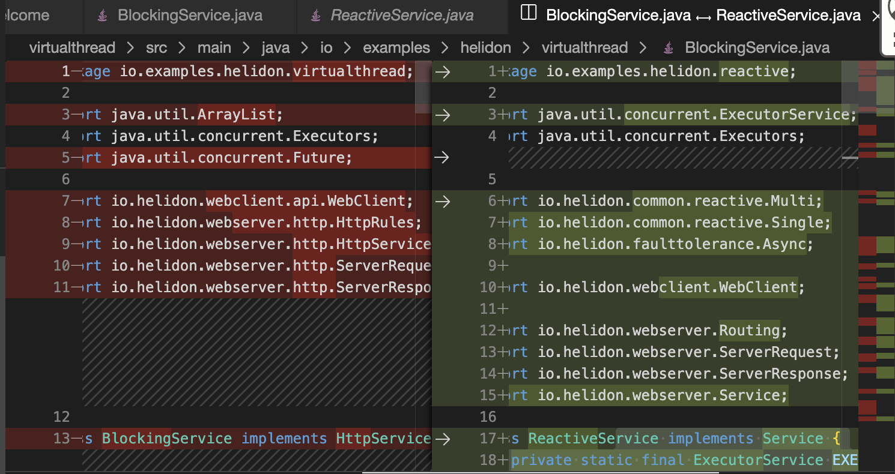

# Build and Run the Helidon Nima and Reactive application

## Introduction

This lab walks you through the process of building and running the Nima and Reactive Helidon applications in Oracle Code Editor inside Oracle Cloud Infrastructure.

[Lab2 walkthrough](videohub:1_e88ydqwt)

Estimated Time: 15 minutes


### Objectives

In this lab, you will:

* Build, run and test the Helidon Nima application
* Build, run and test the Helidon Reactive application
* Analyse the simplicity of the Nima application comparative to Reactive application

### Prerequisites

To run this lab, you must have:

* Oracle Cloud Account
* Completed Lab 1, which install the required JDK and maven.

## Task 1: Build and Run the Nima application

1. Click *File* -> *Open* in Code Editor.
    

2. Select *helidon-levelup-2023-main* folder and click *Open*.
    
    > Please ignore the warnings/problems, you notice in Code Editor while opening this folder.


3. Open a new terminal, and then copy and paste the following command to set the PATH and JAVA_HOME variable.
    ```bash
    <copy>PATH=~/jdk-19.0.2/bin:~/apache-maven-3.8.3/bin:$PATH
    JAVA_HOME=~/jdk-19.0.2</copy>
    ```

4. Copy the following command and run in the terminal to verify that required JDK and Maven version are configured properly.

    ```bash
    <copy>mvn -v</copy>
    ```

    you will have the output similar to the following:
    ```bash
    $ mvn -v 
    Apache Maven 3.8.3 (ff8e977a158738155dc465c6a97ffaf31982d739)
    Maven home: /home/ankit_x_pa/apache-maven-3.8.3
    Java version: 19.0.2, vendor: Oracle Corporation, runtime: /home/ankit_x_pa/jdk-19.0.2
    Default locale: en_US, platform encoding: UTF-8
    OS name: "linux", version: "4.14.35-2047.520.3.1.el7uek.x86_64", arch: "amd64", family: "unix"
    $ 
    ```

    > *You will use only this terminal for building and running the application as it has the required JDK and Maven version.*

5. Copy and paste the following command to build the nima application.
    ```bash
    <copy>cd ~/helidon-levelup-2023-main/nima/
    mvn clean package -DskipTests</copy>
    ```

    You will have output similar to the following:
    ```bash
    [INFO] --- maven-jar-plugin:3.0.2:jar (default-jar) @ example-nima-blocking ---
    [INFO] Building jar: /home/ankit_x_pa/helidon-levelup-2023-main/nima/target/example-nima-blocking.jar
    [INFO] ------------------------------------------------------------------------
    [INFO] BUILD SUCCESS
    [INFO] ------------------------------------------------------------------------
    [INFO] Total time:  7.562 s
    [INFO] Finished at: 2023-02-27T11:42:52Z
    [INFO] ------------------------------------------------------------------------
    ```

6. Copy and paste the following command in the terminal to run the blocking nima version of the application:
    ```bash
    <copy>java --enable-preview -jar target/example-nima-blocking.jar</copy>
    ```
    You will have output similar to the following:
    ```bash
    $ java --enable-preview -jar target/example-nima-blocking.jar
    2023.02.27 11:43:18.589 Logging at initialization configured using classpath: /logging.properties
    2023.02.27 11:43:18.902 Configuration file application.yaml is on classpath, yet there is no parser configured for it
    2023.02.27 11:43:19.700 [0x314d2373] http://127.0.0.1:33193 bound for socket '@default'
    2023.02.27 11:43:19.703 [0x314d2373] direct writes
    2023.02.27 11:43:19.722 Helidon Níma 4.0.0-ALPHA5
    ```

7. Write down the port number on which the server runs (see the log entry for @default). For example, in our output, the port number is 33193. Similarly, find out your server port number.

8. To open new terminal, click *Terminal* -> *New Terminal*. We will use this terminal to run *curl* commands. 
    
    

9. Copy and paste the following command into the new terminal. Don't forget to replace *`<port>`* with your server port.
    ```bash
    <copy>curl http://localhost:<port>/one</copy>
    ```
    You will have output similar to the following:
    ```bash
    curl http://localhost:33193/one
    remote_1
    $
    ```

10. Copy and paste the following command into the new terminal. Don't forget to replace to *`<port>`* with your server port.
    ```bash
    <copy>curl http://localhost:<port>/sequence</copy>
    ```
    You will have output similar to the following:
    ```bash
    $ curl http://localhost:33193/sequence
    Combined results: [remote_2, remote_3, remote_4, remote_5, remote_6, remote_7, remote_8, remote_9, remote_10, remote_11]
    $
    ```
    > Notice the order of the results. As suggested by the name, this request invokes a remote resource multiple times in sequence.


11. Copy and paste the following command into the new terminal. Don't forget to replace to *`<port>`* with your server port.
    ```bash
    <copy>curl http://localhost:<port>/parallel</copy>
    ```
    You will have output similar to the following:
    ```bash
    $ curl http://localhost:33193/parallel
    Combined results: [remote_21, remote_18, remote_12, remote_13, remote_14, remote_15, remote_16, remote_17, remote_19, remote_20]
    $
    ``` 
    > Notice the order of the results. As suggested by the name, this request invokes a remote resource multiple times in parallel.

12. Press the *Ctrl + C* in the terminal where *java -jar * command is running to to stop the server.

## Task 2: Build and Run the Reactive application

1. Copy and paste the following command to build the nima application.
    ```bash
    <copy>cd ~/helidon-levelup-2023-main/reactive/
    mvn clean package -DskipTests</copy>
    ```

    You will have output similar to the following:
    ```bash
    [INFO] --- maven-jar-plugin:3.0.2:jar (default-jar) @ example-nima-reactive ---
    [INFO] Building jar: /home/ankit_x_pa/helidon-levelup-2023-main/reactive/target/example-nima-reactive.jar
    [INFO] ------------------------------------------------------------------------
    [INFO] BUILD SUCCESS
    [INFO] ------------------------------------------------------------------------
    [INFO] Total time:  6.196 s
    [INFO] Finished at: 2023-02-27T11:51:17Z
    [INFO] ------------------------------------------------------------------------
    $
    ```

2. Copy and paste the following command in the terminal to run the reactive version of the application:
    ```bash
    <copy>java --enable-preview -jar target/example-nima-reactive.jar</copy>
    ```
    You will have output similar to the following:
    ```bash
    $ java --enable-preview -jar target/example-nima-reactive.jar
    2023.02.27 11:51:26.227 Logging at initialization configured using classpath: /logging.properties
    2023.02.27 11:51:26.723 Configuration file application.yaml is on classpath, yet there is no parser configured for it
    2023.02.27 11:51:27.286 Helidon SE 4.0.0-ALPHA5 features: [Config, Fault Tolerance, Tracing, Web Client, WebServer]
    2023.02.27 11:51:27.618 Channel '@default' started: [id: 0x53fadd43, L:/0.0.0.0:45765]
    ```

3. Write down the port number on which the server runs (see the log entry for @default). For example, in our output, the port number is 45765. Similarly, find out your server port number.

4. Go back to the terminal, which we opened in Task 1 for running the curl command.
    
5. Copy and paste the following command into the new terminal. Don't forget to replace to *`<port>`* with your server port.
    ```bash
    <copy>curl http://localhost:<port>/one</copy>
    ```
    You will have output similar to the following:
    ```bash
    $ curl http://localhost:45765/one
    remote_1
    $
    ```

6. Copy and paste the following command into the new terminal. Don't forget to replace to *`<port>`* with your server port.
    ```bash
    <copy>curl http://localhost:<port>/sequence</copy>
    ```
    You will have output similar to the following:
    ```bash
    $ curl http://localhost:45765/sequence
    Combined results: [remote_2, remote_3, remote_4, remote_5, remote_6, remote_7, remote_8, remote_9, remote_10, remote_11]
    $
    ```
    > Notice the order of the results. As suggested by the name, this request invokes a remote resource multiple times in sequence.


7. Copy and paste the following command into the new terminal. Don't forget to replace to *`<port>`* with your server port.
    ```bash
    <copy>curl http://localhost:<port>/parallel</copy>
    ```
    You will have output similar to the following:
    ```bash
    $ curl http://localhost:45765/parallel
    Combined results: [remote_17, remote_16, remote_13, remote_20, remote_12, remote_19, remote_18, remote_14, remote_21, remote_15]
    $
    ``` 
    > Notice the order of the results. As suggested by the name, this request invokes a remote resource multiple times in parallel.

8. Press the *Ctrl + C* in the terminal where *java -jar * command is running to to stop the server.

## Task 3: Analyse the simplicity of the Nima application

**Blocking vs. Reactive**

Let’s compare the implementations between Níma (blocking) and Helidon SE (reactive) for the same task.

* Both implementations execute REST calls using the Helidon WebClient
* The blocking implementation is straightforward to follow:
    - The execution flow is reflected by the statement order in the code
    - There are no calls to intricate or semantically-rich library calls
    - Debugging is straightforward
* Reactive versions require a good understanding of reactive libraries
    - Including Multi, flatMap, error handling, etc.
    - Control flow is no longer obvious due to use of reactive handlers
    - An understanding of flatMap's capability to enable/forbid concurrency is required
    - Debugging is more difficult


1. Open the *nima/src/main/java/io/examples/helidon/nima/BlockingService.java* file to see how endpoints are implemented in the nima version of the application.
    

2. Open the *reactive/src/main/java/io/examples/helidon/reactive/ReactiveService.java* file to see how endpoints are implemented in the reactive version of the application.
    

3. In *OPEN EDITORS* section, right click on the *BlockingService.java* file and select the *Select for Compare*.
    

4. Right click on the *ReactiveService.java* file and select the *Compare with Selected*.
    


5. See that reactive code is more complicated than blocking (Virtual Thread)
    

    > Check methods one, sequence and parallel in BlockingService and ReactiveService respectively. See if you understand how they work!

You may now *proceed to the next lab*.

## Acknowledgements

* **Author** -  Joe DiPol
* **Contributors** - Ankit Pandey, Maciej Gruszka
* **Last Updated By/Date** - Ankit Pandey, Feb 2023
