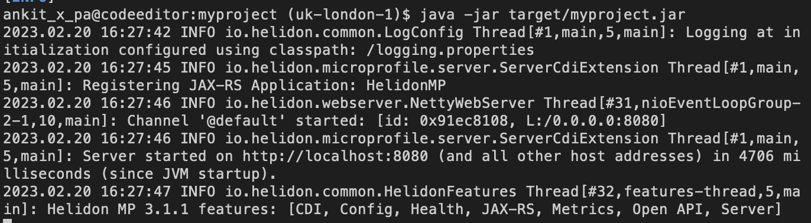

# Create a Helidon 3 application and then migrate it to Helidon 4

## Introduction

In this lab, you will start with a Helidon 3 application running on our original reactive Web Server based on Netty. You will then migrate the application to Helidon 4 running on the new Helidon Nima WebServer using virtual threads.

Estimated Time: 15 minutes


### Objectives

* Generate, build and run the Helidon MicroProfile application using Helidon Starter.
* Migrate the Helidon 3 Microprofile application to Helidon 4

### Prerequisites

* Oracle Cloud Account


## Task 1: Create a Helidon 3 application and build the application

1. Copy the below URL and paste it into the browser to open the Helidon Project page.

    ```bash
    <copy>https://helidon.io/starter/</copy>
    ```
2. Under Generate Your Project, select *Helidon MP* as Helidon Flavor and then click *Next*.

3. For Application Type, select *Quickstart* and then click *Next*.

4. For Media Support, select *Jackson* and then click *Next*.

5. For Customize Project, select the default values and click on *Downloads*. This will pop up in a window, save this *myproject.zip* to the location of your choice. In the rest of this workshop, the *myproject* name will be used. if you choose a different name, please change respectively.

6. Go back to Code Editor, In HELIDON-LEVELUP-2023-MAIN, and click *docs*.
    

7. Click *File* -> *Upload Files*. 
    

8. You will see *myproject.zip* file under *docs* folder.
    

9. copy and paste the following command to unzip the file.
    ```bash
    <copy>cd ~/helidon-levelup-2023-main/docs/
    unzip myproject.zip</copy>
    ```

10. From the myproject folder, run the following command to build the project. Please use the terminal, where you have set the PATH and JAVA_HOME variables.
    ```bash
    <copy>cd myproject
    mvn clean package</copy>
    ```
    > You should see *BUILD SUCCESS* at the end of the execution of this command.

12. Copy and paste the following command into the terminal, to run this application. You will see an output similar to that shown in the below screenshot.
    ```bash
    <copy>java -jar target/myproject.jar</copy>
    ```
    

13. Go back to the terminal,from where you run the curl commands and run the following commands to check the application:

    ```bash
    <copy>
    curl -X GET http://localhost:8080/greet
    </copy>
    {"message":"Hello World!"}
    ```

    ```bash
    <copy>
    curl -X GET http://localhost:8080/greet/Joe
    </copy>
    {"message":"Hello Joe!"}
    ```

14. Stop the *myproject* application by entering `Ctrl + C` in the terminal where the "java -jar target/myproject.jar" command is running.

15. Edit the file *src/main/java/com/example/myproject/GreetResource.java*, Find the method *createResponse(String who)* and add the following line as shown in the screenshot.
    ```bash
    <copy>System.out.println("Running on thread " + Thread.currentThread());</copy>
    ```
    

16. Rebuild, run and exercise the application as described in steps 11, 12 and 13.

17. Look at the server output in the terminal where you started the server. Note that the thread is named helidon-server-n. This is a traditional platform thread in a threadpool created by Helidon to handle JAX-RS requests.
    You will have server output similar to the following:
    ```bash
    Running on thread Thread[#25,helidon-server-1,5,server]
    ```

18. Stop the *myproject* application by entering `Ctrl + C` in the terminal where the "java -jar target/myproject.jar" command is running.


## Task 2: Migrate the Helidom MicroProfile application to Helidon 4

1. For myproject, open the *pom.xml* file and change the parent pom from *3.1.1* to *4.0.0-ALPHA4*.
    

2. Edit src/main/resources/logging.properties and change *io.helidon.common.HelidonConsoleHandler* to *io.helidon.logging.jul.HelidonConsoleHandler*.
    

3. Your application has now been migrated to Helidon 4! Copy and paste the following command to build the application.
    ```bash
    <copy>mvn clean package -DskipTests</copy>
    ```

4. Copy and paste the following command to run the application.
    ```bash
    <copy>java --enable-preview  -jar target/myproject.jar</copy>
    ```
    You will have output similar to the following.
    ```bash
     java --enable-preview  -jar target/myproject.jar
    2023.02.20 16:49:58 INFO io.helidon.logging.jul.JulProvider Thread[#1,main,5,main]: Logging at initialization configured using classpath: /logging.properties
    2023.02.20 16:50:02 INFO io.helidon.microprofile.server.ServerCdiExtension Thread[#1,main,5,main]: Registering JAX-RS Application: HelidonMP
    2023.02.20 16:50:03 INFO io.helidon.nima.webserver.ServerListener VirtualThread[#25,start @default (/0.0.0.0:8080)]/runnable@ForkJoinPool-1-worker-1: [0x0f26a2e0] http://0.0.0.0:8080 bound for socket '@default'
    2023.02.20 16:50:03 INFO io.helidon.nima.webserver.ServerListener VirtualThread[#25,start @default (/0.0.0.0:8080)]/runnable@ForkJoinPool-1-worker-1: [0x0f26a2e0] direct writes
    2023.02.20 16:50:03 INFO io.helidon.nima.webserver.LoomServer Thread[#1,main,5,main]: Helidon Níma 4.0.0-ALPHA4
    2023.02.20 16:50:03 INFO io.helidon.nima.webserver.LoomServer Thread[#1,main,5,main]: Started all channels in 52 milliseconds. 4998 milliseconds since JVM startup. Java 19.0.2+7-44
    2023.02.20 16:50:03 INFO io.helidon.microprofile.server.ServerCdiExtension Thread[#1,main,5,main]: Server started on http://localhost:8080 (and all other host addresses) in 5023 milliseconds (since JVM startup).
    2023.02.20 16:50:04 INFO io.helidon.common.features.HelidonFeatures Thread[#28,features-thread,5,main]: Helidon MP 4.0.0-ALPHA4 features: [CDI, Config, Health, Metrics, Open API, Server, WebServer]
    ```
5.  Look at the server output and note that the thread is now a VirtualThread.

6. Stop the *myproject* application by entering `Ctrl + C` in the terminal where the "java --enable-preview  -jar target/myproject.jar" command is running.

Congratulations, you have completed the Helidon virtual thread workshop.

## Acknowledgements

* **Author** -  Joe DiPol
* **Contributors** - Ankit Pandey, Maciej Gruszka
* **Last Updated By/Date** - Ankit Pandey, Feb 2023
