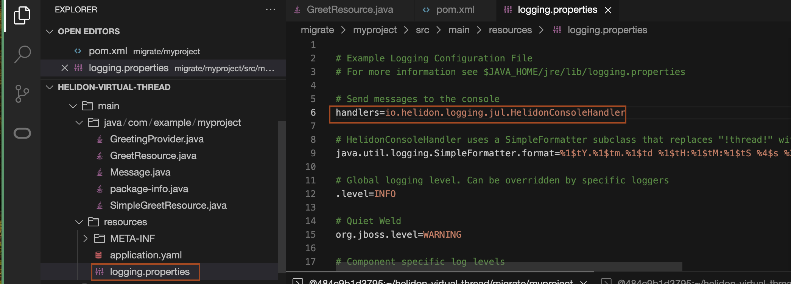

# Create a Helidon 3 application and then migrate it to Helidon 4

## Introduction

In this lab, you will start with a Helidon 3 application running on our original reactive Web Server based on Netty. You will then migrate the application to Helidon 4 running on the new Helidon WebServer using virtual threads.

[Lab4 walkthrough](videohub:1_zr1m00ba)

Estimated Time: 20 minutes


### Objectives

* Generate, build and run a Helidon MP application using Helidon Starter.
* Migrate the Helidon 3 MP application to Helidon 4

### Prerequisites

* Oracle Cloud Account


## Task 1: Create a Helidon 3 application and build the application

1. Copy the below URL and paste it into the browser to open the Helidon Project page.

    ```bash
    <copy>https://helidon.io/starter/</copy>
    ```
    > From the version drop down, select the Helidon Version *3.x.x*.
2. Under Generate Your Project, select *Helidon MP* as Helidon Flavor and then click *Next*.

3. For Application Type, select *Quickstart* and then click *Next*.

4. For Media Support, select *JSON-B* and then click *Next*.

5. For Customize Project, select the default values and click on *Downloads*. This will pop up in a window, save this *myproject.zip* to the location of your choice. In the rest of this workshop, the *myproject* name will be used. if you choose a different name, please change respectively.

6. Go back to Code Editor, In helidon-virtual-thread, and click *migrate*.
    

7. Click *File* -> *Upload Files* and select the *myproject.zip* from the location where you have saved this file earlier and then click *Open*.
    

8. You will see *myproject.zip* file under *migrate* folder.
    

9. copy and paste the following command to unzip the file.
    ```bash
    <copy>cd ~/helidon-virtual-thread/migrate/
    unzip myproject.zip</copy>
    ```

10. From the myproject folder, run the following command to build the project. Please use the terminal, where you have set the PATH and JAVA_HOME variables.
    ```bash
    <copy>cd myproject
    mvn clean package</copy>
    ```
    > You should see *BUILD SUCCESS* at the end of the execution of this command.

12. Copy and paste the following command into the terminal, to run this application. You will see an output similar to that shown in the below screenshot.
    ```bash
    <copy>java -jar target/myproject.jar</copy>
    ```
    You will see output similar to the following:
    ```bash
    $ java -jar target/myproject.jar
    2024.02.21 11:19:09 INFO io.helidon.common.LogConfig Thread[#1,main,5,main]: Logging at initialization configured using classpath: /logging.properties
    2024.02.21 11:19:11 INFO io.helidon.microprofile.server.ServerCdiExtension Thread[#1,main,5,main]: Registering JAX-RS Application: HelidonMP
    2024.02.21 11:19:11 INFO io.helidon.webserver.NettyWebServer Thread[#30,nioEventLoopGroup-2-1,10,main]: Channel '@default' started: [id: 0x49f247d4, L:/0.0.0.0:8080]
    2024.02.21 11:19:11 INFO io.helidon.microprofile.server.ServerCdiExtension Thread[#1,main,5,main]: Server started on http://localhost:8080 (and all other host addresses) in 2426 milliseconds (since JVM startup).
    2024.02.21 11:19:11 INFO io.helidon.common.HelidonFeatures Thread[#31,features-thread,5,main]: Helidon MP 3.2.8 features: [CDI, Config, Health, JAX-RS, Metrics, Open API, Server]
    ```

13. Go back to the terminal,from where you run the curl commands and run the following commands to check the application:

    ```bash
    <copy>
    curl -X GET http://localhost:8080/greet
    </copy>
    {"message":"Hello World!"}
    ```

    ```bash
    <copy>
    curl -X GET http://localhost:8080/greet/Joe
    </copy>
    {"message":"Hello Joe!"}
    ```

14. Stop the *myproject* application by entering `Ctrl + C` in the terminal where the "java -jar target/myproject.jar" command is running.

15. Edit the file *src/main/java/com/example/myproject/GreetResource.java*, Find the method *createResponse(String who)* and add the following line as shown in the screenshot.
    ```bash
    <copy>System.out.println("Running on thread " + Thread.currentThread());</copy>
    ```
    

16. Rebuild, run and exercise the application as described in steps 10, 11 and 12.

17. Look at the server output in the terminal where you started the server. Note that the thread is named helidon-server-n. This is a traditional platform thread in a threadpool created by Helidon to handle JAX-RS requests.
    You will have server output similar to the following:
    ```bash
    Running on thread Thread[#24,helidon-server-1,5,server]
    ```

18. Stop the *myproject* application by entering `Ctrl + C` in the terminal where the "java -jar target/myproject.jar" command is running.


## Task 2: Migrate the Helidom MP application to Helidon 4

1. For myproject, open the *pom.xml* file and change the parent pom from *3.2.8* to *4.0.5*.
    ```bash
    <parent>
        <groupId>io.helidon.applications</groupId>
        <artifactId>helidon-mp</artifactId>
        <version>4.0.5</version>
        <relativePath/>
    </parent>
    ```
    

2. Edit src/main/resources/logging.properties and change *io.helidon.common.HelidonConsoleHandler* to *io.helidon.logging.jul.HelidonConsoleHandler*.
    

3. In the pom.xml file, search for the following dependencies/plugin and remove it. We need to add new dependencies/plugin compatible to Helidon 4. 
    ```bash
    <copy><dependency>
            <groupId>org.jboss</groupId>
            <artifactId>jandex</artifactId>
            <scope>runtime</scope>
        </dependency>
        <dependency>
            <groupId>io.helidon.microprofile.tests</groupId>
            <artifactId>helidon-microprofile-tests-junit5</artifactId>
            <scope>test</scope>
        </dependency>
        <plugin>
                <groupId>org.jboss.jandex</groupId>
                <artifactId>jandex-maven-plugin</artifactId>
                <executions>
                    <execution>
                        <id>make-index</id>
                    </execution>
                </executions>
        </plugin>
        </copy>
        ```

4. Copy and paste the following dependencies in the pom.xml. Please maintain the proper indentation.
    ```bash
    <copy><dependency>
            <groupId>io.smallrye</groupId>
            <artifactId>jandex</artifactId>
            <scope>runtime</scope>
        </dependency>
        <dependency>
            <groupId>io.helidon.microprofile.testing</groupId>
            <artifactId>helidon-microprofile-testing-junit5</artifactId>
            <scope>test</scope>
        </dependency></copy>
    ```
5. Copy and paste the following plugin in the pom.xml. Please maintain the proper indentation.
    ```bash
    <copy><plugin>
                <groupId>io.smallrye</groupId>
                <artifactId>jandex-maven-plugin</artifactId>
                <executions>
                    <execution>
                        <id>make-index</id>
                    </execution>
                </executions>
            </plugin></copy>
    ```

6. Open the file *myproject/src/test/java/com/example/myproject/MainTest.java* and modify the package from **io.helidon.microprofile.tests.junit5.HelidonTest** to **io.helidon.microprofile.testing.junit5.HelidonTest**.

3. Your application has now been migrated to Helidon 4! Copy and paste the following command to build the application.
    ```bash
    <copy>mvn clean package -DskipTests</copy>
    ```

4. Copy and paste the following command to run the application.
    ```bash
    <copy>java -jar target/myproject.jar</copy>
    ```
    You will have output similar to the following.
    ```bash
    $ java -jar target/myproject.jar
    There is no Helidon logging implementation on classpath, skipping log configuration.
    Feb 21, 2024 11:46:46 AM org.jboss.weld.bootstrap.WeldStartup <clinit>
    INFO: WELD-000900: 5.1.1 (SP2)
    Feb 21, 2024 11:46:46 AM org.jboss.weld.environment.deployment.discovery.DiscoveryStrategyFactory create
    INFO: WELD-ENV-000020: Using jandex for bean discovery
    Feb 21, 2024 11:46:46 AM org.jboss.weld.bootstrap.WeldStartup startContainer
    INFO: WELD-000101: Transactional services not available. Injection of @Inject UserTransaction not available. Transactional observers will be invoked synchronously.
    Feb 21, 2024 11:46:47 AM org.jboss.weld.event.ExtensionObserverMethodImpl checkRequiredTypeAnnotations
    INFO: WELD-000411: Observer method [BackedAnnotatedMethod] public org.glassfish.jersey.ext.cdi1x.internal.ProcessAllAnnotatedTypes.processAnnotatedType(@Observes ProcessAnnotatedType<?>, BeanManager) receives events for all annotated types. Consider restricting events using @WithAnnotations or a generic type with bounds.
    Feb 21, 2024 11:46:47 AM org.jboss.weld.event.ExtensionObserverMethodImpl checkRequiredTypeAnnotations
    INFO: WELD-000411: Observer method [BackedAnnotatedMethod] private io.helidon.microprofile.openapi.OpenApiCdiExtension.processAnnotatedType(@Observes ProcessAnnotatedType<X>) receives events for all annotated types. Consider restricting events using @WithAnnotations or a generic type with bounds.
    Feb 21, 2024 11:46:47 AM io.helidon.openapi.OpenApiFeature <init>
    WARNING: Static OpenAPI file not found, checked: [META-INF/openapi.yml, META-INF/openapi.yaml, META-INF/openapi.json]
    Feb 21, 2024 11:46:48 AM io.helidon.microprofile.server.ServerCdiExtension addApplication
    INFO: Registering JAX-RS Application: HelidonMP
    Feb 21, 2024 11:46:48 AM org.glassfish.jersey.server.wadl.WadlFeature configure
    WARNING: JAX-B API not found . WADL feature is disabled.
    Feb 21, 2024 11:46:48 AM io.helidon.webserver.ServerListener start
    INFO: [0x56f6f591] http://0.0.0.0:8080 bound for socket '@default'
    Feb 21, 2024 11:46:48 AM io.helidon.webserver.LoomServer startIt
    INFO: Started all channels in 13 milliseconds. 2263 milliseconds since JVM startup. Java 21.0.2+13-LTS-58
    Feb 21, 2024 11:46:48 AM io.helidon.microprofile.server.ServerCdiExtension startServer
    INFO: Server started on http://localhost:8080 (and all other host addresses) in 2267 milliseconds (since JVM startup).
    Feb 21, 2024 11:46:48 AM io.helidon.common.features.HelidonFeatures features
    INFO: Helidon MP 4.0.5 features: [CDI, Config, Health, Metrics, Open API, Server]
    ```
5. Go back to the terminal,from where you run the curl commands and run the following commands to check the application:

    ```bash
    <copy>
    curl -X GET http://localhost:8080/greet
    </copy>
    {"message":"Hello World!"}
    ```

6. Look at the server output in the terminal where you started the server. You will have server output similar to the following:
    ```bash
    Running on thread VirtualThread[#31,[0x0571f5b8 0x2d2dbfe7] WebServer socket]/runnable@ForkJoinPool-1-worker-3
    ```

6. Stop the *myproject* application by entering `Ctrl + C` in the terminal where the "java -jar target/myproject.jar" command is running.

Congratulations, you have completed the Helidon virtual thread workshop.

## Acknowledgements

* **Author** -  Ankit Pandey
* **Contributors** - Sid Joshi, Maciej Gruszka
* **Last Updated By/Date** - Ankit Pandey, March 2024
