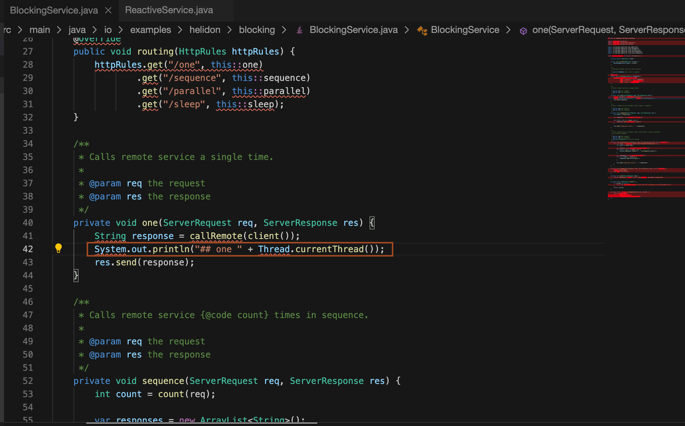
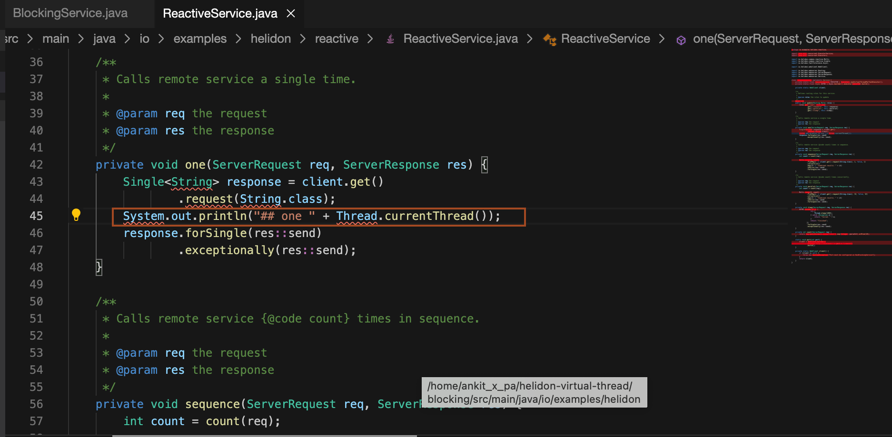

# Modify the Helidon Virtual thread and Reactive application and analyse the stack trace

## Introduction

In this lab, you will modify the helidon 4 and reactive application. Then you will rebuild the application and analyse the stack trace in case of exceptions.

[Lab3 walkthrough](videohub:1_gq37iysp)

Estimated Time: 10 minutes


### Objectives

In this lab, you will:

* Modify, build and run the Helidon 4 (Virtual thread) application
* Make an exception in request to analyse stack trace for the Helidon 4 application
* Modify, build and run the Helidon Reactive application
* Make an exception in request to analyse stack trace for reactive application

### Prerequisites

* You must have an [Oracle Cloud Infrastructure](https://cloud.oracle.com/en_US/cloud-infrastructure) enabled account.

## Task 1: Modify the Helidon 4 application and build the application

1. Go back to the file *virtualthread/src/main/java/io/examples/helidon/virtualthread/BlockingService.java*, and add the following line to method *one* as shown.
    ```bash
    <copy>System.out.println("## one " + Thread.currentThread());</copy>
    ```
    

2. Copy and paste the following command into the terminal to build the application.
    ```bash
    <copy>cd ~/helidon-virtual-thread/virtualthread/
    mvn clean package -DskipTests</copy>
    ```
    > Make sure to use the terminal, where you have set the PATH and JAVA_HOME variables.

3. Copy and paste the following command to run the blocking application.
    ```bash
    <copy>java -jar target/example-virtual-thread.jar</copy>
    ```
    You will have output similar to the following:
    ```bash
    $ java -jar target/example-virtual-thread.jar
    Feb 21, 2024 10:26:59 AM io.helidon.config.MetaConfigFinder lambda$findSource$9
    WARNING: Configuration file application.yaml is on classpath, yet there is no parser configured for it
    Feb 21, 2024 10:26:59 AM io.helidon.common.features.HelidonFeatures features
    INFO: Helidon SE 4.0.5 features: [Config, Encoding, Media, WebClient, WebServer]
    Feb 21, 2024 10:26:59 AM io.helidon.webserver.ServerListener start
    INFO: [0x32b6199e] http://0.0.0.0:40789 bound for socket '@default'
    Feb 21, 2024 10:26:59 AM io.helidon.webserver.LoomServer startIt
    INFO: Started all channels in 40 milliseconds. 692 milliseconds since JVM startup. Java 21.0.2+13-LTS-58
    ```
    
4. Go back to the terminal, which you open for running the curl command. Copy and paste the following curl command to the terminal.
    ```bash
    <copy>curl http://localhost:<port>/one</copy>
    ```

    You will have output similar to the following:
    ```bash
    $ curl http://localhost:40789/one
    remote_1
    $
    ```

5. Observe the output in the server log, you will see something like the below:
    ```bash
    ## one VirtualThread[#29,[0x32b6199e 0x49abf544] WebServer socket]/runnable@ForkJoinPool-1-worker-3
    ```

## Task 2: Analyse stack trace for the Helidon 4 application

1. Copy and paste the following command to force an exception(count must be an integer!)
    ```bash
    <copy>curl "http://localhost:<port>/parallel?count=foo"</copy>
    ```

    You will output similar to the following:
    ```bash
    $ curl "http://localhost:45043/parallel?count=foo"
    For input string: &quot;foo&quot;$
    ```

2. Check the server log, you will have output similar to the below:
    ```bash
    WARNING: Internal server error
    io.helidon.http.RequestException: For input string: "foo"
            at io.helidon.http.RequestException$Builder.build(RequestException.java:139)
            at io.helidon.webserver.http.ErrorHandlers.unhandledError(ErrorHandlers.java:202)
            at io.helidon.webserver.http.ErrorHandlers.lambda$handleError$1(ErrorHandlers.java:182)
            at java.base/java.util.Optional.ifPresentOrElse(Optional.java:198)
            at io.helidon.webserver.http.ErrorHandlers.handleError(ErrorHandlers.java:181)
            at io.helidon.webserver.http.ErrorHandlers.runWithErrorHandling(ErrorHandlers.java:118)
            at io.helidon.webserver.http.Filters$FilterChainImpl.proceed(Filters.java:121)
            at io.examples.helidon.blocking.BlockingMain.lambda$routing$0(BlockingMain.java:62)
            at io.helidon.webserver.http.Filters$FilterChainImpl.proceed(Filters.java:119)
            at io.helidon.webserver.http.Filters.executeFilters(Filters.java:87)
            at io.helidon.webserver.http.Filters.lambda$filter$0(Filters.java:83)
            at io.helidon.webserver.http.ErrorHandlers.runWithErrorHandling(ErrorHandlers.java:75)
            at io.helidon.webserver.http.Filters.filter(Filters.java:83)
            at io.helidon.webserver.http.HttpRouting.route(HttpRouting.java:109)
            at io.helidon.webserver.http1.Http1Connection.route(Http1Connection.java:357)
            at io.helidon.webserver.http1.Http1Connection.handle(Http1Connection.java:194)
            at io.helidon.webserver.ConnectionHandler.run(ConnectionHandler.java:165)
            at io.helidon.common.task.InterruptableTask.call(InterruptableTask.java:47)
            at io.helidon.webserver.ThreadPerTaskExecutor$ThreadBoundFuture.run(ThreadPerTaskExecutor.java:239)
            at java.base/java.lang.VirtualThread.run(VirtualThread.java:309)
    Caused by: java.lang.NumberFormatException: For input string: "foo"
            at java.base/java.lang.NumberFormatException.forInputString(NumberFormatException.java:67)
            at java.base/java.lang.Integer.parseInt(Integer.java:662)
            at java.base/java.lang.Integer.parseInt(Integer.java:778)
            at java.base/java.util.Optional.map(Optional.java:260)
            at io.helidon.common.mapper.OptionalValue.map(OptionalValue.java:208)
            at io.examples.helidon.blocking.BlockingService.count(BlockingService.java:96)
            at io.examples.helidon.blocking.BlockingService.parallel(BlockingService.java:74)
            at io.helidon.webserver.http.HttpRouting$RoutingExecutor.doRoute(HttpRouting.java:668)
            at io.helidon.webserver.http.HttpRouting$RoutingExecutor.call(HttpRouting.java:627)
            at io.helidon.webserver.http.HttpRouting$RoutingExecutor.call(HttpRouting.java:605)
            at io.helidon.webserver.http.ErrorHandlers.runWithErrorHandling(ErrorHandlers.java:75)
            ... 14 more
        ```

3. Press the *Ctrl + C* in the terminal where *java -jar * command is running to to stop the server.

## Task 3: Modify the Reactive application and build the application

1. Go back to the file *reactive/src/main/java/io/examples/helidon/reactive/ReactiveService.java*, and add the following line to method *one* as shown.
    ```bash
    <copy>System.out.println("## one " + Thread.currentThread());</copy>
    ```
    

2. Copy and paste the following command in the terminal to build the application.
    ```bash
    <copy>cd ~/helidon-virtual-thread/reactive/
    mvn clean package -DskipTests</copy>
    ```
    > Make sure to use the terminal, where you have set the PATH and JAVA_HOME variables.

3. Copy and paste the following command to run the reactive application.
    ```bash
    <copy>java -jar target/example-reactive.jar</copy>
    ```
    You will have output similar to the following:
    ```bash
    $ java -jar target/example-reactive.jar
    2024.02.21 10:59:50.605 Logging at initialization configured using classpath: /logging.properties
    2024.02.21 10:59:50.853 Configuration file application.yaml is on classpath, yet there is no parser configured for it
    2024.02.21 10:59:51.099 Helidon SE 3.2.5 features: [Config, Fault Tolerance, Tracing, WebServer]
    2024.02.21 10:59:51.273 Channel '@default' started: [id: 0x4a0416a4, L:/0.0.0.0:43755]
    ```
    
4. Go back to the terminal, which you open for running the curl command. Copy and paste the following curl command to the terminal.
    ```bash
    <copy>curl http://localhost:<port>/one</copy>
    ```

    You will have output similar to the following:
    ```bash
    $ curl http://localhost:43755/one
    remote_1
    $
    ```

5. Observe the output in the server log, you will see something like the below:
    ```bash
    ## one Thread[#23,nioEventLoopGroup-3-1,10,main]
    ```
    
    > This is a Netty event loop thread, Netty is reactive and it's threads must not be blocked. Helidon 4 on the other hand has virtual thread based WebServer and it's request handlers can be blocked, that allows use of simple blocking code in Helidon 4 request handlers instead of complicated reactive constructs like in Helidon 3.

## Task 4: Analyse stack trace for Reactive application

1. Copy and paste the following command to force an exception(count must be an integer!)
    ```bash
    <copy>curl "http://localhost:<port>/parallel?count=foo"</copy>
    ```

    You will output similar to the following:
    ```bash
    $ curl http://localhost:43755/parallel?count=foo
    For input string: "foo"
    $
    ```

2. Check the server log, you will have output similar to the below:
    ```bash
    2024.02.21 11:02:56.370 Default error handler: Unhandled exception encountered.
    java.util.concurrent.ExecutionException: Unhandled 'cause' of this exception encountered.
            at io.helidon.webserver.RequestRouting$RoutedRequest.defaultHandler(RequestRouting.java:398)
            at io.helidon.webserver.RequestRouting$RoutedRequest.nextNoCheck(RequestRouting.java:379)
            at io.helidon.webserver.RequestRouting$RoutedRequest.next(RequestRouting.java:328)
            at io.helidon.webserver.WebTracingConfig$RequestSpanHandler.accept(WebTracingConfig.java:272)
            at io.helidon.webserver.RequestRouting$RoutedRequest.next(RequestRouting.java:326)
            at io.helidon.webserver.RequestRouting.route(RequestRouting.java:88)
            at io.helidon.webserver.ForwardingHandler.lambda$channelReadHttpRequest$14(ForwardingHandler.java:453)
            at io.helidon.webserver.RequestContext.lambda$runInScope$4(RequestContext.java:77)
            at io.helidon.common.context.Contexts.runInContext(Contexts.java:117)
            at io.helidon.webserver.RequestContext.runInScope(RequestContext.java:75)
            at io.helidon.webserver.ForwardingHandler.channelReadHttpRequest(ForwardingHandler.java:453)
            at io.helidon.webserver.ForwardingHandler.lambda$channelRead0$3(ForwardingHandler.java:156)
            at io.helidon.common.context.Contexts.runInContext(Contexts.java:137)
            at io.helidon.webserver.ForwardingHandler.channelRead0(ForwardingHandler.java:155)
            at io.netty.channel.SimpleChannelInboundHandler.channelRead(SimpleChannelInboundHandler.java:99)
            at io.netty.channel.AbstractChannelHandlerContext.invokeChannelRead(AbstractChannelHandlerContext.java:444)
            at io.netty.channel.AbstractChannelHandlerContext.invokeChannelRead(AbstractChannelHandlerContext.java:420)
            at io.netty.channel.AbstractChannelHandlerContext.fireChannelRead(AbstractChannelHandlerContext.java:412)
            at io.netty.channel.CombinedChannelDuplexHandler$DelegatingChannelHandlerContext.fireChannelRead(CombinedChannelDuplexHandler.java:436)
            at io.netty.handler.codec.ByteToMessageDecoder.fireChannelRead(ByteToMessageDecoder.java:346)
            at io.netty.handler.codec.ByteToMessageDecoder.channelRead(ByteToMessageDecoder.java:318)
            at io.netty.channel.CombinedChannelDuplexHandler.channelRead(CombinedChannelDuplexHandler.java:251)
            at io.netty.channel.AbstractChannelHandlerContext.invokeChannelRead(AbstractChannelHandlerContext.java:442)
            at io.netty.channel.AbstractChannelHandlerContext.invokeChannelRead(AbstractChannelHandlerContext.java:420)
            at io.netty.channel.AbstractChannelHandlerContext.fireChannelRead(AbstractChannelHandlerContext.java:412)
            at io.netty.channel.DefaultChannelPipeline$HeadContext.channelRead(DefaultChannelPipeline.java:1410)
            at io.netty.channel.AbstractChannelHandlerContext.invokeChannelRead(AbstractChannelHandlerContext.java:440)
            at io.netty.channel.AbstractChannelHandlerContext.invokeChannelRead(AbstractChannelHandlerContext.java:420)
            at io.netty.channel.DefaultChannelPipeline.fireChannelRead(DefaultChannelPipeline.java:919)
            at io.netty.channel.nio.AbstractNioByteChannel$NioByteUnsafe.read(AbstractNioByteChannel.java:166)
            at io.netty.channel.nio.NioEventLoop.processSelectedKey(NioEventLoop.java:788)
            at io.netty.channel.nio.NioEventLoop.processSelectedKeysOptimized(NioEventLoop.java:724)
            at io.netty.channel.nio.NioEventLoop.processSelectedKeys(NioEventLoop.java:650)
            at io.netty.channel.nio.NioEventLoop.run(NioEventLoop.java:562)
            at io.netty.util.concurrent.SingleThreadEventExecutor$4.run(SingleThreadEventExecutor.java:997)
            at io.netty.util.internal.ThreadExecutorMap$2.run(ThreadExecutorMap.java:74)
            at io.netty.util.concurrent.FastThreadLocalRunnable.run(FastThreadLocalRunnable.java:30)
            at java.base/java.lang.Thread.run(Thread.java:1583)
    Caused by: java.lang.NumberFormatException: For input string: "foo"
            at java.base/java.lang.NumberFormatException.forInputString(NumberFormatException.java:67)
            at java.base/java.lang.Integer.parseInt(Integer.java:662)
            at java.base/java.lang.Integer.parseInt(Integer.java:778)
            at java.base/java.util.Optional.map(Optional.java:260)
            at io.examples.helidon.reactive.ReactiveService.count(ReactiveService.java:98)
            at io.examples.helidon.reactive.ReactiveService.parallel(ReactiveService.java:74)
            at io.helidon.webserver.RequestRouting$RoutedRequest.next(RequestRouting.java:326)
            ... 35 more
    ``` 
    > Let’s compare the stack trace of Helidon 4 and Helidon 3 (reactive) for the same type of exception.
    * Reactive traces are long and include calls from an event loop managers (e.g. Netty)
    * The event loop manager can call any of the handlers registered by the application
        - The execution flow is not necessarily conducive to the code order
        - Handlers can be called at different times during the execution to handle events
    * Blocking traces are straightforward to understand due to order preservation
        - Thanks to virtual threads blocking operations are suspended and later continued
        - Execution flow is simple and clear to follow

3. Press the *Ctrl + C* in the terminal where *java -jar * command is running to to stop the server.

You may now *proceed to the next lab*.

## Acknowledgements
* **Author** -  Ankit Pandey
* **Contributors** - Sid Joshi, Maciej Gruszka
* **Last Updated By/Date** - Ankit Pandey, March 2025