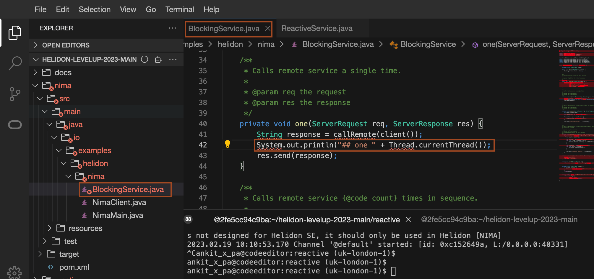

# Modify the Helidon Nima and Reactive application and analyse the stack trace

## Introduction

In this lab, you will modify the helidon nima and reactive application. Then you will rebuild the application and analyse the stack trace in case of exceptions.

Estimated Time: 10 minutes


### Objectives

In this lab, you will:

* Modify, build and run the Helidon Nima application
* Make an exception in request to analyse stack trace for the nima application
* Modify, build and run the Helidon Reactive application
* Make an exception in request to analyse stack trace for reactive application

### Prerequisites

* You must have an [Oracle Cloud Infrastructure](https://cloud.oracle.com/en_US/cloud-infrastructure) enabled account.

## Task 1: Modify the Nima application and build the application

1. Go back to the file *nima/src/main/java/io/examples/helidon/nima/BlockingService.java*, and add the following line to method *one* as shown.
    ```bash
    <copy>System.out.println("## one " + Thread.currentThread());</copy>
    ```
    

2. Copy and paste the following command into the terminal to build the application.
    ```bash
    <copy>cd ~/helidon-levelup-2023-main/nima/
    mvn clean package -DskipTests</copy>
    ```
    > Make sure to use the terminal, where you have set the PATH and JAVA_HOME variables.

3. Copy and paste the following command to run the nima application.
    ```bash
    <copy>java --enable-preview -jar target/example-nima-blocking.jar</copy>
    ```
    You will have output similar to the following:
    ```bash
    $ java --enable-preview -jar target/example-nima-blocking.jar
    2023.02.28 03:13:54.951 Logging at initialization configured using classpath: /logging.properties
    2023.02.28 03:13:55.295 Configuration file application.yaml is on classpath, yet there is no parser configured for it
    2023.02.28 03:13:56.094 [0x314d2373] http://127.0.0.1:35037 bound for socket '@default'
    2023.02.28 03:13:56.097 [0x314d2373] direct writes
    2023.02.28 03:13:56.124 Helidon Níma 4.0.0-ALPHA5
    2023.02.28 03:13:56.139 Started all channels in 54 milliseconds. 1396 milliseconds since JVM startup. Java 19.0.2+7-44
    ```
    
4. Go back to the terminal, which you open for running the curl command. Copy and paste the following curl command to the terminal.
    ```bash
    <copy>curl http://localhost:<port>/one</copy>
    ```

    You will have output similar to the following:
    ```bash
    $ curl http://localhost:35037/one
    remote_1
    $
    ```

5. Observe the output in the server log, you will see something like the below:
    ```bash
    ## one VirtualThread[#27,[0x75c91e4b 0x3b495792] Nima socket]/runnable@ForkJoinPool-1-worker-2
    ```

## Task 2: Analyse stack trace for the Nima application

1. Copy and paste the following command to force an exception(count must be an integer!)
    ```bash
    <copy>curl "http://localhost:<port>/parallel?count=foo"</copy>
    ```

    You will output similar to the following:
    ```bash
    $ curl "http://localhost:35037/parallel?count=foo"
    For input string: &quot;foo&quot;$
    ```

2. Check the server log, you will have output similar to the below:
    ```bash
    2023.02.28 03:19:49.910 Internal server error
    io.helidon.common.http.RequestException: For input string: "foo"
        at io.helidon.common.http.RequestException$Builder.build(RequestException.java:126)
        at io.helidon.nima.webserver.http.ErrorHandlers.unhandledError(ErrorHandlers.java:201)
        at io.helidon.nima.webserver.http.ErrorHandlers.lambda$handleError$1(ErrorHandlers.java:181)
        at java.base/java.util.Optional.ifPresentOrElse(Optional.java:198)
        at io.helidon.nima.webserver.http.ErrorHandlers.handleError(ErrorHandlers.java:180)
        at io.helidon.nima.webserver.http.ErrorHandlers.runWithErrorHandling(ErrorHandlers.java:118)
        at io.helidon.nima.webserver.http.Filters$FilterChainImpl.proceed(Filters.java:116)
        at io.examples.helidon.nima.NimaMain.lambda$routing$0(NimaMain.java:53)
        at io.helidon.nima.webserver.http.Filters$FilterChainImpl.runNextFilter(Filters.java:127)
        at io.helidon.nima.webserver.http.ErrorHandlers.runWithErrorHandling(ErrorHandlers.java:75)
        at io.helidon.nima.webserver.http.Filters$FilterChainImpl.proceed(Filters.java:114)
        at io.helidon.nima.webserver.http.Filters.filter(Filters.java:83)
        at io.helidon.nima.webserver.http.HttpRouting.route(HttpRouting.java:108)
        at io.helidon.nima.webserver.http1.Http1Connection.route(Http1Connection.java:259)
        at io.helidon.nima.webserver.http1.Http1Connection.handle(Http1Connection.java:145)
        at io.helidon.nima.webserver.ConnectionHandler.run(ConnectionHandler.java:107)
        at io.helidon.common.task.InterruptableTask.call(InterruptableTask.java:47)
        at io.helidon.nima.webserver.ThreadPerTaskExecutor$ThreadBoundFuture.run(ThreadPerTaskExecutor.java:234)
        at java.base/java.lang.VirtualThread.run(VirtualThread.java:287)
        at java.base/java.lang.VirtualThread$VThreadContinuation.lambda$new$0(VirtualThread.java:174)
        at java.base/jdk.internal.vm.Continuation.enter0(Continuation.java:327)
        at java.base/jdk.internal.vm.Continuation.enter(Continuation.java:320)
    Caused by: java.lang.NumberFormatException: For input string: "foo"
        at java.base/java.lang.NumberFormatException.forInputString(NumberFormatException.java:67)
        at java.base/java.lang.Integer.parseInt(Integer.java:665)
        at java.base/java.lang.Integer.parseInt(Integer.java:781)
        at java.base/java.util.Optional.map(Optional.java:260)
        at io.examples.helidon.nima.BlockingService.count(BlockingService.java:96)
        at io.examples.helidon.nima.BlockingService.parallel(BlockingService.java:74)
        at io.helidon.nima.webserver.http.HttpRouting$RoutingExecutor.doRoute(HttpRouting.java:455)
        at io.helidon.nima.webserver.http.HttpRouting$RoutingExecutor.call(HttpRouting.java:414)
        at io.helidon.nima.webserver.http.HttpRouting$RoutingExecutor.call(HttpRouting.java:392)
        at io.helidon.nima.webserver.http.ErrorHandlers.runWithErrorHandling(ErrorHandlers.java:75)
        ... 16 more
        ```

3. Press the *Ctrl + C* in the terminal where *java -jar * command is running to to stop the server.

## Task 3: Modify the Reactive application and build the application

1. Go back to the file *reactive/src/main/java/io/examples/helidon/reactive/ReactiveService.java*, and add the following line to method *one* as shown.
    ```bash
    <copy>System.out.println("## one " + Thread.currentThread());</copy>
    ```
    

2. Copy and paste the following command in the terminal to build the application.
    ```bash
    <copy>cd ~/helidon-levelup-2023-main/reactive/
    mvn clean package -DskipTests</copy>
    ```
    > Make sure to use the terminal, where you have set the PATH and JAVA_HOME variables.

3. Copy and paste the following command to run the nima application.
    ```bash
    <copy>java --enable-preview -jar target/example-nima-reactive.jar</copy>
    ```
    You will have output similar to the following:
    ```bash
    $ java --enable-preview -jar target/example-nima-reactive.jar
    2023.02.28 03:33:03.624 Logging at initialization configured using classpath: /logging.properties
    2023.02.28 03:33:04.193 Configuration file application.yaml is on classpath, yet there is no parser configured for it
    2023.02.28 03:33:04.737 Helidon SE 4.0.0-ALPHA5 features: [Config, Fault Tolerance, Tracing, Web Client, WebServer]
    2023.02.28 03:33:05.113 Channel '@default' started: [id: 0x75db5394, L:/0.0.0.0:45153]
    ```
    
4. Go back to the terminal, which you open for running the curl command. Copy and paste the following curl command to the terminal.
    ```bash
    <copy>curl http://localhost:<port>/one</copy>
    ```

    You will have output similar to the following:
    ```bash
    $ curl http://localhost:45153/one
    remote_1
    $
    ```

5. Observe the output in the server log, you will see something like the below:
    ```bash
    ## one Thread[#25,nioEventLoopGroup-3-1,10,main]
    ```
    
    > This is a Netty event loop thread, you may block a VirtualThread. This means the Nima request handlers can use simple blocking code, but the reactive handlers must not.

## Task 4: Analyse stack trace for Reactive application

1. Copy and paste the following command to force an exception(count must be an integer!)
    ```bash
    <copy>curl "http://localhost:<port>/parallel?count=foo"</copy>
    ```

    You will output similar to the following:
    ```bash
    $ curl http://localhost:45153/parallel?count=foo
    For input string: "foo"
    $
    ```

2. Check the server log, you will have output similar to the below:
    ```bash
    2023.02.28 03:36:06.853 Default error handler: Unhandled exception encountered.
    java.util.concurrent.ExecutionException: Unhandled 'cause' of this exception encountered.
        at io.helidon.reactive.webserver.RequestRouting$RoutedRequest.defaultHandler(RequestRouting.java:401)
        at io.helidon.reactive.webserver.RequestRouting$RoutedRequest.nextNoCheck(RequestRouting.java:382)
        at io.helidon.reactive.webserver.RequestRouting$RoutedRequest.next(RequestRouting.java:331)
        at io.helidon.reactive.webserver.WebTracingConfig$RequestSpanHandler.accept(WebTracingConfig.java:278)
        at io.helidon.reactive.webserver.RequestRouting$RoutedRequest.next(RequestRouting.java:329)
        at io.helidon.reactive.webserver.RequestRouting.route(RequestRouting.java:91)
        at io.helidon.reactive.webserver.ForwardingHandler.lambda$channelReadHttpRequest$17(ForwardingHandler.java:459)
        at io.helidon.reactive.webserver.RequestContext.lambda$runInScope$4(RequestContext.java:77)
        at io.helidon.common.context.Contexts.runInContext(Contexts.java:117)
        at io.helidon.reactive.webserver.RequestContext.runInScope(RequestContext.java:75)
        at io.helidon.reactive.webserver.ForwardingHandler.channelReadHttpRequest(ForwardingHandler.java:459)
        at io.helidon.reactive.webserver.ForwardingHandler.lambda$channelRead0$3(ForwardingHandler.java:159)
        at io.helidon.common.context.Contexts.runInContext(Contexts.java:137)
        at io.helidon.reactive.webserver.ForwardingHandler.channelRead0(ForwardingHandler.java:158)
        at io.netty.channel.SimpleChannelInboundHandler.channelRead(SimpleChannelInboundHandler.java:99)
        at io.netty.channel.AbstractChannelHandlerContext.invokeChannelRead(AbstractChannelHandlerContext.java:444)
        at io.netty.channel.AbstractChannelHandlerContext.invokeChannelRead(AbstractChannelHandlerContext.java:420)
        at io.netty.channel.AbstractChannelHandlerContext.fireChannelRead(AbstractChannelHandlerContext.java:412)
        at io.netty.channel.CombinedChannelDuplexHandler$DelegatingChannelHandlerContext.fireChannelRead(CombinedChannelDuplexHandler.java:436)
        at io.netty.handler.codec.ByteToMessageDecoder.fireChannelRead(ByteToMessageDecoder.java:346)
        at io.netty.handler.codec.ByteToMessageDecoder.channelRead(ByteToMessageDecoder.java:318)
        at io.netty.channel.CombinedChannelDuplexHandler.channelRead(CombinedChannelDuplexHandler.java:251)
        at io.netty.channel.AbstractChannelHandlerContext.invokeChannelRead(AbstractChannelHandlerContext.java:442)
        at io.netty.channel.AbstractChannelHandlerContext.invokeChannelRead(AbstractChannelHandlerContext.java:420)
        at io.netty.channel.AbstractChannelHandlerContext.fireChannelRead(AbstractChannelHandlerContext.java:412)
        at io.netty.channel.DefaultChannelPipeline$HeadContext.channelRead(DefaultChannelPipeline.java:1410)
        at io.netty.channel.AbstractChannelHandlerContext.invokeChannelRead(AbstractChannelHandlerContext.java:440)
        at io.netty.channel.AbstractChannelHandlerContext.invokeChannelRead(AbstractChannelHandlerContext.java:420)
        at io.netty.channel.DefaultChannelPipeline.fireChannelRead(DefaultChannelPipeline.java:919)
        at io.netty.channel.nio.AbstractNioByteChannel$NioByteUnsafe.read(AbstractNioByteChannel.java:166)
        at io.netty.channel.nio.NioEventLoop.processSelectedKey(NioEventLoop.java:788)
        at io.netty.channel.nio.NioEventLoop.processSelectedKeysOptimized(NioEventLoop.java:724)
        at io.netty.channel.nio.NioEventLoop.processSelectedKeys(NioEventLoop.java:650)
        at io.netty.channel.nio.NioEventLoop.run(NioEventLoop.java:562)
        at io.netty.util.concurrent.SingleThreadEventExecutor$4.run(SingleThreadEventExecutor.java:997)
        at io.netty.util.internal.ThreadExecutorMap$2.run(ThreadExecutorMap.java:74)
        at io.netty.util.concurrent.FastThreadLocalRunnable.run(FastThreadLocalRunnable.java:30)
        at java.base/java.lang.Thread.run(Thread.java:1589)
    Caused by: java.lang.NumberFormatException: For input string: "foo"
        at java.base/java.lang.NumberFormatException.forInputString(NumberFormatException.java:67)
        at java.base/java.lang.Integer.parseInt(Integer.java:665)
        at java.base/java.lang.Integer.parseInt(Integer.java:781)
        at java.base/java.util.Optional.map(Optional.java:260)
        at io.examples.helidon.reactive.ReactiveService.count(ReactiveService.java:96)
        at io.examples.helidon.reactive.ReactiveService.parallel(ReactiveService.java:72)
        at io.helidon.reactive.webserver.RequestRouting$RoutedRequest.next(RequestRouting.java:329)
        ... 35 more
    ``` 
    > Let’s compare the stack trace of Níma (blocking) and Helidon SE (reactive) for the same type of exception.
    * Reactive traces are long and include calls from an event loop managers (e.g. Netty)
    * The event loop manager can call any of the handlers registered by the application
        - The execution flow is not necessarily conducive to the code order
        - Handlers can be called at different times during the execution to handle events
    * Blocking traces are straightforward to understand due to order preservation
        - Thanks to virtual threads blocking operations are suspended and later continued
        - Execution flow is simple and clear to follow

3. Press the *Ctrl + C* in the terminal where *java -jar * command is running to to stop the server.

You may now *proceed to the next lab*.

## Acknowledgements

* **Author** -  Joe DiPol
* **Contributors** - Ankit Pandey, Maciej Gruszka
* **Last Updated By/Date** - Ankit Pandey, Feb 2023