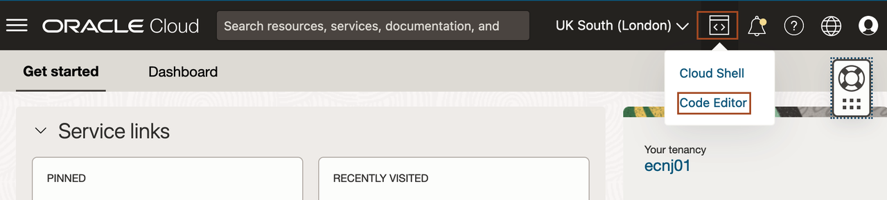
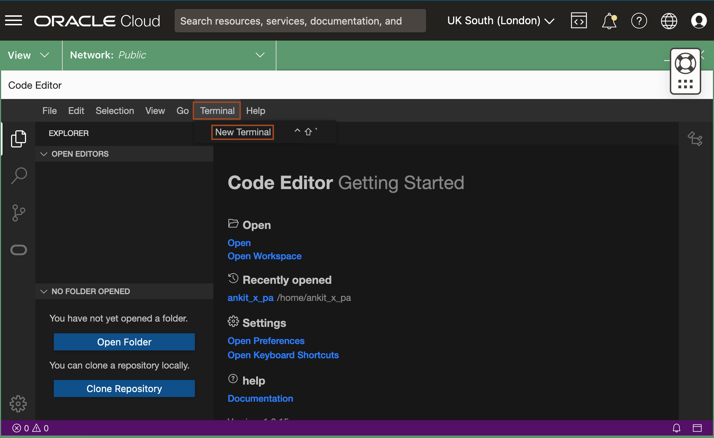
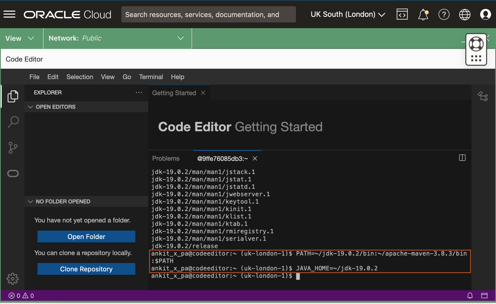

# Setup the Environment

## Introduction

This lab walks you through the steps to setup the required environment for the Workshop.

Estimated Time: 15 minutes

### About Code Editor

The Code Editor enables you to edit and deploy code for various OCI services directly from the OCI Console. You can now update service workflows and scripts without having to switch between the Console and your local development environments. This makes it easy to rapidly prototype cloud solutions, explore new services, and accomplish quick coding tasks.

Code Editor's direct integration with Cloud Shell allows you access to the GraalVM Enterprise Native Image and JDK 17 (Java Development Kit) pre-installed in Cloud Shell.


### Objectives
* Setup the Code Editor
* Download the required Maven and JDK version
* Download the Helidon source code

### Prerequisites

* You must have an [Oracle Cloud Infrastructure](https://cloud.oracle.com/en_US/cloud-infrastructure) enabled account.


## Task 1: Setup the Code Editor

1. In Cloud Console, click the Code Editor icon as shown.
    

2. In Code Editor, click Terminal -> New Terminal.
    

## Task 2: Download the required Maven and JDK version

1. Copy the following commands and paste in the terminal. It downloads the required version of JDK and Maven and set the PATH variable to use the required Maven and JDK.

    ```bash
    <copy>wget https://archive.apache.org/dist/maven/maven-3/3.8.3/binaries/apache-maven-3.8.3-bin.tar.gz
    tar -xvf apache-maven-3.8.3-bin.tar.gz
    wget https://download.oracle.com/java/19/latest/jdk-19_linux-x64_bin.tar.gz
    tar -xzvf jdk-19_linux-x64_bin.tar.gz
    PATH=~/jdk-19.0.2/bin:~/apache-maven-3.8.3/bin:$PATH
    JAVA_HOME=~/jdk-19.0.2</copy>
    ```
    

2. Copy the following command and run in the terminal to verify that required JDK and Maven version are configured properly.

    ```bash
    <copy>mvn -v</copy>
    ```

    you will have the output similar to the following:
    ```bash
    $ mvn -v 
    Apache Maven 3.8.3 (ff8e977a158738155dc465c6a97ffaf31982d739)
    Maven home: /home/ankit_x_pa/apache-maven-3.8.3
    Java version: 19.0.2, vendor: Oracle Corporation, runtime: /home/ankit_x_pa/jdk-19.0.2
    Default locale: en_US, platform encoding: UTF-8
    OS name: "linux", version: "4.14.35-2047.520.3.1.el7uek.x86_64", arch: "amd64", family: "unix"
    $ 
    ```

    > *You will use only this terminal for building and running the application as it has the required JDK and Maven version.*


## Task 3: Download the Helidon source code

1.  Copy the following commands and paste in the terminal to download the source code of helidon application.

    ```bash
    <copy>curl -LSs https://github.com/pandey-ankit/helidon-virtual-thread/blob/main/setup-environment/code/helidon-levelup-2023-main.zip?raw=true >~/helidon-levelup-2023-main.zip </copy>
    ```
    

2. Copy and paste the following command to unzip the *helidon-levelup-2023-main.zip*.
    ```bash
    <copy>unzip helidon-levelup-2023-main.zip</copy>
    ```


## Acknowledgements

* **Author** -  Joe DiPol
* **Contributors** - Ankit Pandey, Maciej Gruszka
* **Last Updated By/Date** - Ankit Pandey, Feb 2023
