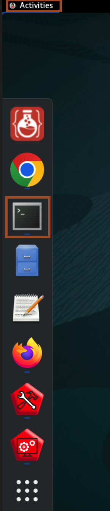

# Initialize Environment

## Introduction

In this lab we will review and startup all components required to successfully run this workshop.

*Estimated Lab Time:* 10 Minutes.

### Objectives
- Initialize the workshop environment.

### Prerequisites
This lab assumes you have:
- A Free Tier, Paid or LiveLabs Oracle Cloud account
- You have completed:
    - Lab: Prepare Setup (*Free-tier* and *Paid Tenants* only)


## Task 1: Validate that the WebLogic Server is up and running

1. Click **Activities** and then click **Firefox**.
    

2. Click **Local WLS** bookmark and we have saved the password for you, so click login.
    


## Task 2: Download the source code for workshop

1. Click **Activities** and then click **Terminal** icon to open the terminal.
    

2. Copy and paste the following command to download the zip file containing source code required for this workshop.
    ```bash
    <copy>curl -O https://objectstorage.uk-london-1.oraclecloud.com/p/ZJIQ7Ku0c8A2VyP5dFZViCQPnl1wVoYfrlm2UlW3YDIXcD96LmO0YMGJbX-T1GRw/n/lrv4zdykjqrj/b/ankit-bucket/o/wls-helidon.zip
    unzip ~/wls-helidon.zip
    cd ~/wls-helidon
    ls -ltra</copy>
    ```
    

3. Copy and paste the following command to deploy the traditional JAVA EE Best bank application.
    ```bash
    <copy>cd ~/Oracle/Middleware/Oracle_Home/user_projects/domains/test_domain/bin/
    . ./setDomainEnv.sh
    cd ~/wls-helidon
    java weblogic.Deployer -adminurl 't3://localhost:7001' -username weblogic -password Welcome1% -deploy -name bestbank -targets admin-server bestbank.war</copy>
    ```
    

4. In the Firefox, open the tab where you have Admin console running and click **Deployment**. you can see **bestbank** as deployed application.
    

5. Copy and paste the following URL in the new tab of the browser to access the application.
    ```bash
    <copy>http://localhost:7001/bestbank</copy>
    ```
    

You may now [proceed to the next lab](#next).


## Acknowledgements

* **Author** - Ankit Pandey
* **Contributors** - Sid Joshi, Maciej Gruszka
* **Last Updated By/Date** - Ankit Pandey, October 2024
