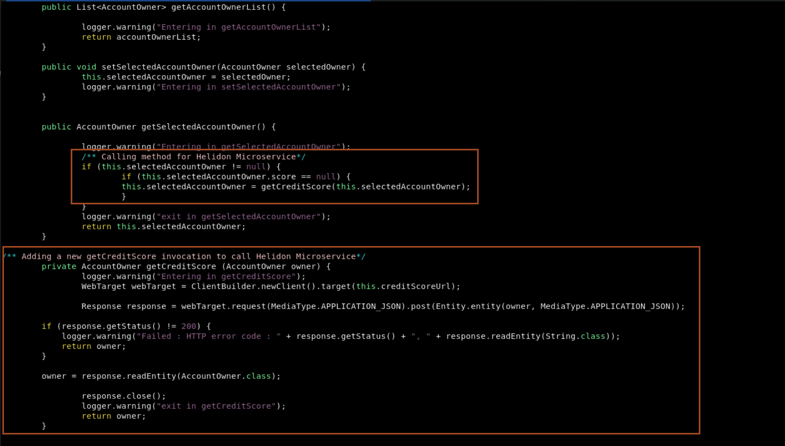
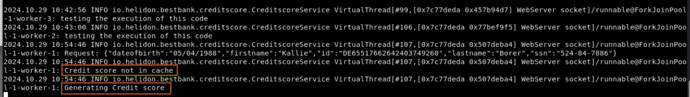

# Using WebLogic and Helidon Microservices

## Introduction

This lab walks you through the steps for deploying and testing the interoperability between WebLogic Bank Application, Coherence and Helidon Microservice for Credit Verification.

*Estimated Lab Time:* 30 minutes

### Objectives

* Create a Helidon MP application
* Integrate Coherence CE with in the Helidon MP application
* Modify Bank Web Application to use Credit Score microservice and deploy on WebLogic 

### Prerequisites
This lab assumes you have:
* A Free Tier, Paid or LiveLabs Oracle Cloud account
* You have completed:
    - Lab: Prepare Setup (*Free-tier* and *Paid Tenants* only)
    - Lab: Initialize Environment

### Lab Description

The very purpose of writing microservices is to do a small piece of job efficiently and reuse it multiple times in different applications. Helidon MP enables us to write one such microservice for this demo. BestBank, a hypothetical bank has an application. As part of that application, the bank’s credit division wants to build a simple UI which showcases the details of the top 15 customers with their SSN and IBAN numbers. The team wants to have a microservice which provides the credit score of the customer as output taking the user details like IBAN/SSNs as input. The IT developers create a CreditScore Microservice in Helidon and consume it in the current UI application listing the top 15 customers.

### Implementation Details and Assumptions
* The sample application UI is built to showcase JSF and CDI using XHTML
* The user data is not coming from database
* The Helidon Microservice written in the lab can be deployed on Docker/Kubernetes, but in this lab, we only run it from the JVM locally

### Lab Flow
This lab is designed for people with no prior experience with Kubernetes, Docker, WebLogic, Helidon and want to learn the core concepts and basics of how to run WebLogic JEE and Helidon microservices application.
* Develop new Credit Score function as microservice using Helidon MP and deploy on local JVM
* Modify Bank Web Application to use Credit Score microservice and deploy on WebLogic.
 
## Task 1: Develop new Credit Score Function
Proceed to Develop new Credit Score Function as microservice using Helidon MP and deploy on local JVM.


1. Open a **new tab** in the **terminal** and copy and paste the below command in the terminal to setup the required environment. This command download the required JDK 21 and Maven 3.8.3. Later it setup the environment variable PATH and JAVA_HOME. This setup is required to create Helidon microservice.

    ```
    <copy>wget https://archive.apache.org/dist/maven/maven-3/3.8.3/binaries/apache-maven-3.8.3-bin.tar.gz
    tar -xvf apache-maven-3.8.3-bin.tar.gz
    wget https://download.oracle.com/java/21/latest/jdk-21_linux-x64_bin.tar.gz
    tar -xzvf jdk-21_linux-x64_bin.tar.gz
    PATH=~/jdk-21.0.5/bin:~/apache-maven-3.8.3/bin:$PATH
    JAVA_HOME=~/jdk-21.0.5</copy>
    ```

2. Copy and paste the following command to verify the environment in the terminal.
    ```bash
    <copy>mvn -v</copy>
    ```

    You will have output similar to the below.
    ```bash
    $ mvn -v 
    Apache Maven 3.8.3 (ff8e977a158738155dc465c6a97ffaf31982d739)
    Maven home: /home/opc/apache-maven-3.8.3
    Java version: 21.0.5, vendor: Oracle Corporation, runtime: /home/opc/jdk-21.0.5
    Default locale: en_US, platform encoding: UTF-8
    OS name: "linux", version: "5.15.0-104.119.4.2.el8uek.x86_64", arch: "amd64", family: "unix"
    ```
3.	copy and paste the following command to navigate to `~/wls-helidon/microservice`

    ```bash
    <copy>cd ~/wls-helidon/microservice</copy>
    ```

4.	Generate the project sources using the Helidon Maven archetype. The result is a simple project that shows the basics of a MicroProfile application.

    ```bash
    <copy>
    mvn archetype:generate -DinteractiveMode=false \
    	-DarchetypeGroupId=io.helidon.archetypes \
    	-DarchetypeArtifactId=helidon-quickstart-mp \
    	-DarchetypeVersion=4.0.5 \
    	-DgroupId=io.helidon.bestbank \
    	-DartifactId=helidon-mp-creditscore \
    	-Dpackage=io.helidon.bestbank.creditscore
    </copy>
    ```

5. Copy and paste the following command to view the new Helidon project.
    ```bash
    <copy>ls -ltra</copy>
    ```
    

6.	Now create a new class called CreditscoreService in the same package where the Main.java is located.  Simply run the following to create the class file

    ```bash
    <copy>cd ~/wls-helidon/microservice/helidon-mp-creditscore/
    vi src/main/java/io/helidon/bestbank/creditscore/CreditscoreService.java</copy>
    ```

7. Copy and paste the below code to the class file.
    ```bash
    <copy>package io.helidon.bestbank.creditscore;

    import jakarta.enterprise.context.ApplicationScoped;
    import jakarta.inject.Inject;
    import jakarta.ws.rs.GET;
    import jakarta.ws.rs.POST;
    import jakarta.ws.rs.Path;
    import jakarta.ws.rs.Produces;
    import jakarta.ws.rs.Consumes;
    import jakarta.ws.rs.core.MediaType;
    import jakarta.ws.rs.core.Response;
    import jakarta.json.Json;
    import jakarta.json.JsonObject;

    import com.tangosol.net.CacheFactory;
    import com.tangosol.net.NamedCache;

    import static java.lang.System.Logger.Level.INFO;

    @ApplicationScoped
    @Path("/creditscore")
    public class CreditscoreService {

        private static final System.Logger logger = System.getLogger(CreditscoreService.class.getName());
        private static final String CACHE_NAME = "creditScoreCache";

        private static final int SCORE_MAX = 800;
        private static final int SCORE_MIN = 550;

        @Inject
        private NamedCache<String, Integer> creditScoreCache;

        public CreditscoreService() {
            this.creditScoreCache = CacheFactory.getCache(CACHE_NAME);
        }

        @GET
        @Path("/healthcheck")
        @Produces(MediaType.APPLICATION_JSON)
        public Response getHealthCheck() {
        logger.log(INFO, "testing the execution of this code");
            JsonObject returnObject = Json.createObjectBuilder()
                    .add("message", "The credit score provider is running.")
                    .build();
            return Response.ok(returnObject).build();
        }
        // Endpoint to handle POST requests to get or calculate a creditscore
        @POST
        @Consumes(MediaType.APPLICATION_JSON)
        @Produces(MediaType.APPLICATION_JSON)
        public Response postMethodCreditScore(JsonObject reqJson) {
        
            // Extract SSN from the request JSON Object.
            String ssn = reqJson.getString("ssn");

            // Retrieve the credit score from the cache based on SSN
            Integer creditScore = creditScoreCache.get(ssn);

        logger.log(INFO, "Request: {0}", reqJson);
            // If credit score is not found in cache,calculate it
            if (creditScore == null) {  
                
            logger.log(INFO, "Credit score not in cache");
                // calculate the credit score based on provided details
                creditScore = calculateCreditScore(reqJson.getString("firstname"),
                                                    reqJson.getString("lastname"),
                                                    reqJson.getString("dateofbirth"),
                                                    ssn);
                // Store the calculated credit score in cache
                creditScoreCache.put(ssn, creditScore);
            }
        
        else {
            logger.log(INFO, "Credit score from cache");
            
        }
            // Create a JSON object with the original request details plus the credit score
            JsonObject resJson = Json.createObjectBuilder(reqJson)
                    .add("score", creditScore)
                    .build();

            return Response.ok(resJson).build();
        }
        // Method to calculate a credit score based on given personal information
        private int calculateCreditScore(String firstName, String lastName, String dateOfBirth, String ssn) {

            int score = Math.abs(firstName.hashCode() + lastName.hashCode() + dateOfBirth.hashCode() + ssn.hashCode());
        logger.log(INFO, "Generating Credit score");
            score = score % SCORE_MAX;

            while (score < SCORE_MIN) {
                score = score + 100;
            }
            return score;
        }
    }
    </copy>
    ```
    > Please note the code above accepts a GET for healthcheck and POST method to calculate the credit score value based on the account owner's details which passed using JSON. We have explained the code in comments. 


8. Modify the pom file for helidon application to include the dependency for coherence as explained in code below.
    ```bash
    <copy>vi /home/opc/wls-helidon/microservice/helidon-mp-creditscore/pom.xml</copy>
    ```

9. copy and paste the below code just after the parent tag, to specify the coherence version in the pom file.
    ```bash
    <copy><properties>
        <version.lib.coherence>24.03.1</version.lib.coherence>
    </properties></copy>
    ```

10. copy and paste the below code in dependencies, to add the dependency for coherence cdi server and coherence mp config.
    ```bash
    <copy><dependency>
            <groupId>com.oracle.coherence.ce</groupId>
            <artifactId>coherence-cdi-server</artifactId>
            <version>${version.lib.coherence}</version>
        </dependency>

        <dependency>
            <groupId>com.oracle.coherence.ce</groupId>
            <artifactId>coherence-mp-config</artifactId>
            <version>${version.lib.coherence}</version>
        </dependency></copy>
    ```
    


11. Build the project:

    ```
    <copy>cd ~/wls-helidon/microservice/helidon-mp-creditscore/
    mvn clean package -DskipTests</copy>
    ```

    This will create the executable jar file of the Helidon Microservice under the folder “target”

    ```
    <copy>
    ls -alrt target/helidon-mp-creditscore.jar
    </copy>
    ```

12. Copy and paste the following command to run Helidon MP application.
    ```bash
    <copy>java -jar -Dcoherence.ttl=0 -Djava.net.preferIPv4Stack=true -Dcoherence.localhost=127.0.0.1 -Dcoherence.wka=127.0.0.1 target/helidon-mp-creditscore.jar</copy>
    ```
    

13. In the browser, check if the CreditScore Microservice application is running by checking the health check url `http://localhost:8080/creditscore/healthcheck`
    '''bash
    <copy>http://localhost:8080/creditscore/healthcheck</copy>
    


## Task 2: Modify Bank Web Application
Proceed to Modify Bank Web Application To Use Credit Score Microservice & Deploy On WebLogic

Before the deployment of the Bank Web Application to consume Microservice, the following changes will be made:
  -	Modify the User Interface. Create View button which opens Account Owner details window. This detail window will show the credit score value of the Account Owner.
  -	Modify the server side bean to invoke Credit Score Microservices Application.
  -	Configure the endpoint for the Bank Web Application.
  -	Deploy new web application

### Modify user Interface

1. Open a new tab in the terminal, so we use preview tab for building and running the helidon application.

2. Open for view the updated `~/wls-helidon/src/main/webapp/index.xhtml` HTML file.

    ```
    <copy>vi ~/wls-helidon/src/main/webapp/index.xhtml</copy>
   	```

3. we have provided you the updated file. We have added the View button which opens Account Owner details window. We also define the details window which will show the credit score value of the Account owner as shown in below screenshot.
    


### Modify Server Side Bean
4. Open for view the updated `~/wls-helidon/src/main/java/com/oracle/oow19/wls/bestbank/AccountOwnerBean.java` class file.

    ```
    <copy>vi ~/wls-helidon/src/main/java/com/oracle/oow19/wls/bestbank/AccountOwnerBean.java</copy>
    ```

6. We did the following changes in the code as shown in below screenshot.

    - The postConstruct method modified to read the end point URL from the property file.
    - New getCreditScore method created to calculate the credit score value of the Account Owner.
    - Finally include the new method invocation in getSelectedAccountOwner method which is triggered by the View button on the User Interface.

    
    

### Configure End-Point

1. The last file we modifed is the `~/wls-helidon/src/main/resources/app.properties` file.

    The Bank Web Application reads this properties file to know the endpoint's URL. Obviously this solution is just for demo purposes, because in real microservices architecture the best practice is to use additional tools for better service/API management.

    ```
    <copy>vi ~/wls-helidon/src/main/resources/app.properties</copy>
   	```
    


### Deploy Modified Web Application

1. Open a new tab in the terminal.

2. Change the directory to wls-helidon where the Bank Application code reside. we also set the environment for deploying the Best bank application.

    ```bash
    <copy>cd ~/Oracle/Middleware/Oracle_Home/user_projects/domains/test_domain/bin/
    . ./setDomainEnv.sh
    PATH=~/apache-maven-3.8.3/bin:$PATH
    cd ~/wls-helidon/</copy>
    ```

3. Run the following Maven command to deploy the modifid best bank application.

    ```
    <copy>mvn clean package</copy>
    ```
    

    When the build is complete and successful, open the browser and access the new bank application using the URL *`http://localhost:7001/bestbank-2/`*

    ```bash
    <copy>http://localhost:7001/bestbank-2/</copy>
    ```
    

4. Select an Account Owner and click the new View button.	A pop-up window with CreditScore information of the user is seen. 
    

5. Go back to tab in the terminal, where helidon server is running and check the logs. As we are accessing the details for this customer first time, the Helidon application generates the credit score.
    

6. Go back to the browser and again select the same customer and click the View button. You can see, it is the same credit score, which we saw last time as well. Click the Cross icon to close this. Now Go back to the same tab in the terminal, and you can see the logs, Credit score from cache.
    


*Congratulations! You have successfully completed the workshop*

## Acknowledgements
* **Author** - Ankit Pandey
* **Contributors** - Sid Joshi, Maciej Gruszka
* **Last Updated By/Date** - Ankit Pandey, October 2024
