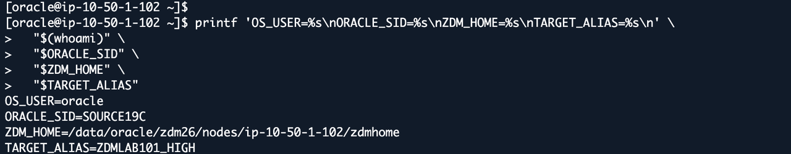
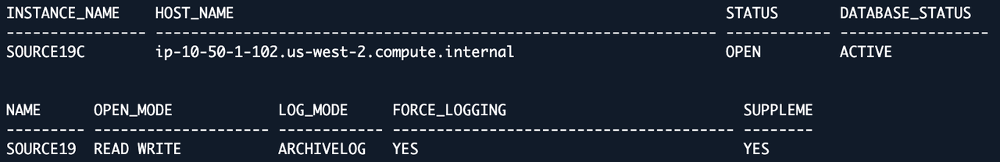
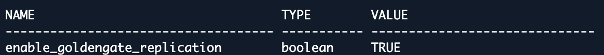
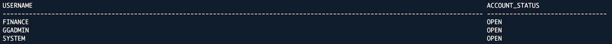
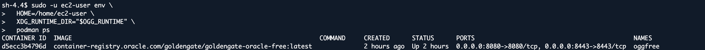
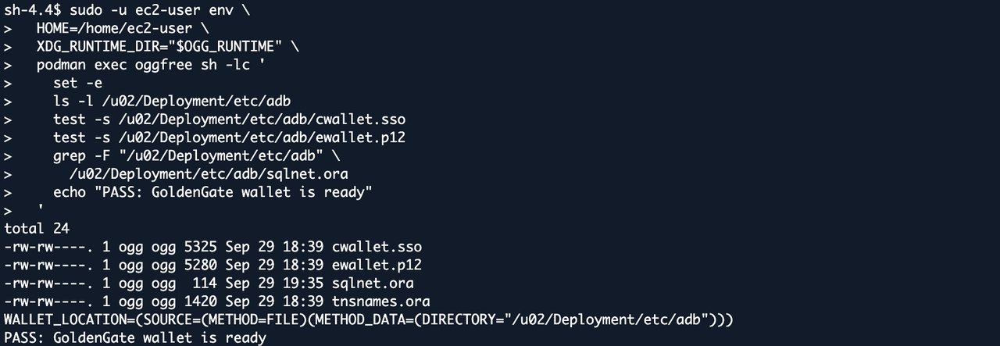
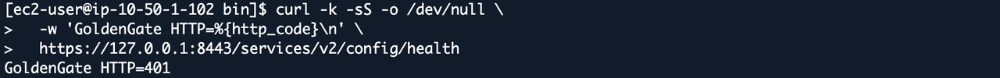

# Lab 1: Confirm the Migration Architecture and Preflight Checks

## Introduction

The source database and ZDM run on the assigned EC2 host. GoldenGate runs in the lab's Podman container. Data Pump performs the initial load using EFS; GoldenGate keeps the target synchronized afterward.

Estimated Time: 15 minutes

### Objectives

Identify your assigned resources, verify source access, and confirm readiness before migration.

## Task 1: Load Your Assigned Environment

Open your assigned EC2 Session Manager session from the EC2 console, or run this in **AWS CloudShell as `cloudshell-user`**. Enter your assigned instance ID, not another participant's instance:

```bash
read -rp "Assigned EC2 instance ID: " ASSIGNED_INSTANCE_ID
aws ssm start-session --region us-west-2 --target "$ASSIGNED_INSTANCE_ID"
```

The following commands run on **the assigned EC2**, not CloudShell or the runner. At the **Linux shell as `ssm-user`**, switch to `oracle`:

```bash
sudo -iu oracle
```

Load the source and assigned lab environments in the **`oracle` shell**:

```bash
source "$HOME/env/source19c.env"
source /etc/profile.d/zdm26.sh
source /data/oracle/lab/config/lab-env.sh
export ZDMCLI="$ZDM_HOME/bin/zdmcli"
```

Print your lab assignment. Check that the Lab ID and target are the ones assigned to you:

```bash
printf 'Lab=%s\nRegion=%s\nSource=%s\nTarget=%s\nEFS=%s\n' \
  "$LAB_ID" "$AWS_REGION" "$SOURCE_PRIVATE_IP" "$TARGET_HOST" "$EFS_DNS"
```

Check that the ZDM executable and response file are accessible:

```bash
test -x "$ZDMCLI" && test -r "$ZDM_RESPONSE_FILE"
```

Validate the generated ZDM response file. Require the final `ZDM_RESPONSE_VALID` marker:

```bash
/data/oracle/lab/bin/validate-zdm-response.sh
```

Stop if a value is blank, the Lab ID is wrong, or validation fails. A missing validator means provisioning is incomplete. Do not source CloudShell provisioning environments on EC2.

Confirm the user and Oracle environment:

```bash
printf 'OS_USER=%s\nORACLE_SID=%s\nZDM_HOME=%s\nTARGET_ALIAS=%s\n' \
  "$(whoami)" "$ORACLE_SID" "$ZDM_HOME" "$TARGET_ALIAS"
```

Example from Lab 101: the OS user is `oracle`, the source SID is `SOURCE19C`, and the target alias belongs to the assigned lab. Hostnames, IDs, paths, and addresses in screenshots are examples, not values to copy into another lab.



## Task 2: Verify Source SSH

Run as `oracle`. The key belongs to this instance:

```bash
export ZDM_SOURCE_SSH_KEY="$HOME/.ssh/zdm_source_ed25519"
test -s "$ZDM_SOURCE_SSH_KEY" && echo "PASS: key exists"
```

Test same-host SSH and the switch to `oracle`:

```bash
ssh -i "$ZDM_SOURCE_SSH_KEY" -o BatchMode=yes \
  -o StrictHostKeyChecking=yes "ec2-user@$(hostname -f)" \
  'whoami; sudo -n -iu oracle whoami'
```

Expect `ec2-user`, then `oracle`. If the key or verified host-key entry is missing, ask the instructor to repair provisioning. Do not disable host-key checks or copy private keys.

## Task 3: Verify the Source Database

At the **`oracle` shell**, open the source database:

```bash
sqlplus / as sysdba
```

At `SQL>` (do not paste shell commands here):

```sql
SET LINESIZE 220
SET PAGESIZE 100
SELECT instance_name, host_name, status, database_status FROM v$instance;
SELECT name, open_mode, log_mode, cdb, force_logging,
       supplemental_log_data_min FROM v$database;
```

At **source `SQL>`**, check the replication and memory settings without changing them:

```sql
SHOW PARAMETER enable_goldengate_replication
SHOW PARAMETER sga_target
SHOW PARAMETER sga_max_size
SHOW PARAMETER streams_pool_size
```

Check the source accounts and record the initial row count:

```sql
SELECT username, account_status FROM dba_users
WHERE username IN ('SYSTEM','GGADMIN','FINANCE') ORDER BY username;
SELECT COUNT(*) AS source_baseline FROM finance.accounts;
```

Return to the **`oracle` shell**:

```sql
EXIT
```

Expect OPEN/ACTIVE, READ WRITE, ARCHIVELOG, FORCE_LOGGING=YES, supplemental logging enabled, replication enabled, and the listed accounts open. Record the count. Memory queries are read-only diagnostics; do not change parameters or reset passwords.

Source database state (Lab 101 example):



GoldenGate replication setting:



Account status:



## Task 4: Check Network and Service Readiness

Run these read-only connectivity checks from the **`oracle` EC2 shell**:

```bash
getent hosts "$TARGET_HOST"
getent hosts "$EFS_DNS"
```

Check the database and NFS ports:

```bash
nc -vz -w 5 "$TARGET_HOST" 1521
nc -vz -w 5 "$TARGET_HOST" 1522
nc -vz -w 5 "$EFS_DNS" 2049
```

Check the ZDM service:

```bash
"$ZDM_HOME/bin/zdmservice" status
```

ZDM evaluation in Lab 3 checks the GoldenGate deployment and database connectivity. Stop here if a connectivity or service check fails.

### Check the Rootless Podman Container

Return from the `oracle` login shell to **`ssm-user`** with `exit`. If already `ssm-user`, do not exit the Session Manager session. Confirm with `whoami`, then run:

```bash
exit
```

Confirm the current user before checking the container:

```bash
whoami
```

Run Podman as the container owner, `ec2-user`:

```bash
OGG_UID="$(id -u ec2-user)"
OGG_RUNTIME="/tmp/xdg-runtime-${OGG_UID}"
sudo -u ec2-user env \
  HOME=/home/ec2-user \
  XDG_RUNTIME_DIR="$OGG_RUNTIME" \
  podman ps
```

The container owner is `ec2-user`; expect `oggfree` to report `Up`.



### Validate the Wallet Inside GoldenGate

Run in the same **`ssm-user` shell**:

```bash
OGG_UID="$(id -u ec2-user)"
OGG_RUNTIME="/tmp/xdg-runtime-${OGG_UID}"
sudo -u ec2-user env \
  HOME=/home/ec2-user \
  XDG_RUNTIME_DIR="$OGG_RUNTIME" \
  podman exec oggfree sh -lc '
    set -e
    ls -l /u02/Deployment/etc/adb
    test -s /u02/Deployment/etc/adb/cwallet.sso
    test -s /u02/Deployment/etc/adb/ewallet.p12
    grep -F "/u02/Deployment/etc/adb" \
      /u02/Deployment/etc/adb/sqlnet.ora
    echo "PASS: GoldenGate wallet is ready"
  '
```



### Check the GoldenGate Endpoint

From **`ssm-user`**, run the local check as `ec2-user`:

```bash
sudo -u ec2-user curl -k -sS -o /dev/null \
  -w 'GoldenGate HTTP=%{http_code}\n' \
  https://127.0.0.1:8443/services/v2/config/health
```

`-k` is limited to this localhost diagnostic against the workshop's self-signed certificate; do not use it to relax other connection checks.



HTTP `200` or `401` demonstrates that the endpoint answered; `401` does not prove authenticated GoldenGate readiness. Use ZDM evaluation as well. Do not rerun provisioning or change container settings.

Remain in the **`ssm-user` shell** for Lab 2. EC2 connectivity does not prove ADB-to-EFS connectivity; Lab 2 tests that path. Stop on failed checks rather than changing the provisioned infrastructure.

## Acknowledgements

* **Author** - Arnab Saha, Principal Solutions Architect, OCI Multicloud
* **Author** - Vineet Agarwal, Senior Principal Solutions Architect, OCI Multicloud
* **Last Updated By/Date** - Arnab Saha and Vineet Agarwal / September 30, 2026
