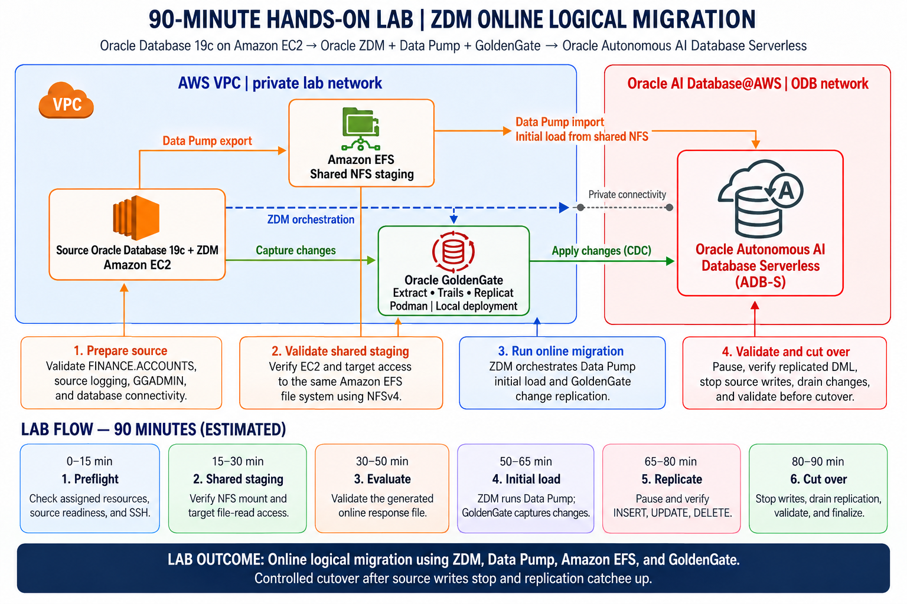

# Online Database Migration on AWS with Oracle ZDM and GoldenGate

## Introduction

Migrate `FINANCE.ACCOUNTS` from self-managed Oracle Database 19c on Amazon EC2 to Oracle Autonomous AI Database Serverless on Oracle AI Database@AWS. ZDM orchestrates an **online logical migration**: Data Pump loads the initial data through shared Amazon EFS, and GoldenGate captures and applies subsequent source changes. EFS carries the dump set, not the GoldenGate change stream.

The source can accept writes during initial load and replication. Controlled cutover still requires stopping source application writes, letting replication catch up, and validating the target before redirecting the application. Online migration is not a guarantee of zero application downtime.

Estimated Workshop Time: 90 minutes, excluding instructor provisioning. Actual timings depend on the environment.

### Objectives

- Verify source, target, GoldenGate, and shared NFS staging.
- Evaluate the generated `ONLINE_LOGICAL` response file.
- Run ZDM with a pause after `ZDM_MONITOR_GG_LAG`.
- Demonstrate committed changes replicating to the target.
- Validate data and perform an instructor-approved cutover.

### Prerequisites and responsibilities

The instructor provisions EC2, the target database, EFS, networking, database users, GoldenGate, target wallet, and source SSH access. Participants use their assigned resources only; AWS administrator permissions and infrastructure creation are not required. The lab's database administrative credentials are separate from AWS IAM permissions and must be supplied through the approved workshop credential process.

Use the generated `/data/oracle/lab/config/lab-env.sh` and `zdm-response-online.rsp`. Source SID/service is `SOURCE19C`; scope is `FINANCE.ACCOUNTS`. Do not copy old prototype IPs, PDB names, tables, or job IDs. Record actual counts, not a fixed expected count.

Participant SQL connections use password-authenticated TLS on port 1521. ZDM uses the assigned target wallet and wallet service alias on TCPS port 1522. Do not replace one configuration with the other. Keep credentials and wallet contents out of this repository.

### Workshop flow

1. Architecture and preflight — 15 minutes.
2. Verify shared NFS staging — 15 minutes.
3. Review configuration and evaluate — 20 minutes.
4. Execute, monitor, demonstrate replication, validate, and cut over — 40 minutes.

For product behavior beyond this lab, see the [ZDM 26.1 migration guide](https://docs.oracle.com/en/database/oracle/zero-downtime-migration/26.1/zdmug/migrating-with-zero-downtime-migration.html).

## Acknowledgements

* **Author** - Arnab Saha, Principal Solutions Architect, OCI Multicloud
* **Author** - Vineet Agarwal, Senior Principal Solutions Architect, OCI Multicloud
* **Last Updated By/Date** - Arnab Saha and Vineet Agarwal / September 28, 2026
