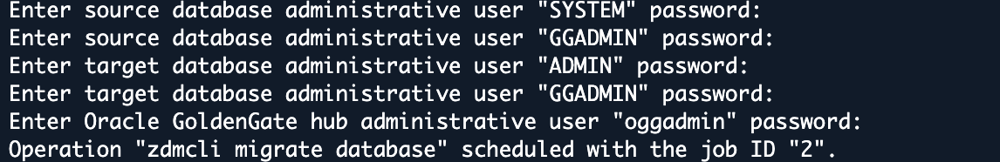

# Lab 4: Execute, Monitor, and Validate the Online Migration

## Introduction

Start the evaluated online migration, pause with replication running, demonstrate source DML on the target, and complete a controlled cutover. Use your own job IDs and log paths. No fixed duration or row count is promised.

Estimated Time: 40 minutes

### Objectives

Run Data Pump and GoldenGate through ZDM, verify committed changes, and retain cutover evidence.

## Task 1: Start with a Replication Pause

1. At the EC2 shell as `oracle`, load the environment after successful evaluation and NFS validation.

    ```bash
    <copy>
    source "$HOME/env/source19c.env"
    source /etc/profile.d/zdm26.sh
    source /data/oracle/lab/config/lab-env.sh
    export ZDMCLI="$ZDM_HOME/bin/zdmcli"
    export ZDM_SOURCE_SSH_KEY="$HOME/.ssh/zdm_source_ed25519"
    </copy>
    ```

2. Submit the migration once.

    ```bash
    <copy>
    "$ZDMCLI" migrate database \
      -sourcesid "$ORACLE_SID" \
      -sourcenode "$(hostname -f)" \
      -srcauth zdmauth \
      -srcarg1 user:ec2-user \
      -srcarg2 "identity_file:$ZDM_SOURCE_SSH_KEY" \
      -srcarg3 sudo_location:/usr/bin/sudo \
      -rsp "$ZDM_RESPONSE_FILE" \
      -pauseafter ZDM_MONITOR_GG_LAG
    </copy>
    ```

    

3. Supply the prompted credentials and record the new migration ID.

    

4. Query the returned migration job ID. The commands in this page use **2**, matching the Lab 101 example. If your migration ID differs, replace `2` in every job query, resume command, and job-specific filename below. Do not use the evaluation job ID.

    ```bash
    <copy>
    "$ZDMCLI" query job -jobid 2
    </copy>
    ```

## Task 2: Monitor Initial Load and Replication

Example submission from Lab 101: `-pauseafter ZDM_MONITOR_GG_LAG` requests a later pause. Receiving job ID `2` confirms scheduling, not completion or arrival at the pause. Use your own returned migration job ID.

1. Repeat this query periodically from the **`oracle` EC2 shell**, not the migration submission.

    ```bash
    <copy>
    "$ZDMCLI" query job -jobid 2
    </copy>
    ```

2. Confirm that the job reaches these milestones in order:

    - Source, target, GoldenGate hub, and Data Pump validation.
    - GoldenGate source preparation and Extract creation.
    - Data Pump export to EFS, shared-storage transfer phase, and target import.
    - Replicat creation/start and lag monitoring.
    - Job `PAUSED` after `ZDM_MONITOR_GG_LAG` completes.

    The paused state is intentional. Extract and Replicat should be running at this checkpoint. Check their reported state and heartbeat lag. Zero throughput can mean an idle source; it does not by itself indicate failure.

3. Use the result-log path printed by the job query.

    ```bash
    <copy>
    read -rp "Exact result log path from query output: " JOB_LOG
    </copy>
    ```

4. Read the latest log entries.

    ```bash
    <copy>
    tail -80 "$JOB_LOG"
    </copy>
    ```

5. List this job’s dump files.

    ```bash
    <copy>
    find "$EFS_MOUNT_POINT" -maxdepth 1 -type f -name "ZDM_2_*" -ls
    </copy>
    ```

    If import remains STARTED, inspect the current log and Data Pump evidence before concluding it is stuck.

    For a FAILED job, stop and retain the error and result log. Do not skip a failed phase or restart the entire migration.

## Task 3: Demonstrate INSERT, UPDATE, and DELETE Replication

Run only while the migration is paused after lag monitoring, before cutover. Use the three test rows below. Never run this DML on the target.

1. Load the source environment in the **oracle EC2 shell**.

    ```bash
    <copy>
    source "$HOME/env/source19c.env"
    </copy>
    ```

2. Open the source database.

    ```bash
    <copy>
    sqlplus / as sysdba
    </copy>
    ```

3. At **source SQL>**, inspect the table structure.

    ```sql
    <copy>
    DESC finance.accounts
    </copy>
    ```

4. Check that the demonstration IDs are unused.

    ```sql
    <copy>
    SELECT account_id, account_number, balance, status
    FROM finance.accounts
    WHERE account_id IN (99000101,99000102,99000103)
    ORDER BY account_id;
    </copy>
    ```

    Continue only if this returns `no rows selected`. If any ID exists, stop.

5. Insert the three demonstration rows.

    ```sql
    <copy>
    INSERT INTO finance.accounts
      (account_id, account_number, account_type, balance, opened_date, status)
    VALUES
      (99000101, 'ZDM-ONLINE-101', 'CHECKING', 1001.01, SYSDATE, 'ACTIVE');

    INSERT INTO finance.accounts
      (account_id, account_number, account_type, balance, opened_date, status)
    VALUES
      (99000102, 'ZDM-ONLINE-102', 'SAVINGS', 1002.02, SYSDATE, 'ACTIVE');

    INSERT INTO finance.accounts
      (account_id, account_number, account_type, balance, opened_date, status)
    VALUES
      (99000103, 'ZDM-ONLINE-103', 'CREDIT', 1003.03, SYSDATE, 'ACTIVE');
    </copy>
    ```

6. Require three successful inserts. If any statement fails, run `ROLLBACK;` and stop. Update the first row using the six-character status `ZDMUPD`, which fits the lab's `STATUS` column.

    ```sql
    <copy>
    UPDATE finance.accounts
    SET balance = 7777.77, status = 'ZDMUPD'
    WHERE account_id = 99000101;
    </copy>
    ```

7. Expect one row updated. Delete the second demonstration row.

    ```sql
    <copy>
    DELETE FROM finance.accounts WHERE account_id = 99000102;
    </copy>
    ```

8. Expect one row deleted. Commit the changes.

    ```sql
    <copy>
    COMMIT;
    </copy>
    ```

9. Record the committed source results.

    ```sql
    <copy>
    SELECT account_id, account_number, balance, status
    FROM finance.accounts
    WHERE account_id IN (99000101,99000102,99000103)
    ORDER BY account_id;
    </copy>
    ```

    Expect ID `99000101` with balance `7777.77` and status `ZDMUPD`, and ID `99000103` with balance `1003.03` and status `ACTIVE`. ID `99000102` must be absent.

10. Return to the **oracle shell**.

    ```sql
    <copy>
    EXIT
    </copy>
    ```

11. Load the target environment.

    ```bash
    <copy>
    source "$HOME/env/adbs.env"
    </copy>
    ```

12. Connect to the target as ADMIN and enter the password at the prompt.

    ```bash
    <copy>
    sqlplus -L ADMIN@"$TARGET_ALIAS"
    </copy>
    ```

13. At **target SQL>**, query the same rows.

    ```sql
    <copy>
    SET LINESIZE 220
    SELECT account_id, account_number, balance, status
    FROM finance.accounts
    WHERE account_id IN (99000101,99000102,99000103)
    ORDER BY account_id;
    </copy>
    ```

    Repeat this SELECT until it matches the committed source results. Replication is asynchronous. Do not write to the target or rerun the source inserts. Stop if the results do not converge.

14. Return to the **oracle shell**.

    ```sql
    <copy>
    EXIT
    </copy>
    ```

## Task 4: Resume the Same Job for Cutover

1. Stop all source application writes and finish or roll back outstanding transactions **before** resuming. In this lab, stop the DML test and any workload generator. Do not stop the database, listener, or GoldenGate manually.

2. Load ZDM in the **oracle shell**.

    ```bash
    <copy>
    source /etc/profile.d/zdm26.sh
    export ZDMCLI="$ZDM_HOME/bin/zdmcli"
    </copy>
    ```

3. Confirm the same migration job is paused at the expected phase.

    ```bash
    <copy>
    "$ZDMCLI" query job -jobid 2
    </copy>
    ```

4. After the replication test passes, resume the job once.

    ```bash
    <copy>
    "$ZDMCLI" resume job -jobid 2
    </copy>
    ```

5. Repeat this query until the job reports `SUCCEEDED`.

    ```bash
    <copy>
    "$ZDMCLI" query job -jobid 2
    </copy>
    ```

    Do not run `migrate database` again. A resumed job retains its job ID. If disconnected, reconnect, load the environment from Task 1, enter the existing job ID, and query it. Keep source writes stopped after cutover.

## Task 5: Retain Evidence

1. After the migration reports `SUCCEEDED`, load the target environment from the **`oracle` EC2 shell**.

    ```bash
    <copy>
    source "$HOME/env/adbs.env"
    </copy>
    ```

2. Check that the supplied validation script exists.

    ```bash
    <copy>
    test -r /data/oracle/lab/config/validate-zdm-accounts.sql \
      && echo "PASS: validation script exists" \
      || echo "STOP: validation script is missing"
    </copy>
    ```

3. If it exists, run the script and enter the target ADMIN password.

    ```bash
    <copy>
    "$ORACLE_HOME/bin/sqlplus" -L ADMIN@"$TARGET_ALIAS" \
      @/data/oracle/lab/config/validate-zdm-accounts.sql
    </copy>
    ```

    If the file is missing, stop; skipped validation is not a pass. Review the table, row count, allocated space, and any SQL errors. This script reports target data; it does not automatically prove source/target equality. Retain the matching DML results from Task 3 as separate evidence.

4. Load ZDM to save the final report using the same migration job ID recorded in Task 1.

    ```bash
    <copy>
    source /etc/profile.d/zdm26.sh
    export ZDMCLI="$ZDM_HOME/bin/zdmcli"
    </copy>
    ```

5. Write the final job report to your home directory.

    ```bash
    <copy>
    "$ZDMCLI" query job -jobid 2 \
      | tee "$HOME/zdm-job-2-final.txt"
    </copy>
    ```

6. Record Lab ID, evaluation/migration job IDs, start/end times, phase statuses, sanitized response file, CPAT/excluded-object reports, Data Pump logs, replication metrics, and source/target validation results. Obtain paths from your job rather than copying prototype paths.

    Do not upload passwords, private SSH keys, wallet contents, or unsanitized environment files. Participants do not delete shared infrastructure or rerun fleet provisioning.

## Acknowledgements

* **Author** - Arnab Saha, Principal Solutions Architect, OCI Multicloud
* **Author** - Vineet Agarwal, Senior Principal Solutions Architect, OCI Multicloud
* **Last Updated By/Date** - Arnab Saha and Vineet Agarwal / September 30, 2026
