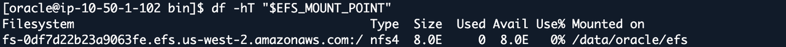
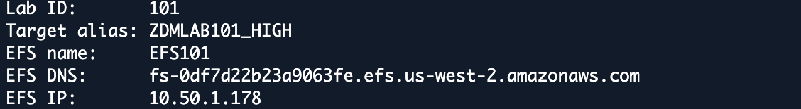
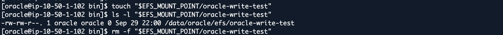
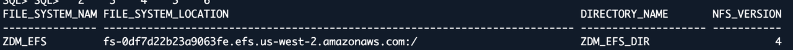
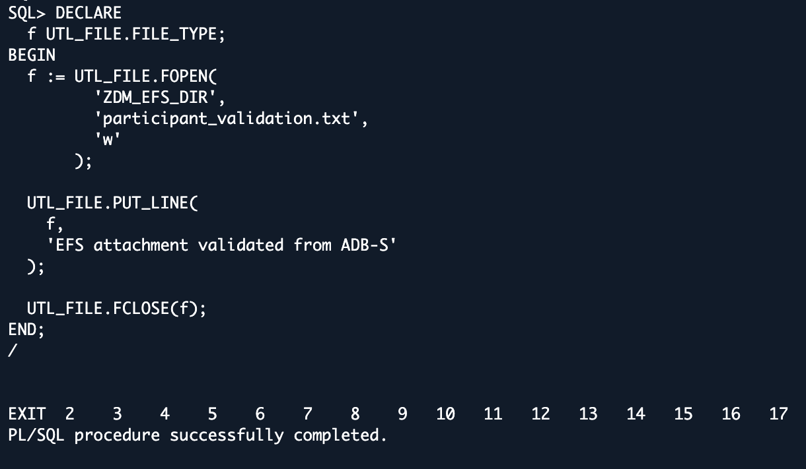

# Lab 2: Verify Shared Amazon EFS NFS Staging

## Introduction

Verify your assigned staging filesystem. The source directory is `DATA_PUMP_DIR_NFS`; the target directory is `ZDM_EFS_DIR`. This lab uses NFSv4. Complete these checks before starting migration.

Estimated Time: 15 minutes

### Objectives

Confirm the EC2 mount, match target attachment metadata, and verify that a file written by ADB-S can be read on EC2.

## Task 1: Check the Source Mount

1. Before migration, run the provided mount helper from **EC2 Session Manager as `ssm-user`**. If continuing in the `oracle` login shell from Lab 1, use `exit` once to return to `ssm-user`; check `whoami` before proceeding.

    ```bash
    <copy>
    sudo /data/oracle/lab/bin/mount-efs.sh
    </copy>
    ```

2. Switch to **`oracle`**.

    ```bash
    <copy>
    sudo -iu oracle
    </copy>
    ```

3. Load the source and assigned lab environments.

    ```bash
    <copy>
    source "$HOME/env/source19c.env"
    source /data/oracle/lab/config/lab-env.sh
    </copy>
    ```

    The helper uses the assigned configuration. Do not run it to repair storage during an active migration; escalate instead.

4. Continue at the EC2 shell as **`oracle`** and display the assigned EFS values.

    ```bash
    <copy>
    echo "$EFS_DNS"
    echo "$EFS_IP"
    echo "$EFS_MOUNT_POINT"
    </copy>
    ```

5. Check the filesystem mounted at that path.

    ```bash
    <copy>
    findmnt -T "$EFS_MOUNT_POINT" -o TARGET,SOURCE,FSTYPE,OPTIONS
    df -hT "$EFS_MOUNT_POINT"
    </copy>
    ```

6. Check write access for `oracle`.

    ```bash
    <copy>
    test -w "$EFS_MOUNT_POINT" && echo "PASS: staging writable"
    </copy>
    ```

    Confirm NFS/NFS4, the assigned EFS source, and the expected mount path. A local root filesystem is not an EFS mount. Stop if any check fails.

    

    Example: Lab 101 uses `/data/oracle/efs`. Use your generated environment values, not the screenshot's filesystem ID or IP. These checks do not require recreating the mount.

7. Load the target environment and construct the EFS resource name.

    ```bash
    <copy>
    source "$HOME/env/adbs.env"
    export EFS_NAME="EFS${RESOURCE_LAB_ID:-$LAB_ID}"
    </copy>
    ```

8. Print the assigned EFS and target details.

    ```bash
    <copy>
    printf 'Lab ID: %s\nTarget alias: %s\nEFS name: %s\nEFS ID: %s\nEFS DNS: %s\nEFS IP: %s\nMount: %s\n' \
      "$LAB_ID" "$TARGET_ALIAS" "$EFS_NAME" "$EFS_ID" \
      "$EFS_DNS" "$EFS_IP" "$EFS_MOUNT_POINT"
    </copy>
    ```

    

9. Test write access using `oracle-write-test`. If `oracle-write-test` already exists, stop before running this test.

    ```bash
    <copy>
    touch "$EFS_MOUNT_POINT/oracle-write-test"
    ls -l "$EFS_MOUNT_POINT/oracle-write-test"
    </copy>
    ```

    

10. Remove the write-test file you just created.

    ```bash
    <copy>
    rm -f "$EFS_MOUNT_POINT/oracle-write-test"
    </copy>
    ```

## Task 2: Check the Target Attachment

1. At the shell, use the generated SQL alias to check connectivity.

    ```bash
    <copy>
    source "$HOME/env/adbs.env"
    "$ORACLE_HOME/bin/tnsping" "$TARGET_ALIAS"
    </copy>
    ```

2. Connect to the target as ADMIN and enter the supplied password at the prompt.

    ```bash
    <copy>
    sqlplus -L admin@"$TARGET_ALIAS"
    </copy>
    ```

3. At `SQL>`, display the target identity.

    ```sql
    <copy>
    SET LINESIZE 220
    SET PAGESIZE 100
    COLUMN file_system_name FORMAT A15
    COLUMN file_system_location FORMAT A75
    COLUMN directory_name FORMAT A20
    SELECT SYS_CONTEXT('USERENV','DB_NAME') AS db_name,
           SYS_CONTEXT('USERENV','SERVICE_NAME') AS service_name,
           SYS_CONTEXT('USERENV','CURRENT_USER') AS current_user FROM dual;
    </copy>
    ```

4. Check the attached filesystem and database directory at **target `SQL>`**.

    ```sql
    <copy>
    SELECT file_system_name, file_system_location, directory_name,
           directory_path, nfs_version
    FROM dba_cloud_file_systems WHERE directory_name='ZDM_EFS_DIR';
    SELECT directory_name, directory_path FROM dba_directories
    WHERE directory_name='ZDM_EFS_DIR';
    </copy>
    ```

    Match the location against your assigned EFS hostname and export path, and confirm NFS version 4. Metadata alone is not an I/O test.

    

    The example's attachment name is `ZDM_EFS`; the AWS resource name is `EFS101`. Compare the filesystem location and directory, rather than requiring those two names to be identical.

5. Return to the **`oracle` shell**.

    ```sql
    <copy>
    EXIT
    </copy>
    ```

## Task 3: Validate a Target Write from EC2

1. Before starting migration, connect to the target as ADMIN from the **`oracle` EC2 shell**.

    ```bash
    <copy>
    source "$HOME/env/adbs.env"
    sqlplus -L admin@"$TARGET_ALIAS"
    </copy>
    ```

2. At **target `SQL>`**, write `participant_validation.txt`. This replaces that test file if it already exists; use it only for the workshop validation. Use the existing provisioned `ZDM_EFS_DIR`.

    ```sql
    <copy>
    DECLARE
      f UTL_FILE.FILE_TYPE;
    BEGIN
      f := UTL_FILE.FOPEN('ZDM_EFS_DIR', 'participant_validation.txt', 'w');
      UTL_FILE.PUT_LINE(f, 'EFS attachment validated from ADB-S');
      UTL_FILE.FCLOSE(f);
    EXCEPTION WHEN OTHERS THEN
      IF UTL_FILE.IS_OPEN(f) THEN UTL_FILE.FCLOSE(f); END IF;
      RAISE;
    END;
    /
    </copy>
    ```

3. Require `PL/SQL procedure successfully completed`, then confirm the file exists.

    ```sql
    <copy>
    SELECT object_name, bytes FROM DBMS_CLOUD.LIST_FILES('ZDM_EFS_DIR')
    WHERE object_name = 'participant_validation.txt';
    </copy>
    ```

4. Return to the EC2 shell.

    ```sql
    <copy>
    EXIT
    </copy>
    ```

    The target ADB-S write completes:

    

5. In the **`oracle` EC2 shell**, go to the EFS mount.

    ```bash
    <copy>
    cd /data/oracle/efs
    </copy>
    ```

6. Read the file written by ADB-S.

    ```bash
    <copy>
    cat participant_validation.txt
    </copy>
    ```

    Expect `EFS attachment validated from ADB-S`. Leave the file in place.

    

    Stop if the write or read fails or hangs; do not start migration or repeat blocked I/O calls.

## Acknowledgements

* **Author** - Arnab Saha, Principal Solutions Architect, OCI Multicloud
* **Author** - Vineet Agarwal, Senior Principal Solutions Architect, OCI Multicloud
* **Last Updated By/Date** - Arnab Saha and Vineet Agarwal / September 30, 2026
