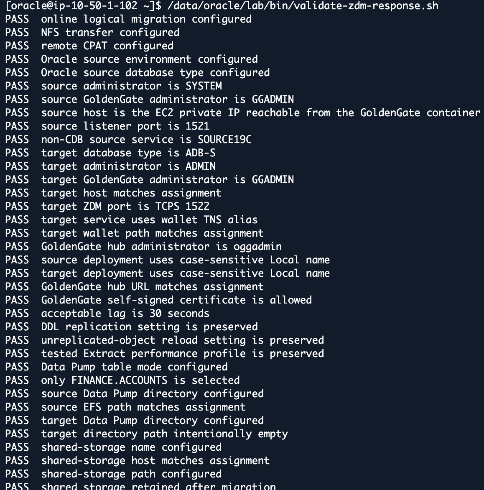
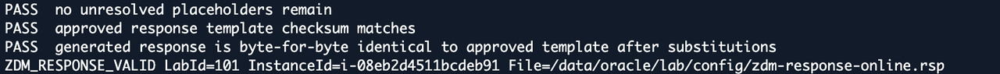
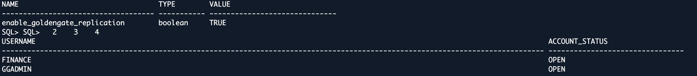

# Lab 3: Review and Evaluate the Online ZDM Migration

## Introduction

Use the fleet-generated response file; do not rebuild it from the earlier offline example. Evaluation checks readiness but does not perform the full export/import or prove end-to-end replication.

Estimated Time: 20 minutes

### Objectives

Verify the migration scope, distinguish SQL and ZDM authentication, and complete evaluation.

## Task 1: Review the Working Configuration

1. Run as `oracle` at the EC2 shell and load the workshop environment.

    ```bash
    <copy>
    source "$HOME/env/source19c.env"
    source /etc/profile.d/zdm26.sh
    source /data/oracle/lab/config/lab-env.sh
    export ZDMCLI="$ZDM_HOME/bin/zdmcli"
    export ZDM_SOURCE_SSH_KEY="$HOME/.ssh/zdm_source_ed25519"
    </copy>
    ```

2. Display the migration method, included object, deployment names, and target service.

    ```bash
    <copy>
    grep -E '^(MIGRATION_METHOD|DATA_TRANSFER_MEDIUM|INCLUDEOBJECTS-1|GOLDENGATEHUB_(SOURCE|TARGET)DEPLOYMENTNAME|TARGETDATABASE_CONNECTIONDETAILS_SERVICENAME)=' "$ZDM_RESPONSE_FILE"
    </copy>
    ```

3. Confirm the following required settings:

    - `MIGRATION_METHOD=ONLINE_LOGICAL` and `DATA_TRANSFER_MEDIUM=NFS`.
    - Only `FINANCE.ACCOUNTS` included in TABLE mode.
    - Source `SYSTEM` and `GGADMIN`; target `ADMIN` and `GGADMIN`; hub `oggadmin`.
    - Case-sensitive `Local` for both deployment names.
    - Source host reachable from the GoldenGate container, not container-local `127.0.0.1`.
    - Target ZDM wallet alias on port 1522, not the fully qualified service string substituted into the alias field.
    - Source `DATA_PUMP_DIR_NFS`, target `ZDM_EFS_DIR`, assigned EFS hostname, and retained shared storage.
    - Approved lag, DDL, performance, and dump-retention settings unchanged.

    The validator compares the generated file with the approved template after assignment substitutions. Do not add tablespace remapping, change usernames, or loosen TLS settings to bypass a failure.

4. Run the response-file validator from the **`oracle` shell**.

    ```bash
    <copy>
    /data/oracle/lab/bin/validate-zdm-response.sh
    </copy>
    ```

    

    The screenshots show output from the command above. `ZDM_RESPONSE_VALID` is its success marker, not another command to run.

    

## Task 2: Confirm Target Preparation

The target accounts are already prepared. The target TLS wallet is already installed for ZDM. ZDM prompts for credentials at runtime; SQL*Plus uses the password-authenticated alias from `adbs.env`.

1. From the **`oracle` EC2 shell**, check connectivity to the assigned target.

    ```bash
    <copy>
    source "$HOME/env/adbs.env"
    "$ORACLE_HOME/bin/tnsping" "$TARGET_ALIAS"
    </copy>
    ```

2. Connect to the target as ADMIN.

    ```bash
    <copy>
    sqlplus -L ADMIN@"$TARGET_ALIAS"
    </copy>
    ```

3. Enter the instructor-provided password at the prompt. At **target `SQL>`**, check the database and GoldenGate replication setting.

    ```sql
    <copy>
    SET LINESIZE 220
    SET PAGESIZE 100
    SELECT name, open_mode FROM v$database;
    SHOW PARAMETER enable_goldengate_replication
    </copy>
    ```

4. Check the target accounts.

    ```sql
    <copy>
    SELECT username, account_status FROM dba_users
    WHERE username IN ('GGADMIN','FINANCE') ORDER BY username;
    </copy>
    ```

5. Check that the target ACCOUNTS table is absent before the first migration. If it already exists, stop; do not drop it to force a rerun.

    ```sql
    <copy>
    SELECT owner, table_name FROM dba_tables
    WHERE owner='FINANCE' AND table_name='ACCOUNTS';
    </copy>
    ```

6. Return to the EC2 shell.

    ```sql
    <copy>
    EXIT
    </copy>
    ```

    For a fresh migration, the last query must return `no rows selected`. Stop and ask the instructor if it does not. Account status alone does not prove every required privilege.

    

## Task 3: Run Evaluation

1. Back at the **`oracle` shell**, reload the source environment after the target SQL check.

    ```bash
    <copy>
    source "$HOME/env/source19c.env"
    source /etc/profile.d/zdm26.sh
    source /data/oracle/lab/config/lab-env.sh
    export ZDMCLI="$ZDM_HOME/bin/zdmcli"
    export ZDM_SOURCE_SSH_KEY="$HOME/.ssh/zdm_source_ed25519"
    </copy>
    ```

2. Submit the evaluation from the **`oracle` shell**.

    ```bash
    <copy>
    "$ZDMCLI" migrate database \
      -sourcesid "$ORACLE_SID" \
      -sourcenode "$(hostname -f)" \
      -srcauth zdmauth \
      -srcarg1 user:ec2-user \
      -srcarg2 "identity_file:$ZDM_SOURCE_SSH_KEY" \
      -srcarg3 sudo_location:/usr/bin/sudo \
      -rsp "$ZDM_RESPONSE_FILE" \
      -eval
    </copy>
    ```

    

3. Enter the prompted passwords for source SYSTEM, source GGADMIN, target ADMIN, target GGADMIN, and hub oggadmin. Do not put them on command lines, in screenshots, or in the response file. Enter the lab passwords provided by your instructor. Password input is not displayed.

    

    Submission schedules the evaluation; it does not mean it passed. Use the job ID returned in your own session, which may differ from the example's `1`.

4. Query the job ID returned by the evaluation. The example below uses job **1**; replace `1` with your returned evaluation ID if different. Repeat the query until it finishes; do not resubmit the evaluation.

    ```bash
    <copy>
    "$ZDMCLI" query job -jobid 1
    </copy>
    ```

5. Proceed only when this job reports `SUCCEEDED`. Review CPAT findings and the excluded-objects file: ACCOUNTS must not be excluded from the required migration/replication scope. Save the actual result-log path from the output.

    

    Completed prerequisite phases from the same evaluation:

    

    This example is job type `EVAL`, not the actual migration. It does not prove Data Pump import or GoldenGate replication has completed.

    For failures, report the first failed phase and the corresponding log error. Do not skip validation or submit repeated migration jobs.

## Acknowledgements

* **Author** - Arnab Saha, Principal Solutions Architect, OCI Multicloud
* **Author** - Vineet Agarwal, Senior Principal Solutions Architect, OCI Multicloud
* **Last Updated By/Date** - Arnab Saha and Vineet Agarwal / September 30, 2026
