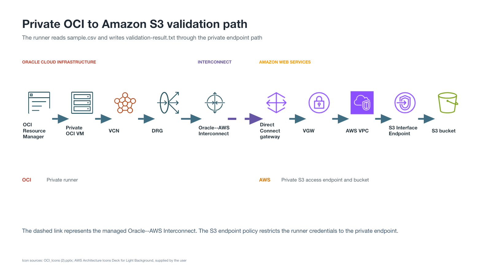

# Access Amazon S3 Privately from OCI

## Introduction

In this workshop, you will build and validate a private network path from an Oracle Cloud Infrastructure (OCI) compute instance to an Amazon Simple Storage Service (Amazon S3) bucket. The connection uses Oracle--AWS Interconnect and an Amazon S3 Interface VPC Endpoint, so the validation traffic does not traverse the public internet.

The completed environment uses AWS CloudFormation and OCI Resource Manager for the repeatable infrastructure. The only manual actions are creating a limited AWS access key, uploading a test CSV file, and authorizing the managed interconnect in both cloud accounts.

Estimated Workshop Time: 90 minutes

### Objectives

In this workshop, you will:

* Deploy an AWS VPC, S3 bucket, Interface VPC Endpoint, Direct Connect gateway, and restricted IAM user
* Deploy an OCI VCN, private subnet, Dynamic Routing Gateway (DRG), Service Gateway, and Network Security Group (NSG)
* Establish Oracle--AWS Interconnect between the two environments
* Deploy a private OCI test runner with OCI Resource Manager
* Verify that the private runner can read from and write to Amazon S3 only through the interface endpoint

### Prerequisites

To complete this workshop, you need:

* An AWS account with permission to create CloudFormation, VPC, Direct Connect, S3, and IAM resources
* An OCI tenancy with permission to create Resource Manager, Networking, FastConnect, and Compute resources
* An OCI compartment for the lab resources
* Access to AWS US East (N. Virginia), `us-east-1`
* Access to OCI US East (Ashburn), `us-ashburn-1`

## Architecture

The private validation path is:

```text
OCI Resource Manager -> private OCI VM -> VCN -> DRG -> Oracle--AWS Interconnect
-> AWS Direct Connect gateway -> VGW -> AWS VPC -> S3 Interface Endpoint -> S3 bucket
```



The runner reads `sample.csv` and writes `validation-result.txt`. The AWS policies require `aws:SourceVpce` to match the S3 interface endpoint created for this workshop. A request sent through a public S3 route does not satisfy that condition.

The default networks use OCI `10.10.0.0/16` and AWS `10.20.0.0/16`. You must choose different, non-overlapping CIDR blocks if either range conflicts with an existing network.

## Workshop Structure

The workshop follows one continuous deployment path:

* **Getting Started:** Prepare both cloud consoles and collect the required identifiers.
* **Lab 1:** Deploy the AWS foundation and create the limited credentials.
* **Lab 2:** Deploy the OCI network foundation.
* **Lab 3:** Establish Oracle--AWS Interconnect.
* **Lab 4:** Deploy the private OCI test runner.
* **Lab 5:** Validate the private S3 path and repeat the test when needed.
* **Lab 6:** Diagnose common deployment and connectivity issues.
* **Lab 7:** Remove the workshop resources in dependency order.

## Learn More

* [Oracle Interconnect for AWS](https://docs.oracle.com/en-us/iaas/Content/multicloud/interconnect-aws.htm)
* [AWS multicloud Interconnect setup](https://docs.aws.amazon.com/interconnect/latest/userguide/getting-started-multicloud.html)
* [Amazon S3 PrivateLink interface endpoints](https://docs.aws.amazon.com/AmazonS3/latest/userguide/privatelink-interface-endpoints.html)

## Acknowledgements

* **Author** - Arun Ramakrishnan
* **Last Updated By/Date** - David Start, September 2026
