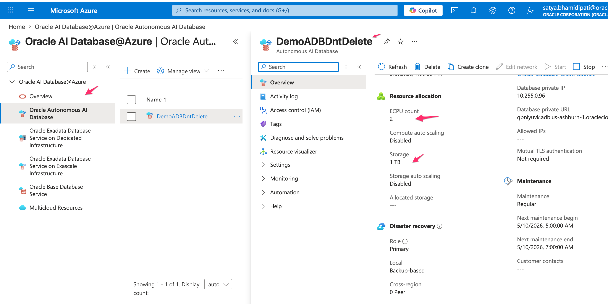
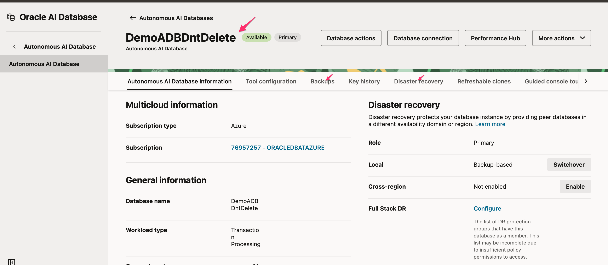
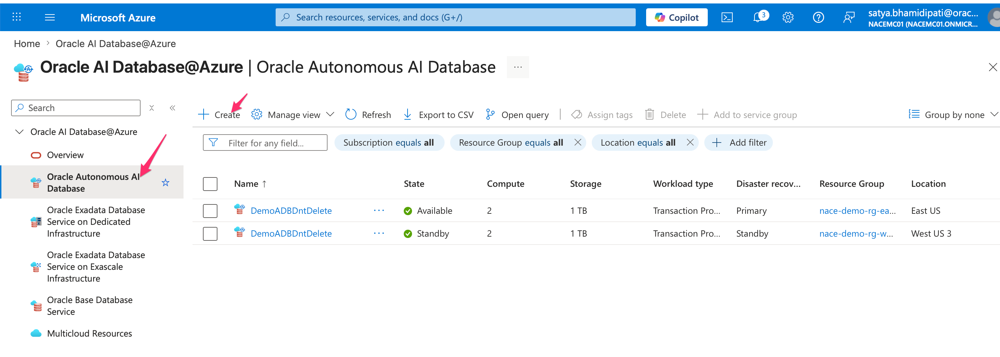
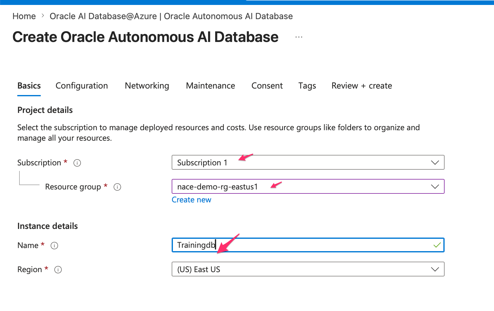
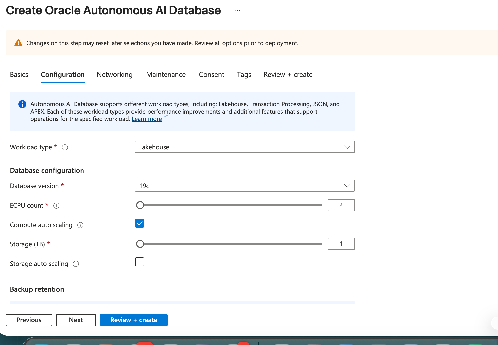
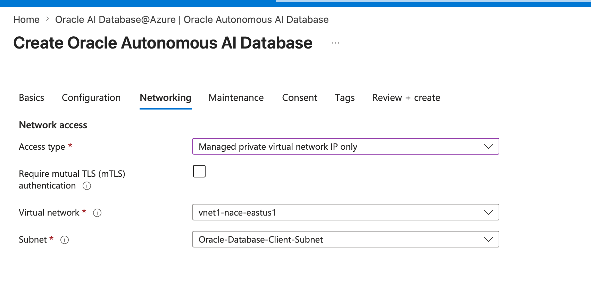

# Explore Autonomous Database Operations

## Introduction

This lab reviews Autonomous Database from the Azure and OCI views. You compare capacity settings, backup and disaster recovery information, and the guided create workflow.

Estimated Time: 15 minutes

### Objectives

- Locate an Autonomous Database from Azure.
- Review ECPU, storage, backup, and disaster recovery information.
- Walk through the create workflow without creating a database.
- Explain how Autonomous Database reduces operational work for database teams.

## Task 1: Review an Existing Autonomous Database

1. In Azure, open Oracle Database@Azure, then Autonomous Database.

2. Select the demo Autonomous Database, such as `DemoADBDntDelete`.

    

3. Review the capacity and operational fields.

    - ECPUs.
    - Storage.
    - Lifecycle state.
    - Management links.

4. Open the OCI view for the same Autonomous Database.

    

5. Review backup and disaster recovery details.

    - Autonomous Database automates patching, tuning, and backup operations.
    - Compute can auto scale to support workload spikes when enabled.
    - Cross-region disaster recovery depends on region pairing and configuration.

## Task 2: Review the Create Workflow

1. Return to the Autonomous Database list.

    

2. Click Create only if your instructor tells you to enter the wizard.

    - Do not submit the final create action in a shared environment.
    - Use the wizard to learn the required choices.

3. Review the Basics tab.

    

4. Review the Configuration tab.

    

5. Review the Networking tab.

    

6. Identify the minimum design choices for a real deployment.

    - Subscription and resource group.
    - Database name and workload type.
    - ECPU and storage size.
    - Network path and private access.
    - Backup and disaster recovery objectives.

## Task 3: Validate Your Understanding

1. Compare Exadata and Autonomous Database at a high level.

    - Exadata gives database teams more direct infrastructure and VM cluster control.
    - Autonomous Database places patching, indexing, backup, and tuning under Oracle-managed automation.
    - Both options still require identity, network, cost, and recovery decisions.

2. State one workload that may fit Autonomous Database.

    - Example: a new application with standard operational requirements.
    - Example: analytics or development work that benefits from automated scaling and management.

## Acknowledgements

* **Author** - Oracle LiveLabs workshop draft generated from the provided demo script.
* **Last Updated By/Date** - Codex, May 14, 2026
