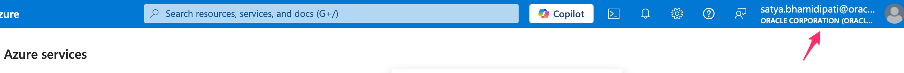
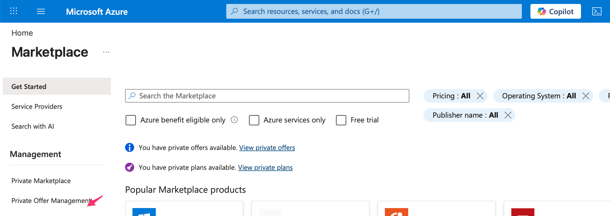
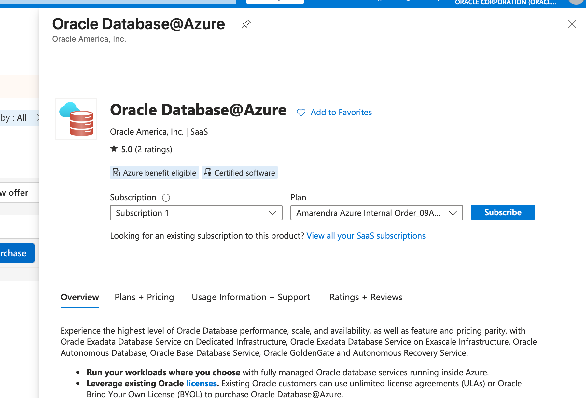
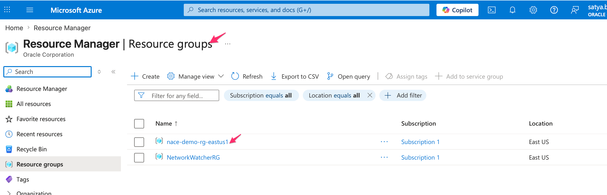
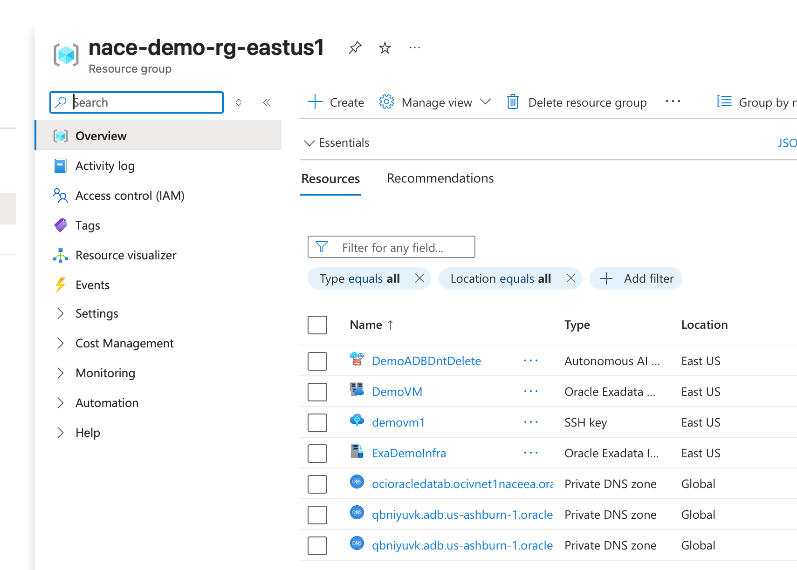
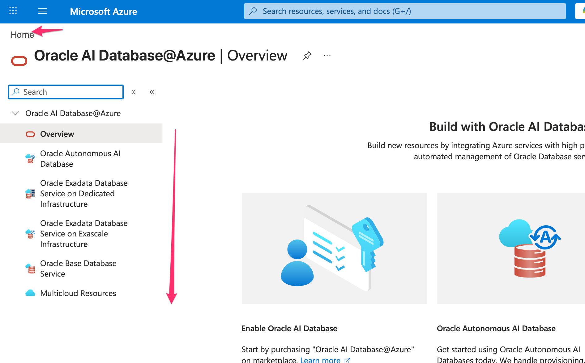

# Review Azure Access, Offers, and Resource Organization.

## Introduction

This lab orients you in the Azure portal before you review database services. You confirm the subscription, locate the private offer, inspect the resource group, and find the Oracle Database@Azure landing page.

Estimated Time: 15 minutes

### Objectives

- Locate the Azure subscription that hosts the demo resources.
- Review the private offer without purchasing it.
- Connect resource group and virtual network views to Oracle Database@Azure deployment planning.
- Find the Oracle Database@Azure overview page.

## Task 1: Review the Azure Subscription and Private Offer

1. Sign in to `portal.azure.com` with the account that your instructor provides.

    - Complete Microsoft Authenticator approval if prompted.
    - Confirm that the expected subscription appears in the portal context.

2. Search for `Private Offer Management` from the Azure portal search bar.

    

3. Open Private Offer Management and review the private offer associated with the demo subscription.

    

4. Open the offer details and review the purchase information.

    

5. Stop before any purchase action.

    - Confirm the offer name, subscription, and commercial context.
    - Do not click **Purchase** in a classroom or shared demo environment.

## Task 2: Review the Resource Group and Network Foundation

1. Search for `Resource Groups` in the Azure portal.

    - Open the demo resource group, such as `nacie-demo-rg-eastus`.
    - Compare the resource group concept with OCI compartments.

2. Review the resource inventory in the group.

    

3. Open the virtual network, such as `vnet1-nace-eastus1`, and review its subnets.

    

4. Record the network facts that matter before database provisioning.

    - Region and resource group.
    - Virtual network and subnet names.
    - CIDR ranges and available IP addresses.
    - Network ownership and approval path.

## Task 3: Locate Oracle Database@Azure

1. Return to the Azure portal home page.

2. Search for `Oracle Database@Azure` and open the overview page.

    

3. Identify the database service choices available from Azure.

    - Oracle Exadata Database.
    - Oracle Autonomous Database.
    - Related deployment and management pages.

## Task 4: Validate Your Understanding

1. Explain why private offer, subscription, resource group, and network checks come before database review.

    - The private offer ties commercial access to the subscription.
    - The resource group gives the Azure organization boundary.
    - The virtual network and subnet choices prepare connectivity for Exadata and Autonomous Database.

2. Share one access or governance question that you would ask before a customer deployment.

    - Example: Which team owns subscription approval?
    - Example: Who can update subnets or delegate network permissions?

## Acknowledgements

* **Author** - Oracle LiveLabs workshop draft generated from the provided demo script.
* **Last Updated By/Date** - Codex, May 14, 2026
