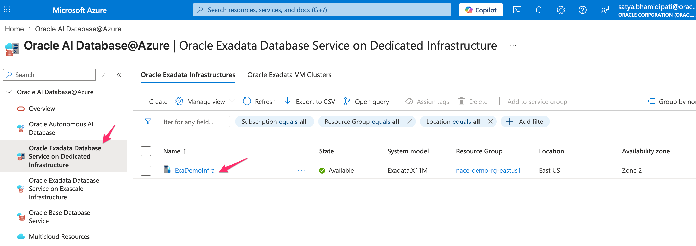
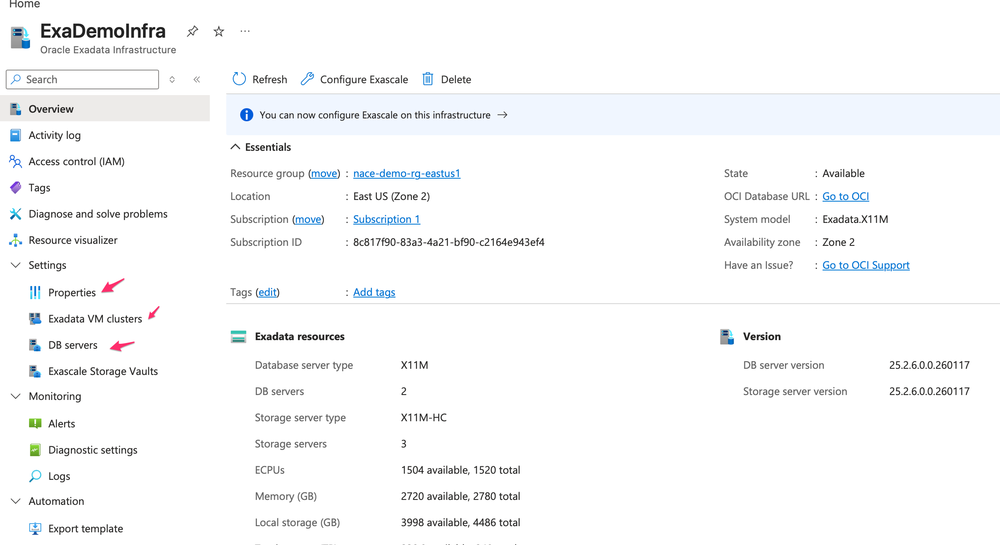
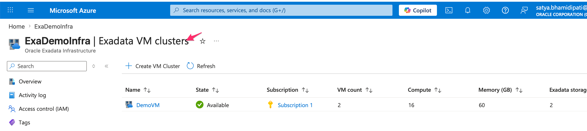
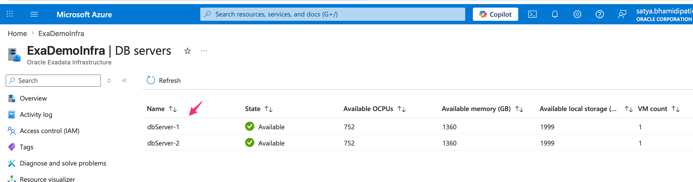

# Review Exadata Infrastructure in Azure.

## Introduction.

This lab reviews the Exadata views that an Azure user sees after the shared network and subscription work exists. You inspect infrastructure, VM clusters, and DB server pages without provisioning new hardware.

Estimated Time: 15 minutes

### Objectives

- Locate existing Exadata infrastructure in Azure.
- Identify zone, resource group, and hardware details.
- Review VM cluster and DB server pages.
- Connect Azure views to OCI-managed database operations.

## Task 1: Open the Exadata Infrastructure List

1. From Oracle Database@Azure, open Oracle Exadata Database.

2. Find the existing infrastructure, such as `ExaDemoInfra1`.

    

3. Explain what the list confirms.

    - Azure can show Exadata infrastructure that already exists.
    - The learner can inspect the demo without starting a new provisioning flow.
    - Network planning should happen before infrastructure provisioning.

## Task 2: Review Infrastructure Details

1. Open the Exadata infrastructure details page.

    

2. Locate the fields that an architect should review.

    - Azure zone placement.
    - Resource group.
    - Hardware configuration.
    - Maintenance and patching properties.

3. Discuss why zone placement matters.

    - Azure regions often provide multiple availability zones.
    - Database placement affects latency, resilience, and network design.
    - Customers should align placement with application and recovery needs.

## Task 3: Review VM Clusters and DB Servers

1. Open the VM Clusters area for the Exadata infrastructure.

    

2. Review the VM cluster names and high-level status.

    - Use this page to confirm the VM cluster exists.
    - Save scale and database operations for the OCI control plane lab.

3. Open the DB Servers view.

    

4. Identify why DB server visibility helps operations teams.

    - DB server status supports health review.
    - Hardware visibility helps explain capacity and patch planning.
    - Azure users can orient themselves before they move into OCI views.

## Task 4: Validate Your Understanding

1. Draw a simple mental model of the split control plane.

    - Azure hosts the customer-facing resource group, network, and Oracle Database@Azure entry points.
    - OCI provides the Oracle database management plane behind the service.
    - Exadata infrastructure appears in Azure, while deeper VM cluster and database operations also appear in OCI.

2. Identify one item you would verify before a production Exadata deployment.

    - Example: selected Azure zone.
    - Example: subnet sizing.
    - Example: maintenance window ownership.

## Acknowledgements

* **Author** - Oracle LiveLabs workshop draft generated from the provided demo script.
* **Last Updated By/Date** - Codex, May 14, 2026
