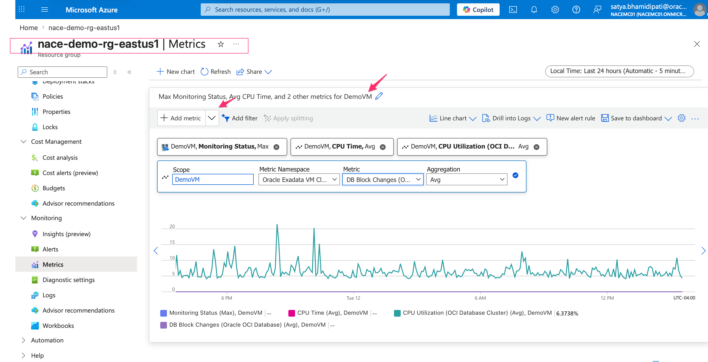
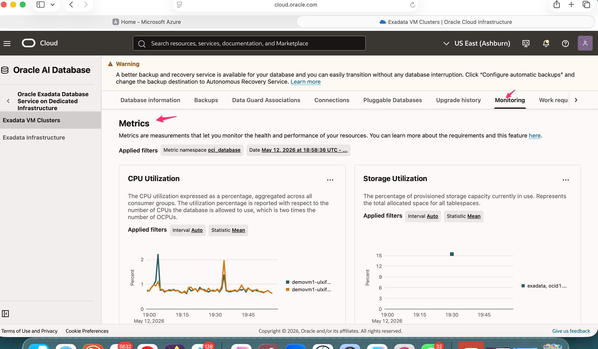

# Review Monitoring and Cost Signals

## Introduction

This lab closes the workshop with operational review. You inspect Azure and OCI metric views, then connect those signals to budget, forecasting, and support conversations.

Estimated Time: 10 minutes

### Objectives

- Locate database metrics in Azure.
- Compare Azure and OCI monitoring perspectives.
- Identify cost-management questions for a customer review.
- Create a short operational follow-up checklist.

## Task 1: Review Azure Metrics

1. Open the database resource or Oracle Database@Azure monitoring view in Azure.

2. Review available metrics and chart controls.

    

3. Identify the metric questions an operations team should ask.

    - Which metric shows workload pressure?
    - Which alert thresholds already exist?
    - Which team owns dashboard updates?
    - Which events need paging, and which only need trend review?

## Task 2: Compare OCI Metrics

1. Open the database monitoring page in OCI.

2. Review the same operational area from the Oracle control plane.

    

3. Compare the Azure and OCI views.

    - Azure helps teams monitor resources near the application estate.
    - OCI exposes database-focused operational pages.
    - Architects should define which console owns each operational runbook step.

## Task 3: Connect Monitoring to Cost Management

1. Open Azure Cost Management for the subscription if you have read access.

2. Review cost analysis, budgets, forecasting, and reports.

    - Identify the subscription and resource group filters.
    - Confirm who receives budget alerts.
    - Check whether Oracle Database@Azure costs align with project ownership.
    - Capture questions for finance, platform, and database owners.

3. Create a final operational checklist.

    - Subscription and private offer verified.
    - Resource group and network documented.
    - Exadata infrastructure and VM cluster reviewed.
    - OCI subscription mapping and administrator groups reviewed.
    - Autonomous Database backup and disaster recovery settings reviewed.
    - Azure and OCI monitoring ownership agreed.
    - Cost alert ownership assigned.

## Acknowledgements

* **Author** - Oracle LiveLabs workshop draft generated from the provided demo script.
* **Last Updated By/Date** - Codex, May 14, 2026
