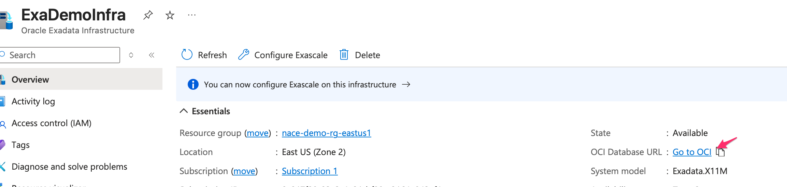
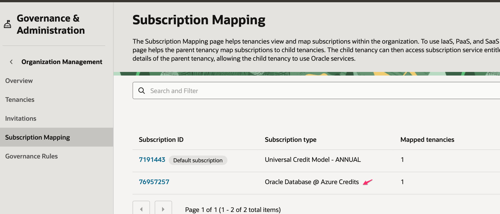
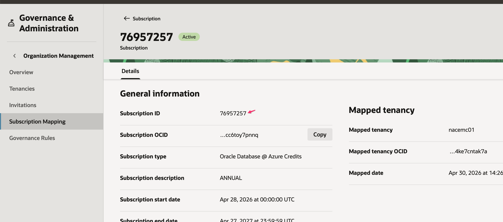
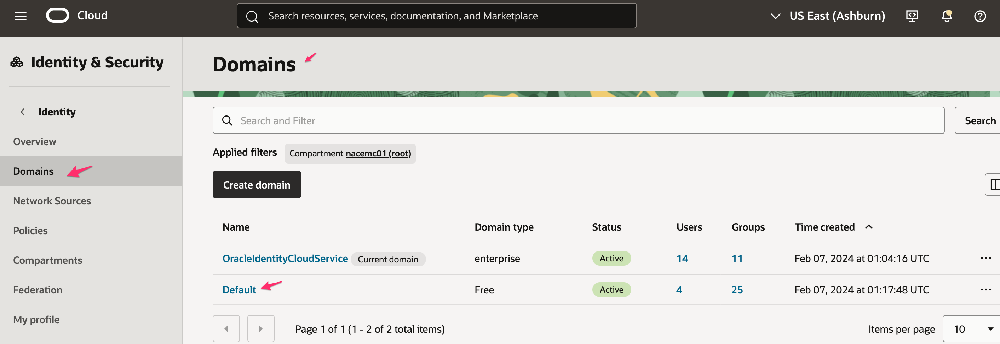
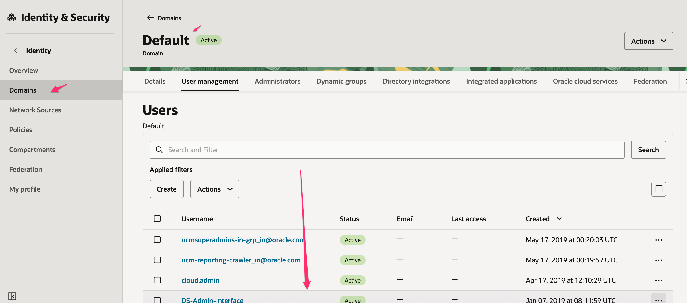
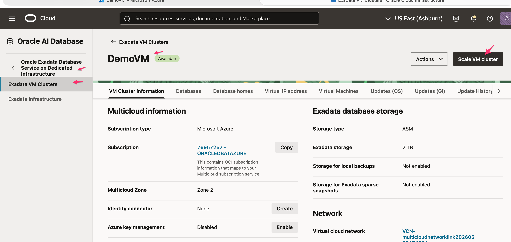
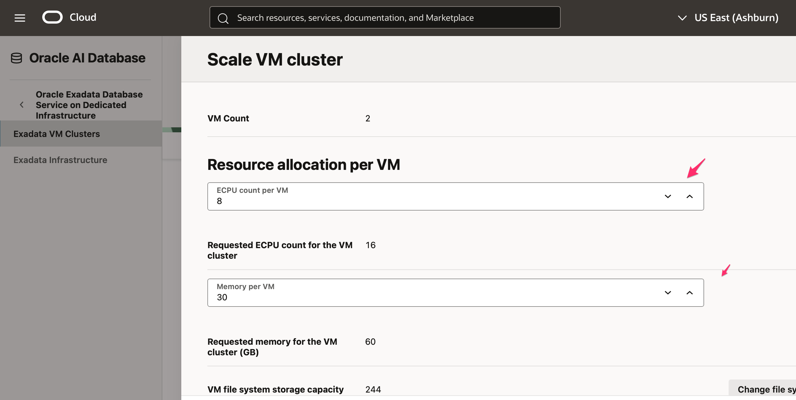
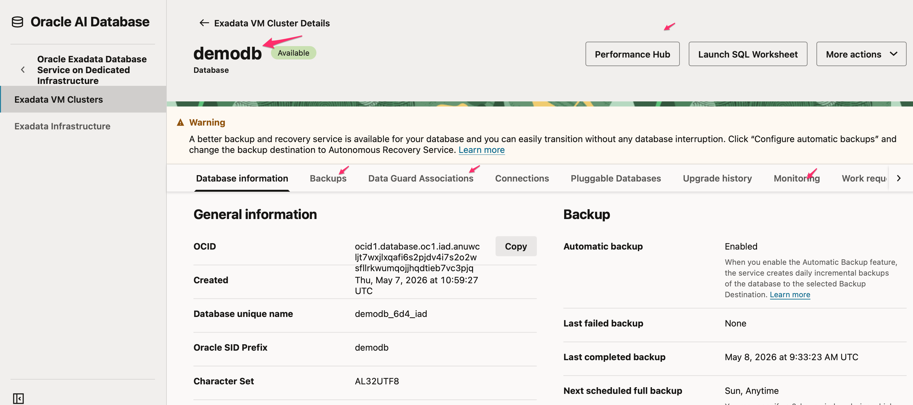

# Explore the OCI Control Plane for Oracle Database@Azure

## Introduction

This lab moves from Azure into OCI. You review subscription mapping, administrator groups, VM cluster scaling, database details, backup placement, and monitoring views.

Estimated Time: 20 minutes

### Objectives

- Navigate from Azure to the paired OCI control plane.
- Review Oracle Database@Azure subscription mapping.
- Locate administrator identity views.
- Inspect VM cluster scale controls and database operational pages.

## Task 1: Navigate to OCI

1. From the Oracle Database@Azure resource page, locate the Go to OCI action.

    

2. Open OCI in a new browser tab if your instructor grants access.

    - Use the paired tenancy for the demo.
    - Keep Azure open so you can compare the two control planes.

## Task 2: Review Subscription Mapping

1. In OCI, search for `Subscription Mapping`.

2. Open Oracle Database@Azure subscription mapping.

    

3. Open the mapped subscription details.

    

4. Confirm the mapping details.

    - Azure subscription relationship.
    - Mapped tenancy information.
    - Credit type for Oracle Database@Azure.
    - Administrator ownership for future governance questions.

## Task 3: Review OCI Identity Administration

1. Open Identity and Security, then Domains.

    

2. Open the default domain or the domain your instructor specifies.

    

3. Identify the groups that support Oracle Database@Azure operations.

    - Networking administrators.
    - Database administrators.
    - VM cluster administrators.
    - Viewer roles for students or support teams.

## Task 4: Inspect VM Cluster Scaling

1. In OCI, open Oracle Exadata Database, then Exadata VM Clusters.

2. Open the VM cluster, such as `DemoVM`.

    

3. Review the scale action without saving changes.

    

4. Describe what the scale page controls.

    - ECPU allocation per VM.
    - Memory allocation per VM.
    - Local storage allocation per VM.
    - Resource planning for database workload growth.

## Task 5: Review Database Operations

1. Open the Databases tab for the Exadata VM cluster.

2. Select the demo database, such as `Demodb`.

    

3. Review the database information and operational tabs.

    - Database identity and version.
    - Backup destination and recovery settings.
    - Basic monitoring metrics.
    - Performance Hub access requirements, if your environment supports it.

4. Explain the backup note from the demo script.

    - Standard backups write to OCI Object Storage.
    - Autonomous Recovery Service can become a future recovery target when provisioned.
    - Recovery design should match retention and recovery objectives.

## Acknowledgements

* **Author** - Oracle LiveLabs workshop draft generated from the provided demo script.
* **Last Updated By/Date** - Codex, May 14, 2026
