# Use Verrazzano to Access and Monitor the Application

## Introduction

You deployed the Springboot application. In this lab, we will access the application and verify using multiple management tools provided by Verrazzano.

Estimated Time: 15 minutes

**Grafana**

Grafana is an open-source solution for running data analytics, pulling up metrics that make sense of the massive amount of data & to monitor our apps with the help of nice customizable dashboards. The tool helps to study, analyse & monitor data over some time, technically called time series analytics.
Useful to track the user behaviour, application behaviour, frequency of errors popping up in production or a pre-prod environment, type of errors popping up and the contextual scenarios by providing relative data.

[https://grafana.com/grafana/](https://grafana.com/grafana/)

**OpenSearch Dashboards**

OpenSearch Dashboards is a visualization dashboard for the content indexed on an OpenSearch cluster. Verrazzano creates an OpenSearch Dashboards deployment to provide a user interface for querying and visualizing the log data collected in OpenSearch.

To access the OpenSearch Dashboards console, read [Access Verrazzano](https://verrazzano.io/latest/docs/access/).

To see the records of an OpenSearch index through OpenSearch Dashboards, create an index pattern to filter for records under the desired index.

In Task 3, we will explore the OpenSearch Dashboards.

[https://opensearch.org/docs/latest/dashboards/index/](https://opensearch.org/docs/latest/dashboards/index/)

**Prometheus**

Prometheus is a monitoring and alerting toolkit. Prometheus collects and stores its metrics as time series data, i.e. metrics information is stored with the timestamp at which it was recorded, alongside optional key-value pairs called labels.

[https://prometheus.io/](https://prometheus.io/)

**Rancher**

Rancher is a platform that enables Verrazzano to run containers on multiple Kubernetes clusters in production. It enables hybrid which means a single pane of glass management of on-prem clusters and hosted on cloud services.

[https://rancher.com/](https://rancher.com/)

**Kiali**

Kiali is the user interface to Istio, and it is super simple to use. From the Verrazzano console, you can directly access Kiali. From there, you can see the traffic flows and any hot spots or trouble areas. You can then drill down to see the details of each. Kiali uses metrics data from Envoy stored in Prometheus to build the graphical model

### Objectives

In this lab, you will:

* Explore the Rancher console.
* Explore the Prometheus console.
* Explore the Grafana console.
* Explore the OpenSearch Dashboards.
* Explore the Kiali console.
* Explore the Keycloak console.


### Prerequisites

* Kubernetes (OKE) cluster running on the Oracle Cloud Infrastructure.
* Verrazzano installed on a Kubernetes (OKE) cluster.
* Deployed springboot sample application.


## Task 1: Explore the Rancher Console

Verrazzano installs several consoles. The endpoints for an installation are stored in the `Status` field of the installed Verrazzano Custom Resource.

1. You can get the endpoints for these consoles by using the following command:

      ```bash
      <copy>kubectl get vz -o jsonpath="{.items[].status.instance}" | jq .</copy>
      ```

   The output should be similar to the following:
      ```bash
      $ kubectl get vz -o jsonpath="{.items[].status.instance}" | jq .
      {
      "consoleUrl": "https://verrazzano.default.xx.xx.xx.xx.nip.io",
      "grafanaUrl": "https://grafana.vmi.system.default.xx.xx.xx.xx.nip.io",
      "keyCloakUrl": "https://keycloak.default.xx.xx.xx.xx.nip.io",
      "kialiUrl": "https://kiali.vmi.system.default.xx.xx.xx.xx.nip.io",
      "openSearchDashboardsUrl": "https://osd.vmi.system.default.xx.xx.xx.xx.nip.io",
      "openSearchUrl": "https://opensearch.vmi.system.default.xx.xx.xx.xx.nip.io",
      "prometheusUrl": "https://prometheus.vmi.system.default.xx.xx.xx.xx.nip.io",
      "rancherUrl": "https://rancher.default.xx.xx.xx.xx.nip.io"
      }
      $
      ```


2. Use the `https://rancher.default.YOUR_UNIQUE_IP.nip.io` to open the Rancher console.

3. Verrazzano *dev* profile use self-signed certificates, so you need to click **Advanced** to accept risk and skip the warning.

      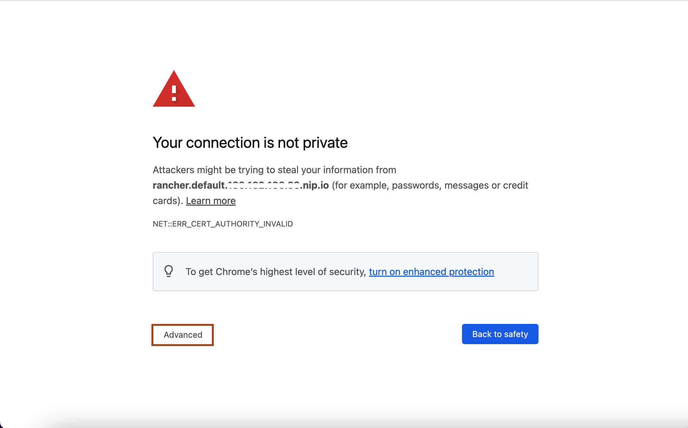

4. Click **Proceed to rancher default XX.XX.XX.XX.nip.io(unsafe)**. If you are not getting this option for proceeding, just type *thisisunsafe* without any space anywhere inside this chrome browser window. As you are typing in the chrome browser window, you can't see it, but as soon as you finish typing *thisisunsafe*, you can see the next page immediately. You can find more details [here](https://verrazzano.io/latest/docs/faq/faq/#enable-google-chrome-to-accept-self-signed-verrazzano-certificates).

      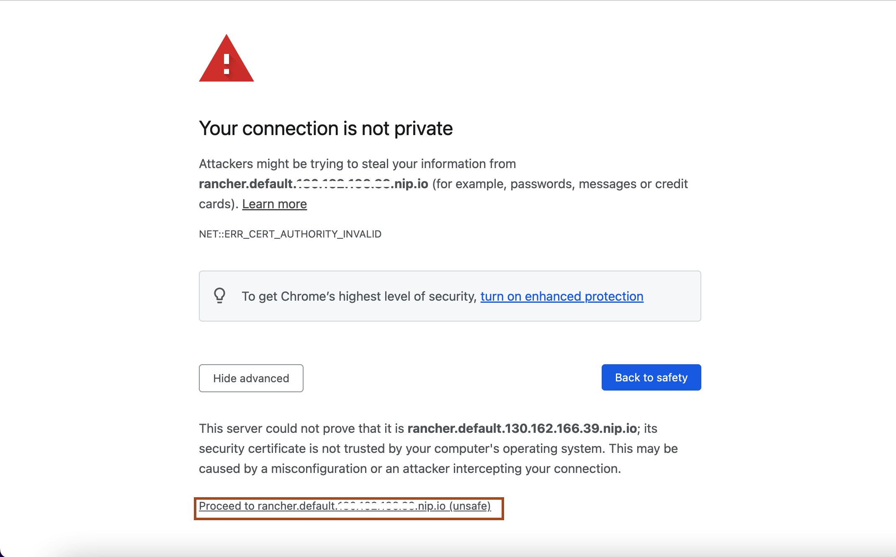

5. Click *Log in with Keycloak*.
      

6. Because it redirects to the Keycloak console URL for authentication, click **Advanced**.

      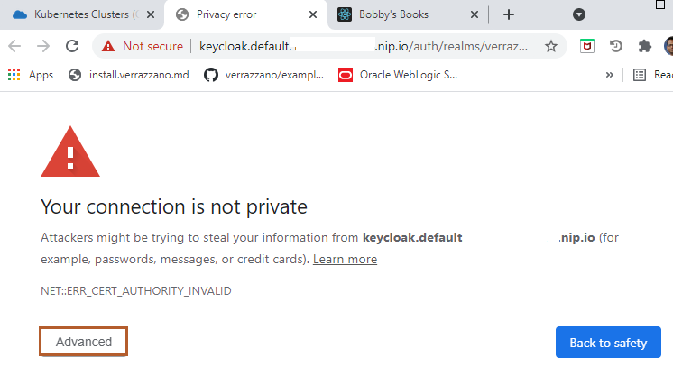

7. Click **Proceed to Keycloak default XX.XX.XX.XX.nip.io(unsafe)**. If you are not getting this option for proceeding, just type *thisisunsafe* without any space anywhere inside this chrome browser window. As you are typing in the chrome browser window, you can't see it, but as soon as you finish typing *thisisunsafe*, you can see the next page immediately. You can find more details [here](https://verrazzano.io/latest/docs/faq/faq/#enable-google-chrome-to-accept-self-signed-verrazzano-certificates).

      

8. Now we need the username and password for the Verrazzano console. *Username* is *verrazzano* and to find out the password, go back to the *Cloud Shell* and paste the following command to find out the password for the *Rancher Console*.

      ```bash
      <copy>kubectl get secret --namespace verrazzano-system verrazzano -o jsonpath={.data.password} | base64 --decode; echo</copy>
      ```

9. Copy the password and go back to the browser, where the *Rancher Console* is open. Paste the password in the *Password* field and enter *verrazzano* as *Username* and then click **Sign In**.

      

10. From the home page of the rancher console, you can view the Verrazzano Links. you can access any of these consoles from rancher console.Click *Hamburger menu* -> *Verrazzano*.

      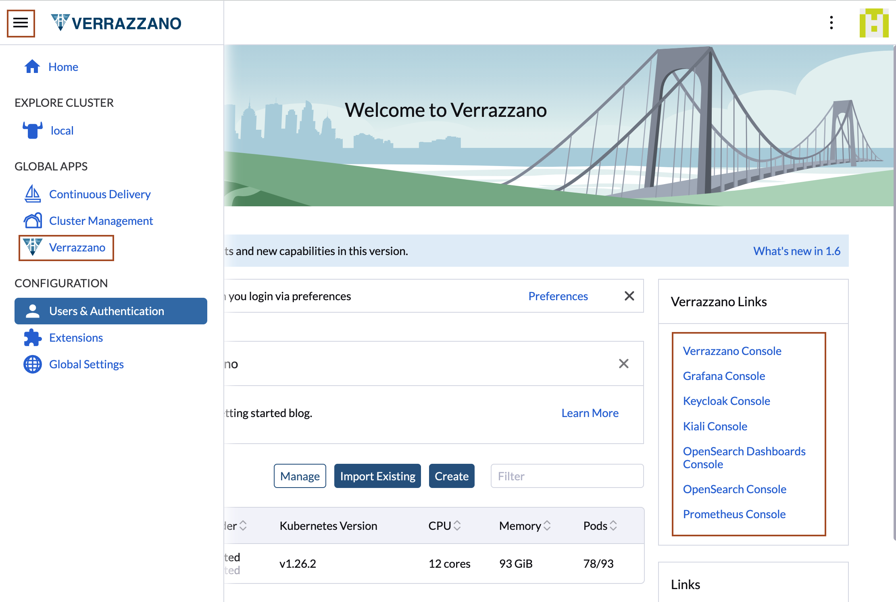

11. Click *Applications*. This section shows all the applications with their namespace and is managed by Verrazzano. Click the *springboot-appconf* application within the *springboot* namespace.
      

12. You can view the pods associated with the application. The pod name contains an auto-generated unique string to identify that particular replica. To view the logs of pods, Click *Three dots* -> *View Logs*.
      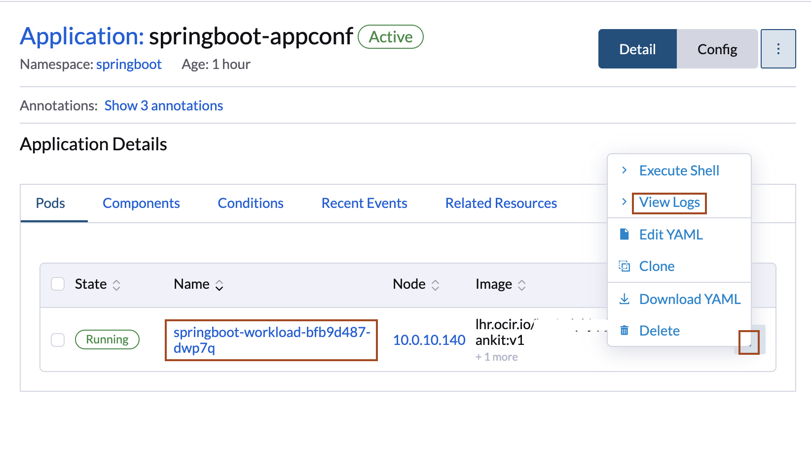

13. You can view the application logs for the application. If you can't see the application log then click the **Settings** (blue button with the gear icon) and change the time filter to show all the log entries from the container start. To view the Component associated with the application, click *Components*.
      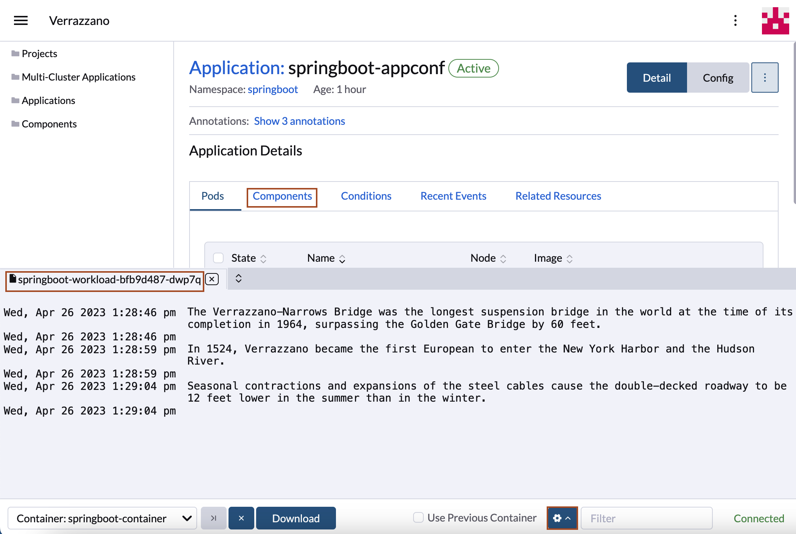

14. This application has only one component.To view what are the related resources, click *Related Resources*.
      
      

15. Click *Hamburgar menu* -> *local*, to open the *Cluster Explorer*. The *Cluster Explorer* allows you to view and manipulate all of the custom resources and CRDs in a Kubernetes cluster from the Rancher UI.
      


16. The dashboard gives an overview of the cluster and the deployed applications. The number of resources belongs to the *User Namespaces* which is practically almost all the resources including the system too. You can filter by namespace at top of the dashboard, but this is not necessary now. Click on the **Nodes** item in the left side menu to get an overview of the current load of the nodes.

      

17. The whole deployment doesn't have any impact on the OKE cluster. Now click on the **Workload** -> **Deployment** item in the left side menu to check deployed application.

      

18. You can see several deployments. 

      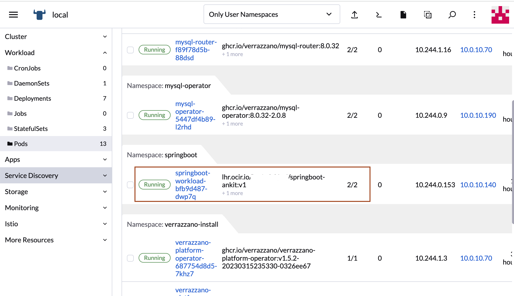

## Task 2: Explore the Grafana Console

1. Click *Hamburgar menu* -> *Home*.
      

2. On the home page, you'll see the link for opening the *Grafana console*. Click the link for the **Grafana Console** as shown:

      

3. Click **Advanced**.

      

4. Click **Proceed to grafana.vmi.system.default.XX.XX.XX.XX.nip.io(unsafe)**. If you are not getting this option for proceeding, just type *thisisunsafe* without any space anywhere inside this chrome browser window. As you are typing in the chrome browser window, you can't see it, but as soon as you finish typing *thisisunsafe*, you can see the next page immediately. You can find more details [here](https://verrazzano.io/latest/docs/faq/faq/#enable-google-chrome-to-accept-self-signed-verrazzano-certificates).

      

5. In Grafana home, Click *Home* and then Select *JVM(Micrometer)* as shown.
      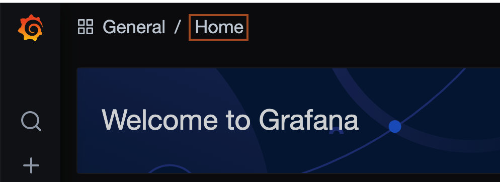
      

6. You can view the metrics like application uptime, heap used, JVM memory data as shown below.
      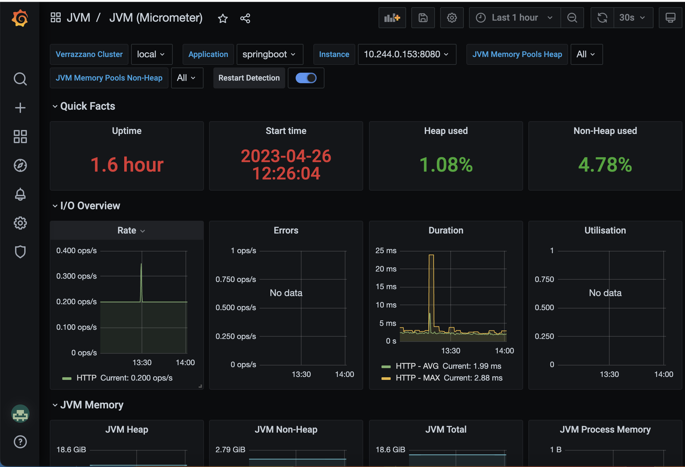
      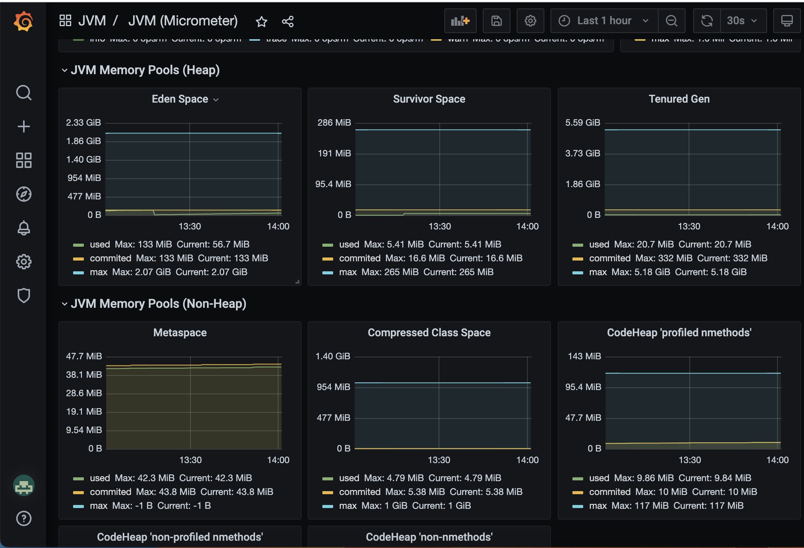

7. Similaryly, Click on JVM and open the *Application Status* dashboards as shown below.
      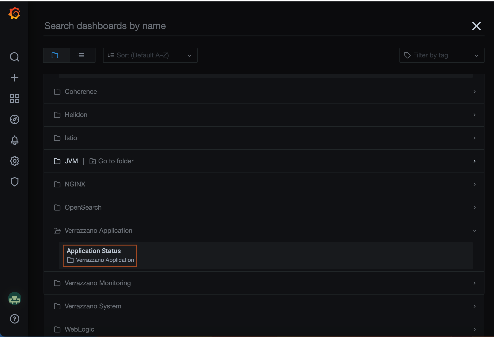

8. You can view the application status in terms of CPU Used, Memory Used, Disk Used and HTTP Request/second and other information as shown below.
      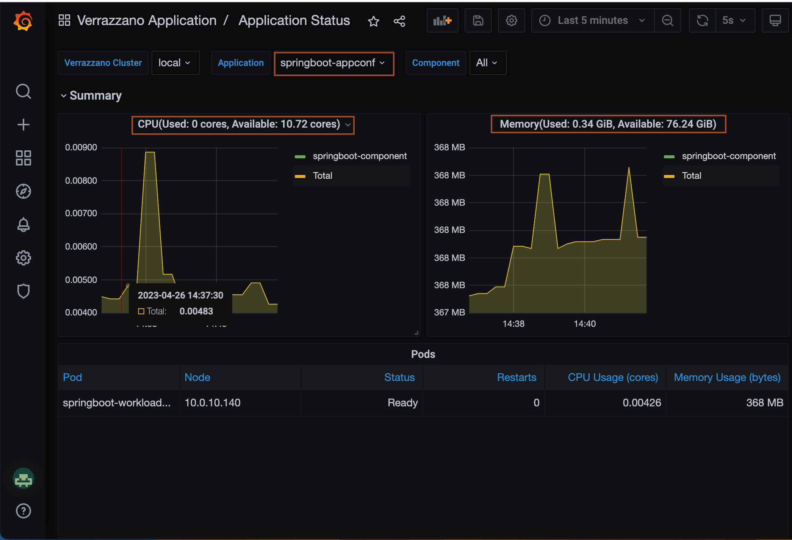

## Task 3: Explore the OpenSearch Dashboards

1. Go back to the Verrazzano home page and click the **OpenSearch Dashboards** console.

      

2. Click *Proceed to ... default XX.XX.XX.XX.nip.io(unsafe)* if necessary. The first time *OpenSearch Dashboards* shows the welcome page. It offers built-in sample data to try OpenSearch but you can select the **Explore on my own** option because Verrazzano completed the necessary configuration and the application data is already available.

      

3. On the OpenSearch homepage click the **Home** -> **Discover**.

      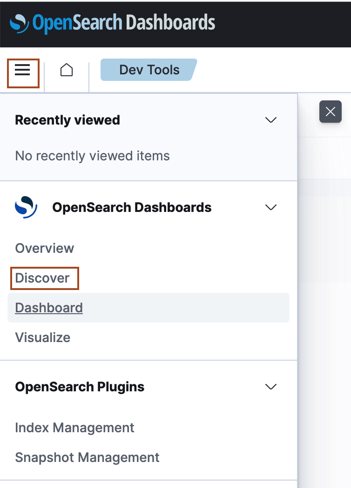

4. Invoke the following HTTP request in the Cloud Shell against your endpoint. You can execute requests multiple times.

      ```bash
      <copy>curl -k https://$(kubectl get gateways.networking.istio.io springboot-springboot-appconf-gw -n springboot -o jsonpath={.spec.servers[0].hosts[0]})/facts; echo</copy>
      ```

      > what you see in the outcome, you can pick any word and search the same in next step. In our case, we will search the word *bridge*, but you can search any word from the outcome.

5. Select the *`verrazzano-application*`* namespace as shown and then search for the logs in the Springboot application: `bridge ` into the filter textbox. Press **Enter** or click **Refresh**. You should get at least one result.
      
      

## Task 4: Explore the Prometheus Console

1. Go back to the Verrazzano home page and click **Prometheus** console.

      

2. Click **Proceed to ... default XX.XX.XX.XX.nip.io(unsafe)** if prompted.

3. On the Prometheus dashboard page type *http* into the search field and click metric *`http_server_requests_seconds_count`* and then click *Execute*.

      

4. Click **Execute** and check the result below. You should see your metric's current value which means total duration in seconds of serving http request. You can also switch to *Graph* view instead of the *Console* mode.

      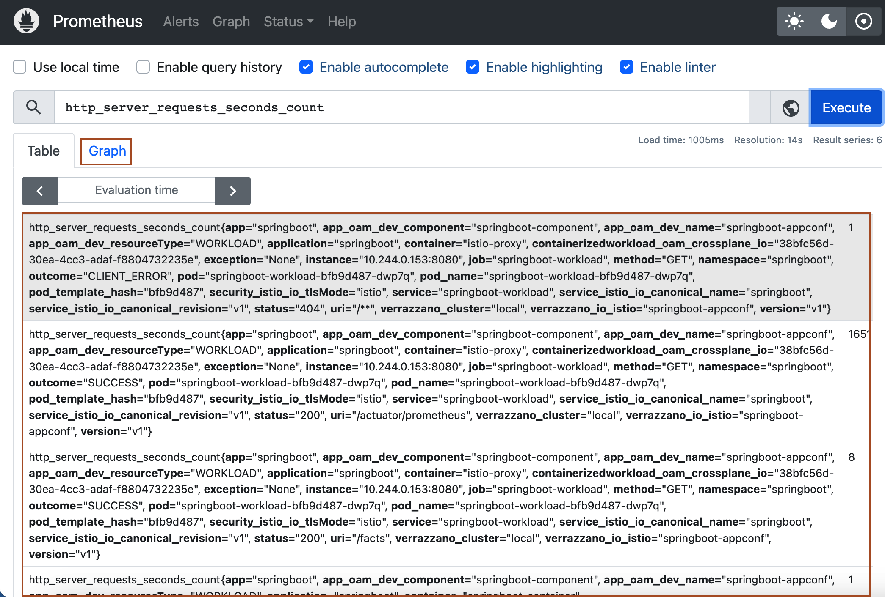

      >You can also add another metric to your dashboard. Discover the available, default metrics in the list.

## Task 5: Explore the Kiali Console

1. Go back to the Verrazzano home page and click **Kiali** console.

      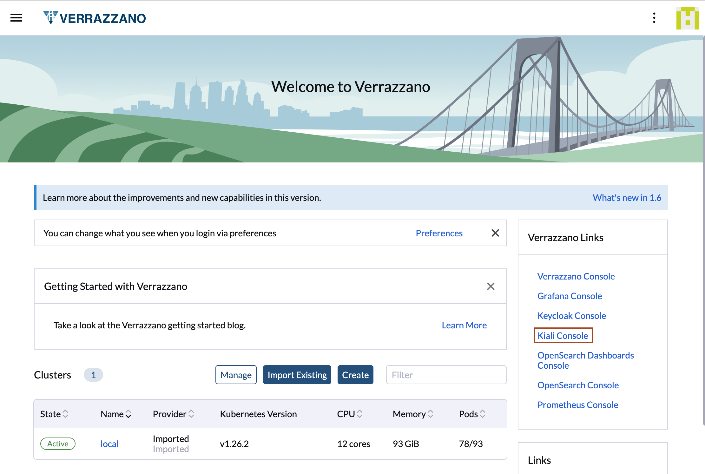

2. Click **Proceed to ... default XX.XX.XX.XX.nip.io(unsafe)** if prompted.

3. On Left side, Click on Graph.

   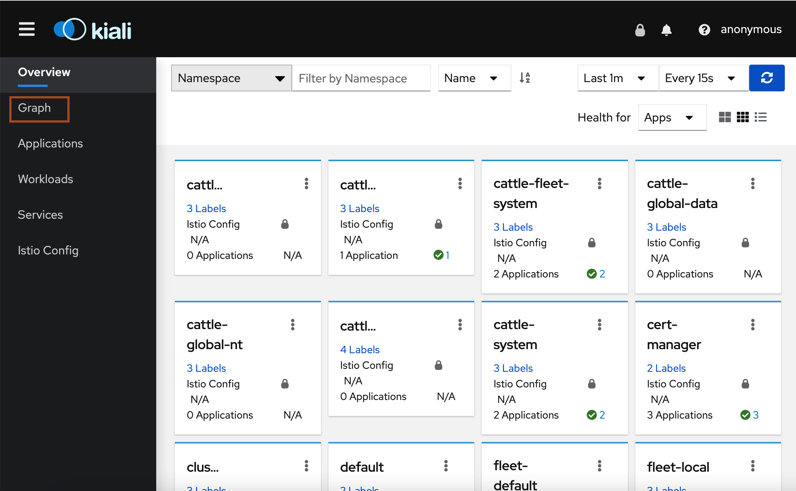

4. In the Namespace dropdown, check the box for *verrazzano-system* and make the curser move outside the dropdown. 
   

5. You can view the graphical view of *verrazzano-system* namespace. Click *Legend* to view the Legend view.

   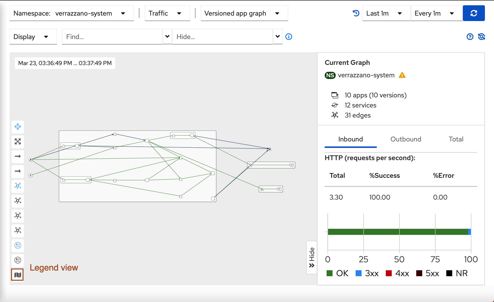

6. Here you can view, what each shapes represents, like circle represents the *Workloads*.

   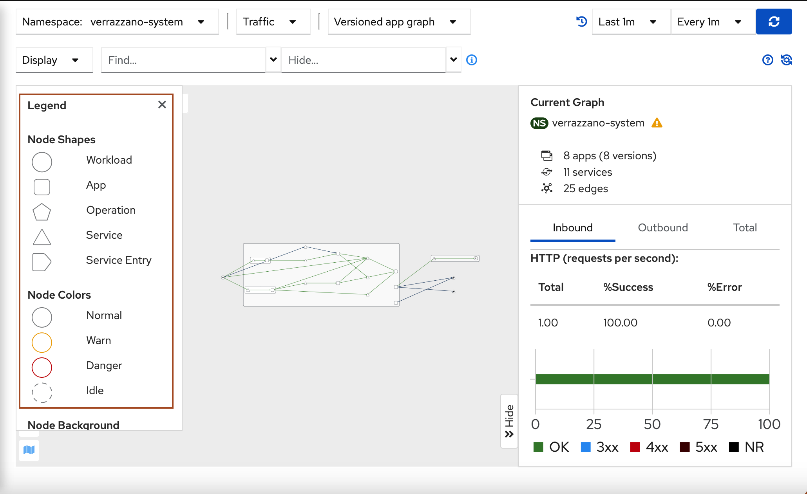

7. On Left side, Click on *Applications* to view the deployed applications.

   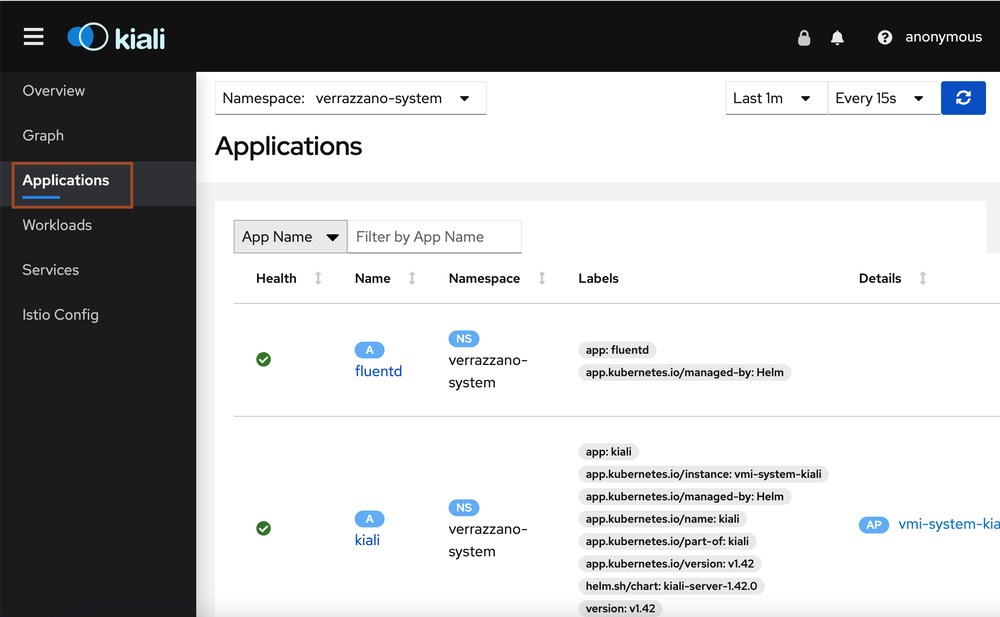

## Task 6: Explore the Keycloak Console

1. Go back to the Verrazzano home page and click **Keycloak** console.

      

2. Click **Proceed to ... default XX.XX.XX.XX.nip.io(unsafe)** if prompted.

3. On the Welcome to Keycloak page, click *Administration Console*.
      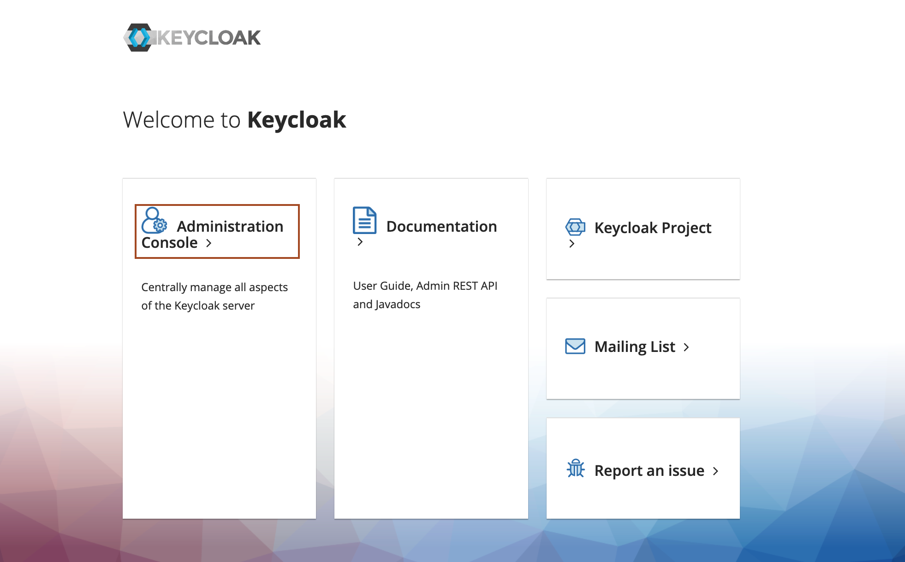

4. Now we need the username and password for the Keycloak console. *Username* is *keycloakadmin* and to find out the password, go back to the *Cloud Shell* and paste the following command to find out the password for the *Keycloak Console*.

      ```bash
      <copy>kubectl get secret --namespace keycloak keycloak-http -o jsonpath={.data.password} | base64  --decode; echo</copy>
      ```

5. Copy the password and go back to the browser, where the *Keycloak Console* is open. Paste the password in the *Password* field and enter *keycloakadmin* as *Username* and then click **Sign In**.

      

6. Here you can view default configuration done by Verrazzano.
      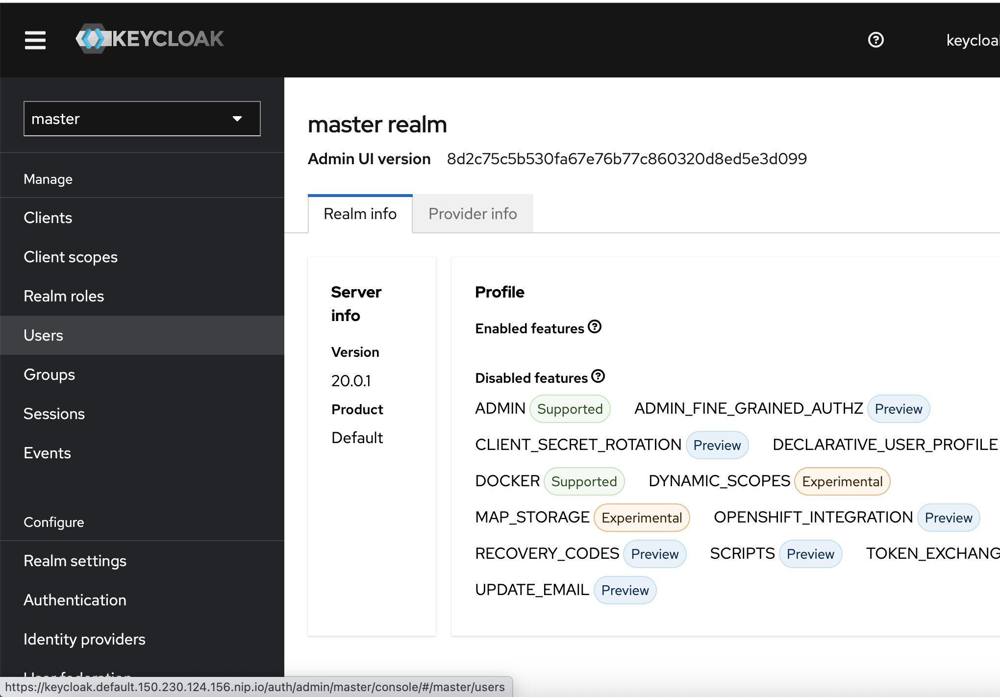

Congratulations you have completed the Springboot application deployment on Verrazzano lab.

## Acknowledgements

* **Author** -  Ankit Pandey
* **Contributors** - Maciej Gruszka, Sid Joshi
* **Last Updated By/Date** - Ankit Pandey, August 2023
