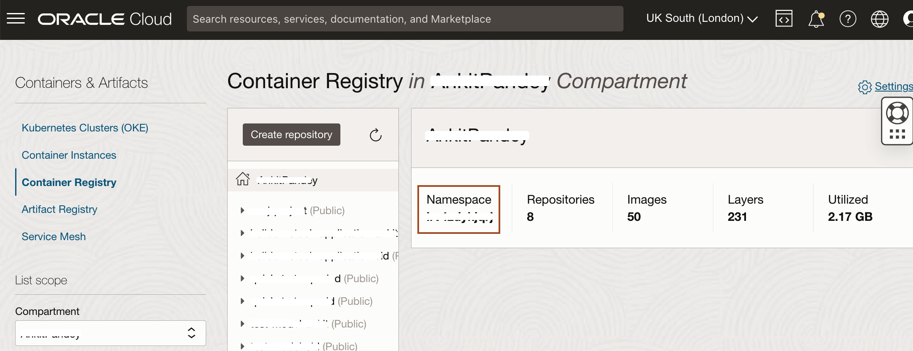

# Push Springboot Application Image to Oracle Cloud Container Registry

## Introduction

In this lab, you will build a Docker image with your springboot application and push that image to a repository inside the Oracle Cloud Container Registry.

Estimated Time: 10 minutes

### Objectives

* Build and package your application using Docker.
* Generate an Authentication Token to log in to the Oracle Cloud Container Registry.
* Push springboot application Docker image to your Oracle Cloud Container Registry repository.

### Prerequisites

* Docker
* Oracle Cloud Account

## Task 1: Download the application source code and required JDK

1. Copy and paste the following command to download the source code for this workshop.
    ```bash
    <copy>curl -LSs https://objectstorage.uk-london-1.oraclecloud.com/p/EeNNvCVLObhXjHIwu5M-J_zbSXJsbLop6wcsFFnDfneY3zqbAFfdKikZe-Q0GT3I/n/lrv4zdykjqrj/b/ankit-bucket/o/springboot-app.zip >~/springboot-app.zip</copy>
    ```

2. Copy and paste the following command to unzip the source code and change the current directory to application folder.
    ```bash
    <copy>unzip ~/springboot-app.zip
    cd ~/springboot-app/</copy>
    ```

3. We are going to create a Docker image for springboot application, but this application uses a specific version of JDK and we don't want to change the Docker files which build the new image. So, we download the required JDK. To download the required JDK version, copy the below command and paste it in the Cloud Shell.
    ```bash
    <copy>wget https://download.java.net/java/ga/jdk11/openjdk-11_linux-x64_bin.tar.gz</copy>
    ```
4. Copy and paste the following command to build the springboot application.
    ```bash
    <copy>mvn clean package</copy>
    ```
## Task 2: Build the Springboot Application Docker Image

We'll start by preparing the Docker image that you will use to deploy on Verrazzano.

We are creating a Docker image, which you will upload to the Oracle Cloud Container Registry that belongs to your OCI account. To do so you need to create an image name which reflects your registry coordinates.

You need the following information:

* Region Name
* Tenancy Namespace
* Endpoint for the Region

    > Copy this information to a text file so that you can refer to it throughout the lab.


1. Locate your *Region Name*. <br>
Your *Region Name* is located in the top right corner of the Oracle Cloud Console, in this example, it is shown as *UK South (London)*. Yours may be different.

    

2. Locate the *Tenancy Namespace*. <br>
In the Console, open the navigation menu and click **Developer Services**. Under **Containers & Artifacts**, click **Container Registry**.
    

    > The tenancy namespace is listed in the compartment. Copy and save it in a text file. You will use this information in the next lab, too.
    

3. Locate the *Endpoint for Your Region*. <br>
Refer to the table documented at this URL [https://docs.oracle.com/en-us/iaas/Content/Registry/Concepts/registryprerequisites.htm#Availab](https://docs.oracle.com/en-us/iaas/Content/Registry/Concepts/registryprerequisites.htm#Availab). In the example shown, the endpoint for the region is *UK South (London)* (as the region name) and its endpoint is *lhr.ocir.io*. Locate the endpoint for your own *Region Name* and save it in the text file. You will also need it for the next lab.

    

    >Now you have both the tenancy namespace and endpoint for your region.

4. Copy the following command and paste it into your text file. Then replace the *`ENDPOINT_OF_YOUR_REGION`* with the endpoint of your region name, *`NAMESPACE_OF_YOUR_TENANCY`* with your tenancy's namespace and *`your_first_name`* with your's first name.

    ```bash
    <copy>docker build -t ENDPOINT_OF_YOUR_REGION/NAMESPACE_OF_YOUR_TENANCY/springboot-your_first_name:v1 .</copy>
    ```
    When the command is ready then run in the Cloud Shell from the `~/springboot-app/` directory. The build will produce the following result:

    ```bash
    $ cd ~/springboot-app/
    $ $ docker build -t lhr.ocir.io/tenancy-namespace/springboot-ankit:v1 .
    Sending build context to Docker daemon  206.7MB
    Step 1/14 : FROM ghcr.io/oracle/oraclelinux:7-slim AS build_base
    Trying to pull repository ghcr.io/oracle/oraclelinux ... 
    7-slim: Pulling from ghcr.io/oracle/oraclelinux
    6cb086706000: Pull complete 
    Digest: sha256:4353fdc8664c386c0a443eb40b10a7662b4eb8d6eb5d6dcefe218e9783132c71
    Status: Downloaded newer image for ghcr.io/oracle/oraclelinux:7-slim
    ---> 1d56b1a0fd84
    Step 2/14 : RUN yum update -y && yum-config-manager --save --setopt=ol7_ociyum_config.skip_if_unavailable=true     && yum install -y tar unzip gzip     && yum clean all; rm -rf /var/cache/yum     && mkdir -p /license
    ---> Running in 92c013a8e84f
    Loaded plugins: ovl
    No packages marked for update
    Loaded plugins: ovl
    ===================================== main =====================================
    [main]
    alwaysprompt = True
    assumeno = False
    assumeyes = False
    autocheck_running_kernel = True
    autosavets = True
    bandwidth = 0
    bugtracker_url = https://linux.oracle.com
    cache = 0
    cachedir = /var/cache/yum/x86_64/7Server
    check_config_file_age = True
    clean_requirements_on_remove = False
    ----------------------------------------------------------------------
    Step 3/14 : ENV JAVA_HOME=/usr/java
    ---> Running in 96b99fba7e50
    Removing intermediate container 96b99fba7e50
    ---> 1cc6c7a63b89
    Step 4/14 : ENV PATH $JAVA_HOME/bin:$PATH
    ---> Running in 4a88eb052547
    Removing intermediate container 4a88eb052547
    ---> 48e7fa9b7b0c
    Step 5/14 : ARG JDK_BINARY="${JDK_BINARY:-openjdk-11_linux-x64_bin.tar.gz}"
    ---> Running in e922e8b35bfd
    Removing intermediate container e922e8b35bfd
    ---> 6888b690a4b0
    Step 6/14 : COPY ${JDK_BINARY} jdk.tar.gz
    ---> e9c5ffd0f2a5
    Step 7/14 : ENV JDK_DOWNLOAD_SHA256=3784cfc4670f0d4c5482604c7c513beb1a92b005f569df9bf100e8bef6610f2e
    ---> Running in a7a89b057f25
    Removing intermediate container a7a89b057f25
    ---> 12ecfaa002bf
    Step 8/14 : RUN set -eux     echo "Checking JDK hash";     echo "${JDK_DOWNLOAD_SHA256} *jdk.tar.gz" | sha256sum --check -;     echo "Installing JDK";     mkdir -p "$JAVA_HOME";     tar xzf jdk.tar.gz --directory "${JAVA_HOME}" --strip-components=1;     rm -f jdk.tar.gz;
    ---> Running in a6a590adeee6
    + echo '3784cfc4670f0d4c5482604c7c513beb1a92b005f569df9bf100e8bef6610f2e *jdk.tar.gz'
    + sha256sum --check -
    jdk.tar.gz: OK
    + echo 'Installing JDK'
    + mkdir -p /usr/java
    Installing JDK
    + tar xzf jdk.tar.gz --directory /usr/java --strip-components=1
    + rm -f jdk.tar.gz
    Removing intermediate container a6a590adeee6
    ---> 1f37a6cb044d
    Step 9/14 : COPY LICENSE.txt /license/
    ---> dc69f24f5be6
    Step 10/14 : COPY THIRD_PARTY_LICENSES.txt /license/
    ---> 5ef683dbda22
    Step 11/14 : ARG JAR_FILE=target/*.jar
    ---> Running in 3b80032f8310
    Removing intermediate container 3b80032f8310
    ---> 8eca16289bd7
    Step 12/14 : COPY ${JAR_FILE} app.jar
    ---> dcb7e3ed0871
    Step 13/14 : ENTRYPOINT ["java","-jar","/app.jar"]
    ---> Running in 2191623bf524
    Removing intermediate container 2191623bf524
    ---> 11e59e19cfb4
    Step 14/14 : USER 1000
    ---> Running in 16446779b92b
    Removing intermediate container 16446779b92b
    ---> a701fa912f2e
    Successfully built a701fa912f2e
    Successfully tagged lhr.ocir.io/tenancynamespace/springboot-ankit:v1
    $
    ```

5. This creates the Docker image, which you can check in your local repository.

    ```bash
    $ docker images
    REPOSITORY                                TAG IMAGE ID    CREATED      SIZE
    lhr.ocir.io/lrv4zdykjqrj/springboot-ankit v1 a701fa912f2 3 minutes ago 664MB
    ghcr.io/oracle/oraclelinux            7-slim 1d56b1a0fd8 3 weeks ago   138MB
    $ 
    ```
    Copy to your text file the replaced full image name `ENDPOINT_OF_YOUR_REGION/NAMESPACE_OF_YOUR_TENANCY/springboot-ankit:v1` because you will need it later.

## Task 3: Generate an Authentication Token to log in to the Oracle Cloud Container Registry

In this step, we are going to generate an *Authentication Token*, that we will use to log in to the Oracle Cloud Container Registry.

1. Select the User Icon in the top right corner and then select *My Profile*.

    

2. Scroll down and select *Auth Tokens*.

    

3. Click *Generate Token*.

    

4. Copy *`springboot-your_first_name`* and paste it in the *Description* box and click *Generate Token*.

    

5. Select *Copy* under Generated Token and paste it in the text file. We cannot copy it later. Then click *Close*.

    

## Task 4: Push the Springboot Application Docker Image to your Container Registry Repository

1. In Task 1 of this lab, you opened a URL [https://docs.oracle.com/en-us/iaas/Content/Registry/Concepts/registryprerequisites.htm#Availab](https://docs.oracle.com/en-us/iaas/Content/Registry/Concepts/registryprerequisites.htm#Availab) and determined the endpoint for your Region name and copied it to a text file. In our example, the Region Name is UK South (London). You will need this information for this task.
    

2. Copy the following command and paste it into your text editor and then replace the `ENDPOINT_OF_REGION_NAME` with the endpoint of your region.

    >In our example the Region Name is *UK South (London)* and the endpoint is *lhr.ocir.io*. You will need your specific information for this task.

    ```bash
    <copy>docker login ENDPOINT_OF_REGION_NAME</copy>
    ```

3. In the previous step, you also determined the tenancy namespace.
Enter the Username as follows: `NAMESPACE_OF_YOUR_TENANCY`/`YOUR_ORACLE_CLOUD_USERNAME`. <br>
    * Replace `NAMESPACE_OF_YOUR_TENANCY` with your tenancy's namespace
    * Replace `YOUR_ORACLE_CLOUD_USERNAME` with your Oracle Cloud Account user name and then copy the replaced username from your text editor and paste it into the *Cloud Shell*.
    * For Password, copy and paste the Authentication Token from your text editor (or wherever you saved it.)

    ```bash
    $ docker login lhr.ocir.io
    Username: NAMESPACE_OF_YOUR_TENANCY/YOUR_ORACLE_CLOUD_USERNAME
    Password:
    Login Succeeded
    ```
4. Navigate back to the Container Registry. In the Console, open the navigation menu and click **Developer Services**. Under **Containers & Artifacts**, click **Container Registry**.
    

5. Select the compartment and then click **Create Repository**.
    

6. Select the compartment and enter *`springboot-your_first_name`* as the Repository Name, then choose Access as **Public** and click **Create Repository**.

    

7. To push your Docker image into your repository inside the Oracle Cloud Container Registry, copy and paste the following command in your text file and then replace `ENDPOINT_OF_YOUR_REGION_NAME`/`NAMESPACE_OF_YOUR_TENANCY`/springboot-your_first_name:1.0 with Docker image full name, which you saved earlier.

    ```bash
    <copy>docker push ENDPOINT_OF_YOUR_REGION_NAME/NAMESPACE_OF_YOUR_TENANCY/springboot-ankit:v1</copy>
    ```
    The result should look like this:
    ```bash
    $ docker push lhr.ocir.io/tenancynamespace/springboot-ankit:v1
    The push refers to repository [lhr.ocir.io/tenancynamespace/springboot-ankit]
    31118271414e: Pushed 
    e6144652ec48: Pushed 
    a5ac4d4576aa: Pushed 
    2f93ab3a0c42: Pushed 
    3ed60ad88e51: Pushed 
    f47db30f116a: Pushed 
    f50ba2e0b2f9: Pushed 
    v1: digest: sha256:96aacff31cb255ea815213aba837f16f40d73b14d67449d4744ed811c7a864c8 size: 1795
    $ 
    ```

8. After the *docker push* command runs successfully, expand the *`springboot-ankit:v1`* repository and you will notice a new image has been uploaded to this repository.

    

You may now **proceed to the next lab**.

## Acknowledgements

* **Author** -  Ankit Pandey
* **Contributors** - Maciej Gruszka, Sid Joshi
* **Last Updated By/Date** - Ankit Pandey, April 2023
